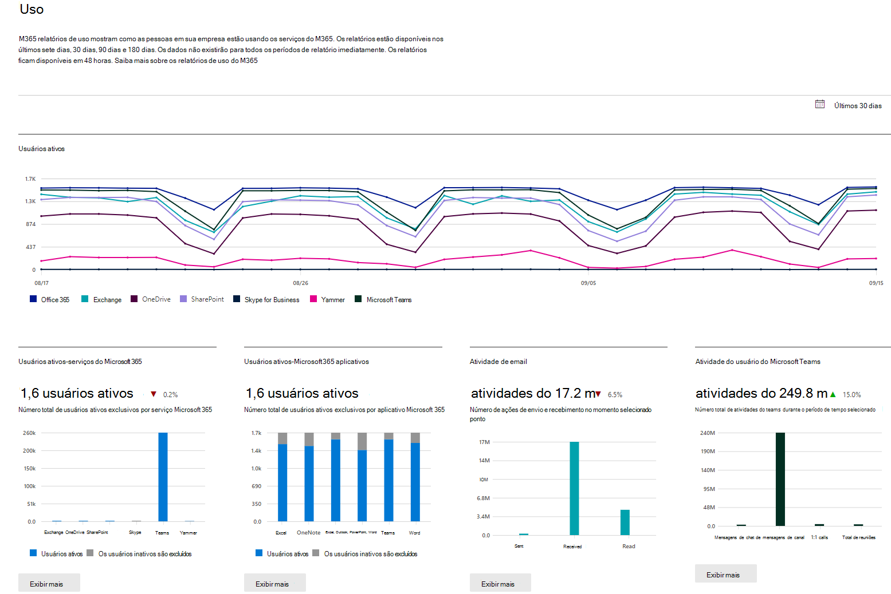

# Relatórios do Microsoft 365 no centro de administraçãoMicrosoft 365 Reports in the admin center

Você pode ver facilmente como as pessoas da sua empresa estão usando os serviços do Microsoft 365. Por exemplo, você pode identificar quem está usando muito um serviço e está atingindo cotas ou quem não precisa de uma licença do Microsoft 365.You can easily see how people in your business are using Microsoft 365 services. For example, you can identify who is using a service a lot and reaching quotas, or who may not need an Microsoft 365 license at all.
  
Os relatórios estão disponíveis para os últimos 7 dias, 30 dias, 90 dias e 180 dias. Não existirão dados para todos os períodos de relatórios imediatamente. Os relatórios ficam disponíveis a partir de 48 horas.Reports are available for the last 7 days, 30 days, 90 days, and 180 days. Data won't exist for all reporting periods right away. The reports become available within 48 hours.
  
Assista a este vídeo para obter uma visão geral: sobre como você pode usar os relatórios:Watch this video for on overview: on how you can use the reports:
  
> [!VIDEO https://www.microsoft.com/videoplayer/embed/fb726f8e-aead-43b2-ba0f-53ba5b886bf7?autoplay=false]
  
## Como acessar o painel RelatóriosHow to get to the Reports dashboard

::: moniker range="o365-worldwide"

1. No centro de administração do, vá para a página **Relatórios** \> <a href="https://go.microsoft.com/fwlink/p/?linkid=2074756" target="_blank">Uso</a>.In the admin center, go to the **Reports** \> <a href="https://go.microsoft.com/fwlink/p/?linkid=2074756" target="_blank">Usage</a> page.

::: moniker-end

::: moniker range="o365-germany"

1. No <a href="https://go.microsoft.com/fwlink/p/?linkid=848041" target="_blank">centro de administração</a>, vá para a página **Relatórios** \> **Uso**.In the <a href="https://go.microsoft.com/fwlink/p/?linkid=848041" target="_blank">admin center</a>, go to the **Reports** \> **Usage** page.

::: moniker-end

::: moniker range="o365-21vianet"

1. No <a href="https://go.microsoft.com/fwlink/p/?linkid=850627" target="_blank">centro de administração</a>, vá para a página **Relatórios** \> **Uso**.In the <a href="https://go.microsoft.com/fwlink/p/?linkid=850627" target="_blank">admin center</a>, go to the **Reports** \> **Usage** page.

::: moniker-end

2. Clique no botão **Exibir mais** no cartão de atividades de visão geral para um serviço (como email ou OneDrive) para ver a página detalhes do relatório.Click on the **View more** button from the at-a-glance activity card for a service (such as email or OneDrive) to see the report detail page. Lá, diferentes relatórios para o serviço são fornecidos em guias.In there different reports for the service are provided in tabs.   

## Quem pode ver os relatórios?Who can see reports

Pessoas com as seguintes permissões: People who have the following permissions:
  
- Administradores globais: Recomendamos que apenas algumas pessoas na empresa tenham essa função.Global admins: We recommend that only a few people in your company have this role. Isso reduz os riscos para a sua empresa.It reduces the risk to your business.
    
- Administradores do ExchangeExchange admins
    
- Administradores do SharePointSharePoint admins
    
- Administradores do Skype for BusinessSkype for Business admins

- Leitor globalGlobal reader
    
- Leitor de relatóriosReports reader

- Administrador de Serviço do TeamsTeams Service Administrator

- Administrador de Comunicações do TeamsTeams Communications Administrator
    
Para saber mais, confira [Sobre as funções de administrador](../add-users/about-admin-roles.md) e [Atribuir funções de administrador](../add-users/assign-admin-roles.md).To learn more, see [About admin roles](../add-users/about-admin-roles.md) and [Assign admin roles](../add-users/assign-admin-roles.md).
  
## Quais relatórios de atividades estão disponíveis no Centro de administraçãoWhich activity reports are available in the admin center

De acordo com a sua assinatura, aqui estão os relatórios disponíveis.Depending on your subscription, here are the available reports.

- [Microsoft browser usageMicrosoft browser usage](browser-usage-report.md) 
  
- [Atividade de emailEmail activity](email-activity-ww.md)

- [Atividade de email para o governo dos EUAEmail activity for US Government](email-activity.md)
    
- [Uso de caixa de correioMailbox usage](mailbox-usage.md)
    
- [Ativações do OfficeOffice activations](microsoft-office-activations-ww.md)

- [Ativações do Office para o Governo dos EUAOffice activations for US Government](microsoft-office-activations.md)

- [Usuários AtivosActive Users](active-users-ww.md)

- [Usuários Ativos para o Governo dos EUAActive Users for US Government](active-users.md)
  
- [Uso de aplicativos de emailEmail apps usage](email-apps-usage-ww.md)

- [Uso de aplicativos de email para o governo dos EUAEmail apps usage for US Government](email-apps-usage.md)

- [Atividade do FormsForms activity](forms-activity-ww.md)

- [Atividade do Forms para o Governo dos EUAForms activity for US Government](forms-activity.md)

- [Atividade do Dynamics 365 Customer VoiceDynamics 365 Customer Voice activity](forms-pro-activity-ww.md)
  
- [Atividade do Dynamics 365 Customer Voice para o Governo dos EUADynamics 365 Customer Voice activity for US Government](forms-pro-activity.md)

- [Grupos do Microsoft 365Microsoft 365 groups](office-365-groups-ww.md)

- [Grupos do Microsoft 365 para o Governo dos EUAMicrosoft 365 groups for US Government](office-365-groups.md)
  
- [Atividade de usuários do OneDrive for BusinessOneDrive for Business user activity](onedrive-for-business-activity-ww.md)

- [OneDrive for Business para atividades de usuários do Governo dos EUAOneDrive for Business user activity for US Government](onedrive-for-business-activity.md)

- [Uso do OneDrive for BusinessOneDrive for Business usage](onedrive-for-business-usage-ww.md)

- [Utilização do OneDrive for Business pelo Governo dos EUAOneDrive for Business usage for US Government](onedrive-for-business-usage.md)

- [Uso do Microsoft 365 AppsMicrosoft 365 Apps usage](microsoft365-apps-usage-ww.md)
  
- [Uso do site do Microsoft Office SharePoint OnlineSharePoint site usage](sharepoint-site-usage-ww.md)

- [Utilização do site do SharePoint pelo Governo dos EUASharePoint site usage for US Government](sharepoint-site-usage.md)
  
- [Atividade do SharePointSharePoint activity](sharepoint-activity-ww.md)

- [Atividade do SharePoint para o Governo dos EUASharePoint activity for US Government](sharepoint-activity.md)
  
- [Atividade do Skype for Business OnlineSkype for Business Online activity](https://docs.microsoft.com/SkypeForBusiness/skype-for-business-online-reporting/activity-report)
  
- [Atividade organizada da conferência do Skype for Business OnlineSkype for Business Online conference organized activity](https://docs.microsoft.com/SkypeForBusiness/skype-for-business-online-reporting/conference-organizer-activity-report)
  
- [Atividade do participante da conferência do Skype for Business OnlineSkype for Business Online conference participant activity](https://docs.microsoft.com/SkypeForBusiness/skype-for-business-online-reporting/conference-participant-activity-report)
  
- [Atividade ponto a ponto do Skype for Business OnlineSkype for Business Online peer-to-peer activity](https://docs.microsoft.com/SkypeForBusiness/skype-for-business-online-reporting/peer-to-peer-activity-report)
  
::: moniker range="o365-worldwide"

- [Atividade do YammerYammer activity](yammer-activity-report-ww.md)

::: moniker-end

::: moniker range="o365-worldwide"

- [Atividade do Yammer para o Governo dos EUAYammer activity for US Government](yammer-activity-report.md)

::: moniker-end

::: moniker range="o365-worldwide"

- [Uso do dispositivo YammerYammer device usage](yammer-device-usage-report-ww.md)

::: moniker-end

::: moniker range="o365-worldwide"

- [Uso de dispositivo Yammer para o Governo dos EUAYammer device usage for US Government](yammer-device-usage-report.md)

::: moniker-end

::: moniker range="o365-worldwide"

- [Relatório de atividades de grupos do YammerYammer groups activity report](yammer-groups-activity-report-ww.md)

::: moniker-end

::: moniker range="o365-worldwide"

- [Relatório de atividades de grupos do Yammer para o Governo dos EUAYammer groups activity report for US Government](yammer-groups-activity-report.md)

::: moniker-end

::: moniker range="o365-worldwide"

- [Atividade de usuários do Microsoft TeamsMicrosoft Teams user activity](microsoft-teams-user-activity-preview.md)

::: moniker-end

::: moniker range="o365-worldwide"

- [Atividade de usuários do Microsoft Teams para o Governo dos Estados UnidosMicrosoft Teams user activity for US Government](microsoft-teams-user-activity.md)

::: moniker-end

::: moniker range="o365-worldwide"

- [Uso do dispositivo do Microsoft TeamsMicrosoft Teams device usage](microsoft-teams-device-usage-preview.md)

::: moniker-end

::: moniker range="o365-worldwide"

- [Uso do dispositivo do Microsoft Teams para o Governo dos Estados UnidosMicrosoft Teams device usage for US Government](microsoft-teams-device-usage.md)

::: moniker-end

## Como exibir informações de licenciamentoHow to view licensing information

- Para ver quantas licenças você atribuiu ou cancelou, no Centro de administração, vá para a página **Faturamento** \> <a href="https://go.microsoft.com/fwlink/p/?linkid=842264" target="_blank">licenças</a>.To see how many licenses you have assigned and unassigned, in the admin center, go to the **Billing** \> <a href="https://go.microsoft.com/fwlink/p/?linkid=842264" target="_blank">Licenses</a> page.
    
- Para ver os usuários licenciados, não licenciados ou convidados, no centro de administração, vá para a página **Usuários** \> <a href="https://go.microsoft.com/fwlink/p/?linkid=834822" target="_blank">Usuários ativos</a>.To see who is licensed, unlicensed, or guest, in the admin center, go to the **Users** \> <a href="https://go.microsoft.com/fwlink/p/?linkid=834822" target="_blank">Active users</a> page. 
  
## Como exibir informações de uso de um usuário específicoHow to view usage information for a specific user

Use os relatórios de serviço para pesquisar o nível de uso de um determinado usuário. Por exemplo, para descobrir a quantidade de armazenamento de caixa de correio que um usuário específico consumiu, abra o relatório de uso da caixa de correio e classifique os usuários por nome. Caso tenha milhares de usuários, exporte o relatório para o Excel a fim de filtrar a lista rapidamente.Use the service reports to research how much a specific user is using the service. For example, to find out how much mailbox storage a specific user has consumed, open the Mailbox usage report, and sort the users by name. If you have thousands of users, export the report to Excel so you filter through the list quickly.
  
Não é possível gerar um relatório no qual você insere contas de usuários e obtém uma lista com os serviços e a quantidade que eles estão usando.You can't generate a report where you enter a user's account and then get a list of which services they are using and how much.

Há situações em que os novos usuários aparecem como **desconhecido**.There are circumstances where new users show up as **unknown**. Isso geralmente ocorre devido a atrasos ocasionais na criação de perfis de usuário.This is usually due to occasional delays in creating user profiles.  
  
## Ocultar detalhes do usuário nos relatóriosHide user details in the reports

Se quiser ocultar informações de nível do usuário ao gerar seus relatórios, você pode fazer essa alteração rapidamente no centro de administração.If you want to hide user level information when you're generating your reports, you can quickly make that change in the admin center.
  
1. No centro de administração, vá para a página **Configurações** \> <a href="https://go.microsoft.com/fwlink/p/?linkid=2053743" target="_blank">Serviços&amp; suplementos</a>.In the admin center, go to the **Settings** \> <a href="https://go.microsoft.com/fwlink/p/?linkid=2053743" target="_blank">Services &amp; add-ins</a> page.

2. Selecione **Relatórios**.Select **Reports**. 
  
3. No painel **relatórios**, selecione as opções desejadas e, em seguida, salve suas alterações.In the **Reports** pane, select the options you want, and then save your changes.
  
A sua lista de usuários terá a seguinte aparência:Your user list will look like this:
  

  
Levará alguns minutos para que essas alterações entrem em vigor nos relatórios do Painel de relatórios. Isso também se aplica à API de relatórios.It'll take a few minutes for these changes to take effect on the reports in the reports dashboard. This setting also applies to the reports API.
  
## O que acontece com os dados de uso quando uma conta de usuário é fechada?What happens to usage data when a user account is closed?

Sempre que você fechar a conta de um usuário, a Microsoft excluirá os dados do usuário em 30 dias.Whenever you close a user's account, Microsoft will delete that user's usage data within 30 days. Esse usuário ainda será incluído nos totais do gráfico de atividade (Confira número 1) para ver os períodos em que ela estava ativa, mas não aparecerá na tabela de detalhes do usuário (Confira número 2).That user will still be included in the Activity chart totals (see number 1) for the periods she was active in, but will not appear in the User Details table (see number 2).
  
No entanto, quando você seleciona um determinado dia (Veja o número 3), até 28 dias a partir da data atual, o relatório mostra o uso do usuário desse dia na tabela de detalhes do usuário (consulte número 2).However, when you select a particular day (see number 3), up to 28 days from the current date, the report show the user's usage for that day in the User Details table (see number 2).
  
## Artigos relacionadosRelated articles

[Relatórios no Centro de Conformidade &amp; e SegurançaReports in the Security &amp; Compliance Center](https://docs.microsoft.com/microsoft-365/compliance/reports-in-security-and-compliance)
  
