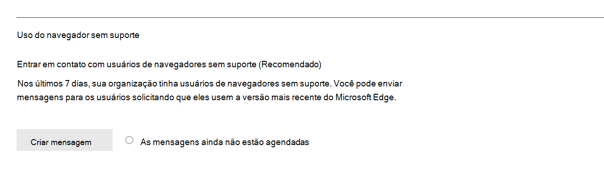
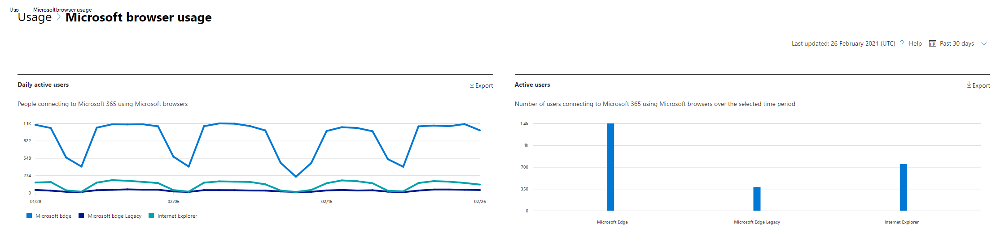

# Microsoft 365 Relatórios no centro de administração - uso do navegador da Microsoft

O painel Microsoft 365 **relatórios** mostra uma visão geral de atividades em todos os produtos em sua organização. Ele permite que você faça uma pesquisa em relatórios de nível de produto individuais para dar uma visão mais granular sobre as atividades em cada produto. Confira o tópico [Visão geral de relatórios](activity-reports.md). No relatório de uso do navegador da Microsoft, você pode obter informações sobre o Internet Explorer, Versão Prévia do Microsoft Edge e novos Microsoft Edge uso. O relatório de uso baseia-se Microsoft 365 serviços online acessados usando um navegador da Microsoft.

 > [!NOTE]
 > Você deve ser um administrador global, leitor global ou leitor de relatórios no Microsoft 365 ou um Exchange, SharePoint ou Skype for Business para ver relatórios.

## Como chegar ao relatório de uso do navegador da Microsoft

1. No centro de administração do, vá para a página **Relatórios** \> <a href="https://go.microsoft.com/fwlink/p/?linkid=2074756" target="_blank">Uso</a>. 
2. Na página inicial do painel, clique no botão **Exibir mais** no cartão de uso do navegador da Microsoft.

## Como notificar os usuários para atualizar seu navegador

Os administradores globais podem optar por enviar mensagens aos usuários usando Microsoft 365 serviços no Edge Legacy (sem suporte) e no Internet Explorer (em breve sem suporte). Essa mensagem direcionada notifica os usuários que o suporte a esses navegadores terminará em breve e se vincula a um artigo de suporte com informações sobre Microsoft Edge e etapas simples a serem seguidas para alternar navegadores. 

Você pode encontrar esse recurso na página de relatório. Depois que a mensagem é criada, os usuários são notificados na frequência especificada até 17 de agosto de 2021. Você pode desativar esse recurso a qualquer momento para parar de enviar notificações aos usuários. Para começar a enviar notificações novamente, ative o recurso novamente.

Para obter mais informações, [consulte Microsoft Edge ajuda & aprendizagem](https://support.microsoft.com/microsoft-edge).

## Interpretar o relatório de uso do navegador da Microsoft

|Item|Descrição|
 |:-----|:-----|
 |1.   |O **relatório de uso** do navegador da Microsoft pode ser exibido para tendências nos últimos 7 dias, 30, 90 ou 180 dias.    |
 |2.   |Os dados em cada relatório geralmente abrangem até os últimos sete dias.   |
 |3.   |O **gráfico Usuários ativos** diários mostra a contagem diária de usuários para Microsoft Edge, Versão Prévia do Microsoft Edge e Internet Explorer quando usado para acessar Microsoft 365 serviços.   |
 |4. |O **gráfico Usuários ativos** mostra o número total de usuários usando Microsoft Edge, Versão Prévia do Microsoft Edge e Internet Explorer quando usado para acessar serviços Microsoft 365 no período selecionado. |
 |5. |A tabela mostra o detalhamento dos dados no nível do usuário. Você pode adicionar ou remover colunas da tabela.    **Nome** de usuário é o endereço de email do usuário que se conectou aos serviços Microsoft 365 usando navegadores da Microsoft.  **O Microsoft Edge** mostra uma marca de escala se o usuário usou Microsoft Edge para se conectar aos serviços Microsoft 365.  **A Versão Prévia do Microsoft Edge** mostra uma marca de escala se o usuário usou Versão Prévia do Microsoft Edge para se conectar aos serviços Microsoft 365.  **O Internet Explorer** usado mostra uma marca de escala se o usuário usou o Internet Explorer para se conectar Microsoft 365 serviços. |
 |6. |Selecione o **ícone Escolher colunas** para adicionar ou remover colunas do relatório.|
 |7. |Você também pode exportar os dados do relatório para um arquivo Excel .csv selecionando o link **Exportar.** Isso exporta dados para todos os usuários e permite que você faça agregação, classificação e filtragem simples para análise posterior. Se você tiver menos de 100 usuários, poderá classificar e filtrar dentro da tabela no próprio relatório. Se você tiver mais de 100 usuários, para filtrar e classificar, será necessário exportar os dados.|
