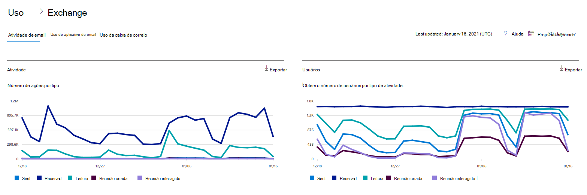
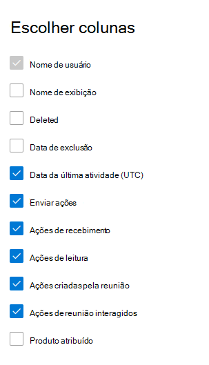

# Microsoft 365 Relatórios no centro de administração - Atividade de emailMicrosoft 365 Reports in the admin center - Email activity

O painel Microsoft 365 **relatórios** mostra a visão geral da atividade em todos os produtos em sua organização.The Microsoft 365 **Reports** dashboard shows you the activity overview across the products in your organization. Ele possibilita detalhar até relatórios de um produto específico para que você tenha informações mais precisas sobre as atividades em cada produto.It enables you to drill in to individual product level reports to give you more granular insight about the activities within each product. Confira o tópico [Visão geral de relatórios](activity-reports.md).Check out [the Reports overview topic](activity-reports.md).
  
Por exemplo, você pode obter uma visão de alto nível do tráfego de email dentro de sua organização na página Relatórios e, depois, pode analisar para o widget de Atividade de email para entender as tendências e detalhes da atividade de email de cada usuário em sua organização.For example, you can get a high level view of email traffic within your organization from the Reports page, and then you can drill into the Email activity widget to understand the trends and per user level details of the email activity within your organization.
  
> [!NOTE]
> Você deve ser um administrador global, leitor global ou leitor de relatórios no Microsoft 365 ou um Exchange, SharePoint, serviço Teams, comunicações Teams ou Skype for Business para ver relatórios.You must be a global administrator, global reader or reports reader in Microsoft 365 or an Exchange, SharePoint, Teams Service, Teams Communications, or Skype for Business administrator to see reports. 

## Como acessar o relatório de atividade de emailHow to get to the email activity report

1. No centro de administração do, vá para a página **Relatórios** \> <a href="https://go.microsoft.com/fwlink/p/?linkid=2074756" target="_blank">Uso</a>.In the admin center, go to the **Reports** \> <a href="https://go.microsoft.com/fwlink/p/?linkid=2074756" target="_blank">Usage</a> page.
2. Selecione **Exibir Mais em** Atividade de **Email.**Select **View More** under **Email activity**. 
3. Na lista **lista** da de atividades de email, **selecione** Exchange Atividade \> **email**.From the **Email activity** drop-down list, select **Exchange** \> **Email activity**.
  
## Interpretar o relatório de atividade de emailInterpret the email activity report

Você pode observar a atividade de email do usuário examinando os gráficos **Atividade** e **Usuários**.You can get a view into your user's email activity by looking at the **Activity** and **Users** charts. 
  

  
|ItemItem|DescriçãoDescription|
|:-----|:-----|
|1.1.    |O relatório **Atividade de email** pode ser consultado sobre tendências dos últimos 7, 30, 90 ou 180 dias.The **Email activity** report can be viewed for trends over the last 7 days, 30 days, 90 days, or 180 days. No entanto, se você selecionar um dia específico no relatório, a tabela (7) mostrará dados por até 28 dias a partir da data atual (e não a data em que o relatório foi gerado).However, if you select a particular day in the report, the table (7) will show data for up to 28 days from the current date (not the date the report was generated).    |
|2.2.    |Os dados em cada relatório geralmente abrangem até as últimas 24 a 48 horas.The data in each report usually covers up to the last 24 to 48 hours.    |
|3.3.    |O gráfico **Atividade** permite que você entenda a tendência da quantidade de atividade de email ocorrendo em sua organização.The **Activity** chart enables you to understand the trend of the amount of email activity going on in your organization. Você pode entender a divisão de envio de email, leitura de email, email recebido, reunião criada ou atividades interagidas de reunião.You can understand the split of email send, email read, email received, meeting created, or meeting interacted activities.    |
|4.4.    |O gráfico **Usuário** permite que você entenda a tendência da quantidade de usuários exclusivos que estão gerando as atividades de email.The **User** chart enables you to understand the trend of the amount of unique users who are generating the email activities. Você pode ver a tendência dos usuários que executam o envio de emails, leitura de email, recebimento de emails, criação de reuniões ou atividades interagindo de reunião.You can look at the trend of users performing email sending, email reading, email receiving, meeting creating, or meeting interacting activities.    |
|5.5.    | No gráfico **Atividade,** o eixo Y é a contagem de atividades do tipo de email enviado, emails recebidos, leitura de email, reunião criada e reunião interagido.On the **Activity** chart, the Y axis is the count of activity of the type email sent, email received, email read, meeting created, and meeting interacted.     No gráfico **de atividades** Usuários, o eixo Y é a atividade de execução do usuário do tipo de email enviado, emails recebidos, leitura de email, reunião criada ou reunião interagido.On the **Users** activity chart, the Y axis is the user's performing activity of the type email sent, email received, email read, meeting created, or meeting interacted.     O eixo X em ambos os gráficos é o intervalo de datas selecionado para esse relatório específico.The X axis on both charts is the selected date range for this specific report.    |
|6.6.    |Você pode filtrar a série que você vê no gráfico selecionando um item na legenda.You can filter the series you see on the chart by selecting an item in the legend.    |
|7.7.    | A tabela mostra uma divisão das atividades de email para cada usuário.The table shows you a breakdown of the email activities at the per-user level. Isso mostra todos os usuários com um produto do Exchange atribuído e suas atividades de email.This shows all users that have an Exchange product assigned to them and their email activities.     **Nome de usuário** é o endereço de email do usuário.**Username** is the email address of the user.    **O nome de** exibição será o nome completo se o usuário.**Display name** is the full name if the user.    **Excluído** refere-se ao usuário cujo estado atual é excluído, mas esteve ativo durante uma parte do período do relatório.**Deleted** refers to the user whose current state is deleted, but was active during some part of the reporting period of the report.    **Data de exclusão** é a data em que o usuário foi excluído.**Deleted date** is the date the user was deleted.    **Data da última atividade** refere-se à última vez que o usuário executou uma atividade de leitura ou envio de email.**Last activity date** refers to the last time the user performed a read or send email activity.    **Ações de envio** é o número de vezes que uma ação de envio de email foi gravada para o usuário.**Send actions** is the number of times an email send action was recorded for the user.    **Ações de recebimento** é o número de vezes que uma ação de recebimento de email foi gravada para o usuário.**Receive actions** is the number of times an email received action was recorded for the user.    **Ações de leitura** é o número de vezes que uma ação de leitura de email foi gravada para o usuário.**Read actions** is the number of times an email read action was recorded for the user.    **As ações criadas** pela reunião são o número de vezes que uma ação de envio de solicitação de reunião foi registrada para o usuário.**Meeting created actions** is the number of times a meeting request send action was recorded for the user.    **As ações interagidas de** reunião são o número de vezes que uma solicitação de reunião aceita, tentativa, recusa ou ação de cancelamento foi registrada para o usuário.**Meeting interacted actions** is the number of times a meeting request accept, tentative, decline, or cancel action was recorded for the user.    **O produto atribuído** é os produtos atribuídos a esse usuário.**Product assigned** is the products that are assigned to this user.     Se as políticas da organização impedem a exibição de relatórios em que as informações do usuário podem ser identificadas, você pode alterar as configurações de privacidade para todos esses relatórios.If your organization's policies prevents you from viewing reports where user information is identifiable, you can change the privacy setting for all these reports. Confira a seção Como ocultar detalhes do nível **do usuário?** na seção Relatórios de [Atividades no Microsoft 365 de administração.](activity-reports.md)Check out the **How do I hide user level details?** section in the [Activity Reports in the Microsoft 365 admin center](activity-reports.md).    |
|8.8.    |Selecione **Escolher colunas** para adicionar ou remover colunas do relatório.Select **Choose columns** to add or remove columns from the report.    |
|9.9.    |Você também pode exportar os dados do relatório para um arquivo Excel .csv, selecionando o link **Exportar.**You can also export the report data into an Excel .csv file, by selecting the **Export** link. Isso exporta os dados de todos os usuários e permite que você realize uma classificação e filtragem simples para mais análise.This exports data of all users and enables you to do simple sorting and filtering for further analysis. Se você tiver menos de 2000 usuários, poderá classificar e filtrar dentro da tabela no próprio relatório.If you have less than 2000 users, you can sort and filter within the table in the report itself. Se você tiver mais de 2000 usuários, para filtrar e classificar, você precisa exportar os dados.If you have more than 2000 users, in order to filter and sort, you will need to export the data.    |
|||
   
> [!NOTE]
> O relatório de atividades de email só está disponível para caixas de correio associadas a usuários com licenças.The Email activity report is only available for mailboxes that are associated with users who have licenses.
