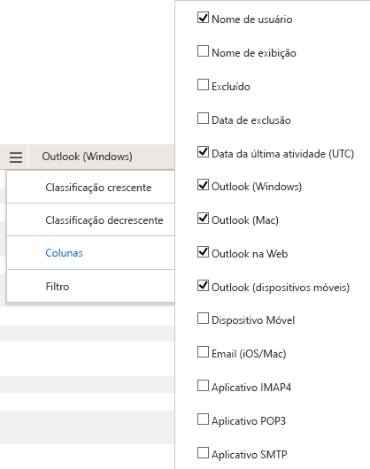

# Relatórios do Microsoft 365 no centro de administração-uso de aplicativos de emailMicrosoft 365 Reports in the admin center - Email apps usage

O painel de **relatórios** do Microsoft 365 mostra a visão geral das atividades em todos os produtos de sua organização.The Microsoft 365 **Reports** dashboard shows you the activity overview across the products in your organization. Ele possibilita detalhar até relatórios de um produto específico para que você tenha informações mais precisas sobre as atividades em cada produto.It enables you to drill in to individual product level reports to give you more granular insight about the activities within each product. Confira o tópico [Visão geral de relatórios](activity-reports.md).Check out [the Reports overview topic](activity-reports.md). No relatório de uso de aplicativos de email, você pode ver quantos aplicativos de email estão se conectando ao Exchange Online.In the email apps usage report, you can see how many email apps are connecting to Exchange Online. Você também pode ver as informações de versão dos aplicativos do Outlook que os usuários estão usando, que permitem o acompanhamento com aqueles que estão usando versões sem suporte para instalar versões com suporte do Outlook.You can also see the version information of Outlook apps that users are using, which will allow you to follow up with those who are using unsupported versions to install supported versions of Outlook.
  
> [!NOTE]
> Você deve ser um administrador global, um leitor global ou um leitor de relatórios no Microsoft 365 ou um administrador do Exchange, do SharePoint, do teams ou do Skype for Business para ver os relatórios.You must be a global administrator, global reader or reports reader in Microsoft 365 or an Exchange, SharePoint, Teams Service, Teams Communications, or Skype for Business administrator to see reports.  
 
## Como acessar o relatório de aplicativos de emailHow to get to the email apps report

1. No centro de administração do, vá para a página**Relatórios** \> <a href="https://go.microsoft.com/fwlink/p/?linkid=2074756" target="_blank">Uso</a>.In the admin center, go to the **Reports** \> <a href="https://go.microsoft.com/fwlink/p/?linkid=2074756" target="_blank">Usage</a> page.

    
2. No menu suspenso **selecionar um relatório** , selecione o uso do aplicativo de email do **Exchange** \> **Email app usage**.From the **Select a report** drop-down, select **Exchange** \> **Email app usage**.
  
## Interpretar o relatório de aplicativos de emailInterpret the email apps report

Você pode obter uma visão da atividade aplicativos de email examinando os gráficos **usuários** e **clientes** .You can get a view into email apps activity by looking at the **Users** and **Clients** charts. 
  

  
|||
|:-----|:-----|
|1.1.    |O relatório de **uso de aplicativos de email** pode ser exibido para tendências nos últimos sete dias, 30 dias, 90 dias ou 180 dias.The **Email apps usage** report can be viewed for trends over the last 7 days, 30 days, 90 days, or 180 days. No entanto, se você selecionar um dia específico no relatório, a tabela (7) mostrará dados de até 28 dias a partir da data atual (não a data em que o relatório foi gerado).However, if you select a particular day in the report, the table (7) will show data for up to 28 days from the current date (not the date the report was generated).    |
|2.2.    |Os dados em cada relatório normalmente cobrem até as últimas 24 a 48 horas.The data in each report usually covers up to the last 24 to 48 hours.    |
|3.3.    |O modo de exibição **Usuários** mostra o número de usuários exclusivos conectados ao Exchange Online usando qualquer aplicativo de email.The **Users** view shows you the number of unique users that connected to Exchange Online using any email app.    |
|4.4.    |O modo de exibição de **Aplicativos** mostra o número de usuários únicos por aplicativo no intervalo de tempo selecionado.The **Apps** view shows you the number of unique users by app over the selected time period.    |
|5.5.    |O modo de exibição de **versões** mostra o número de usuários exclusivos para cada versão do Outlook no Windows.The **Versions** view shows you the number of unique users for each version of Outlook in Windows.    |
|6.6.    | No gráfico **Usuários**, o eixo Y é a contagem total de usuários exclusivos conectados a um aplicativo em um dia do período do relatório.On the **Users** chart, the Y axis is the total count of unique users that connected to an app on any day of the reporting period.     No gráfico **Usuários**, o eixo X é o número de usuários exclusivos que usaram o aplicativo nesse período do relatório.On the **Users** chart, the X axis is number of unique users that used the app for that reporting period.     No gráfico **Aplicativos**, o eixo Y é a contagem total de usuários únicos que usaram um aplicativo específico durante o período do relatório.On the **Apps** chart, the Y axis is the total count of unique users who used a specific app during the reporting period.     No gráfico **Aplicativos**, o eixo X é a lista de aplicativos em sua organização.On the **Apps** chart, the X axis is the list of apps in your organization.     No gráfico **Versões**, o eixo Y é a contagem total de usuários exclusivos usando uma versão específica da área de trabalho do Outlook.On the **Versions** chart, the Y axis is the total count of unique users using a specific version of Outlook desktop. Se o relatório não puder resolver o número de versão do Outlook, a quantidade será mostrada como **indeterminada**.If the report can't resolve the version number of Outlook, the quantity will show as **Undetermined**.     No gráfico **Versões**, o eixo X é a lista de aplicativos em sua organização.On the **Versions** chart, the X axis is the list of apps in your organization.    |
|7.7.    |Você pode filtrar a série que vê no gráfico selecionando um item na legenda.You can filter the series you see on the chart by selecting an item in the legend. Por exemplo, no gráfico **usuários** , selecione **Mac mail** ou **Outlook** Select the email client to get more reporting data on that client.](../../media/19b9da1b-7b69-4a04-8527-38349f859e84.png) para ver apenas as informações relacionadas a cada um deles.to see only the info related to each one. Ao alterar essa seleção, as informações da tabela não mudam.Changing this selection doesn't change the info in the grid table. Mac Mail, Outlook para Mac, Outlook Mobile, Outlook para área de trabalho e Outlook na Web são exemplos de aplicativos de email que talvez você tenha em sua organização.Mac mail, Outlook for Mac, Outlook mobile, Outlook desktop, and Outlook on the web are examples of email apps you may have in your organization.    |
|8.8.    | É possível que você não veja todos os itens da lista abaixo nas colunas até que os adicione.You might not see all the items in the list below in the columns until you add them.  **Username** é o nome do proprietário do aplicativo de email.**Username** is the name of the email app's owner.    A **data da última atividade** é a última data em que o usuário leu ou enviou uma mensagem de email.**Last activity date** is the latest date the user read or sent an email message.    **Mac mail**, **Outlook para Mac** e **Outlook**, **Outlook Mobile** e **Outlook na Web** são exemplos de aplicativos de email que talvez você tenha em sua organização.**Mac mail**, **Mac Outlook** and **Outlook**, **Outlook mobile** and **Outlook on the web** are examples of email apps you may have in your organization.     Se as políticas da organização impedem a exibição de relatórios em que as informações do usuário podem ser identificadas, você pode alterar as configurações de privacidade para todos esses relatórios.If your organization's policies prevents you from viewing reports where user information is identifiable, you can change the privacy setting for all these reports. Confira a seção **como ocultar detalhes de nível de usuário?** nos [relatórios de atividades no centro de administração do Microsoft 365](activity-reports.md).Check out the **How do I hide user level details?** section in the [Activity Reports in the Microsoft 365 admin center](activity-reports.md).    |
|9.9.    |Selecione **gerenciar colunas** para adicionar ou remover colunas do relatório.Select **Manage columns** to add or remove columns from the report.    |
|10.10.    |Você também pode exportar os dados do relatório para um arquivo. csv do Excel, selecionando o link de **exportação** .You can also export the report data into an Excel .csv file, by selecting the **Export** link. Isso exporta os dados de todos os usuários e permite que você realize uma classificação e filtragem simples para mais análise.This exports data of all users and enables you to do simple sorting and filtering for further analysis. Se você tiver menos de 2000 usuários, poderá classificar e filtrar dentro da tabela no próprio relatório.If you have less than 2000 users, you can sort and filter within the table in the report itself. Se você tiver mais de 2000 usuários, para filtrar e classificar, você precisa exportar os dados.If you have more than 2000 users, in order to filter and sort, you will need to export the data.    |
|||
   
