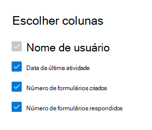

# Relatórios do Microsoft 365 no centro de administração - Atividade de formulários

O painel Relatórios  do Microsoft 365 mostra a visão geral das atividades em todos os produtos em sua organização. Ele permite a você detalhar até relatórios de um produto específico para que você tenha informações mais precisas sobre as atividades em cada produto. Confira o tópico [Visão geral de relatórios](activity-reports.md).
  
Por exemplo, você pode entender a atividade de cada usuário licenciado para usar o Microsoft Forms analisando sua interação com formulários. Ele também ajuda a entender o nível de colaboração em diante, observando o número de formulários criados e formulários aos quais o usuário respondeu.
  
> [!NOTE]
> Você deve ser um administrador global, leitor global ou leitor de relatórios no Microsoft 365 ou um administrador do Exchange, SharePoint, Teams Service, Teams Communications ou Skype for Business para ver os relatórios.  
 
## Como obter o relatório de atividades do Forms

1. No centro de administração do, vá para a página **Relatórios** \> <a href="https://go.microsoft.com/fwlink/p/?linkid=2074756" target="_blank">Uso</a>. 
2. Na home page do painel, clique no botão Exibir **mais** no cartão de formulários.
  
## Interpretar o relatório atividade do Forms

Você pode exibir as atividades no relatório de formulários escolhendo a **guia** Atividade. 

Selecione **Escolher colunas** para adicionar ou remover colunas do relatório.    

Você também pode exportar os dados do relatório para um arquivo .csv do Excel selecionando o link **Exportar.** Isso exporta os dados de todos os usuários e permite que você realize uma classificação e filtragem simples para mais análise. Se você tiver menos de 2000 usuários, poderá classificar e filtrar dentro da tabela no próprio relatório. Se você tiver mais de 2000 usuários, para filtrar e classificar, você precisa exportar os dados. 
  
|Item|Descrição|
|:-----|:-----|
|**Indicador**|**Definição**|
|Nome de usuário    |O endereço de email do usuário que realizou a atividade no Microsoft Forms.    |
|Data da última atividade (UTC)    |A última data em que uma atividade de formulário foi executada pelo usuário para o intervalo de datas selecionado. Para ver a atividade que ocorreu em uma data específica, selecione a data diretamente no gráfico.  Isso filtrará a tabela para exibir dados de atividade do arquivo somente para usuários que realizaram a atividade nesse dia específico.    |
|Número de formulários criados    |O número de formas que o usuário criou.     |
|Número de formulários respondido    |O número de formas às que o usuário enviou respostas.|
|||
