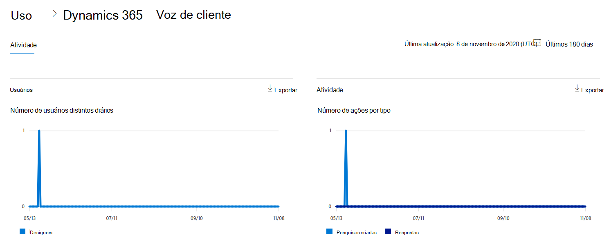
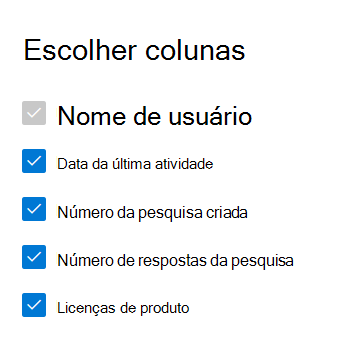

# Relatórios da Microsoft 365 no centro de administração-atividade de voz do cliente do Dynamics 365Microsoft 365 Reports in the admin center - Dynamics 365 Customer Voice activity

O painel de **relatórios** do Microsoft 365 mostra a visão geral das atividades em todos os produtos de sua organização.The Microsoft 365 **Reports** dashboard shows you the activity overview across the products in your organization. Ele permite a você detalhar até relatórios de um produto específico para que você tenha informações mais precisas sobre as atividades em cada produto.It lets you drill in to individual product level reports to give you more granular insight about the activities within each product. Confira o tópico [Visão geral de relatórios](activity-reports.md).Check out [the Reports overview topic](activity-reports.md).
  
Por exemplo, você pode entender a atividade de cada usuário licenciado para usar a voz do cliente Microsoft Dynamics 365 examinando suas interações com a voz do cliente Dynamics 365.For example, you can understand the activity of every user licensed to use Microsoft Dynamics 365 Customer Voice by looking at their interactions with Dynamics 365 Customer Voice. Ele também ajuda você a entender o nível de colaboração que está acontecendo observando o número de pesquisas de pro criadas e pro pesquisas às quais os usuários responderam.It also helps you to understand the level of collaboration going on by looking at the number of Pro Surveys created and Pro Surveys to which the users responded to. 
  
> [!NOTE]
> Você deve ser um administrador global, um leitor global ou um leitor de relatórios no Microsoft 365 ou um administrador do Exchange, do SharePoint, do teams ou do Skype for Business para ver os relatórios.You must be a global administrator, global reader or reports reader in Microsoft 365 or an Exchange, SharePoint, Teams Service, Teams Communications, or Skype for Business administrator to see reports.  
 
## Como obter o relatório de atividade de voz do cliente Dynamics 365How to get to the Dynamics 365 Customer Voice activity report

1. No centro de administração do, vá para a página **Relatórios** \> <a href="https://go.microsoft.com/fwlink/p/?linkid=2074756" target="_blank">Uso</a>.In the admin center, go to the **Reports** \> <a href="https://go.microsoft.com/fwlink/p/?linkid=2074756" target="_blank">Usage</a> page. 
2. Na página inicial do painel, clique no botão **Exibir mais** no cartão de voz do cliente Dynamics 365.From the dashboard homepage, click on the **View more** button on the Dynamics 365 Customer Voice card.
  
## Interpretar o relatório de atividade de voz do cliente Dynamics 365Interpret the Dynamics 365 Customer Voice activity report

Você pode exibir as atividades no relatório de voz de cliente do Dynamics 365 escolhendo a guia **atividade** .You can view the activities in the Dynamics 365 Customer Voice report by choosing the **Activity** tab. 

Selecione **escolher colunas** para adicionar ou remover colunas do relatório.Select **Choose columns** to add or remove columns from the report.    

Você também pode exportar os dados do relatório para um arquivo. csv do Excel selecionando o link de **exportação** .You can also export the report data into an Excel .csv file by selecting the **Export** link. Isso exporta os dados de todos os usuários e permite que você realize uma classificação e filtragem simples para mais análise.This exports data of all users and enables you to do simple sorting and filtering for further analysis. Se você tiver menos de 2000 usuários, poderá classificar e filtrar dentro da tabela no próprio relatório.If you have less than 2000 users, you can sort and filter within the table in the report itself. Se você tiver mais de 2000 usuários, para filtrar e classificar, você precisa exportar os dados.If you have more than 2000 users, in order to filter and sort, you will need to export the data. 
  
|ItemItem|DescriçãoDescription|
|:-----|:-----|
|**Indicador****Metric**|**Definição****Definition**|
|Nome de usuárioUsername    |O endereço de email do usuário que realizou a atividade no Microsoft Forms.The email address of the user who performed the activity on Microsoft Forms.    |
|Data da última atividade (UTC)Last activity date (UTC)    |A última data em que uma atividade de formulário foi realizada pelo usuário para o intervalo de datas selecionado.The latest date a form activity was performed by the user for the selected date range. Para ver a atividade que ocorreu em uma data específica, selecione a data diretamente no gráfico.To see activity that occurred on a specific date, select the date directly in the chart. Isso filtrará a tabela para exibir os dados de atividade de arquivo somente para os usuários que realizaram a atividade nesse dia específico.This will filter the table to display file activity data only for users who performed the activity on that specific day.    |
|Número de pesquisas criadasNumber of surveys created    |O número de pesquisas criadas pelo usuário.The number of surveys that the user created.     |
|Número de respostas da pesquisaNumber of survey responses    |O número de respostas de respondentes aos quais a pesquisa foi distribuída.The number of responses from responders to whom the survey was distributed to.|
|||