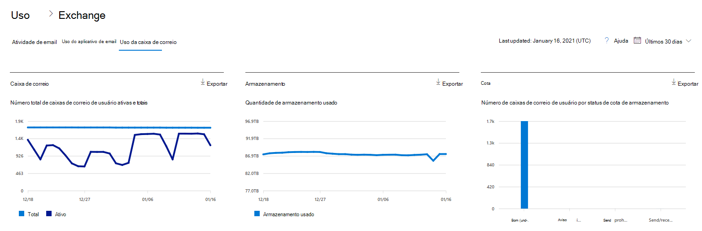
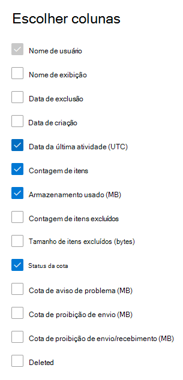

# Relatórios do Microsoft 365 no centro de administração - Uso da caixa de correio

O  relatório de uso da Caixa de Correio fornece informações sobre os usuários com uma caixa de correio de usuário e o nível de atividade de cada um com base no email enviar, ler, criar compromisso, enviar reunião, aceitar reunião, recusar reunião e cancelar a atividade de reunião. Ele fornece também informações sobre o consumo do espaço de armazenamento de cada caixa de correio do usuário e quantas delas estão prestes a atingir as cotas de armazenamento. 
  
> [!NOTE]
> Você deve ser um administrador global, leitor global ou leitor de relatórios no Microsoft 365 ou um administrador do Exchange, SharePoint, Teams Service, Teams Communications ou Skype for Business para ver relatórios. 
 
## Como obter o relatório de uso da caixa de correio

1. No centro de administração do, vá para a página **Relatórios** \> <a href="https://go.microsoft.com/fwlink/p/?linkid=2074756" target="_blank">Uso</a>.
2. Selecione **Exibir Mais em** Atividade de **Email.** 
3. Na lista listada de atividades de **email,** selecione Uso de **Caixa** de Correio do Exchange \> .

## Interpretar o relatório de uso da caixa de correio

Para ter uma noção do **uso da caixa de correio** da organização, analise os gráficos **Caixa de correio**, **Armazenamento** e **Cota**. 
  

|Item|Descrição|
|:-----|:-----|
|1.    |O relatório **Uso da caixa de correio** pode ser consultado sobre tendências dos últimos 7, 30, 90 ou 180 dias. No entanto, se você selecionar um dia específico no relatório, a tabela mostrará dados por até 28 dias a partir da data atual (e não a data em que o relatório foi gerado).    |
|2.    |Os dados em cada relatório geralmente abrangem até as últimas 24 a 48 horas.    |
|3.    |O gráfico "Caixa de correio" mostra o número total de caixas de correio do usuário na organização e o total das que estão ativas em um determinado dia do período de relatório. Uma caixa de correio de usuário é considerada ativa se tiver um email enviar, ler, criar compromisso, enviar reunião, aceitar reunião, recusar reunião e cancelar atividades de reunião.    |
|4.    |O gráfico **Armazenamento** mostra a quantidade de armazenamento em uso na organização. O Gráfico de Armazenamento não inclui caixas de correio de arquivo morto. Para obter mais informações sobre arquivamento de expansão automática, consulte [Overview of unlimited archiving in Microsoft 365](../../compliance/unlimited-archiving.md).  |
|5.    | O gráfico **Cota** mostra o número de caixas de correio do usuário em cada categoria de cota. Há quatro categorias de cota:     Bom - Quantidade de usuários cujo armazenamento usado é inferior à cota de aviso de problema.     Aviso - Quantidade de usuários cujo armazenamento usado é igual ou superior à cota de aviso de problema, mas é inferior à cota de proibição de envio.     Não é possível enviar - Quantidade de usuários cujo armazenamento usado é igual ou superior à cota de proibição de envio, mas é inferior à cota de proibição de envio/recebimento.     Não é possível enviar/receber - Quantidade de usuários cujo armazenamento usado é igual ou superior à cota de proibição de envio/recebimento.    |
|6.    | No gráfico **Caixa de correio**, o eixo Y é o número de caixas de correio do usuário.     No gráfico **Armazenamento**, o eixo Y é a quantidade de armazenamento em uso pelas caixas de correio do usuário da organização.     No gráfico **Cota**, o eixo Y é o número de caixas de correio do usuário para cada cota de armazenamento.     Nos gráficos "Caixa de correio" e "Armazenamento", o eixo X é o intervalo de datas escolhido para esse relatório específico.     O eixo X no gráfico Cota é a categoria da cota.    |
|7.    |Você pode filtrar gráficos que você vê selecionando um item na legenda.    |
|8.    | A tabela mostra o detalhamento de uso da caixa de correio no nível do usuário. Você pode adicionar mais colunas à tabela.    **Nome de usuário** é o endereço de email do usuário.    **Nome para Exibição** é o nome completo do usuário.    **Excluída** se refere à caixa de correio cujo estado atual é excluída, mas esteve ativa durante parte do período do relatório.    **Data da exclusão** é a data de exclusão da caixa de correio.    **Data de criação** é a data de criação da caixa de correio.    **Data da última atividade** se refere à data em que houve um envio de email ou atividade de leitura na caixa de correio.    **Contagem de itens** se refere ao total de itens na caixa de correio.    **Armazenamento usado (MB)** se refere ao total de armazenamento usado.    **Contagem de Itens Excluídos** refere-se ao número total de itens excluídos na caixa de correio.   **Tamanho do Item Excluído (MB)** refere-se ao tamanho total de todos os itens excluídos na caixa de correio.   **Cota de aviso de problema (MB)** se refere ao limite de armazenamento quando o proprietário da caixa de correio recebe um aviso informando que ele está prestes a atingir a cota de armazenamento.    **Cota de proibição de envio (MB)** se refere ao limite de armazenamento quando a caixa de correio não pode mais enviar emails.    **Cota de proibição de envio/recebimento (MB)** se refere ao limite de armazenamento quando a caixa de correio não pode mais enviar ou receber emails.     Se as políticas da organização impedem a exibição de relatórios em que as informações do usuário podem ser identificadas, você pode alterar as configurações de privacidade para todos esses relatórios. Confira a seção **Ocultar detalhes do usuário na** seção Relatórios de Atividades no Centro de administração do Microsoft [365.](activity-reports.md)    |
|9.    |Selecione **Escolher colunas** para adicionar ou remover colunas do relatório.    |
|10.    |Você também pode exportar os dados do relatório para um arquivo .csv do Excel, selecionando o link **Exportar.**    |
|||
