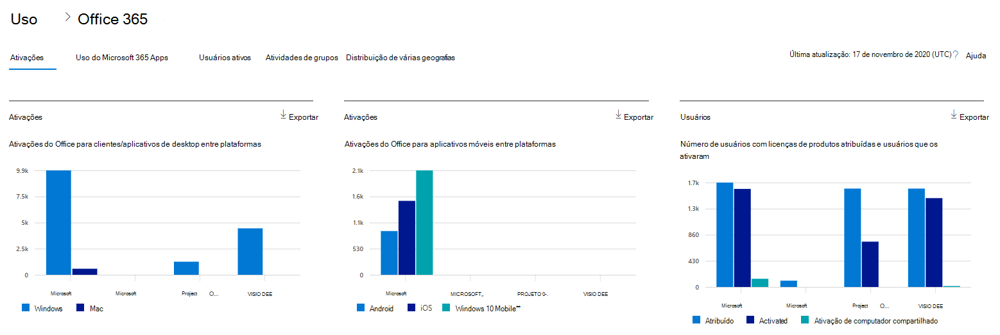
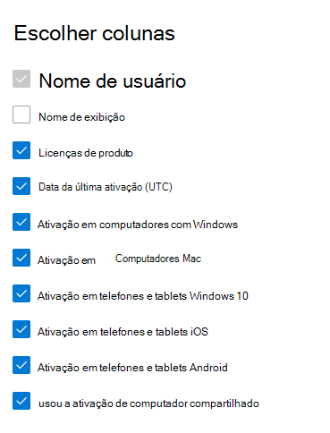

# Relatórios do Microsoft 365 no centro de administração-ativações do Microsoft OfficeMicrosoft 365 Reports in the admin center - Microsoft Office activations

O painel de **relatórios** do Microsoft 365 mostra a visão geral das atividades em todos os produtos de sua organização.The Microsoft 365 **Reports** dashboard shows you the activity overview across the products in your organization. Ele possibilita detalhar até relatórios de um produto específico para que você tenha informações mais precisas sobre as atividades em cada produto.It enables you to drill in to individual product level reports to give you more granular insight about the activities within each product. Confira o tópico [Visão geral de relatórios](activity-reports.md).Check out [the Reports overview topic](activity-reports.md).
  
O relatório Ativação do Office oferece uma visão de quais usuários têm a assinatura do Office ativada em ao menos um dispositivo.The Office Activation report gives you a view of which users have activated their Office subscription on at least one device. Ele fornece uma divisão dos aplicativos do Microsoft 365 para as ativações de assinatura Enterprise, Project e Visio pro para Office 365, bem como a divisão de ativações na área de trabalho e nos dispositivos.It provides a breakdown of the Microsoft 365 Apps for enterprise, Project, and Visio Pro for Office 365 subscription activations, as well as the breakdown of activations across desktop and devices. Esse relatório pode ser útil para ajudá-lo a identificar usuários que podem precisar de auxílio e suporte adicionais para ativar a assinatura do Office.This report could be useful in helping you identify users that might need additional help and support to activate their Office subscription.
  
> [!NOTE]
> Você deve ser um administrador global, um leitor global ou um leitor de relatórios no Microsoft 365 ou um administrador do Exchange, do SharePoint, do teams ou do Skype for Business para ver os relatórios.You must be a global administrator, global reader or reports reader in Microsoft 365 or an Exchange, SharePoint, Teams Service, Teams Communications, or Skype for Business administrator to see reports.  
  
## Como obter o relatório de ativações do OfficeHow to get to the Office activations report

1. No centro de administração do, vá para a página **Relatórios** \> <a href="https://go.microsoft.com/fwlink/p/?linkid=2074756" target="_blank">Uso</a>.In the admin center, go to the **Reports** \> <a href="https://go.microsoft.com/fwlink/p/?linkid=2074756" target="_blank">Usage</a> page. 
2. Na página inicial do painel, clique no botão **Exibir mais** no cartão de ativações do Office.From the dashboard homepage, click on the **View more** button on the Office activations card.
  
## Interpretação do relatório de ativações do OfficeInterpret the Office activations report
  
Você pode exibir as ativações no relatório do Office 365 escolhendo a guia **ativações** .You can view the activations in the Office 365 report by choosing the **Activations** tab. 

Selecione **escolher colunas** para adicionar ou remover colunas do relatório.Select **Choose columns** to add or remove columns from the report.    

Você também pode exportar os dados do relatório para um arquivo. csv do Excel selecionando o link de **exportação** .You can also export the report data into an Excel .csv file by selecting the **Export** link. Isso exporta os dados de todos os usuários e permite que você realize uma classificação e filtragem simples para mais análise.This exports data of all users and enables you to do simple sorting and filtering for further analysis. Se você tiver menos de 2000 usuários, poderá classificar e filtrar dentro da tabela no próprio relatório.If you have less than 2000 users, you can sort and filter within the table in the report itself. Se você tiver mais de 2000 usuários, para filtrar e classificar, você precisa exportar os dados.If you have more than 2000 users, in order to filter and sort, you will need to export the data. 

|ItemItem|DescriçãoDescription|
|:-----|:-----|
|**Indicador****Metric**|**Definição****Definition**|
|Nome de usuárioUsername    |O endereço de email do usuário.The email address of the user.    |
|Nome de exibiçãoDisplay name    |O nome completo do usuário.The full name of the user.    |
|Licenças de produtoProduct licenses    |Os produtos atribuídos a esse usuário.The products that are assigned to this user.    |
|Data da última ativação (UTC)Last activated date(UTC)    |A data em que o usuário ativou o Office em uma área de trabalho ou um dispositivo.The date the user activated Office on a desktop or a device.    |
|Ativação em computadores com WindowsActivation on Windows computers    |O número de áreas de trabalho do Windows em que o usuário ativou o Office.The number of Windows desktops a user activated Office on.    |
|Ativação em computadores MacActivation on Mac computers   |O número de áreas de trabalho Mac em que o usuário ativou o Office.The number of Mac desktops a user activated Office on.|
|Ativação em telefones e tablets Windows 10Activation on Windows 10 phones and tablets    |O número de dispositivos móveis Windows 10 em que o usuário ativou o Office.The number of Windows 10 mobile devices a user activated Office on.    |
|Ativação em telefones e tablets iOSActivation on iOS phones and tablets    |O número de dispositivos iOS em que o usuário ativou o Office.The number of iOS devices a user activated Office on.|
|Ativação em telefones e tablets AndroidActivation on Android phones and tablets    |O número de dispositivos Android em que o usuário ativou o Office.The number of Android devices a user activated Office on.    |
|Usou a ativação de computador compartilhadoUsed Shared Computer Activation |Isso será verdadeiro se o usuário usou o Office por meio da ativação de computador compartilhado.This is true if the user used Office through shared computer activation.|
|||
   