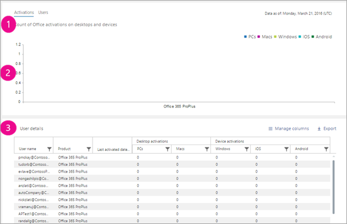

# Relatórios do Microsoft 365 no centro de administração-ativações do Microsoft Office

O painel de **relatórios** do Microsoft 365 mostra a visão geral das atividades em todos os produtos de sua organização. Ele possibilita detalhar até relatórios de um produto específico para que você tenha informações mais precisas sobre as atividades em cada produto. Confira o tópico [Visão geral de relatórios](activity-reports.md).
  
O relatório Ativação do Office oferece uma visão de quais usuários têm a assinatura do Office ativada em ao menos um dispositivo. Ele fornece uma divisão dos aplicativos do Microsoft 365 para as ativações de assinatura Enterprise, Project e Visio pro para Office 365, bem como a divisão de ativações na área de trabalho e nos dispositivos. Esse relatório pode ser útil para ajudá-lo a identificar usuários que podem precisar de auxílio e suporte adicionais para ativar a assinatura do Office.
  
> [!NOTE]
> Você deve ser um administrador global, um leitor global ou um leitor de relatórios no Microsoft 365 ou um administrador do Exchange, do SharePoint, do teams ou do Skype for Business para ver os relatórios.  
  
## Como obter o relatório de ativações do Office

1. No centro de administração do, vá para a página **Relatórios** \> <a href="https://go.microsoft.com/fwlink/p/?linkid=2074756" target="_blank">Uso</a>.

    
2. No menu suspenso **selecionar um relatório** , selecione as ativações **do Office 365** \> . 
  
## Interpretação do relatório de ativações do Office

Você pode analisar as ativações do Office na sua organização olhando os gráficos **Ativações** e **Usuários**. 
  

  
|Item|Descrição|
|:-----|:-----|
|1    |O relatório Ativações do Office apresenta o estado atual dos dados de ativações de licença do Office [na data do relatório apresentado na parte superior direita do gráfico].    |
|2     |Os dados em cada relatório normalmente cobrem até as últimas 24 a 48 horas.    |
|3     |O gráfico **Ativações** mostra a contagem de ativações do Office em computadores e dispositivos.    |
|4     |O gráfico **Usuários** mostra a contagem de usuários que estão habilitados e quais usuários ativaram a assinatura do Office em computadores e dispositivos.    |
|5     | No gráfico **Ativações**, o eixo Y é a contagem de ativações do Office.     Já no gráfico **Usuários**, ele é a atividade do usuário de ativar o Office.     O eixo X em ambos os gráficos é o intervalo de datas selecionado para esse relatório específico.    |
|6     |Você pode filtrar gráficos que vê selecionando um item na legenda. Por exemplo, no gráfico de **ativações** , selecione **sistema operacional Windows**, **Mac os**, **Windows 10 Mobile**, **Ios** ou **Android** para ver apenas as informações relacionadas a cada uma. Ao alterar essa seleção, as informações da tabela não mudam.       |
|7     | A tabela mostra um detalhamento das ativações do Office no nível do usuário. Esta é a lista de todos os usuários com o produto Office atribuído a eles. Você pode adicionar mais colunas à tabela.      **Nome de usuário** é o endereço de email do usuário.    **Nome para exibição** é o nome completo do usuário.    **Licenças de produto** são os produtos atribuídos a esse usuário.    **Última data de ativação** refere-se à data em que o usuário ativou o Office em um computador ou dispositivo.    O **uso da ativação de computador compartilhado** é true se o usuário usou o Office por meio da ativação de computador compartilhado.   O **Windows** refere-se ao número de áreas de trabalho do Windows em que o usuário ativou o Office.    **Mac** refere-se ao número de áreas de trabalho Mac em que o usuário ativou o Office.    O **Windows 10 Mobile** refere-se ao número de dispositivos móveis Windows 10 em que o usuário ativou o Office.    o **Ios** se refere ao número de dispositivos IOS em que o usuário ativou o Office.    O **Android** refere-se ao número de dispositivos Android em que o usuário ativou o Office.     Se as políticas da organização impedem a exibição de relatórios em que as informações do usuário podem ser identificadas, você pode alterar as configurações de privacidade para todos esses relatórios. Confira a seção **ocultar detalhes do usuário na seção relatórios** nos [relatórios de atividades no centro de administração do Microsoft 365](activity-reports.md).    |
|||
   

