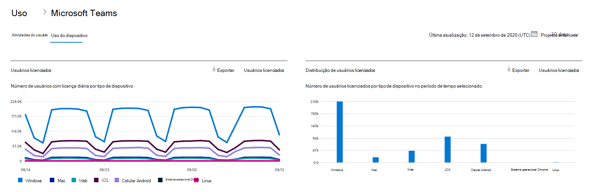
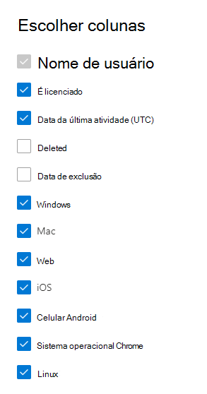

# Relatórios do Microsoft 365 no centro de administração-uso de dispositivos do Microsoft TeamsMicrosoft 365 Reports in the admin center - Microsoft Teams device usage

O painel de **relatórios** do Microsoft 365 mostra a visão geral das atividades em todos os produtos de sua organização.The Microsoft 365 **Reports** dashboard shows you the activity overview across the products in your organization. Ele possibilita detalhar até relatórios de um produto específico para que você tenha informações mais precisas sobre as atividades em cada produto.It enables you to drill in to individual product level reports to give you more granular insight about the activities within each product. Confira o tópico [Visão geral de relatórios](activity-reports.md).Check out [the Reports overview topic](activity-reports.md). No relatório de uso do aplicativo Microsoft Teams, você encontra informações sobre os aplicativos do Microsoft Teams em uso na sua organização.In the Microsoft Teams app usage report, you can gain insights into the Microsoft Teams apps that are used in your organization.
  
> [!NOTE]
> Você deve ser um administrador global, um leitor global ou um leitor de relatórios no Microsoft 365 ou um administrador do Exchange, do SharePoint, do teams ou do Skype for Business para ver os relatórios.You must be a global administrator, global reader or reports reader in Microsoft 365 or an Exchange, SharePoint, Teams Service, Teams Communications, or Skype for Business administrator to see reports.  
 
## Como gerar o relatório de uso do aplicativo Microsoft TeamsHow to get to the Microsoft Teams app usage report

1. No centro de administração do, vá para a página **Relatórios** \> <a href="https://go.microsoft.com/fwlink/p/?linkid=2074756" target="_blank">Uso</a>.In the admin center, go to the **Reports** \> <a href="https://go.microsoft.com/fwlink/p/?linkid=2074756" target="_blank">Usage</a> page. 
2. Na página inicial do painel, clique no botão **Exibir mais** no cartão de atividades do Microsoft Teams.From the dashboard homepage, click on the **View more** button on the Microsoft Teams activity card.
  
## Interpretar o relatório de uso do aplicativo Microsoft TeamsInterpret the Microsoft Teams app usage report

Você pode exibir o uso do dispositivo no relatório do teams escolhendo a guia **uso do dispositivo** .You can view the device use in the Teams report by choosing the **Device usage** tab. 

Selecione **escolher colunas** para adicionar ou remover colunas do relatório.Select **Choose columns** to add or remove columns from the report.    

Você também pode exportar os dados do relatório para um arquivo. csv do Excel selecionando o link de **exportação** .You can also export the report data into an Excel .csv file by selecting the **Export** link. Isso exporta os dados de todos os usuários e permite que você realize uma classificação e filtragem simples para mais análise.This exports data of all users and enables you to do simple sorting and filtering for further analysis. Se você tiver menos de 2000 usuários, poderá classificar e filtrar dentro da tabela no próprio relatório.If you have less than 2000 users, you can sort and filter within the table in the report itself. Se você tiver mais de 2000 usuários, para filtrar e classificar, você precisa exportar os dados.If you have more than 2000 users, in order to filter and sort, you will need to export the data. 
  
|ItemItem|DescriçãoDescription|
|:-----|:-----|
|**Indicador****Metric**|**Definição****Definition**|
|Nome de usuárioUser name    |O nome de exibição do usuário.The display name of the user.    |
|WindowsWindows    |Selecionado se o usuário estava ativo no cliente da área de trabalho do Microsoft Teams em um computador baseado no Windows.Selected if the user was active in the Teams desktop client on a Windows-based computer.    |
|MacMac    |Selecionado se o usuário estava ativo no cliente da área de trabalho do Microsoft Teams em um computador macOS.Selected if the user was active in the Teams desktop client on a macOS computer.    |
|iOSiOS    |Selecionado se o usuário estava ativo no cliente móvel do Microsoft Teams para iOS.Selected if the user was active on the Teams mobile client for iOS.    |
|Celular AndroidAndroid phone    | Selecionado se o usuário estava ativo no cliente móvel do Microsoft Teams para Android.Selected if the user was active on the Teams mobile client for Android.    |
|Sistema operacional ChromeChrome OS    |Selecionado se o usuário estava ativo no cliente da área de trabalho do Microsoft Teams em um computador do ChromeOS.Selected if the user was active in the Teams desktop client on a ChromeOS computer.|
|LinuxLinux    | Selecionado se o usuário estava ativo no cliente da área de trabalho do Microsoft Teams em um computador Linux.Selected if the user was active in the Teams desktop client on a Linux computer.    |
|WebWeb    |Selecionado se o usuário estava ativo no cliente da Web do teams em dispositivos.Selected if the user was active in the Teams web client on devices.|
|Data da última atividade (UTC)Last activity date (UTC)    |A última data (UTC) que o usuário participou em uma atividade do teams.The last date (UTC) that the user participated in a Teams activity .    |
|É licenciadoIs licensed|Selecionado se o usuário está licenciado para usar o Microsoft Teams.Selected if the user is licensed to use Teams.|
|||