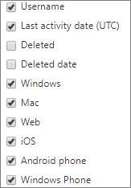

# Relatórios do Microsoft 365 no centro de administração-uso de dispositivos do Microsoft TeamsMicrosoft 365 Reports in the admin center - Microsoft Teams device usage

O painel de **relatórios** do Microsoft 365 mostra a visão geral das atividades em todos os produtos de sua organização.The Microsoft 365 **Reports** dashboard shows you the activity overview across the products in your organization. Ele possibilita detalhar até relatórios de um produto específico para que você tenha informações mais precisas sobre as atividades em cada produto.It enables you to drill in to individual product level reports to give you more granular insight about the activities within each product. Confira o tópico [Visão geral de relatórios](activity-reports.md).Check out [the Reports overview topic](activity-reports.md). No relatório de uso do aplicativo Microsoft Teams, você encontra informações sobre os aplicativos do Microsoft Teams em uso na sua organização.In the Microsoft Teams app usage report, you can gain insights into the Microsoft Teams apps that are used in your organization.
  
> [!NOTE]
> Você deve ser um administrador global, um leitor global ou um leitor de relatórios no Microsoft 365 ou um administrador do Exchange, do SharePoint, do teams ou do Skype for Business para ver os relatórios.You must be a global administrator, global reader or reports reader in Microsoft 365 or an Exchange, SharePoint, Teams Service, Teams Communications, or Skype for Business administrator to see reports.  
 
## Como gerar o relatório de uso do aplicativo Microsoft TeamsHow to get to the Microsoft Teams app usage report

1. No centro de administração do, vá para a página**Relatórios** \> <a href="https://go.microsoft.com/fwlink/p/?linkid=2074756" target="_blank">Uso</a>.In the admin center, go to the **Reports** \> <a href="https://go.microsoft.com/fwlink/p/?linkid=2074756" target="_blank">Usage</a> page.

    
2. No menu suspenso **selecionar um relatório** , selecione uso **do dispositivo do Microsoft Teams** \> **Device usage**.From the **Select a report** drop-down, select  **Microsoft Teams** \> **Device usage**.
  
## Interpretar o relatório de uso do aplicativo Microsoft TeamsInterpret the Microsoft Teams app usage report

Você pode ver detalhes de uso do aplicativo do Microsoft Teams examinando os gráficos **Usuários** e **Distribuição**.You can get a view into Microsoft Teams app usage by looking at the **Users** and **Distribution** charts. 
  

  
|||
|:-----|:-----|
|1.1.    |O relatório **Uso de dispositivo do Microsoft Teams** pode ser consultado sobre tendências dos últimos 7, 30, 90 ou 180 dias.The **Microsoft Teams device usage** report can be viewed for trends over the last 7 days, 30 days, 90 days, or 180 days. No entanto, se você selecionar um dia específico no relatório, a tabela (7) mostrará dados de até 28 dias a partir da data atual (não a data em que o relatório foi gerado).However, if you select a particular day in the report, the table (7) will show data for up to 28 days from the current date (not the date the report was generated).    |
|2.2.    |Os dados em cada relatório normalmente cobrem até as últimas 24 a 48 horas.The data in each report usually covers up to the last 24 to 48 hours.    |
|3.3.    |O modo de exibição **Usuários** mostra o número de usuários exclusivos diariamente por aplicativo.The **Users** view shows you the number of daily unique users by app.    |
|4.4.    |O modo de exibição **Distribuição** mostra o número de usuários exclusivos por aplicativo no intervalo de tempo selecionado.The **Distribution** view shows you the number of unique users by app over the selected time period.    |
|5.5.    | No gráfico **Usuários**, o eixo Y representa o número de usuários por aplicativo.On the **Users** chart, the Y axis is the number of users per app.     No gráfico **Distribuição**, o eixo Y representa o número de usuários que estão usando o aplicativo especificado.On the **Distribution** chart, the Y axis is the number of users using the specified app.     O eixo X nos gráficos representa o intervalo de datas selecionado para esse relatório específico.The X axis on the charts is the selected date range for the specific report.    |
|6.6.    |Você pode filtrar a série que vê no gráfico selecionando um item na legenda.You can filter the series you see on the chart by selecting an item in the legend. Por exemplo, no gráfico **usuários** , selecione **Windows**, **Mac**, **chamadas**, **Web**, **telefone Android**ou **Windows Phone** para ver apenas as informações relacionadas a cada uma delas.For example, on the **Users** chart, select **Windows**, **Mac**, **Calls**, **Web**, **Android phone**, or **Windows phone** to see only the info related to each one. Ao alterar essa seleção, as informações da tabela não mudam.Changing this selection doesn't change the info in the grid table.    |
|7.7.    | A lista de grupos mostrada é determinada pelo conjunto de todos os grupos que existiram (que não foram excluídos) no mais amplo período de relatório (180 dias). A contagem de atividades variará de acordo com a seleção de data.  The list of groups shown is determined by the set of all groups that existed (weren't deleted) across the widest (180-day) reporting time frame. The activity count will vary according to the date selection.    Observação: Talvez você não veja todos os itens da lista abaixo nas colunas até que os adicione.NOTE: You might not see all the items in the list below in the columns until you add them.  **Nome de usuário** é o endereço de email do usuário.**Username** is the email address of the user. Você pode exibir o endereço de email real ou tornar este campo anônimo.You can display the actual email address or make this field anonymous.    **Data da última atividade (UTC)** se refere à data da última atividade que o usuário participou em uma atividade do Microsoft Teams em um aplicativo.**Last Activity Date (UTC)** refers to the last date that the user participated in a Microsoft Teams activity in an app.    **Excluídos** indica se a equipe foi excluída. Se a equipe foi excluída, mas teve atividade no período do relatório, ela é exibida na grade com a exclusão definida como true.  **Deleted** indicates if the team is deleted. If the team is deleted, but had activity in the reporting period, it will show up in the grid with deleted set to true.    **Data de exclusão** é a data em que a equipe foi excluída.**Deleted date** is the date that the team was deleted.    **Windows** estará selecionado se o usuário estava ativo no aplicativo Windows durante o intervalo de tempo especificado.**Windows** is checked if the user was active in the Windows app during the specified time period.    **Mac** estará selecionado se o usuário estava ativo em um aplicativo Mac durante o intervalo de tempo especificado.**Mac** is checked if the user was active in a Mac app during the specified time period.    **Web** estará selecionado se o usuário estava ativo em um aplicativo Web durante o intervalo de tempo especificado.**Web** is checked if the user was active in a web app during the specified time period.    **iOS** estará selecionado se o usuário estava ativo em um aplicativo iOS durante o intervalo de tempo especificado.**iOS** is checked if the user was active in an iOS app during the specified time period.    **Telefone Android** estará selecionado se o usuário estava ativo em um aplicativo para telefone Android durante o intervalo de tempo especificado.**Android phone** is checked if the user was active in an Android phone app during the specified time period.    **Telefone Windows** estará selecionado se o usuário estava ativo em um aplicativo para Windows Phone durante o intervalo de tempo especificado.**Windows phone** is checked if the user was active in a Windows Phone app during the specified time period.     Se as políticas da organização impedem a exibição de relatórios em que as informações do usuário podem ser identificadas, você pode alterar as configurações de privacidade para todos esses relatórios.If your organization's policies prevents you from viewing reports where user information is identifiable, you can change the privacy setting for all these reports. Confira a seção **como ocultar detalhes de nível de usuário?** nos [relatórios de atividades no centro de administração do Microsoft 365](activity-reports.md).Check out the **How do I hide user level details?** section in the [Activity Reports in the Microsoft 365 admin center](activity-reports.md).    |
|8.8.    |Selecione **colunas** para adicionar ou remover colunas do relatório.Select **Columns** to add or remove columns from the report.    |
|9.9.    |Você também pode exportar os dados do relatório para um arquivo. csv do Excel, selecionando o link de **exportação** .You can also export the report data into an Excel .csv file, by selecting the **Export** link. Isso exporta os dados de todos os usuários e permite que você realize uma classificação e filtragem simples para mais análise.This exports data of all users and enables you to do simple sorting and filtering for further analysis. Se você tiver menos de 2000 usuários, poderá classificar e filtrar dentro da tabela no próprio relatório.If you have less than 2000 users, you can sort and filter within the table in the report itself. Se você tiver mais de 2000 usuários, para filtrar e classificar, você precisa exportar os dados.If you have more than 2000 users, in order to filter and sort, you will need to export the data.    |
|||
   
  

