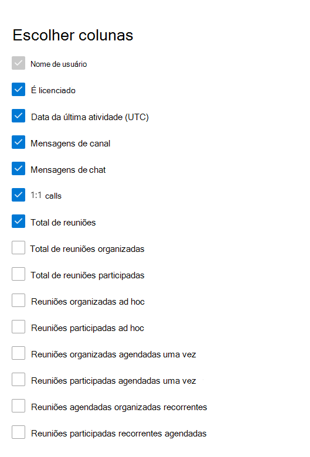

# Relatórios do Microsoft 365 no centro de administração – Atividade do usuário do Microsoft Teams

O painel Microsoft 365 **relatórios** mostra a visão geral da atividade em todos os produtos em sua organização. Ele possibilita detalhar até relatórios de um produto específico para que você tenha informações mais precisas sobre as atividades em cada produto. Confira o tópico [Visão geral de relatórios](activity-reports.md). No relatório de atividade de usuários do Microsoft Teams, você pode obter informações sobre a atividade do Microsoft Teams em sua organização.
  
> [!NOTE]
> Você deve ser um administrador global, leitor global ou leitor de relatórios no Microsoft 365 ou um Exchange, SharePoint, serviço Teams, comunicações Teams ou Skype for Business para ver relatórios.  
 
## Como gerar o relatório de atividade de usuários do Microsoft Teams

1. No centro de administração do, vá para a página **Relatórios** \> <a href="https://go.microsoft.com/fwlink/p/?linkid=2074756" target="_blank">Uso</a>.
2. Na página inicial do painel, clique no botão **Exibir mais** no Microsoft Teams de atividade.

## Interpretar o relatório de atividade de usuários do Microsoft Teams

Você pode exibir a atividade do usuário no relatório de Teams escolhendo a **guia Atividade do** usuário.  

Selecione **Escolher colunas** para adicionar ou remover colunas do relatório.    

Você também pode exportar os dados do relatório para um arquivo Excel .csv selecionando o link **Exportar.** Isso exporta os dados de todos os usuários e permite que você realize uma classificação e filtragem simples para mais análise. Se você tiver menos de 2000 usuários, poderá classificar e filtrar dentro da tabela no próprio relatório. Se você tiver mais de 2000 usuários, para filtrar e classificar, você precisa exportar os dados. O formato exportado para **tempo de** áudio, **tempo de vídeo** e tempo de **compartilhamento** de tela segue o formato de duração ISO8601.

O relatório **Atividade de usuários do Microsoft Teams** pode ser consultado sobre tendências dos últimos 7, 30, 90 ou 180 dias. No entanto, se você selecionar um dia específico no relatório, a tabela (7) mostrará dados por até 28 dias a partir da data atual (e não a data em que o relatório foi gerado).

Para garantir a qualidade dos dados, realizamos verificações diárias de validação de dados nos últimos três dias e preencheremos quaisquer lacunas detectadas. Você pode observar diferenças nos dados históricos durante o processo.

|Item|Descrição|
|:-----|:-----|
|**Indicador**|**Definição**|
|Nome de usuário    |O endereço de email do usuário. Você pode exibir o endereço de email real ou tornar este campo anônimo.     |
|Mensagens de canal     |O número de mensagens exclusivas que o usuário postou em um chat de equipe durante o período de tempo especificado.    |
|Mensagens de chat     |O número de mensagens exclusivas que o usuário postou em um chat privado durante o período de tempo especificado.    |
|Total de reuniões     |O número de reuniões online que o usuário participou durante o período de tempo especificado.    |
|Chamadas 1:1     | O número de chamadas 1:1 que o usuário participou durante o período de tempo especificado.    |
|Data da última atividade (UTC)    |A última data em que o usuário participou de uma Microsoft Teams de usuário.  |
|Reuniões participadas ad hoc     | O número de reuniões ad hoc que um usuário participou durante o período de tempo especificado.    |
|Reuniões organizadas ad hoc   |O número de reuniões ad hoc que um usuário organizou durante o período especificado.  |
|Total de reuniões organizadas    |A soma das reuniões agendadas, recorrentes, ad hoc e não classificadas que um usuário organizou durante o período de tempo especificado.    |
|Total de reuniões participadas    |A soma das reuniões agendadas, recorrentes, ad hoc e não classificadas em que um usuário participou durante o período de tempo especificado.    |
|Reuniões organizadas agendadas uma vez    |O número de reuniões agendadas única que um usuário organizou durante o período de tempo especificado.    |
|Reuniões agendadas organizadas recorrentes    |O número de reuniões recorrentes que um usuário organizou durante o período de tempo especificado.    |
|Reuniões participadas agendadas uma vez    |O número das reuniões agendadas de uma vez em que um usuário participou durante o período de tempo especificado.    |
|Reuniões participadas recorrentes agendadas    |O número de reuniões recorrentes que um usuário participou durante o período de tempo especificado.    |
|É licenciado    |Selecionado se o usuário estiver licenciado para usar Teams.  |
|Outras atividades   |O Usuário está ativo, mas realizou outras atividades que não os tipos de ação expostos oferecidos no relatório (enviando ou respondendo a mensagens de canal e mensagens de chat, agendando ou participando de chamadas e reuniões 1:1). Exemplos de ações são quando um usuário altera o status Teams ou a mensagem de status Teams ou abre uma postagem mensagem de canal, mas não responde.   |
|reuniões não classificadas  |Aquele que não pode ser classificado como agenda ou recorrente ou ad hoc. Eles são curtos em número e, principalmente, não podem ser identificados devido a informações de telemetria adulteradas. |
|||