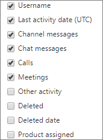

# Relatórios do Microsoft 365 no centro de administração-atividade de usuário do Microsoft Teams

O painel de **relatórios** do Microsoft 365 mostra a visão geral das atividades em todos os produtos de sua organização. Ele possibilita detalhar até relatórios de um produto específico para que você tenha informações mais precisas sobre as atividades em cada produto. Confira o tópico [Visão geral de relatórios](activity-reports.md). No relatório de atividade de usuários do Microsoft Teams, você pode obter informações sobre a atividade do Microsoft Teams em sua organização.
  
> [!NOTE]
> Você deve ser um administrador global, um leitor global ou um leitor de relatórios no Microsoft 365 ou um administrador do Exchange, do SharePoint, do teams ou do Skype for Business para ver os relatórios.  
 
## Como gerar o relatório de atividade de usuários do Microsoft Teams

1. No centro de administração do, vá para a página**Relatórios** \> <a href="https://go.microsoft.com/fwlink/p/?linkid=2074756" target="_blank">Uso</a>.

    
2. No menu suspenso **selecionar um relatório** , selecione atividade de **usuário do Microsoft Teams** \> **User activity**.
  
## Interpretar o relatório de atividade de usuários do Microsoft Teams

Você pode observar a atividade de usuários do Microsoft Teams examinando os gráficos **Atividade** e **Usuários**. 
  
|Item|Descrição|
|:-----|:-----|
|1.    |O relatório **Atividade de usuários do Microsoft Teams** pode ser consultado sobre tendências dos últimos 7, 30, 90 ou 180 dias. No entanto, se você selecionar um dia específico no relatório, a tabela (7) mostrará dados de até 28 dias a partir da data atual (não a data em que o relatório foi gerado).    |
|2.    |Os dados em cada relatório normalmente cobrem até as últimas 24 a 48 horas.    |
|3.    |O modo de exibição **Atividade** mostra o número de atividades do Microsoft Teams por tipo de atividade. Os tipos de atividade são número de mensagens de chat da equipe, mensagens de chat particular, chamadas ou reuniões.    |
|4.    |Os modo de exibição **Usuários** mostra o número de usuários por tipo de atividade. Os tipos de atividade são número de mensagens de chat da equipe, mensagens de chat particular, chamadas ou reuniões.    |
|5.    | No gráfico **Atividades**, o eixo Y representa a contagem de atividade especificada.     No gráfico **Arquivos**, o eixo Y representa o número de usuários que fazem parte dos gráficos de equipe, conversas particulares, chamadas ou reuniões.     O eixo X nos gráficos representa o intervalo de datas selecionado para esse relatório específico.    |
|6.    |Você pode filtrar a série que vê no gráfico selecionando um item na legenda. Por exemplo, no gráfico **atividade** , selecione **mensagens de canal**, **mensagens de chat**, **chamadas**ou **reuniões** para ver apenas as informações relacionadas a cada uma delas. Ao alterar essa seleção, as informações da tabela não mudam.    |
|7.    | A lista de grupos mostrada é determinada pelo conjunto de todos os grupos que existiram (que não foram excluídos) no mais amplo período de relatório (180 dias). A contagem de atividades variará de acordo com a seleção de data.    Observação: Talvez você não veja todos os itens da lista abaixo nas colunas até que os adicione. **Nome de usuário** é o endereço de email do usuário. Você pode exibir o endereço de email real ou tornar este campo anônimo.    **Data da última atividade (UTC)** se refere à data da última atividade que o usuário participou em uma atividade do Microsoft Teams.    **Mensagens do canal** é o número de mensagens exclusivas que o usuário publicou em um chat de equipe durante o período de tempo especificado.    **Mensagens de chat** é o número de mensagens exclusivas que o usuário publicou em um chat particular durante o período de tempo especificado.    **Chamadas** é o número de chamadas das quais o usuário participou durante o período especificado.    **Reuniões** é o número de reuniões online das quais o usuário participou durante o período especificado.    **Outra atividade** é o número de outras atividades da equipe por usuário.    **Excluídos** indica se a equipe foi excluída. Se a equipe foi excluída, mas teve atividade no período do relatório, ela é exibida na grade com a exclusão definida como true.    **Data de exclusão** é a data em que a equipe foi excluída.    **Produto atribuído** é a lista de produtos atribuídos ao usuário.     Se as políticas da organização impedem a exibição de relatórios em que as informações do usuário podem ser identificadas, você pode alterar as configurações de privacidade para todos esses relatórios. Confira a seção **como ocultar detalhes de nível de usuário?** nos [relatórios de atividades no centro de administração do Microsoft 365](activity-reports.md).    |
|8.    |Selecione **colunas** para adicionar ou remover colunas do relatório.    |
|9.    |Você também pode exportar os dados do relatório para um arquivo. csv do Excel selecionando o link de **exportação** . Isso exporta os dados de todos os usuários e permite que você realize uma classificação e filtragem simples para mais análise. Se você tiver menos de 2000 usuários, poderá classificar e filtrar dentro da tabela no próprio relatório. Se você tiver mais de 2000 usuários, para filtrar e classificar, você precisa exportar os dados.    |
|||
   

