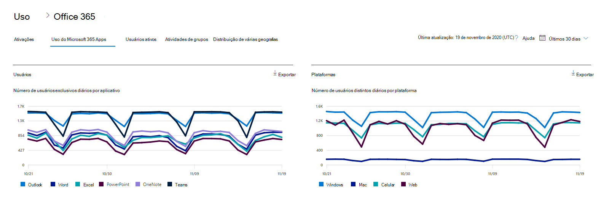

# Relatórios do Microsoft 365 no centro de administração - uso dos Aplicativos do Microsoft 365Microsoft 365 Reports in the admin center - Microsoft 365 Apps usage

O painel Relatórios  do Microsoft 365 mostra a visão geral das atividades em todos os produtos em sua organização.The Microsoft 365 **Reports** dashboard shows you the activity overview across the products in your organization. Ele possibilita detalhar até relatórios de um produto específico para que você tenha informações mais precisas sobre as atividades em cada produto.It enables you to drill in to individual product level reports to give you more granular insight about the activities within each product. Confira o tópico [Visão geral de relatórios](activity-reports.md).Check out [the Reports overview topic](activity-reports.md).

 Por exemplo, você pode entender a atividade de cada usuário licenciado para usar os aplicativos do Microsoft 365 Apps observando suas atividades entre os aplicativos e como eles são utilizados em todas as plataformas.For example, you can understand the activity of each user licensed to use Microsoft 365 Apps apps by looking at their activity across the apps and how they are utilized across platforms.

 > [!NOTE]
 > Você deve ser um administrador global, leitor global ou leitor de relatórios no Microsoft 365 ou um administrador do Exchange, SharePoint ou Skype for Business para ver os relatórios.You must be a global administrator, global reader or reports reader in Microsoft 365 or an Exchange, SharePoint, or Skype for Business administrator to see reports.

## Como obter o relatório de uso do Microsoft 365 AppsHow to get to the Microsoft 365 Apps usage report

1. No centro de administração do, vá para a página **Relatórios** \> <a href="https://go.microsoft.com/fwlink/p/?linkid=2074756" target="_blank">Uso</a>.In the admin center, go to the **Reports** \> <a href="https://go.microsoft.com/fwlink/p/?linkid=2074756" target="_blank">Usage</a> page. 
2. Na home page do painel, clique no botão Exibir mais no cartão Usuários ativos - Aplicativos do Microsoft 365. From the dashboard homepage, click on the **View more** button on the Active users - Microsoft 365 Apps card.

## Interpretar o relatório de uso do Microsoft 365 AppsInterpret the Microsoft 365 Apps usage report

Você pode ver a atividade dos Aplicativos do Microsoft 365 do usuário analisando os gráficos **Usuários** **e Plataformas.**You can get a view into your user's Microsoft 365 Apps activity by looking at the **Users** and **Platform** charts.

|ItemItem|DescriçãoDescription|
 |:-----|:-----|
 |1.1.   |O relatório de uso do **Microsoft 365 Apps** pode ser consultado sobre tendências dos últimos 7, 30, 90 ou 180 dias.The **Microsoft 365 Apps usage** report can be viewed for trends over the last 7 days, 30 days, 90 days, or 180 days. No entanto, se você selecionar um dia específico no relatório, a tabela (7) mostrará dados por até 28 dias a partir da data atual (e não a data em que o relatório foi gerado).However, if you select a particular day in the report, the table (7) will show data for up to 28 days from the current date (not the date the report was generated).   |
 |2.2.   |Os dados em cada relatório geralmente abrangem até os últimos sete dias.The data in each report usually covers up to the last seven days.   |
 |3.3.   |A **exibição** Usuários mostra a tendência no número de usuários ativos para cada aplicativo – Outlook, Word, Excel, PowerPoint, OneNote e Teams.The **Users** view shows the trend in the number of active users for each app – Outlook, Word, Excel, PowerPoint, OneNote, and Teams. "Usuários ativos" são aqueles que executam ações intencionais nesses aplicativos."Active users" are any who perform any intentional actions within these apps.   |
 |4.4.   |O **visualização Plataformas** mostra a tendência de usuários ativos em todos os aplicativos para cada plataforma – Windows, Mac, Web e Mobile.The **Platforms** view shows the trend of active users across all apps for each platform – Windows, Mac, Web, and Mobile.   |
 |5.5. |No gráfico **Usuários,** o eixo Y é o número de usuários ativos exclusivos para o respectivo aplicativo.On the **Users** chart, the Y-axis is the number of unique active users for the respective app. No gráfico **Plataformas,** o eixo Y é o   número de usuários exclusivos da respectiva plataforma.On the **Platforms** chart, the Y-axis is the number of unique users for the respective platform. O eixo X em ambos os gráficos é a data em que um aplicativo foi usado em uma determinada plataforma.The X-axis on both charts is the date on which an app was used on a given platform. |
 6.6. |Você pode filtrar a série que vê no gráfico selecionando um item na legenda.You can filter the series you see on the chart by selecting an item in the legend. Por exemplo, no gráfico **Usuários,** selecione Outlook, Word, Excel, PowerPoint, OneDrive ou Teams para ver apenas as informações relacionadas a cada um deles.For example, on the **Users** chart, select Outlook, Word, Excel, PowerPoint, OneDrive, or Teams to see only the info related to each one. Alterar essa seleção não altera as informações da tabela de grade abaixo dela.Changing this selection doesn't change the info in the grid table below it.|
 |7.7. |A tabela mostra o detalhamento dos dados no nível do usuário.The table shows you a breakdown of data at the per-user level. Você pode adicionar ou remover colunas da tabela.You can add or remove columns from the table.   **Nome** de usuário é o endereço de email do usuário que realizou a atividade no Microsoft Apps.**Username** is the email address of the user who performed the activity on Microsoft Apps.  **A última data de ativação (UTC)** é a última data em que o usuário ativou sua assinatura do Microsoft 365 Apps.**Last activation date (UTC)** is the latest date on which the user activated their Microsoft 365 Apps subscription.  **A data da última atividade (UTC)** é a última data em que uma atividade intencional foi executada pelo usuário.**Last activity date (UTC)** is the latest date an intentional activity was performed by the user. Para ver a atividade que ocorreu em uma data específica, selecione a data diretamente no gráfico.To see activity that occurred on a specific date, select the date directly in the chart.  As outras colunas identificam se o usuário estava ativo nessa plataforma para esse aplicativo (no Microsoft 365 Apps) no período selecionado.The other columns identify if the user was active on that platform for that app (within Microsoft 365 Apps) in the period selected. |
 |8.8. |Selecione o **ícone Escolher colunas** para adicionar ou remover colunas do relatório.Select the **Choose columns** icon to add or remove columns from the report.|
 |9.9. |Você também pode exportar os dados do relatório para um arquivo .csv do Excel selecionando o link **Exportar.**You can also export the report data into an Excel .csv file by selecting the **Export** link. Isso exporta dados para todos os usuários e permite que você faça agregação, classificação e filtragem simples para análise posterior.This exports data for all users and enables you to do simple aggregation, sorting, and filtering for further analysis. Se você tiver menos de 100 usuários, poderá classificar e filtrar dentro da tabela no próprio relatório.If you have less than 100 users, you can sort and filter within the table in the report itself. Se você tiver mais de 100 usuários, para filtrar e classificar, precisará exportar os dados.If you have more than 100 users, in order to filter and sort, you will need to export the data.|
