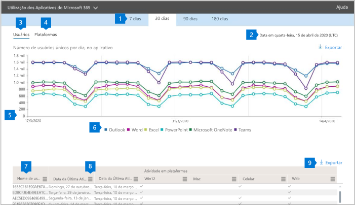

# Relatórios do Microsoft 365 no centro de administração-uso ProPlus

O painel de **relatórios** do Microsoft 365 mostra a visão geral das atividades em todos os produtos de sua organização. Ele possibilita detalhar até relatórios de um produto específico para que você tenha informações mais precisas sobre as atividades em cada produto. Confira o tópico [Visão geral de relatórios](activity-reports.md).
  
Por exemplo, você pode entender a atividade de cada usuário licenciado para usar aplicativos ProPlus, examinando suas atividades nos aplicativos e como eles são utilizados nas plataformas.  
  
> [!NOTE]
> Você deve ser um administrador global, leitor global ou leitor de relatórios no Microsoft 365 ou um administrador do Exchange, SharePoint ou Skype for Business para ver os relatórios. 

## Como acessar o relatório de uso do ProPlus

1. No centro de administração do, vá para a página**Relatórios** \> <a href="https://go.microsoft.com/fwlink/p/?linkid=2074756" target="_blank">Uso</a>.

    
2. No menu suspenso **selecionar um relatório** , selecione o uso **do Office 365** \> **ProPlus** .

## Interpretar o relatório de uso do ProPlus

Você pode obter uma visão da atividade ProPlus do usuário examinando os gráficos de **usuários** e **plataformas** . 

|||
|:-----|:-----|
|1.    |O relatório de **uso ProPlus** pode ser exibido para tendências nos últimos sete dias, 30 dias, 90 dias ou 180 dias. No entanto, se você selecionar um dia específico no relatório, a tabela (7) mostrará dados de até 28 dias a partir da data atual (não a data em que o relatório foi gerado).    |
|2.    |Os dados em cada relatório normalmente cobrem até as últimas 24 a 48 horas.    |
|3.    |O modo de exibição **usuários** iew mostra a tendência no número de usuários ativos para cada aplicativo – Outlook, Word, Excel, PowerPoint, OneNote e Teams. "Usuários ativos" são aqueles que realizam qualquer ação intencional nesses aplicativos.    |
|4.    |O modo de exibição **plataformas** mostra a tendência de usuários ativos em todos os aplicativos para cada plataforma – Windows, Mac, Web e celular.   |
|5. |No gráfico **usuários** , o eixo Y é o número de usuários ativos exclusivos para o respectivo aplicativo. No gráfico **plataformas** , o eixo Y é o número de usuários exclusivos para a respectiva plataforma. O eixo X em ambos os gráficos é a data em que um aplicativo foi usado em um determinado Platform. RM. |
|6. |Você pode filtrar a série que vê no gráfico selecionando um item na legenda. Por exemplo, no gráfico **usuários** , selecione Outlook, Word, Excel, PowerPoint, onedrive ou Teams para ver apenas as informações relacionadas a cada uma delas. A alteração dessa seleção não altera as informações na tabela de grade abaixo dela.|
|7. |A tabela mostra o detalhamento dos dados no nível do usuário. Você pode adicionar ou remover colunas da tabela.   **Username** é o endereço de email do usuário que realizou a atividade em aplicativos da Microsoft.  **Data da última ativação (UTC)** é a última data em que o usuário ativou a assinatura ProPlus.  **Data da última atividade (UTC)** é a última data em que a atividade intencional foi realizada pelo usuário. Para ver a atividade que ocorreu em uma data específica, selecione a data diretamente no gráfico.  Seguintes colunas correspondentes a cada aplicativo que identifica se o usuário estava ativo naquele aplicativo no período selecionado:   **Outlook**  **Word**  **Excel** **PowerPoint**  **OneNote**   Seguintes colunas correspondentes a cada plataforma que identifica se o usuário estava ativo nessa plataforma para qualquer aplicativo (dentro do ProPlus) no período selecionado:  **Outlook (Windows)** **Outlook (Mac)** **Outlook (Web)**  **Outlook (celular)**  **Word (Windows)**  **Word (Mac)**  **Word (Web)**  **Word (celular)**  **Excel (Windows)**  **Excel (Mac)**  **Excel (Web)**  **Excel (celular)**  **PowerPoint (Windows)**  **PowerPoint (Mac)** **PowerPoint (Web)**  **PowerPoint (móvel)**  **OneNote (Windows)**  **OneNote (Mac)**  **OneNote (Web)** **OneNote (celular)**  **Teams (Windows)**  **Teams (Mac)**  **Teams (Web)** **Teams (celular)** |
|8. |Selecione o ícone **gerenciar colunas** para adicionar ou remover colunas do relatório.|
|9. |Você também pode exportar os dados do relatório para um arquivo. csv do Excel selecionando o link de **exportação** . Isso exporta os dados de todos os usuários e permite que você faça agregação, classificação e filtragem simples para análise adicional. Se você tiver menos de 100 usuários, poderá classificar e filtrar dentro da tabela no próprio relatório. Se você tiver mais de 100 usuários, para filtrar e classificar, será necessário exportar os dados.|