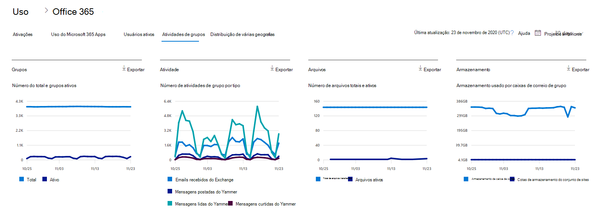
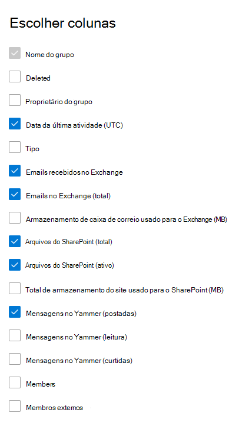

# Relatórios do Microsoft 365 no centro de administração-Microsoft 365 gruposMicrosoft 365 Reports in the admin center - Microsoft 365 groups

O painel de **relatórios** do Microsoft 365 mostra a visão geral das atividades em todos os produtos de sua organização.The Microsoft 365 **Reports** dashboard shows you the activity overview across the products in your organization. Ele possibilita detalhar até relatórios de um produto específico para que você tenha informações mais precisas sobre as atividades em cada produto.It enables you to drill in to individual product level reports to give you more granular insight about the activities within each product. Confira o tópico [Visão geral de relatórios](activity-reports.md).Check out [the Reports overview topic](activity-reports.md). No relatório de grupos do Microsoft 365, você pode obter informações sobre a atividade dos grupos em sua organização e ver quantos grupos estão sendo criados e usados.In the Microsoft 365 groups report, you can gain insights into the activity of groups in your organization and see how many groups are being created and used.
  
> [!NOTE]
> Você deve ser um administrador global, um leitor global ou um leitor de relatórios no Microsoft 365 ou um administrador do Exchange, do SharePoint, do teams ou do Skype for Business para ver os relatórios.You must be a global administrator, global reader or reports reader in Microsoft 365 or an Exchange, SharePoint, Teams Service, Teams Communications, or Skype for Business administrator to see reports.  
  
## Como obter o relatório de gruposHow to get to the groups report

1. No centro de administração do, vá para a página **Relatórios** \> <a href="https://go.microsoft.com/fwlink/p/?linkid=2074756" target="_blank">Uso</a>.In the admin center, go to the **Reports** \> <a href="https://go.microsoft.com/fwlink/p/?linkid=2074756" target="_blank">Usage</a> page. 
2. Na página inicial do painel, clique no botão **Exibir mais** nos usuários ativos-Microsoft 365 Apps ou no Active Users-Microsoft 365 Services Card para acessar a página de relatório do Office 365.From the dashboard homepage, click on the **View more** button on the Active users - Microsoft 365 Apps or the Active users - Microsoft 365 Services card to get to the Office 365 report page.
  
## Interpretar o relatório de gruposInterpret the groups report

Você pode exibir as ativações no relatório do Office 365 escolhendo a guia **atividade de grupos** .You can view the activations in the Office 365 report by choosing the **Groups activity** tab. 

Selecione **escolher colunas** para adicionar ou remover colunas do relatório.Select **Choose columns** to add or remove columns from the report.    

Você também pode exportar os dados do relatório para um arquivo. csv do Excel selecionando o link de **exportação** .You can also export the report data into an Excel .csv file by selecting the **Export** link. Isso exporta os dados de todos os usuários e permite que você realize uma classificação e filtragem simples para mais análise.This exports data of all users and enables you to do simple sorting and filtering for further analysis. Se você tiver menos de 2000 usuários, poderá classificar e filtrar dentro da tabela no próprio relatório.If you have less than 2000 users, you can sort and filter within the table in the report itself. Se você tiver mais de 2000 usuários, para filtrar e classificar, você precisa exportar os dados.If you have more than 2000 users, in order to filter and sort, you will need to export the data. 

|ItemItem|DescriçãoDescription|
|:-----|:-----|
|**Indicador****Metric**|**Definição****Definition**|
|Nome do grupoGroup name    |O nome do grupo.The name of the group.    |
|DeletedDeleted    |O número de grupos excluídos.The number of deleted groups. Se o grupo for excluído, mas tiver atividades no período do relatório, elas serão exibidas na grade com esse sinalizador definido como true.If the group is deleted, but had activity in the reporting period it will show up in the grid with this flag set to true.    |
|Proprietário do grupoGroup owner    |O nome do proprietário do grupo.The name of the group owner.    |
|Data da última atividade (UTC)Last activity date (UTC)    |A última data em que uma mensagem foi recebida pelo grupo.The latest date a message was received by the group. Esta é a última data em que uma atividade aconteceu em uma conversa por email, Yammer ou Site.- This is the latest date an activity happened in an email conversation, Yammer, or the Site.    |
|TipoType    |O tipo de grupo.The type of group. Pode ser um grupo público ou particular.This can be private or public group.    |
|Emails recebidos no ExchangeEmails received in Exchange    |O número de mensagens recebidas pelo grupo.The number of messages received by the group.|
|Emails no Exchange (total)Emails in Exchange (total)    |O número total de itens na caixa de correio do grupo.The total number of items in the group's mailbox.    |
|Armazenamento de caixa de correio usado para o Exchange (MB)Mailbox storage used for Exchange (MB)    |O armazenamento usado pela caixa de correio do grupo.The storage used by the group's mailbox.  |
|Arquivos do SharePoint (total)SharePoint files (total)    |O número de arquivos armazenados nos sites de grupo do SharePoint.The number of files stored in SharePoint group sites.    |
|Arquivos do SharePoint (ativo)SharePoint files (active)    |O número de arquivos no site de grupo do SharePoint que foram acionados (exibidos ou modificados, sincronizados, compartilhados internamente ou externamente) durante o período do relatório.The number of files in the SharePoint group site that were acted on (viewed or modified, synched , shared internally or externally) during the reporting period.    |
|Total de armazenamento do site usado para o SharePoint (MB)Total site storage used for SharePoint (MB)    |O volume de armazenamento em MB usado durante o período do relatório.The amount of storage in MB used during the reporting period.    |
|Mensagens no Yammer (postadas)Messages in Yammer (posted)    |O número de mensagens postadas no grupo do Yammer durante o período do relatório.The number of messages posted in the Yammer group over the reporting period.    |
|Mensagens no Yammer (leitura)Messages in Yammer (read)    |O número de conversas lidas no grupo do Yammer durante o período do relatório.The number of conversations read in the Yammer group over the reporting period.    |
|Mensagens no Yammer (curtidas)Messages in Yammer (liked)    |O número de mensagens curtidas no grupo do Yammer durante o período do relatório.The number of messages liked in the Yammer group over the reporting period.    |
|MembersMembers    |O número de membros no grupo.The number of members in the group.    |
|Membros externosExternal members |O número de usuários externos no grupo.The number of external users in the group.|
|||