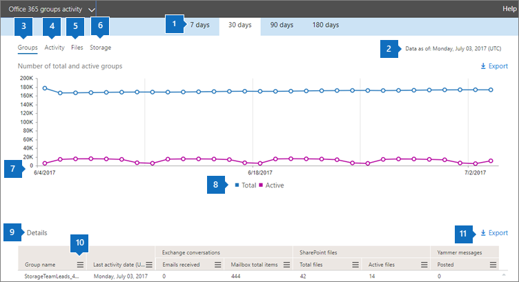

# Relatórios do Microsoft 365 no centro de administração-Microsoft 365 grupos

O painel de **relatórios** do Microsoft 365 mostra a visão geral das atividades em todos os produtos de sua organização. Ele possibilita detalhar até relatórios de um produto específico para que você tenha informações mais precisas sobre as atividades em cada produto. Confira o tópico [Visão geral de relatórios](activity-reports.md). No relatório de grupos do Microsoft 365, você pode obter informações sobre a atividade dos grupos em sua organização e ver quantos grupos estão sendo criados e usados.
  
> [!NOTE]
> Você deve ser um administrador global, um leitor global ou um leitor de relatórios no Microsoft 365 ou um administrador do Exchange, do SharePoint, do teams ou do Skype for Business para ver os relatórios.  
  
## Como obter o relatório de grupos

1. No centro de administração do, vá para a página**Relatórios** \> <a href="https://go.microsoft.com/fwlink/p/?linkid=2074756" target="_blank">Uso</a>.

    
2. No menu suspenso **selecionar um relatório** , selecione atividade de **grupos do Office 365** \> **Groups activity**.
  
## Interpretar o relatório de grupos

Você pode obter uma visão da atividade de grupos examinando os gráficos de **grupos**, de **atividades**, de **arquivos**e de **armazenamento** . 
  

  
|Item|Descrição|
|:-----|:-----|
|1.    |O relatório de **grupos do Microsoft 365** pode ser exibido para tendências nos últimos sete dias, 30 dias, 90 dias ou 180 dias. No entanto, se você selecionar um dia específico no relatório, a tabela (7) mostrará dados de até 28 dias a partir da data atual (não a data em que o relatório foi gerado).    |
|2.    |Os dados em cada relatório normalmente cobrem até as últimas 24 a 48 horas.    |
|3.    |O modo de exibição de **grupos** mostra um número total de grupos que existiam em um determinado dia e grupos ativos nesse dia com base em conversas de email, postagens do Yammer e atividades de arquivo do SharePoint e páginas do SharePoint exibidas.    |
|4.    |O modo de exibição **Atividade** mostra o número de atividades em grupo em cargas de trabalho de grupo. É possível exibir os emails do Exchange recebidos pelas caixas de correio de grupo em todos os grupos em qualquer dia durante o período do relatório. Você também pode ver as mensagens postadas, lidas e curtidas em todos os grupos do Yammer associados a um grupo.   |
|5.    |O modo de exibição **arquivos** mostra o número total e os arquivos ativos em todos os sites de grupo associados a um grupo.    |
|6.    |O modo de exibição **Armazenamento** mostra o total de armazenamento usado em todos os sites do grupo e nas caixas de correio do grupo.    |
|7.    | Na gráfico **Grupos**, o eixo Y é o número de grupos (que podem ser vistos como total versus ativos).     No gráfico **atividade** , o eixo Y é o número de vezes que uma atividade foi realizada em grupos.     No gráfico **Arquivos**, o eixo Y é o número total de arquivos ou de arquivos ativos.     No gráfico **Armazenamento**, o eixo Y é o armazenamento total usado pelo site ou pela caixa de correio do grupo.     O eixo X em todos os três gráficos é o intervalo de datas selecionado para esse relatório específico.    |
|8.    |Você pode filtrar a série que vê no gráfico selecionando um item na legenda. Por exemplo, no gráfico **grupos** **, selecione total** ou total **ativo**  para ver apenas as informações relacionadas a cada um. Ao alterar essa seleção, as informações da tabela não mudam.    |
|9.    | A lista de grupos mostrada é determinada pelo conjunto de todos os grupos que existiram (que não foram excluídos) no mais amplo período de relatório (180 dias). A contagem de atividades (conversas de email, postagens do Yammer e atividades de arquivo do SharePoint) varia de acordo com a seleção da data.    Observação: Talvez você não veja todos os itens da lista abaixo nas colunas até que os adicione. **Nome do grupo** é o nome do grupo.    **Excluídos** é o número de grupos que foram excluídos. Se o grupo for excluído, mas tiver atividades no período do relatório, elas serão exibidas na grade com esse sinalizador definido como true.    **Proprietário do grupo** é o nome do proprietário do grupo.    A **data da última atividade** é a última data em que uma mensagem foi recebida pelo grupo. Esta é a última data em que uma atividade aconteceu em uma conversa por email, Yammer ou Site.    **Tipo** é o tipo de grupo. Pode ser um grupo público ou particular.    **Membros** é o número de membros do grupo.    **Membros externos** é o número de usuários externos do grupo.    **Exchange**   **Emails recebidos** é o número de mensagens recebidas pelo grupo.    **Total de itens da caixa de correio** é o número total de itens na caixa de correio do grupo.    **Armazenamento de caixa de correio usado** é o armazenamento usado pela caixa de correio do grupo.    **Arquivos do SharePoint**   **Total de arquivos** é o número de arquivos armazenados nos sites de grupo do SharePoint.    **Arquivos ativos** é o número de arquivos no site de grupo do SharePoint que foram tratados (visualizados ou modificados, sincronizados, compartilhados interna ou externamente) durante o período do relatório.    **Armazenamento utilizado (MB) do site** é a quantidade de armazenamento em MB usado durante o período do relatório.    **Mensagens do Yammer**   **Postadas** é o número de mensagens postadas no grupo do Yammer durante o período do relatório.    **Lidas** é o número de mensagens lidas no grupo do Yammer durante o período do relatório.    **Curtidas** é o número de mensagens curtidas no grupo do Yammer durante o período do relatório.     Se as políticas da organização impedem a exibição de relatórios em que as informações do usuário podem ser identificadas, você pode alterar as configurações de privacidade para todos esses relatórios. Confira a seção **como ocultar detalhes de nível de usuário?** nos [relatórios de atividades no centro de administração do Microsoft 365](activity-reports.md).    |
|254    |Selecione ou toque em **mais** ações  ao lado de um título de coluna para adicionar ou remover colunas do relatório.    |
|11    |Você também pode exportar os dados do relatório para um arquivo. csv do Excel selecionando o link de **exportação** . Isso exporta os dados de todos os usuários e permite que você realize uma classificação e filtragem simples para mais análise. Se você tiver menos de 2000 usuários, poderá classificar e filtrar dentro da tabela no próprio relatório. Se você tiver mais de 2000 usuários, para filtrar e classificar, você precisa exportar os dados.    |
|||
   

