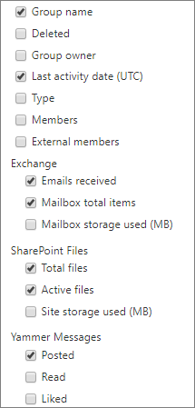

# Relatórios do Microsoft 365 no centro de administração - grupos do Microsoft 365Microsoft 365 Reports in the admin center - Microsoft 365 groups

O painel Relatórios  do Microsoft 365 mostra a visão geral das atividades em todos os produtos em sua organização.The Microsoft 365 **Reports** dashboard shows you the activity overview across the products in your organization. Ele possibilita detalhar até relatórios de um produto específico para que você tenha informações mais precisas sobre as atividades em cada produto.It enables you to drill in to individual product level reports to give you more granular insight about the activities within each product. Confira o tópico [Visão geral de relatórios](activity-reports.md).Check out [the Reports overview topic](activity-reports.md). No relatório de grupos do Microsoft 365, você pode obter informações sobre a atividade de grupos em sua organização e ver quantos grupos estão sendo criados e usados.In the Microsoft 365 groups report, you can gain insights into the activity of groups in your organization and see how many groups are being created and used.
  
> [!NOTE]
> Você deve ser um administrador global, leitor global ou leitor de relatórios no Microsoft 365 ou um administrador do Exchange, SharePoint, Teams Service, Teams Communications ou Skype for Business para ver os relatórios.You must be a global administrator, global reader or reports reader in Microsoft 365 or an Exchange, SharePoint, Teams Service, Teams Communications, or Skype for Business administrator to see reports.  
  
## Como obter o relatório de gruposHow to get to the groups report

1. No centro de administração do, vá para a página **Relatórios** \> <a href="https://go.microsoft.com/fwlink/p/?linkid=2074756" target="_blank">Uso</a>.In the admin center, go to the **Reports** \> <a href="https://go.microsoft.com/fwlink/p/?linkid=2074756" target="_blank">Usage</a> page.

2. Nas opções, selecione **Exibir mais em** Usuários **ativos - Serviços do Microsoft 365.**From the options, select **View more** under **Active users - Microsoft 365 Services**.
3. No **drop-down Selecionar** um relatório, selecione Atividade de Grupos do **Office 365.** \> From the **Select a report** drop-down, select **Office 365** \> **Groups activity**.
  
## Interpretar o relatório de gruposInterpret the groups report

Você pode obter uma exibição das atividades de grupos analisando os gráficos **Grupos**, **Atividade,** **Arquivos** **e** Armazenamento.You can get a view into groups activity by looking at the **Groups**, **Activity**, **Files**, and **Storage** charts. 
  

  
|ItemItem|DescriçãoDescription|
|:-----|:-----|
|1.1.    |O relatório de grupos do **Microsoft 365** pode ser consultado sobre tendências dos últimos 7, 30, 90 ou 180 dias.The **Microsoft 365 groups** report can be viewed for trends over the last 7 days, 30 days, 90 days, or 180 days. No entanto, se você selecionar um dia específico no relatório, a tabela (7) mostrará dados por até 28 dias a partir da data atual (e não a data em que o relatório foi gerado).However, if you select a particular day in the report, the table (7) will show data for up to 28 days from the current date (not the date the report was generated).    |
|2.2.    |Os dados em cada relatório geralmente abrangem até as últimas 24 a 48 horas.The data in each report usually covers up to the last 24 to 48 hours.    |
|3.3.    |A  exibição Grupos mostra um número total de grupos que existiam em um determinado dia e grupos ativos nesse dia com base em conversas de email, postagens do Yammer e atividades de arquivo do SharePoint e páginas do SharePoint exibidas.The **Groups** view shows a total number of groups that existed on any given day, and active groups on that day based on Email Conversations, Yammer Posts and SharePoint file activities and SharePoint pages viewed.    |
|4.4.    |O modo de exibição **Atividade** mostra o número de atividades em grupo em cargas de trabalho de grupo.The **Activity** view shows you the number of group activities across group workloads. É possível exibir os emails do Exchange recebidos pelas caixas de correio de grupo em todos os grupos em qualquer dia durante o período do relatório.You can view the Exchange emails received by the group mailboxes across all groups, on any day during the reporting period. Você também pode ver mensagens postadas, lidas e curtidas nos grupos do Yammer associados a um grupo.You can also see messages posted, read, and liked across the Yammer groups associated with a group.   |
|5.5.    |O **visualização** Arquivos mostra o número total de arquivos ativos e totais em todos os sites de grupo associados a um grupo.The **Files** view shows you the number of total and active files across all group sites associated with a group.    |
|6.6.    |O modo de exibição **Armazenamento** mostra o total de armazenamento usado em todos os sites do grupo e nas caixas de correio do grupo.The **Storage** view shows you the total storage used across all group mailboxes and group sites.    |
|7.7.    | Na gráfico **Grupos**, o eixo Y é o número de grupos (que podem ser vistos como total versus ativos).On the **Groups** chart, Y-axis is the number of groups (which can be seen as total vs active).     No gráfico **Atividade,** o eixo Y é o número de vezes que uma atividade foi executada em grupos.On the **Activity** chart, Y-axis is the number of times an activity was performed in groups.     No gráfico **Arquivos**, o eixo Y é o número total de arquivos ou de arquivos ativos.On the **Files** chart, the Y axis is the number of either total or active files.     No gráfico **Armazenamento**, o eixo Y é o armazenamento total usado pelo site ou pela caixa de correio do grupo.On the **Storage** chart, the Y axis is total storage used by the group mailbox or site.     O eixo X em todos os três gráficos é o intervalo de datas selecionado para esse relatório específico.The X axis on all three charts is the selected date range for the specific report.    |
|8.8.    |Você pode filtrar a série que vê no gráfico selecionando um item na legenda.You can filter the series you see on the chart by selecting an item in the legend. Por exemplo, no gráfico **Grupos,** selecione **Total** ou Total Ativo e Número Ativo de grupos para ver apenas as informações   relacionadas a cada um deles.For example, on the **Groups** chart, select **Total** or **Active**  to see only the info related to each one. Ao alterar essa seleção, as informações da tabela não mudam.Changing this selection doesn't change the info in the grid table.    |
|9.9.    | A lista de grupos mostrada é determinada pelo conjunto de todos os grupos que existiram (que não foram excluídos) no mais amplo período de relatório (180 dias). A contagem de atividades (conversas de email, postagens do Yammer e atividades de arquivo do SharePoint) varia de acordo com a seleção da data.  The list of groups shown is determined by the set of all groups that existed (weren't deleted) across the widest (180-day) reporting time frame. The activity count (email conversations, Yammer posts and SharePoint file activities) will vary according to the date selection.    OBSERVAÇÃO: talvez você não veja todos os itens na lista abaixo nas colunas até adicioná-los.NOTE: You might not see all the items in the list below in the columns until you add them. **Nome do grupo** é o nome do grupo.**Group name** is the name of the group.    **Excluídos** é o número de grupos que foram excluídos. Se o grupo for excluído, mas tiver atividades no período do relatório, elas serão exibidas na grade com esse sinalizador definido como true.  **Deleted** is the number of deleted groups. If the group is deleted, but had activity in the reporting period it will show up in the grid with this flag set to true.    **Proprietário do grupo** é o nome do proprietário do grupo.**Group owner** is the name of the group owner.    **A data da última atividade** é a última data em que uma mensagem foi recebida pelo grupo.**Last activity date** is the latest date a message was received by the group. Esta é a última data em que uma atividade aconteceu em uma conversa por email, Yammer ou Site.- This is the latest date an activity happened in an email conversation, Yammer, or the Site.    **Tipo** é o tipo de grupo. Pode ser um grupo público ou particular.  **Type** is the type of group. This can be private or public group.    **Membros** é o número de membros do grupo.**Members** is the number of members in the group.    **Membros externos** é o número de usuários externos do grupo.**External members** is the number of external users in the group.    **Exchange****Exchange**   **Emails recebidos** é o número de mensagens recebidas pelo grupo.**Emails received** is the number of messages received by the group.    **Total de itens da caixa de correio** é o número total de itens na caixa de correio do grupo.**Mailbox total items** is the total number of items in the group's mailbox.    **Armazenamento de caixa de correio usado** é o armazenamento usado pela caixa de correio do grupo.**Mailbox storage used** is the storage used by the group's mailbox.    **Arquivos do SharePoint****SharePoint Files**   **Total de arquivos** é o número de arquivos armazenados nos sites de grupo do SharePoint.**Total files** is the number of files stored in SharePoint group sites.    **Arquivos ativos** é o número de arquivos no site de grupo do SharePoint que foram tratados (visualizados ou modificados, sincronizados, compartilhados interna ou externamente) durante o período do relatório.**Active files** is the number of files in the SharePoint group site that were acted on (viewed or modified, synched , shared internally or externally) during the reporting period    **Armazenamento utilizado (MB) do site** é a quantidade de armazenamento em MB usado durante o período do relatório.**Site storage used (MB)** is the amount of storage in MB used during the reporting period.    **Mensagens do Yammer****Yammer Messages**   **Postadas** é o número de mensagens postadas no grupo do Yammer durante o período do relatório.**Posted** is the number of messages posted in the Yammer group over the reporting period.    **Lidas** é o número de mensagens lidas no grupo do Yammer durante o período do relatório.**Read** is the number of conversations read in the Yammer group over the reporting period.    **Curtidas** é o número de mensagens curtidas no grupo do Yammer durante o período do relatório.**Liked** is the number of messages liked in the Yammer group over the reporting period.     Se as políticas da organização impedem a exibição de relatórios em que as informações do usuário podem ser identificadas, você pode alterar as configurações de privacidade para todos esses relatórios.If your organization's policies prevents you from viewing reports where user information is identifiable, you can change the privacy setting for all these reports. Confira a seção **Como faço para ocultar detalhes no nível do usuário?** nos Relatórios de Atividades no centro de administração do Microsoft [365.](activity-reports.md)Check out the **How do I hide user level details?** section in the [Activity Reports in the Microsoft 365 admin center](activity-reports.md).    |
|10,10,    |Select or tap **More Actions** button  column heading to add or remove columns from the report.Select or tap **More Actions** button  next to a column heading to add or remove columns from the report.    |
|11,11,    |Você também pode exportar os dados do relatório para um arquivo .csv do Excel selecionando o link **Exportar.**You can also export the report data into an Excel .csv file by selecting the **Export** link. Isso exporta os dados de todos os usuários e permite que você realize uma classificação e filtragem simples para mais análise.This exports data of all users and enables you to do simple sorting and filtering for further analysis. Se você tiver menos de 2000 usuários, poderá classificar e filtrar dentro da tabela no próprio relatório.If you have less than 2000 users, you can sort and filter within the table in the report itself. Se você tiver mais de 2000 usuários, para filtrar e classificar, você precisa exportar os dados.If you have more than 2000 users, in order to filter and sort, you will need to export the data.    |
|||
   
