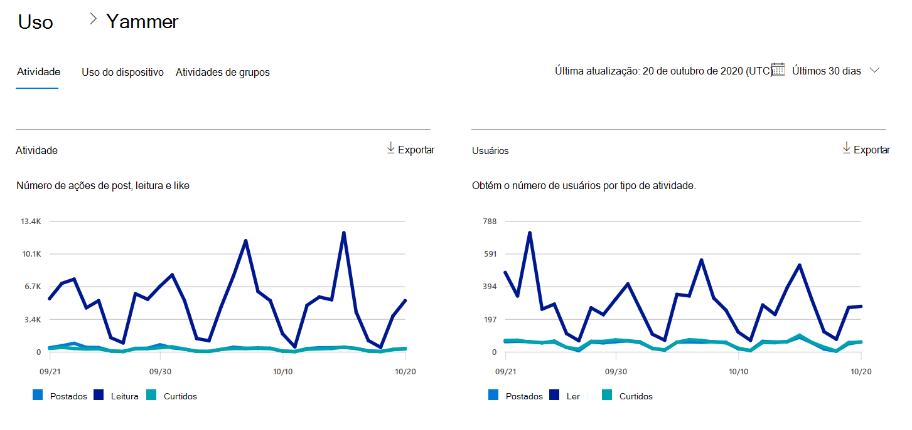
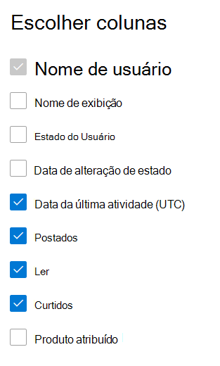

# Relatórios do Microsoft 365 no centro de administração - Relatório de atividades do YammerMicrosoft 365 Reports in the admin center - Yammer activity report

Como administrador do Microsoft 365, o painel **Relatórios** mostra dados sobre o uso dos produtos em sua organização.As Microsoft 365 admin, the **Reports** dashboard shows you data on the usage of the products within your organization. Confira relatórios [de atividades no centro de administração](activity-reports.md).Check out [activity reports in the admin center](activity-reports.md). Com o **Relatório de atividades do Yammer**, você vai entender o nível de interação da sua organização com o Yammer examinando o número de usuários exclusivos usando o Yammer para postar, curtir ou ler uma mensagem e a quantidade de atividade gerada em toda a organização.With the **Yammer Activity report**, you can understand the level of engagement of your organization with Yammer by looking at the number of unique users using Yammer to post, like or read a message and the amount of activity generated across the organization. 
  
> [!NOTE]
> Você deve ser um administrador global, leitor global ou leitor de relatórios no Microsoft 365 ou um administrador do Exchange, SharePoint, Teams Service, Teams Communications ou Skype for Business para ver relatórios.You must be a global administrator, global reader or reports reader in Microsoft 365 or an Exchange, SharePoint, Teams Service, Teams Communications, or Skype for Business administrator to see reports.  
 
## Como faço para chegar ao relatório de atividades do Yammer?How do I get to the Yammer activity report?

1. No centro de administração do, vá para a página **Relatórios** \> <a href="https://go.microsoft.com/fwlink/p/?linkid=2074756" target="_blank">Uso</a>.In the admin center, go to the **Reports** \> <a href="https://go.microsoft.com/fwlink/p/?linkid=2074756" target="_blank">Usage</a> page. 
2. Na página inicial do painel, clique no botão **Exibir mais** no cartão Yammer.From the dashboard homepage, click on the **View more** button on the Yammer card.

  
## Interpretar o relatório de atividades do YammerInterpret the Yammer activity report

Você pode exibir as atividades no relatório do Yammer escolhendo a **guia Atividade.**You can view the activities in the Yammer report by choosing the **Activity** tab. 

Selecione **Escolher colunas** para adicionar ou remover colunas do relatório.Select **Choose columns** to add or remove columns from the report.    

Você também pode exportar os dados do relatório para um arquivo .csv do Excel selecionando o link **Exportar.**You can also export the report data into an Excel .csv file by selecting the **Export** link. Isso exporta os dados de todos os usuários e permite que você realize uma classificação e filtragem simples para mais análise.This exports data of all users and enables you to do simple sorting and filtering for further analysis. Se você tiver menos de 2000 usuários, poderá classificar e filtrar dentro da tabela no próprio relatório.If you have less than 2000 users, you can sort and filter within the table in the report itself. Se você tiver mais de 2000 usuários, para filtrar e classificar, você precisa exportar os dados.If you have more than 2000 users, in order to filter and sort, you will need to export the data. 
  
|ItemItem|DescriçãoDescription|
|:-----|:-----|
|**Indicador****Metric**|**Definição****Definition**|
|Nome de usuárioUsername    |O endereço de email do usuário.The email address of the user. Você pode exibir o endereço de email real ou tornar este campo anônimo.You can display the actual email address or make this field anonymous. Esta grade mostra os usuários que fizeram logont no Yammer usando a conta do Microsoft 365 ou que fizeram logont na rede usando logont único.This grid shows users who logged into Yammer using the Microsoft 365 account or who logged into the network using single sign-on.   |
|Nome de exibiçãoDisplay name    |O nome completo do usuário.The full name of the user. Você pode exibir o endereço de email real ou tornar este campo anônimo.You can display the actual email address or make this field anonymous.    |
|Estado do usuárioUser state    |Um dos três valores: Ativado, Excluído ou Suspenso.One of three values: Activated, Deleted, or Suspended. Esses relatórios mostram os dados de usuários ativos, suspensos e excluídos.These reports show data for active, suspended, and deleted users. Eles não refletem os usuários pendentes, pois os usuários pendentes não podem publicar, ler ou curtir uma mensagem.They do not reflect pending users, because pending users cannot post, read, or like a message.    |
|Data de alteração de estado (UTC)State change date (UTC)    |A data em que o estado do usuário foi alterado no Yammer.The date on which the user's state was changed in Yammer.    |
|Data da última atividade (UTC)Last activity date (UTC)    | A última data em que o usuário postou, leu ou gostou de uma mensagem.The last date that the user posted, read, or liked a message.    |
|PostadosPosted    |O número de mensagens que o usuário postou durante o período especificado.The number of messages the user posted during the time period you specified.  |
|LerRead    |O número de conversas que o usuário leu durante o período especificado.The number of conversations that the user read during the time period you specified.    |
|CurtidosLiked    |O número de mensagens que o usuário gostou durante o período especificado.The number of messages that the user liked during the time period you specified.   |
|Produto atribuídoProduct assigned    |Os produtos atribuídos a esse usuário.The products that are assigned to this user.|
|||