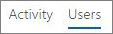
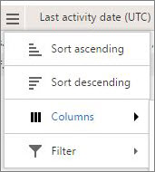

# Relatórios do Microsoft 365 no centro de administração-relatório de atividades do YammerMicrosoft 365 Reports in the admin center - Yammer activity report

Como o Microsoft 365 admin, o painel **relatórios** mostra dados sobre o uso dos produtos dentro da sua organização.As Microsoft 365 admin, the **Reports** dashboard shows you data on the usage of the products within your organization. Confira [os relatórios de atividade no centro de administração](activity-reports.md).Check out [activity reports in the admin center](activity-reports.md). Com o **Relatório de atividades do Yammer**, você vai entender o nível de interação da sua organização com o Yammer examinando o número de usuários exclusivos usando o Yammer para postar, curtir ou ler uma mensagem e a quantidade de atividade gerada em toda a organização.With the **Yammer Activity report**, you can understand the level of engagement of your organization with Yammer by looking at the number of unique users using Yammer to post, like or read a message and the amount of activity generated across the organization. 
  
> [!NOTE]
> Você deve ser um administrador global, um leitor global ou um leitor de relatórios no Microsoft 365 ou um administrador do Exchange, do SharePoint, do teams ou do Skype for Business para ver os relatórios.You must be a global administrator, global reader or reports reader in Microsoft 365 or an Exchange, SharePoint, Teams Service, Teams Communications, or Skype for Business administrator to see reports. 
 
## Como acessar o relatório de atividade do YammerHow to get to the Yammer activity report

1. No centro de administração do, vá para a página**Relatórios** \> <a href="https://go.microsoft.com/fwlink/p/?linkid=2074756" target="_blank">Uso</a>.In the admin center, go to the **Reports** \> <a href="https://go.microsoft.com/fwlink/p/?linkid=2074756" target="_blank">Usage</a> page.

    
2. No menu suspenso **selecionar um relatório** , selecione **atividade**do **Yammer** \> .From the **Select a report** drop-down, select **Yammer** \> **Activity**.
  
## Interpretar o relatório de atividades do YammerInterpret the Yammer activity report

Você pode observar a atividade do Yammer do usuário examinando os gráficos Atividade e Usuários.You can get a view into your user's Yammer activity by looking at the Activity and Users charts.
  

  
O relatório de atividade contém as informações a seguir.The activity report contains the following information.
  
- Use as guias de dia para exibir o relatório **Atividade do Yammer** sobre tendências dos últimos 7, 30, 90 ou 180 dias.Use the day tabs to view the **Yammer activity** report trends over the last 7 days, 30 days, 90 days, or 180 days. No entanto, se você selecionar um dia específico no relatório, a tabela mostrará dados de até 28 dias a partir da data atual (não a data em que o relatório foi gerado).However, if you select a particular day in the report, the table will show data for up to 28 days from the current date (not the date the report was generated). 
    
- Cada relatório tem uma data de geração. O relatório geralmente reflete um período de latência de atividade de 24 a 48 horas.Each report has a date for when the report was generated. The reports usually reflect a 24 to 48 hour latency from time of activity.
    
- O gráfico **Atividade** permite que você entenda a tendência da quantidade de atividade do Yammer ocorrendo em sua organização. Você pode entender a divisão de mensagens postadas, lidas ou curtidas.You can view the **Activity** chart to understand the trend of the amount of Yammer activity going on in your organization. You can understand the split of messages posted, read, or liked. 
    
    
  
  - No gráfico **Atividade**, o eixo Y é a contagem de atividades de mensagens postadas, lidas ou curtidas.On the **Activity** chart, the Y axis is the count of activity of the messages posted, read, or liked. 
    
- Você pode ver o gráfico **Usuário** para entender a tendência da quantidade de usuários exclusivos que estão gerando as atividades do Yammer. Você pode examinar a tendência de usuários postando, lendo ou curtindo mensagens do Yammer.You can view the **User** chart to understand the trend of the amount of unique users who are generating the Yammer activities. You can look at the trend of users posting, reading, or liking Yammer messages. 
    
    
  
  - No gráfico de atividades **Usuários**, o eixo Y é o usuário postando, lendo ou curtindo mensagens do Yammer.On the **Users** activity chart, the Y axis is the user posting, reading, or liking Yammer messages. 
    
  - O eixo X em ambos os gráficos é o intervalo de datas selecionado para esse relatório específico.The X axis on both charts is the selected date range for this specific report.
    
- Você pode filtrar a série que vê no gráfico selecionando um item na legenda.You can filter the series you see on the chart by selecting an item in the legend. Por exemplo, no gráfico **atividade** , selecione **Postado**, **leitura**ou **curtido** para ver apenas as informações relacionadas a cada uma delas.For example, on the **Activity** chart, select **Posted**, **Read**, or **Liked** to see only the info related to each one. 
    
    
  
    Ao alterar essa seleção, as informações da tabela não mudam.Changing this selection doesn't change the info in the grid table.
    
- A tabela sob o gráfico mostra um detalhamento das atividades do Yammer no nível de cada usuário.The table under the graph shows you a breakdown of the Yammer activities at the per-user level.
    
    Você pode usar o menu para filtrar e classificar os dados.You can use the menu to filter and sort the data.
    
    
  
    Você também pode adicionar e remover colunas.You can also add and remove columns. As colunas disponíveis são:The available columns are:
    
  - **Nome de usuário** é o endereço de email do usuário.**Username** is the email address of the user. Você pode exibir o endereço de email real ou tornar este campo anônimo.You can display the actual email address or make this field anonymous. 
    
    Esta grade mostra os usuários que fizeram logon no Yammer usando a conta do Microsoft 365 ou que fizeram logon na rede usando o single sign-on.This grid shows users who logged into Yammer using the Microsoft 365 account or who logged into the network using single sign-on.
    
  - **Nome para exibição** é o nome completo do usuário. Você pode exibir o endereço de email real ou tornar este campo anônimo.**Display name** is the full name of the user. You can display the actual email address or make this field anonymous. 
    
  - **Estado do usuário** é um dos três valores: Ativados, excluídos ou suspensos.**User state** is one of three values: Activated, Deleted, or Suspended. 
    
    Esses relatórios mostram os dados de usuários ativos, suspensos e excluídos. Eles não refletem os usuários pendentes, pois os usuários pendentes não podem publicar, ler ou curtir uma mensagem.These reports show data for active, suspended, and deleted users. They do not reflect pending users, because pending users cannot post, read, or like a message.
    
  - **Data de alteração de estado (UTC)** é a data em que o estado do usuário foi modificado no Yammer.**State change date (UTC)** is the date on which the user's state was changed in Yammer. 
    
  - **Última data de atividade (UTC)** refere-se à última data em que o usuário publicou, leu ou curtiu uma mensagem.**Last activity date (UTC)** refers to the last date that the user posted, read, or liked a message. 
    
  - **Postados** é o número de mensagens que o usuário postou durante o período especificado.**Posted** is the number of messages the user posted during the time period you specified. 
    
  - **Lidos** é o número de conversas que o usuário leu durante o período especificado.**Read** is the number of conversations that the user read during the time period you specified. 
    
  - **Curtidos** é o número de mensagens que o usuário leu durante o período especificado.**Liked** is the number of messages that the user liked during the time period you specified. 
    
  - **Produto atribuído** são os produtos atribuídos a esse usuário.**Product assigned** is the products that are assigned to this user. 
    
    Se as políticas da organização impedem a exibição de relatórios em que as informações do usuário podem ser identificadas, você pode alterar as configurações de privacidade para todos esses relatórios.If your organization's policies prevents you from viewing reports where user information is identifiable, you can change the privacy setting for all these reports. Confira a seção **como ocultar detalhes de nível de usuário?** em [relatórios de atividades no centro de administração do Microsoft 365](activity-reports.md).Check out the **How do I hide user level details?** section in [Activity reports in the Microsoft 365 admin center](activity-reports.md).
    
- Você também pode exportar os dados do relatório para um arquivo. csv do Excel, selecionando o link de **exportação** .You can also export the report data into an Excel .csv file, by selecting the **Export** link. Isso exporta os dados de todos os usuários e permite que você realize uma classificação e filtragem simples para mais análise.This exports data of all users and enables you to do simple sorting and filtering for further analysis. Se você tiver menos de 2000 usuários, poderá classificar e filtrar dentro da tabela no próprio relatório.If you have less than 2000 users, you can sort and filter within the table in the report itself. Se você tiver mais de 2000 usuários, para filtrar e classificar, você precisa exportar os dados.If you have more than 2000 users, in order to filter and sort, you will need to export the data. 
    
## Que dados fazem parte desses relatórios?What data is in these reports?

- **Todos os clientes** esses relatórios agregam dados entre todos os clientes, inclusive os que usam o Yammer em um navegador ou em um aplicativo do Android ou iOS.**All clients** These reports aggregate data across all clients, including using Yammer in a browser or on an iOS or Android app. 
    
- **Nenhum dado de rede externa** dados de rede externa não estão incluídos nesses relatórios.**No external network data** External network data is not included in these reports. 
    
- **Redes ativadas** Esses relatórios mostram os dados da rede do Yammer que fazem parte de sua assinatura do Microsoft 365.**Activated networks** These reports show data for the Yammer network that is part of your Microsoft 365 subscription. O gráfico agrega uso de todos os usuários que fizeram logon na rede do Yammer, independentemente de terem usado o Microsoft 365 ou Yammer para fazer logon.The chart aggregates usage of all users who logged into the Yammer network, irrespective of whether they used Microsoft 365 or Yammer to log in. 
    

