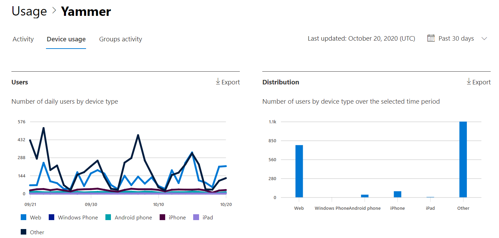

# Relatórios do Microsoft 365 no centro de administração - Relatório de uso de dispositivos do Yammer

O painel Relatórios  do Microsoft 365 mostra a visão geral das atividades em todos os produtos em sua organização. Ele possibilita detalhar até relatórios de um produto específico para que você tenha informações mais precisas sobre as atividades em cada produto. Confira o tópico [Visão geral de relatórios](activity-reports.md).
  
Os relatórios de uso de dispositivos do Yammer fornecem informações sobre em quais dispositivos seus usuários estão utilizando o Yammer. Você pode visualizar o número de usuários por dia por tipo de dispositivo e o número de usuários por tipo de dispositivo. Você pode visualizar ambos de acordo com um período específico de tempo. Você também pode visualizar detalhes por usuário.
  
> [!NOTE]
> Você deve ser um administrador global, leitor global ou leitor de relatórios no Microsoft 365 ou um administrador do Exchange, SharePoint, Teams Service, Teams Communications ou Skype for Business para ver os relatórios.  
 
## Como posso obter o relatório de uso de dispositivos do Yammer?

1. No centro de administração do, vá para a página **Relatórios** \> <a href="https://go.microsoft.com/fwlink/p/?linkid=2074756" target="_blank">Uso</a>. 
2. Na home page do painel, clique no botão Exibir **mais** no cartão do Yammer.
  
## Interpretar o relatório de uso de dispositivos do Yammer

Você pode exibir o uso no relatório do OneDrive escolhendo a guia **Uso do** dispositivo. 

Selecione **Escolher colunas** para adicionar ou remover colunas do relatório.    

Você também pode exportar os dados do relatório para um arquivo .csv do Excel selecionando o link **Exportar.** Isso exporta os dados de todos os usuários e permite que você realize uma classificação e filtragem simples para mais análise. Se você tiver menos de 2000 usuários, poderá classificar e filtrar dentro da tabela no próprio relatório. Se você tiver mais de 2000 usuários, para filtrar e classificar, você precisa exportar os dados. 
  
|Item|Descrição|
|:-----|:-----|
|**Indicador**|**Definição**|
|Nome de usuário    |O endereço de email do usuário. Você pode exibir o endereço de email real ou tornar este campo anônimo. Esta grade mostra os usuários que se registraram no Yammer usando a conta do Microsoft 365 ou que fizeram logor na rede usando o logor único.   |
|Nome de exibição    |O nome completo do usuário. Você pode exibir o endereço de email real ou tornar este campo anônimo.    |
|Estado do usuário    |Um dos três valores: Ativo, Excluído ou Suspenso. Esses relatórios mostram os dados de usuários ativos, suspensos e excluídos. Eles não refletem os usuários pendentes, pois os usuários pendentes não podem publicar, ler ou curtir uma mensagem.     |
|Data da alteração de estado (UTC)    |A data em que o estado do usuário foi alterado no Yammer.    |
|Data da última atividade (UTC)    |A última data (UTC) em que o usuário participou de uma atividade do Yammer.    |
|Web    |Indica se o usuário usou o Yammer na Web.    |
|Windows Phone    | Indica se o usuário usou o Yammer em um telefone Windows.    |
|Celular Android    |Indica se o usuário usou o Yammer em um telefone Android.  |
|iphone   | Indica se o usuário usou o Yammer em um iPhone.    |
|ipad    |Indica se o usuário usou o Yammer em um iPad.  |
|outros    |Indica se o usuário usou o Yammer em outro dispositivo, não listado anteriormente.  |
|||