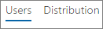
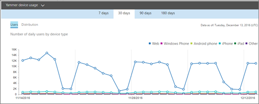

# Relatórios do Microsoft 365 no centro de administração - Relatório de uso do dispositivo Yammer

O painel Relatórios  do Microsoft 365 mostra a visão geral da atividade em todos os produtos em sua organização. Ele possibilita detalhar até relatórios de um produto específico para que você tenha informações mais precisas sobre as atividades em cada produto. Confira o tópico [Visão geral de relatórios](activity-reports.md).
  
Os relatórios de uso de dispositivos do Yammer fornecem informações sobre em quais dispositivos seus usuários estão utilizando o Yammer. Você pode visualizar o número de usuários por dia por tipo de dispositivo e o número de usuários por tipo de dispositivo. Você pode visualizar ambos de acordo com um período específico de tempo. Você também pode visualizar detalhes por usuário.
  
> [!NOTE]
> Você deve ser um administrador global, leitor global ou leitor de relatórios no Microsoft 365 ou um administrador do Exchange, SharePoint, Teams Service, Teams Communications ou Skype for Business para ver relatórios. 
  
## Como posso obter o relatório de uso de dispositivos do Yammer?

1. No centro de administração do, vá para a página **Relatórios** \> <a href="https://go.microsoft.com/fwlink/p/?linkid=2074756" target="_blank">Uso</a>.

    
2. No drop-down **Selecionar um** relatório, selecione **Uso do Dispositivo yammer** \> .
  
## Interpretar o relatório de atividades do Yammer

Você pode ver detalhes de uso do dispositivo Yammer dos seus usuários examinando os gráficos **Usuários** e **Distribuição**. 
  
O relatório de uso do dispositivo contém as informações a seguir.
  
- Use as guias de dia para exibir as tendências do relatório de atividade de uso do dispositivo **Yammer** nos últimos 7 dias, 30, 90 ou 180 dias. No entanto, se você selecionar um dia específico no relatório, a tabela mostrará dados por até 28 dias a partir da data atual (e não a data em que o relatório foi gerado). 
    
- Cada relatório tem uma data de geração. O relatório geralmente reflete um período de latência de atividade de 24 a 48 horas.
    
- Você pode visualizar o gráfico **Usuários** para ver o número de usuários por dia por tipo de dispositivo.  
  
- Você pode visualizar o gráfico **Distribuição** para ver o número de usuários por tipo de dispositivo.  
  
- A tabela **Detalhes** sob o gráfico mostra um detalhamento do uso do dispositivo Yammer no nível de cada usuário. 
    
    Você também pode adicionar e remover colunas. As colunas disponíveis são:
    
  - **Nome de usuário** é o endereço de email do usuário. Você pode exibir o endereço de email real ou tornar este campo anônimo. 
    
    Esta grade mostra os usuários que fizeram logont no Yammer usando a conta do Microsoft 365 ou que fizeram logont na rede usando logont único.
    
  - **Nome para exibição** é o nome completo do usuário. Você pode exibir o endereço de email real ou tornar este campo anônimo. 
    
  - **Estado do usuário** é um dos três valores: ativos, excluídos ou suspensos. 
    
    Esses relatórios mostram os dados de usuários ativos, suspensos e excluídos. Eles não refletem os usuários pendentes, pois os usuários pendentes não podem publicar, ler ou curtir uma mensagem.
    
  - **Web** indica se o usuário usou o Yammer na Web. 
    
  - **Telefone Windows** indica se o usuário usou o Yammer em um telefone Windows 
    
  - **Telefone Android** indica se o usuário usou o Yammer em um telefone Android. 
    
  - **iPhone** indica se o usuário usou o Yammer em um iPhone. 
    
  - **iPad** indica se o usuário usou o Yammer em um iPad. 
    
  - **Outro** indica se o usuário usou o Yammer em outro dispositivo não listado anteriormente. 
    
    Se as políticas da organização impedem a exibição de relatórios em que as informações do usuário podem ser identificadas, você pode alterar as configurações de privacidade para todos esses relatórios. Confira a seção Como ocultar detalhes do nível **do usuário?** na seção Relatórios de Atividades no centro de administração [do Microsoft 365.](activity-reports.md)
    
- Você também pode exportar os dados do relatório para um arquivo .csv do Excel, selecionando o link **Exportar.** Isso exporta os dados de todos os usuários e permite que você realize uma classificação e filtragem simples para mais análise. Se você tiver menos de 2000 usuários, poderá classificar e filtrar dentro da tabela no próprio relatório. Se você tiver mais de 2000 usuários, para filtrar e classificar, você precisa exportar os dados. 
    

