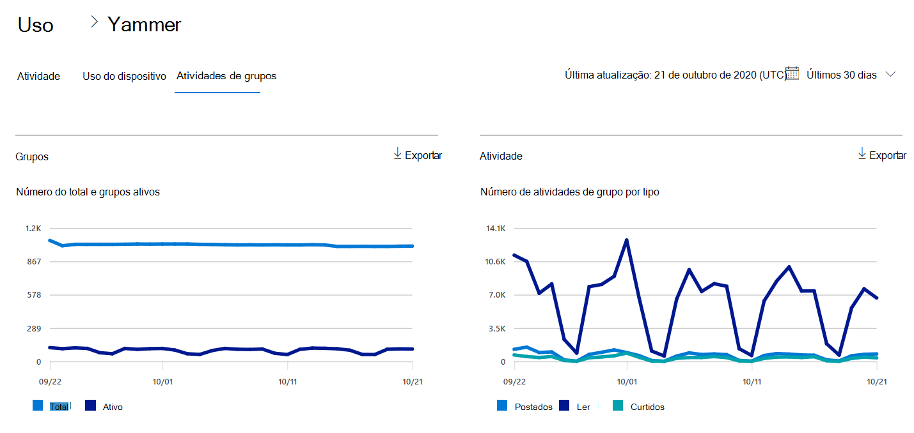
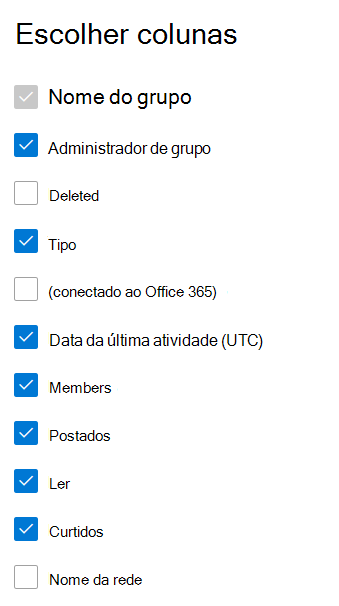

# Relatórios do Microsoft 365 no centro de administração - Relatório de atividades de grupos do YammerMicrosoft 365 Reports in the admin center - Yammer groups activity report

O painel Relatórios  do Microsoft 365 mostra a visão geral das atividades em todos os produtos em sua organização.The Microsoft 365 **Reports** dashboard shows you the activity overview across the products in your organization. Ele possibilita detalhar até relatórios de um produto específico para que você tenha informações mais precisas sobre as atividades em cada produto.It enables you to drill in to individual product level reports to give you more granular insight about the activities within each product. Confira o tópico [Visão geral de relatórios](activity-reports.md).Check out [the Reports overview topic](activity-reports.md). No relatório de atividades de grupos do Yammer, é possível obter informações sobre as atividades de grupos do Yammer em sua organização e ver quantos grupos do Yammer estão sendo criados e usados.In the Yammer groups activity report, you can gain insights into the activity of Yammer groups in your organization and see how many Yammer groups are being created and used.
  
> [!NOTE]
> Você deve ser um administrador global, leitor global ou leitor de relatórios no Microsoft 365 ou um administrador do Exchange, SharePoint, Teams Service, Teams Communications ou Skype for Business para ver os relatórios.You must be a global administrator, global reader or reports reader in Microsoft 365 or an Exchange, SharePoint, Teams Service, Teams Communications, or Skype for Business administrator to see reports.  
 
## Como faço para chegar ao relatório de atividades de grupos do Yammer?How do I get to the Yammer groups activity report?

1. No centro de administração do, vá para a página **Relatórios** \> <a href="https://go.microsoft.com/fwlink/p/?linkid=2074756" target="_blank">Uso</a>.In the admin center, go to the **Reports** \> <a href="https://go.microsoft.com/fwlink/p/?linkid=2074756" target="_blank">Usage</a> page. 
2. Na home page do painel, clique no botão Exibir **mais** no cartão do Yammer.From the dashboard homepage, click on the **View more** button on the Yammer card.

  
## Interpretar o relatório de atividades de grupos do YammerInterpret the Yammer groups activity report

Você pode exibir as atividades de grupos no relatório do Yammer escolhendo a **guia Atividades de** grupos.You can view the groups activities in the Yammer report by choosing the **Groups activity** tab. 

Selecione **Escolher colunas** para adicionar ou remover colunas do relatório.Select **Choose columns** to add or remove columns from the report.    

Você também pode exportar os dados do relatório para um arquivo .csv do Excel selecionando o link **Exportar.**You can also export the report data into an Excel .csv file by selecting the **Export** link. Isso exporta os dados de todos os usuários e permite que você realize uma classificação e filtragem simples para mais análise.This exports data of all users and enables you to do simple sorting and filtering for further analysis. Se você tiver menos de 2000 usuários, poderá classificar e filtrar dentro da tabela no próprio relatório.If you have less than 2000 users, you can sort and filter within the table in the report itself. Se você tiver mais de 2000 usuários, para filtrar e classificar, você precisa exportar os dados.If you have more than 2000 users, in order to filter and sort, you will need to export the data. 
  
|ItemItem|DescriçãoDescription|
|:-----|:-----|
|**Indicador****Metric**|**Definição****Definition**|
|Nome do grupoGroup name    |O nome do grupo.The name of the group.   |
|Administrador do grupoGroup admin    |O nome do administrador ou proprietário do grupo.The name of the group administrator, or owner.    |
|DeletedDeleted    |O número de grupos excluídos do Yammer.The number of deleted Yammer groups. Se o grupo for excluído, mas tiver atividades no período do relatório, elas serão exibidas na grade com esse sinalizador definido como true.If the group is deleted, but had activity in the reporting period it will show up in the grid with this flag set to true.    |
|TipoType    |O tipo de grupo, público ou privado.The type of group, public or private.   |
|Conectado ao Office 365Connected to Office 365    |Indica se o grupo do Yammer também é um grupo do Microsoft 365.Indicates whether the Yammer group is also an Microsoft 365 group.   |
|Data da última atividade (UTC)Last activity date (UTC)    | A última data em que uma mensagem foi lida, postada ou curtida pelo grupo.The latest date a message was read, posted or liked by the group.    |
|MembersMembers    | O número de membros no grupo.The number of members in the group.    |
|PostadosPosted    |O número de mensagens postadas no grupo do Yammer durante o período do relatório.The number of messages posted in the Yammer group over the reporting period.  |
|LerRead    |O número de conversas lidas no grupo do Yammer durante o período do relatório.The number of conversations read in the Yammer group over the reporting period.    |
|CurtidosLiked    |O número de mensagens curtidas no grupo do Yammer durante o período do relatório.The number of messages liked in the Yammer group over the reporting period.  |
|Nome da redeNetwork name    |O nome completo da rede à que o grupo pertence.The full name of the network that the group belongs to. |
|||