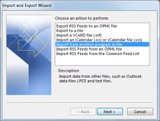

# Obter acesso e realizar backup dos dados de um ex-usuário

Quando um funcionário deixa sua organização, você provavelmente deseja acessar seus dados (documentos e emails) e examiná-los, fazer o backup ou dar a ele um novo funcionário.
  
    
## Acessar os documentos do OneDrive de um usuário antigo

Se você remover a licença de um usuário, mas não excluir a conta, poderá dar a si mesmo o acesso ao conteúdo no OneDrive do usuário. Se você excluir a conta do usuário, você terá 30 dias por padrão para acessar os dados do OneDrive do usuário anterior. [Saiba como definir a retenção do onedrive para usuários excluídos](/onedrive/set-retention). Se você não [restaurar uma conta de usuário](/office365/admin/add-users/restore-user) dentro desse tempo, o conteúdo do onedrive será excluído. 

Para preservar os arquivos do OneDrive de um usuário antigo, primeiro acesse seu OneDrive e mova os arquivos que você deseja manter. 

::: moniker range="o365-worldwide"

> [!NOTE]
> Se não estiver usando o novo centro de administração do Microsoft 365, você poderá ativá-lo selecionando a alternância **Experimentar o novo centro de administração** localizado na parte superior da Home Page.

1. No centro de administração, vá para a página **Usuários** \> <a href="https://go.microsoft.com/fwlink/p/?linkid=834822" target="_blank">Usuários ativos</a>.  
    
2. Selecione um usuário.

3. No painel direito, selecione **onedrive**. Em **obter acesso a arquivos**, selecione **criar link para arquivos**.

4. Selecione o link para abrir o local do arquivo. Baixe os arquivos para o seu computador ou selecione **mover para** ou **copiar para** para movê-los ou copiá-los para o seu próprio onedrive ou para uma biblioteca compartilhada. 

> [!NOTE]
> Você pode mover ou copiar até 500 MB de arquivos e pastas por vez. 
> Quando você move ou copia documentos que têm histórico de versões, apenas a versão mais recente é movida.  

::: moniker-end

::: moniker range="o365-germany"

1. No centro de administração, vá para a página **Usuários** \> <a href="https://go.microsoft.com/fwlink/p/?linkid=847686" target="_blank">Usuários ativos</a>.  

2. Selecione um usuário.

3. No painel direito, expanda **configurações do onedrive**e, em seguida, ao lado de **acesso**, selecione **arquivos do Access**.

4. Selecione o link para abrir o local do arquivo. Baixe os arquivos para o seu computador ou selecione **mover para** ou **copiar para** para movê-los ou copiá-los para o seu próprio onedrive ou para uma biblioteca compartilhada. 

> [!NOTE]
> Você pode mover ou copiar até 500 MB de arquivos e pastas por vez. 
> Quando você move ou copia documentos que têm histórico de versões, apenas a versão mais recente é movida.  

::: moniker-end

::: moniker range="o365-21vianet"

1. No centro de administração, vá para a página **Usuários** \> <a href="https://go.microsoft.com/fwlink/p/?linkid=850628" target="_blank">Usuários ativos</a>. 

2. Selecione um usuário.

3. No painel direito, expanda **configurações do onedrive**e, em seguida, ao lado de **acesso**, selecione **arquivos do Access**.

4. Selecione o link para abrir o local do arquivo. Baixe os arquivos para o seu computador ou selecione **mover para** ou **copiar para** para movê-los ou copiá-los para o seu próprio onedrive ou para uma biblioteca compartilhada.  

> [!NOTE]
> Você pode mover ou copiar até 500 MB de arquivos e pastas por vez. 
> Quando você move ou copia documentos que têm histórico de versões, apenas a versão mais recente é movida.  

::: moniker-end
    

## Revogar o acesso do administrador ao OneDrive de um usuário

Como administrador global, você pode dar a si mesmo acesso ao conteúdo no OneDrive de um usuário, mas talvez queira remover o acesso quando não precisar mais dele. 

::: moniker range="o365-worldwide"

1. Entre no centro de <a href="https://go.microsoft.com/fwlink/p/?linkid=2024339" target="_blank">Administração</a> como administrador global ou administrador do SharePoint. 

    Se você receber uma mensagem informando que você não tem permissão para acessar o centro de administração, você não tem permissões de administrador em sua organização.

::: moniker-end

::: moniker range="o365-germany"

1. Entre no centro de <a href="https://go.microsoft.com/fwlink/p/?linkid=848041" target="_blank">Administração</a> como administrador global ou administrador do SharePoint.

    Se você receber uma mensagem informando que você não tem permissão para acessar o centro de administração, você não tem permissões de administrador em sua organização.

::: moniker-end

::: moniker range="o365-21vianet"

1. Entre no centro de <a href="https://go.microsoft.com/fwlink/p/?linkid=850627" target="_blank">Administração</a> como administrador global ou administrador do SharePoint.

    Se você receber uma mensagem informando que você não tem permissão para acessar o centro de administração, você não tem permissões de administrador em sua organização.

::: moniker-end

2. No painel esquerdo, selecione **central** \> de administração **do SharePoint**. (Talvez seja necessário selecionar **Mostrar tudo** para ver a lista de centros de administração.)

3. Se aparecer o centro de administração do SharePoint clássico, selecione **Abrir agora**, na parte superior da página, para abrir o novo centro de administração do SharePoint.

4. No painel esquerdo, selecione **mais recursos**.

5. Em **perfis de usuário**, selecione **abrir**.

6. Em **pessoas**, selecione **gerenciar perfis de usuário**.

7. Insira o nome do usuário e selecione **Localizar**.

8. Clique com o botão direito do mouse no usuário e escolha **gerenciar proprietários do conjunto de sites**.

9. Remova a pessoa que não precisa mais acessar os dados do usuário e, em seguida, selecione **OK**.

    
## Acessar os dados do Outlook de um usuário anterior

Para salvar as mensagens de email, calendário, tarefas e contatos do funcionário anterior, exporte as informações para um arquivo de dados do Outlook (. pst).
  
1. [Adicione o email do funcionário antigo](https://support.office.com/article/6e27792a-9267-4aa4-8bb6-c84ef146101b.aspx) ao seu Outlook (se você [redefinir a senha do usuário](reset-passwords.md), você pode defini-la como algo que só você sabe.)
    
2. No Outlook, selecione **arquivo**.
    
    
  
3. Selecione **abrir &amp; exportar** \> **importar/exportar**.
    
    
  
4. Selecione **exportar para um arquivo**e, em seguida, selecione **Avançar**.
    
    
  
5. Selecione **arquivo de dados do Outlook (. pst)** e, em seguida, selecione **Avançar**.
    
6. Selecione a conta que você deseja exportar selecionando o nome ou o endereço de email, como caixa de correio-Anne Weiler ou anne@contoso.com. Se você deseja exportar tudo em sua conta, incluindo email, calendário, contatos, tarefas e anotações, verifique se a caixa de seleção **incluir subpastas** está selecionada. 
    
    > [!NOTE]
    > Você pode exportar uma conta por vez. Se você quiser exportar várias contas, após uma conta ser exportada, repita essas etapas. 
  
    
  
7. Selecione **Avançar**.
    
8. Selecione **procurar** para selecionar onde salvar o arquivo de dados do Outlook (. pst). Digite um *nome de arquivo*e, em seguida, selecione **OK** para continuar. 
    
    > [!NOTE]
    > Se você tiver usado exportar antes, o local da pasta e o nome do arquivo anteriores serão exibidos. Digite um *nome de arquivo diferente* antes de selecionar **OK**. 
  
9. Se você estiver exportando para um Arquivo de Dados do Outlook (.pst) já existente, em **Opções**, especifique o que fazer ao exportar itens que já existem no arquivo.
    
10. Selecione **Concluir**.
    
O Outlook começa a exportação imediatamente, a menos que um novo arquivo de dados do Outlook (. pst) seja criado ou um arquivo protegido por senha seja usado.
  
   - Se você estiver criando um arquivo de dados do Outlook (. pst), uma senha opcional poderá ajudar a proteger o arquivo. Quando a caixa de diálogo **criar arquivo de dados do Outlook** for exibida, digite a *senha* nas caixas **senha** e **Confirmar senha** e, em seguida, selecione **OK**. Na caixa de diálogo **senha do arquivo de dados do Outlook** , digite a *senha*e, em seguida, selecione **OK**.
    
  - Se você estiver exportando para um arquivo de dados do Outlook (. pst) existente protegido por senha, na caixa de diálogo **senha do arquivo de dados do Outlook** , digite a *senha*e, em seguida, selecione **OK**.
    
Confira como [exportar ou fazer backup de email, contatos e calendário para um arquivo. pst do Outlook](https://support.office.com/article/14252b52-3075-4e9b-be4e-ff9ef1068f91.aspx) no Outlook 2010. 
  
  
  > [!NOTE]
  > Por padrão, seu email fica disponível offline por um período de 12 meses. Se necessário, Confira como [aumentar os dados disponíveis offline](Https://docs.microsoft.com/outlook/troubleshoot/mailboxes/only-subset-items-synchronized).
 
## Conceder a outro usuário acesso ao email de um usuário anterior 

Para dar acesso às mensagens de email, calendário, tarefas e contatos do antigo funcionário para outro funcionário, importe as informações para a caixa de entrada do Outlook de outro funcionário.

> [!NOTE]
> Você também pode [converter a caixa de correio do usuário anterior em uma caixa de correio compartilhada](https://docs.microsoft.com/office365/admin/email/convert-user-mailbox-to-shared-mailbox) ou [encaminhar o email de um antigo funcionário para outro funcionário](https://docs.microsoft.com/office365/admin/add-users/remove-former-employee#forward-a-former-employees-email-to-another-employee-or-convert-to-a-shared-mailbox).

  
1. No Outlook, vá para **arquivo** \> **abrir &amp; exportar** \> **importar/exportar**.
    
    Isso inicia o assistente de importação e exportação.
    
2. Selecione **importar de outro programa ou arquivo**e, em seguida, selecione **Avançar**.
    
    
  
3. Selecione **arquivo de dados do Outlook (. pst)** e selecione **Avançar**.
    
4. Navegue até o arquivo. pst que você deseja importar.
    
5. Em **Opções**, escolha como você deseja lidar com duplicatas
    
6. Selecione **Avançar**.
    
7. Se uma senha foi atribuída ao arquivo de dados do Outlook (. pst), insira a senha e, em seguida, selecione **OK**.
    
8. Definir as opções de importação de itens. As configurações padrão normalmente não precisam ser alteradas.
    
9. Selecione **Concluir**.

> [!NOTE]
> As etapas permanecem as mesmas para acessar os dados de email e do OneDrive de um usuário existente.
    
> [!TIP]
> Se quiser importar ou restaurar apenas alguns itens de um arquivo de dados do Outlook (. pst), você pode abrir o arquivo de dados do Outlook. Em seguida, no painel de navegação, arraste os itens das pastas de arquivos de dados do Outlook para suas pastas existentes do Outlook. 
  
  
## Artigos relacionados
[Remover um ex-funcionário do Office 365](remove-former-employee.md)

[Adicionar e remover administradores em uma conta do OneDrive](/sharepoint/manage-user-profiles#add-and-remove-admins-for-a-users-onedrive)

[Restaurar um OneDrive excluído](/onedrive/restore-deleted-onedrive)
  
[Retenção e exclusão do OneDrive](/onedrive/retention-and-deletion)
  
