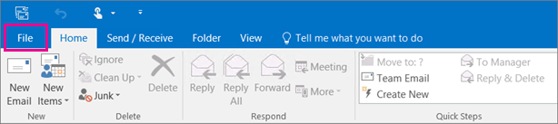

# Obtenha acesso e faça backup dos dados de um usuário anteriorGet access to and back up a former user's data

Quando um funcionário deixa sua organização, você provavelmente deseja acessar seus dados (documentos e emails) e revisá-los, fazer o back-up ou dar a um novo funcionário.When an employee leaves your organization, you probably want to access their data (documents and emails) and either review it, back it up, or give it to a new employee.
  
    
## Acessar os documentos do OneDrive de um usuário antigoAccess a former user's OneDrive documents

Se você remover a licença de um usuário, mas não excluir a conta, poderá dar a si mesmo acesso ao conteúdo no OneDrive do usuário.If you remove a user's license but don't delete the account, you can give yourself access to the content in the user's OneDrive. Se você excluir a conta do usuário, terá 30 dias por padrão para acessar os dados do OneDrive do usuário anterior.If you delete the user's account, you have 30 days by default to access the former user's OneDrive data. [Saiba como definir a retenção do OneDrive para usuários excluídos.](/onedrive/set-retention)[Learn how to set the OneDrive retention for deleted users](/onedrive/set-retention). Se você não restaurar uma [conta de usuário](/office365/admin/add-users/restore-user) nesse período, o conteúdo do OneDrive será excluído.If you don't [restore a user account](/office365/admin/add-users/restore-user) within this time, their OneDrive content is deleted. 

Para preservar os arquivos do OneDrive de um usuário anterior, primeiro dê a si mesmo acesso ao OneDrive e mova os arquivos que você deseja manter.To preserve a former user's OneDrive files, first give yourself access to their OneDrive, and then move the files you want to keep. 

::: moniker range="o365-worldwide"

1. No centro de administração, acesse a página **Usuários** \> <a href="https://go.microsoft.com/fwlink/p/?linkid=834822" target="_blank">Usuários ativos</a>.In the admin center, go to the **Users** \> <a href="https://go.microsoft.com/fwlink/p/?linkid=834822" target="_blank">Active users</a> page.  
    
2. Selecione um usuário.Select a user.

3. No painel direito, selecione **OneDrive.**In the right pane, select **OneDrive**. Em **Obter acesso a arquivos,** selecione Criar link para **arquivos.**Under **Get access to files**, select **Create link to files**.

4. Selecione o link para abrir o local do arquivo.Select the link to open the file location. Baixe os arquivos em seu computador ou selecione **Mover** para **ou** Copiar para movê-los ou copiá-los para seu próprio OneDrive ou para uma biblioteca compartilhada.Download the files to your computer, or select **Move to** or **Copy to** to move or copy them to your own OneDrive or to a shared library. 

> [!NOTE]
> Você pode mover ou copiar até 500 MB de arquivos e pastas por vez.You can move or copy up to 500 MB of files and folders at a time. 
> Quando você move ou copia documentos com histórico de versões, somente a versão mais recente é movida.When you move or copy documents that have version history, only the latest version is moved.  

::: moniker-end

::: moniker range="o365-germany"

1. No centro de administração, acesse a página **Usuários** \> <a href="https://go.microsoft.com/fwlink/p/?linkid=847686" target="_blank">Usuários ativos</a>.In the admin center, go to the **Users** \> <a href="https://go.microsoft.com/fwlink/p/?linkid=847686" target="_blank">Active users</a> page.  

2. Selecione um usuário.Select a user.

3. No painel direito, expanda as **Configurações do OneDrive** e, ao lado do **Access,** selecione **arquivos do Access.**In the right pane, expand **OneDrive Settings**, and then next to **Access**, select **Access files**.

4. Selecione o link para abrir o local do arquivo.Select the link to open the file location. Baixe os arquivos em seu computador ou selecione **Mover** para **ou** Copiar para movê-los ou copiá-los para seu próprio OneDrive ou para uma biblioteca compartilhada.Download the files to your computer, or select **Move to** or **Copy to** to move or copy them to your own OneDrive or to a shared library. 

> [!NOTE]
> Você pode mover ou copiar até 500 MB de arquivos e pastas por vez.You can move or copy up to 500 MB of files and folders at a time. 
> Quando você move ou copia documentos com histórico de versões, somente a versão mais recente é movida.When you move or copy documents that have version history, only the latest version is moved.  

::: moniker-end

::: moniker range="o365-21vianet"

1. No centro de administração, acesse a página **Usuários** \> <a href="https://go.microsoft.com/fwlink/p/?linkid=850628" target="_blank">Usuários ativos</a>.In the admin center, go to the **Users** \> <a href="https://go.microsoft.com/fwlink/p/?linkid=850628" target="_blank">Active users</a> page. 

2. Selecione um usuário.Select a user.

3. No painel direito, expanda as **Configurações do OneDrive** e, ao lado do **Access,** selecione **arquivos do Access.**In the right pane, expand **OneDrive Settings**, and then next to **Access**, select **Access files**.

4. Selecione o link para abrir o local do arquivo.Select the link to open the file location. Baixe os arquivos em seu computador ou selecione **Mover** para **ou** Copiar para movê-los ou copiá-los para seu próprio OneDrive ou para uma biblioteca compartilhada.Download the files to your computer, or select **Move to** or **Copy to** to move or copy them to your own OneDrive or to a shared library.  

> [!NOTE]
> Você pode mover ou copiar até 500 MB de arquivos e pastas por vez.You can move or copy up to 500 MB of files and folders at a time. 
> Quando você move ou copia documentos com histórico de versões, somente a versão mais recente é movida.When you move or copy documents that have version history, only the latest version is moved.  

::: moniker-end
    

## Revogar o acesso de administrador ao OneDrive de um usuárioRevoke admin access to a user's OneDrive

Como administrador global, você pode dar a si mesmo acesso ao conteúdo no OneDrive de um usuário, mas talvez queira remover o acesso quando não precisar mais dele.As global admin, you can give yourself access to the content in a user's OneDrive, but you may want to remove your access when you no longer need it. 

::: moniker range="o365-worldwide"

1. Entre no centro de <a href="https://go.microsoft.com/fwlink/p/?linkid=2024339" target="_blank">administração como</a> um administrador global ou administrador do SharePoint.Sign in to the <a href="https://go.microsoft.com/fwlink/p/?linkid=2024339" target="_blank">admin center</a> as a global admin or SharePoint admin. 

    Se você receber uma mensagem de que não tem permissão para acessar o centro de administração, você não tem permissões de administrador em sua organização.If you get a message that you don't have permission to access the admin center, then you don't have administrator permissions in your organization.

::: moniker-end

::: moniker range="o365-germany"

1. Entre no centro de <a href="https://go.microsoft.com/fwlink/p/?linkid=848041" target="_blank">administração como</a> um administrador global ou administrador do SharePoint.Sign in to the <a href="https://go.microsoft.com/fwlink/p/?linkid=848041" target="_blank">admin center</a> as a global admin or SharePoint admin.

    Se você receber uma mensagem de que não tem permissão para acessar o centro de administração, não terá permissões de administrador em sua organização.If you get a message that you don't have permission to access the admin center, then you don't have administrator permissions in your organization.

::: moniker-end

::: moniker range="o365-21vianet"

1. Entre no centro de <a href="https://go.microsoft.com/fwlink/p/?linkid=850627" target="_blank">administração como</a> um administrador global ou administrador do SharePoint.Sign in to the <a href="https://go.microsoft.com/fwlink/p/?linkid=850627" target="_blank">admin center</a> as a global admin or SharePoint admin.

    Se você receber uma mensagem de que não tem permissão para acessar o centro de administração, você não tem permissões de administrador em sua organização.If you get a message that you don't have permission to access the admin center, then you don't have administrator permissions in your organization.

::: moniker-end

2. No painel esquerdo, selecione Centros **de administração do** \> **SharePoint.**In the left pane, select **Admin centers** \> **SharePoint**. (Talvez seja necessário selecionar **Mostrar tudo** para ver a lista de centros de administração.)(You might need to select **Show all** to see the list of admin centers.)

3. Se o centro de administração do SharePoint clássico aparecer, selecione Abrir **agora** na parte superior da página para abrir o centro de administração do SharePoint.If the classic SharePoint admin center appears, select **Open it now** at the top of the page to open the SharePoint admin center.

4. No painel esquerdo, selecione **Mais recursos.**In the left pane, select **More features**.

5. Em **Perfis de usuário,** selecione **Abrir**.Under **User profiles**, select **Open**.

6. Em **Pessoas,** selecione **Gerenciar Perfis de Usuário.**Under **People**, select **Manage User Profiles**.

7. Insira o nome do usuário e selecione **Find**.Enter the user's name and select **Find**.

8. Clique com o botão direito do mouse no usuário e escolha Gerenciar proprietários **do conjunto de sites.**Right-click the user, and then choose **Manage site collection owners**.

9. Remova a pessoa que não precisa mais acessar os dados do usuário e selecione **OK.**Remove the person who no longer needs access to the user's data, and then select **OK**.

    
## Acessar os dados do Outlook de um usuário anteriorAccess the Outlook data of a former user

Para salvar as mensagens de email, calendário, tarefas e contatos do ex-funcionário, exporte as informações para um Arquivo de Dados do Outlook (.pst).To save the email messages, calendar, tasks, and contacts of the former employee, export the information to an Outlook Data File (.pst).
  
1. [Adicione o email do ex-funcionário](https://support.microsoft.com/office/6e27792a-9267-4aa4-8bb6-c84ef146101b) ao Seu Outlook (se você redefinir a senha do [usuário,](reset-passwords.md)poderá defini-lo como algo que você só conhece.)[Add the former employee's email](https://support.microsoft.com/office/6e27792a-9267-4aa4-8bb6-c84ef146101b) to your Outlook (If you [reset the user's password](reset-passwords.md), you can set it to something only you know.)
    
2. No Outlook, selecione **Arquivo.**In Outlook, select **File**.
    
    
  
3. Selecione **Abrir &amp; Exportação** \> **Importação/Exportação.**Select **Open &amp; Export** \> **Import/Export**.
    
    
  
4. Selecione **Exportar para um arquivo** e, em seguida, selecione **Próximo**.Select **Export to a file**, and then select **Next**.
    
    
  
5. Selecione **Arquivo de Dados do Outlook (.pst)** e, em seguida, selecione **Próximo.**Select **Outlook Data File (.pst)**, and then select **Next**.
    
6. Selecione a conta que você deseja exportar selecionando o nome ou endereço de email, como Mailbox - Anne Weiler ou anne@contoso.com.Select the account you want to export by selecting the name or email address, such as Mailbox - Anne Weiler or anne@contoso.com. Se você quiser exportar tudo em sua conta, incluindo email, calendário, contatos, tarefas e anotações, verifique se a caixa de seleção Incluir **subpastas** está marcada.If you want to export everything in your account, including mail, calendar, contacts, tasks, and notes, make sure the **Include subfolders** check box is selected. 
    
    > [!NOTE]
    > Você pode exportar uma conta por vez.You can export one account at a time. Se você quiser exportar várias contas, depois que uma conta for exportada, repita essas etapas.If you want to export multiple accounts, after one account is exported, repeat these steps. 
  
    
  
7. Selecione **Avançar**.Select **Next**.
    
8. Selecione **Procurar** para selecionar onde salvar o Arquivo de Dados do Outlook (.pst).Select **Browse** to select where to save the Outlook Data File (.pst). Digite um  *nome de arquivo* e selecione **OK** para continuar.Type a  *file name*, and then select **OK** to continue. 
    
    > [!NOTE]
    > Se você já usou a exportação antes, o local da pasta anterior e o nome do arquivo aparecerão.If you've used export before, the previous folder location and file name appear. Digite um  *nome de arquivo diferente*  antes de selecionar **OK**.Type a  *different file name*  before selecting **OK**. 
  
9. Se você estiver exportando para um Arquivo de Dados do Outlook (.pst) já existente, em **Opções**, especifique o que fazer ao exportar itens que já existem no arquivo.If you are exporting to an existing Outlook Data File (.pst), under **Options**, specify what to do when exporting items that already exist in the file.
    
10. Selecione **Concluir**.Select **Finish**.
    
Outlook begins the export immediately unless a new Outlook Data File (.pst) is created or a password-protected file is used.Outlook begins the export immediately unless a new Outlook Data File (.pst) is created or a password-protected file is used.
  
   - Se você estiver criando um Arquivo de Dados do Outlook (.pst), uma senha opcional poderá ajudar a proteger o arquivo.If you're creating an Outlook Data File (.pst), an optional password can help protect the file. Quando a caixa de diálogo Criar  Arquivo de Dados  do **Outlook** for exibida, digite a senha nas caixas **Senha** e Verificar Senha e selecione **OK.**When the **Create Outlook Data File** dialog box appears, type the  *password*  in the **Password** and **Verify Password** boxes, and then select **OK**. Na caixa de diálogo Senha do Arquivo de Dados do **Outlook,** digite *a senha* e selecione **OK.**In the **Outlook Data File Password** dialog box, type the  *password*, and then select **OK**.
    
  - Se você estiver exportando para um Arquivo de Dados do Outlook (.pst) existente protegido por senha, na caixa de diálogo Senha do Arquivo de Dados do **Outlook,** digite a senha e selecione **OK.**If you're exporting to an existing Outlook Data File (.pst) that is password protected, in the **Outlook Data File Password** dialog box, type the  *password*, and then select **OK**.
    
Veja como exportar ou fazer backup de email, contatos e calendário para um arquivo [.pst do Outlook](https://support.microsoft.com/office/14252b52-3075-4e9b-be4e-ff9ef1068f91) no Outlook 2010.See how to [Export or backup email, contacts, and calendar to an Outlook .pst file](https://support.microsoft.com/office/14252b52-3075-4e9b-be4e-ff9ef1068f91) in Outlook 2010. 
  
  
  > [!NOTE]
  > Por padrão, seu email fica disponível offline por um período de 12 meses.By default, your email is available offline for a period of 12 months. Se necessário, veja como aumentar [os dados disponíveis offline.](Https://docs.microsoft.com/outlook/troubleshoot/mailboxes/only-subset-items-synchronized)If required, see how to [increase the data available offline](Https://docs.microsoft.com/outlook/troubleshoot/mailboxes/only-subset-items-synchronized).
 
## Dar a outro usuário acesso ao email de um usuário antigoGive another user access to a former user's email 

Para dar acesso a mensagens de email, calendário, tarefas e contatos do ex-funcionário para outro funcionário, importe as informações para a caixa de entrada do Outlook de outro funcionário.To give access to the email messages, calendar, tasks, and contacts of the former employee to another employee, import the information to another employee's Outlook inbox.

> [!NOTE]
> Você também pode converter a caixa de correio do [ex-usuário em](https://docs.microsoft.com/office365/admin/email/convert-user-mailbox-to-shared-mailbox) uma caixa de correio compartilhada ou encaminhar o email de um [ex-funcionário para outro funcionário.](https://docs.microsoft.com/office365/admin/add-users/remove-former-employee#forward-a-former-employees-email-to-another-employee-or-convert-to-a-shared-mailbox)You can also [convert the former user's mailbox to a shared mailbox](https://docs.microsoft.com/office365/admin/email/convert-user-mailbox-to-shared-mailbox) or [forward a former employee's email to another employee](https://docs.microsoft.com/office365/admin/add-users/remove-former-employee#forward-a-former-employees-email-to-another-employee-or-convert-to-a-shared-mailbox).

  
1. In Outlook, go to **File** \> **Open &amp; Export** \> **Import/Export**.In Outlook, go to **File** \> **Open &amp; Export** \> **Import/Export**.
    
    Isso inicia o Assistente para Importação e Exportação.This starts the Import and Export Wizard.
    
2. Selecione **Importar de outro programa ou arquivo e,** em seguida, selecione **Próximo**.Select **Import from another program or file**, and then select **Next**.
    
    
  
3. Select **Outlook Data File (.pst)**, and select **Next**.Select **Outlook Data File (.pst)**, and select **Next**.
    
4. Navegue até o arquivo .pst que você deseja importar.Browse to the .pst file you want to import.
    
5. Em **Opções,** escolha como deseja lidar com duplicatasUnder **Options**, choose how you want to deal with duplicates
    
6. Selecione **Avançar**.Select **Next**.
    
7. Se uma senha tiver sido atribuída ao Arquivo de Dados do Outlook (.pst), insira a senha e selecione **OK.**If a password was assigned to the Outlook Data File (.pst), enter the password, and then select **OK**.
    
8. De definidas as opções de importação de itens.Set the options for importing items. As configurações padrão geralmente não precisam ser alteradas.The default settings usually don't need to be changed.
    
9. Selecione **Concluir**.Select **Finish**.

> [!NOTE]
> As etapas permanecem as mesmas para acessar o OneDrive e os dados de email de um usuário existente.The steps remain the same for accessing an existing user's OneDrive and email data.
    
> [!TIP]
> Se você quiser importar ou restaurar apenas alguns itens de um Arquivo de Dados do Outlook (.pst), poderá abrir o Arquivo de Dados do Outlook.If you want to import or restore only a few items from an Outlook Data File (.pst), you can open the Outlook Data File. Em seguida, no painel de navegação, arraste os itens das pastas arquivo de dados do Outlook para suas pastas existentes do Outlook.Then, in the navigation pane, drag the items from Outlook Data File folders to your existing Outlook folders. 
  
  
## Artigos relacionadosRelated articles
[Remover um ex-funcionário do Office 365Remove a former employee from Office 365](remove-former-employee.md)

[Adicionar e remover administradores em uma conta do OneDriveAdd and remove admins on a OneDrive account](/sharepoint/manage-user-profiles#add-and-remove-admins-for-a-users-onedrive)

[Restaurar um OneDrive excluídoRestore a deleted OneDrive](/onedrive/restore-deleted-onedrive)
  
[Retenção e exclusão do OneDriveOneDrive retention and deletion](/onedrive/retention-and-deletion)
  
