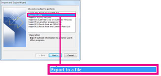

# Obtenha acesso e faça backup dos dados de um usuário anterior

Quando um funcionário sai da sua organização, você provavelmente deseja acessar seus dados (documentos e emails) e revisá-los, fazer o back-up ou dá-los a um novo funcionário.
  
    
## Acessar documentos do OneDrive de um usuário anterior

Se você remover a licença de um usuário, mas não excluir a conta, poderá dar a si mesmo acesso ao conteúdo no OneDrive do usuário. Se você excluir a conta do usuário, terá 30 dias por padrão para acessar os dados do OneDrive do usuário anterior. [Saiba como definir a retenção do OneDrive para usuários excluídos.](/onedrive/set-retention) Se você não restaurar [uma conta de usuário](/office365/admin/add-users/restore-user) nesse momento, o conteúdo do OneDrive será excluído. 

Para preservar os arquivos do OneDrive de um usuário anterior, primeiro dê a si mesmo acesso ao OneDrive e, em seguida, mova os arquivos que você deseja manter. 

::: moniker range="o365-worldwide"

1. No centro de administração, vá para a página **Usuários** \> <a href="https://go.microsoft.com/fwlink/p/?linkid=834822" target="_blank">Usuários ativos</a>.  
    
2. Selecione um usuário.

3. No painel direito, selecione **OneDrive**. Em **Obter acesso a arquivos,** selecione Criar link para **arquivos**.

4. Selecione o link para abrir o local do arquivo. Baixe os arquivos no computador ou selecione **Mover** para **ou** Copiar para mover ou copiá-los para seu próprio OneDrive ou para uma biblioteca compartilhada. 

> [!NOTE]
> Você pode mover ou copiar até 500 MB de arquivos e pastas por vez. 
> Quando você move ou copia documentos que têm histórico de versão, somente a versão mais recente é movida.  

::: moniker-end

::: moniker range="o365-germany"

1. No centro de administração, vá para a página **Usuários** \> <a href="https://go.microsoft.com/fwlink/p/?linkid=847686" target="_blank">Usuários ativos</a>.  

2. Selecione um usuário.

3. No painel direito, expanda **Configurações do OneDrive** e, ao lado de **Access,** selecione **Arquivos de acesso.**

4. Selecione o link para abrir o local do arquivo. Baixe os arquivos no computador ou selecione **Mover** para **ou** Copiar para mover ou copiá-los para seu próprio OneDrive ou para uma biblioteca compartilhada. 

> [!NOTE]
> Você pode mover ou copiar até 500 MB de arquivos e pastas por vez. 
> Quando você move ou copia documentos que têm histórico de versão, somente a versão mais recente é movida.  

::: moniker-end

::: moniker range="o365-21vianet"

1. No centro de administração, vá para a página **Usuários** \> <a href="https://go.microsoft.com/fwlink/p/?linkid=850628" target="_blank">Usuários ativos</a>. 

2. Selecione um usuário.

3. No painel direito, expanda **Configurações do OneDrive** e, ao lado de **Access,** selecione **Arquivos de acesso.**

4. Selecione o link para abrir o local do arquivo. Baixe os arquivos no computador ou selecione **Mover** para **ou** Copiar para mover ou copiá-los para seu próprio OneDrive ou para uma biblioteca compartilhada.  

> [!NOTE]
> Você pode mover ou copiar até 500 MB de arquivos e pastas por vez. 
> Quando você move ou copia documentos que têm histórico de versão, somente a versão mais recente é movida.  

::: moniker-end
    

## Revogar o acesso do administrador ao OneDrive de um usuário

Como administrador global, você pode se dar acesso ao conteúdo no OneDrive de um usuário, mas talvez queira remover seu acesso quando não precisar mais dele. 

::: moniker range="o365-worldwide"

1. Entre no centro de <a href="https://go.microsoft.com/fwlink/p/?linkid=2024339" target="_blank">administração como</a> administrador global ou administrador do SharePoint. 

    Se você receber uma mensagem de que não tem permissão para acessar o centro de administração, não terá permissões de administrador em sua organização.

::: moniker-end

::: moniker range="o365-germany"

1. Entre no centro de <a href="https://go.microsoft.com/fwlink/p/?linkid=848041" target="_blank">administração como</a> administrador global ou administrador do SharePoint.

    Se você receber uma mensagem de que não tem permissão para acessar o centro de administração, não terá permissões de administrador em sua organização.

::: moniker-end

::: moniker range="o365-21vianet"

1. Entre no centro de <a href="https://go.microsoft.com/fwlink/p/?linkid=850627" target="_blank">administração como</a> administrador global ou administrador do SharePoint.

    Se você receber uma mensagem de que não tem permissão para acessar o centro de administração, não terá permissões de administrador em sua organização.

::: moniker-end

2. No painel esquerdo, selecione **Centros de administração do** \> **SharePoint**. (Talvez seja necessário selecionar **Mostrar tudo** para ver a lista de centros de administração.)

3. Se o centro de administração clássico do SharePoint for exibido, selecione **Abri-lo** agora na parte superior da página para abrir o centro de administração do SharePoint.

4. No painel esquerdo, selecione **Mais recursos**.

5. Em **Perfis de usuário,** selecione **Abrir**.

6. Em **Pessoas,** selecione **Gerenciar Perfis de Usuário**.

7. Insira o nome do usuário e selecione **Encontrar**.

8. Clique com o botão direito do mouse no usuário e escolha Gerenciar proprietários **do conjunto de sites.**

9. Remova a pessoa que não precisa mais de acesso aos dados do usuário e selecione **OK**.

    
## Acessar os dados do Outlook de um usuário anterior

Para salvar as mensagens de email, calendário, tarefas e contatos do ex-funcionário, exporte as informações para um Arquivo de Dados do Outlook (.pst).
  
1. [Adicione o email do](https://support.microsoft.com/office/6e27792a-9267-4aa4-8bb6-c84ef146101b) ex-funcionário ao Outlook (Se você redefinir a senha do [usuário,](reset-passwords.md)poderá defini-lo como algo que só você sabe.)
    
2. No Outlook, selecione **Arquivo**.
    
    
  
3. Selecione **Abrir &amp; Exportar** \> **Importação/Exportação.**
    
    
  
4. Selecione **Exportar para um arquivo** e selecione **Próximo**.
    
    
  
5. Selecione **Arquivo de Dados do Outlook (.pst)** e selecione **Próximo**.
    
6. Selecione a conta que deseja exportar selecionando o nome ou o endereço de email, como Mailbox - Anne Weiler ou anne@contoso.com. Se você quiser exportar tudo em sua conta, incluindo email, calendário, contatos, tarefas e anotações, verifique se a caixa de seleção Incluir **subpastas** está selecionada. 
    
    > [!NOTE]
    > Você pode exportar uma conta por vez. Se você quiser exportar várias contas, depois que uma conta for exportada, repita estas etapas. 
  
    
  
7. Selecione **Avançar**.
    
8. Selecione **Procurar** para selecionar onde salvar o Arquivo de Dados do Outlook (.pst). Digite um  *nome de arquivo* e selecione **OK** para continuar. 
    
    > [!NOTE]
    > Se você já usou exportar antes, o local da pasta anterior e o nome do arquivo aparecerão. Digite um  *nome de arquivo diferente antes*  de selecionar **OK**. 
  
9. Se você estiver exportando para um Arquivo de Dados do Outlook (.pst) já existente, em **Opções**, especifique o que fazer ao exportar itens que já existem no arquivo.
    
10. Selecione **Concluir**.
    
O Outlook inicia a exportação imediatamente, a menos que um novo Arquivo de Dados do Outlook (.pst) seja criado ou um arquivo protegido por senha seja usado.
  
   - Se você estiver criando um Arquivo de Dados do Outlook (.pst), uma senha opcional pode ajudar a proteger o arquivo. Quando a caixa de diálogo Criar  Arquivo de  Dados do **Outlook** for exibida, digite a senha nas caixas Senha e **Verificar Senha** e selecione **OK**. Na caixa de diálogo Senha de Arquivo de Dados do **Outlook,** digite a  *senha* e selecione **OK**.
    
  - Se você estiver exportando para um Arquivo de Dados do Outlook (.pst) existente protegido por senha, na caixa de diálogo Senha de Arquivo de Dados do **Outlook,** digite a senha  *e* selecione **OK**.
    
Veja como exportar ou fazer backup de emails, contatos e calendário para um [arquivo .pst do Outlook](https://support.microsoft.com/office/14252b52-3075-4e9b-be4e-ff9ef1068f91) no Outlook 2010. 
  
  
  > [!NOTE]
  > Por padrão, seu email está disponível offline por um período de 12 meses. Se necessário, consulte como aumentar [os dados disponíveis offline](/outlook/troubleshoot/mailboxes/only-subset-items-synchronized).
 
## Dar a outro usuário acesso ao email de um antigo usuário 

Para dar acesso às mensagens de email, calendário, tarefas e contatos do ex-funcionário para outro funcionário, importe as informações para a caixa de entrada do Outlook de outro funcionário.

> [!NOTE]
> Você também pode converter a caixa de correio do [ex-usuário em](/office365/admin/email/convert-user-mailbox-to-shared-mailbox) uma caixa de correio compartilhada ou encaminhar o email de um ex-funcionário [para outro funcionário.](/office365/admin/add-users/remove-former-employee#forward-a-former-employees-email-to-another-employee-or-convert-to-a-shared-mailbox)

  
1. No Outlook, vá para **Arquivo** \> **Abrir Exportação &amp;** \> **Importação/Exportação.**
    
    Isso inicia o Assistente de Importação e Exportação.
    
2. Selecione **Importar de outro programa ou arquivo** e selecione **Próximo**.
    
    
  
3. Selecione **Arquivo de Dados do Outlook (.pst)** e selecione **Próximo**.
    
4. Navegue até o arquivo .pst que você deseja importar.
    
5. Em **Opções**, escolha como você deseja lidar com duplicatas
    
6. Selecione **Avançar**.
    
7. Se uma senha foi atribuída ao Arquivo de Dados do Outlook (.pst), digite a senha e selecione **OK**.
    
8. De definir as opções de importação de itens. As configurações padrão geralmente não precisam ser alteradas.
    
9. Selecione **Concluir**.

> [!NOTE]
> As etapas permanecem as mesmas para acessar dados de email e do OneDrive de um usuário existente.
    
> [!TIP]
> Se você quiser importar ou restaurar apenas alguns itens de um Arquivo de Dados do Outlook (.pst), poderá abrir o Arquivo de Dados do Outlook. Em seguida, no painel de navegação, arraste os itens das pastas arquivo de dados do Outlook para suas pastas existentes do Outlook. 
  
  
## Artigos relacionados
[Remover um ex-funcionário do Office 365](remove-former-employee.md)

[Adicionar e remover administradores em uma conta do OneDrive](/sharepoint/manage-user-profiles#add-and-remove-admins-for-a-users-onedrive)

[Restaurar um OneDrive excluído](/onedrive/restore-deleted-onedrive)
  
[Retenção e exclusão do OneDrive](/onedrive/retention-and-deletion)
