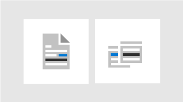

<!-- The following is just placeholder text from Madhura's mail. We need to add images/examples of each -->

# Como obter ajuda no centro de administração do Microsoft 365

Se você é um administrador, o [admin.Microsoft.com](https://admin.microsoft.com) é o local para gerenciar e aproveitar ao máximo a sua assinatura do Microsoft 365. Às vezes, você pode não encontrar a tarefa certa, precisa de mais contexto antes de embarcar em um fluxo de tarefas ou simplesmente não ter certeza do escopo e do impacto de suas ações como administrador. Para cobrir essas situações, fornecemos ajuda moderna e assistência inteligente em todo o centro de administração do Microsoft 365 das seguintes maneiras:
 

<ul class="panelContent cardsW">
    <li>
        

            

                

                    <a href="what-is-help.md#integrated-help">
                        

                            

                                
                            

                        

                        

                            <h3>Ajuda integrada</h3>
                            
Ajuda no centro de administração

                        

                    </a>
                

            

        

    </li>
    <li>
        

            

                

                    <a href="what-is-help.md#modern-self-help-powered-by-ai">
                        

                            

                                
                            

                        

                        

                            <h3>Assistência inteligente</h3>
                            
Auto-ajuda alimentada pelo AI

                        

                    </a>
                

            

        

    </li>
    <li>
        

            

                

                    <a href="what-is-help.md#guides-and-articles">
                        

                            

                                
                            

                        

                        

                            <h3>Guias e artigos</h3>
                            
Conteúdo abrangente na Web

                        

                    </a>
                

            

        

    </li>
</ul>

## Ajuda integrada
A ajuda está integrada em todo o centro de administração e, portanto, está correta quando você precisa. Na parte superior de muitas páginas, você encontrará o texto de ajuda embutida que fornece uma visão geral informativa da tarefa em mãos, bem como links para artigos que permitem encontrar rapidamente a documentação oficial para um aprendizado mais aprofundado.

## Auto-ajuda moderna alimentada pelo AI

Selecionar o botão "precisa de ajuda" no centro de administração do Microsoft 365 abre nossa experiência de auto-ajuda moderna com inteligência artificial. Por exemplo, se você procurar *verificar meu domínio*, receberá as etapas mais alguns artigos que achamos ajudá-lo. Usamos o aprendizado da máquina para entonar a solução mais próxima que foi encontrada como ajuda para outros administradores que inseriram consultas semelhantes.

Ou, para os horários em que você não sabe como fazer algo em sua situação específica, use o assistente de suporte. Atualmente, essa experiência só está disponível em inglês. Basta usar a opção de alternância na parte superior do painel "precisa de ajuda" para ativá-la. O assistente de suporte fornece uma interface de conversa para obter ajuda. Insira sua consulta, e o chatbot fará perguntas de esclarecimento para obter a resposta certa para a sua situação específica. Pense nisso como seu auxiliar virtual para descobrir soluções e concluir tarefas.

É claro que às vezes, as perguntas são melhores para os seres humanos. Se nossa auto-ajuda moderna não tiver a resposta, você sempre terá a opção de entrar em contato com nossos agentes de suporte.

## Guias e artigos

Além disso, se você estiver procurando por guias de implantação abrangentes, procedimentos rápidos passo a passo ou cmdlets do PowerShell, procure conosco na Web. Atualizamos o conteúdo com frequência e tentamos fornecer as informações mais recentes. Confira nossos artigos e guias no site de [documentação do Microsoft 365](https://docs.microsoft.com/microsoft-365/) .