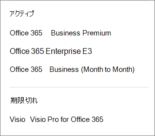

# Qual assinatura eu tenho?What subscription do I have?

Se você for um administrador, poderá verificar quais assinaturas sua organização tem indo para o centro de administração.If you're an admin, you can verify which subscriptions your organization has by going to the admin center.
  
 **Não é um administrador?****Not an admin?** Veja o que eu tenho de produto ou licença do [Microsoft 365 para empresas?](https://support.microsoft.com/office/f8ab5e25-bf3f-4a47-b264-174b1ee925fd)See [What Microsoft 365 for business product or license do I have?](https://support.microsoft.com/office/f8ab5e25-bf3f-4a47-b264-174b1ee925fd)

::: moniker range="o365-worldwide"

1. No centro de administração, vá para a página **Cobrança** \> <a href="https://go.microsoft.com/fwlink/p/?linkid=842054" target="_blank">Seus produtos</a>.In the admin center, go to the **Billing** \> <a href="https://go.microsoft.com/fwlink/p/?linkid=842054" target="_blank">Your products</a> page.
2. Na guia **Produtos,** você vê todas as suas assinaturas.On the **Products** tab, you see all your subscriptions. Cada linha de assinatura inclui informações sobre licenças, status da assinatura e cobrança.Each subscription line includes information about licenses, subscription status, and billing.
3. Se você quiser alterar as colunas que aparecem na lista, selecione **Escolher colunas**.If you want to change the columns that appear in the list, select **Choose columns**. Altere a seleção de colunas e selecione **Salvar.**Change the selection of columns, then select **Save**.
4. Para ver mais detalhes de uma única assinatura, selecione essa assinatura.To see more details for a single subscription, select that subscription.

::: moniker-end
  
::: moniker range="o365-germany"

1. No centro de administração,  vá para a página \> <a href="https://go.microsoft.com/fwlink/p/?linkid=847745" target="_blank">Assinaturas de</a> Cobrança.  In the admin center, go to the **Billing** \>  <a href="https://go.microsoft.com/fwlink/p/?linkid=847745" target="_blank">Subscriptions</a> page.

2. Se você tiver apenas uma assinatura, ela será exibida na página **Assinaturas**, junto com o nome da assinatura, as informações sobre a assinatura e seu status.If you have only one subscription, it will be displayed on the **Subscriptions** page, along with the subscription name, information about the subscription, and its status. Na captura de tela a seguir, você pode ver que tenho uma assinatura do Microsoft 365 Apps para Empresas.In the following screenshot, you can see that I have an Microsoft 365 Apps for business subscription.

    
  
3. Se tiver várias assinaturas, você verá uma coluna ao lado das informações detalhadas da assinatura que lista as assinaturas compradas e as assinaturas de avaliação. Por padrão, a assinatura na parte superior da lista é selecionada automaticamente, e as informações detalhadas dessa assinatura são mostradas.If you have multiple subscriptions, you'll see a column next to the detailed subscription information that lists the subscriptions that have been purchased, as well as any trial subscriptions. By default, the subscription at the top of the list is automatically selected, and the detailed information for that subscription is shown.

    Se você tiver várias assinaturas, escolha a que deseja ver informações detalhadas.If you have multiple subscriptions, choose the one for which you want to see detailed information. O cartão da assinatura será atualizado com informações sobre essa assinatura.The subscription card will update with information about that subscription.

    
  
    > [!NOTE]
    > Se você tiver assinaturas que expiraram ou foram desabilitadas, elas serão listadas com base em seu estado atual.If you have subscriptions that have expired or have been disabled, they'll be listed based on their current state.

::: moniker-end

::: moniker range="o365-21vianet"

1. No centro de administração,  vá para a página \> <a href="https://go.microsoft.com/fwlink/p/?linkid=850626" target="_blank">Assinaturas de</a> Cobrança.  In the admin center, go to the **Billing** \>  <a href="https://go.microsoft.com/fwlink/p/?linkid=850626" target="_blank">Subscriptions</a> page.

2. Se você tiver apenas uma assinatura, ela será exibida na página **Assinaturas**, junto com o nome da assinatura, as informações sobre a assinatura e seu status.If you have only one subscription, it will be displayed on the **Subscriptions** page, along with the subscription name, information about the subscription, and its status. Na captura de tela a seguir, você pode ver que tenho uma assinatura do Microsoft 365 Apps para Empresas.In the following screenshot, you can see that I have an Microsoft 365 Apps for business subscription.

    
  
3. Se tiver várias assinaturas, você verá uma coluna ao lado das informações detalhadas da assinatura que lista as assinaturas compradas e as assinaturas de avaliação. Por padrão, a assinatura na parte superior da lista é selecionada automaticamente, e as informações detalhadas dessa assinatura são mostradas.If you have multiple subscriptions, you'll see a column next to the detailed subscription information that lists the subscriptions that have been purchased, as well as any trial subscriptions. By default, the subscription at the top of the list is automatically selected, and the detailed information for that subscription is shown.

    Se você tiver várias assinaturas, escolha a que deseja ver informações detalhadas.If you have multiple subscriptions, choose the one for which you want to see detailed information. O cartão da assinatura será atualizado com informações sobre essa assinatura.The subscription card will update with information about that subscription.

    
  
    > [!NOTE]
    > Se você tiver assinaturas que expiraram ou foram desabilitadas, elas serão listadas com base em seu estado atual.If you have subscriptions that have expired or have been disabled, they'll be listed based on their current state.

::: moniker-end

## Artigos relacionadosRelated articles
  
[Assinaturas e cobrançaSubscriptions and billing](../../commerce/index.yml)