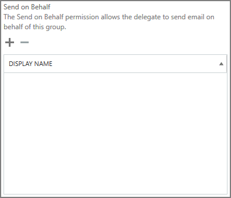

# Permitir que os membros enviem como ou enviem em nome de um grupoAllow members to send as or send on behalf of a Group

Um membro de um grupo do Office 365 que tenha recebido permissões **Enviar como** ou **enviar em nome** de agora pode enviar emails como o grupo ou em nome do grupo.A member of an Office 365 Group who has been granted **Send as** or **Send on behalf** permissions can now send email as the group, or on behalf of the group. Este tópico explica como um administrador pode definir essas permissões.This topic explains how an admin can set these permissions.
  
Por exemplo, se Megan Bowen fizer parte do grupo **Training** Office 365, e tiver permissões **Send** as no grupo, se ele enviar um email como o grupo, será parecido com o grupo de **treinamento** enviado por email.For example, if Megan Bowen is part of the **Training** Office 365 Group, and has **Send as** permissions on the group, if she sends an email as the Group, it will look like the **Training** group sent the email. 
  
A permissão **enviar em nome** de permite que um usuário envie um email em nome de um grupo do Office 365.The **Send on Behalf** permission lets a user send email on behalf of an Office 365 Group. Por exemplo, se Alex Wilber é parte do grupo **marketing** do Office 365 e tem permissões **de enviar em nome** de e envia um email como grupo, o email parece que foi enviado por **Alex Wilber em nome de marketing**.For example, if Alex Wilber is a part of the **Marketing** Office 365 Group, and has **Send on Behalf** permissions and sends an email as the group, the email looks like it was sent by **Alex Wilber on behalf of Marketing**.

> [!IMPORTANT]
> Você pode configurar **Enviar como** ou **enviar em nome** de um determinado usuário, mas não ambos.You can configure **Send as** or **Send on behalf** for a given user, but not both. Se você configurar ambos, o padrão será **Enviar como**.If you configure both, it will default to **Send as**.

> [!TIP]
> Confira as etapas em [Enviar email de ou em nome de um grupo do Office 365](https://support.office.com/article/0f4964af-aec6-484b-a65c-0434df8cdb6b.aspx) para saber como usar o Outlook e o Outlook na Web para enviar emails de um grupo.Check the out the steps in [Send email from or on behalf of an Office 365 group](https://support.office.com/article/0f4964af-aec6-484b-a65c-0434df8cdb6b.aspx) to learn how to use Outlook and Outlook on the Web to send email from a Group.
    
## Permitir que os membros enviem email como um grupoAllow members to send email as a Group

Esta seção explica como permitir que os usuários enviem emails como um grupo no [centro de administração do Exchange](https://go.microsoft.com/fwlink/p/?linkid=2059104) (Eat) no Exchange Online.This section explains how to allow users to send email as a Group in the [Exchange admin center](https://go.microsoft.com/fwlink/p/?linkid=2059104) (EAC) in Exchange Online.
  
1. No <a href="https://go.microsoft.com/fwlink/p/?linkid=2059104" target="_blank">centro de administração do Exchange</a>, vá para **grupos**de **destinatários** \> .In the <a href="https://go.microsoft.com/fwlink/p/?linkid=2059104" target="_blank">Exchange admin center</a>, go to **Recipients** \> **Groups**.
    
2. Selecione **Editar** de grupo no grupo para o qual você deseja permitir que os usuários enviem.  Select **Edit**   on Group that you want to allow users to send as. 
    
3. Selecione **delegação de grupo**.Select **group delegation**.
    
4. Na seção **Enviar como** , selecione o **+** sinal para adicionar os usuários que você deseja enviar como o grupo.In the **Send As** section, select the **+** sign to add the users that you want to send as the Group. 
    
    
  
5. Digite para pesquisar ou selecionar um usuário da lista.Type to search or pick a user from the list. Selecione **OK** e **salvar**.Select **OK** and **Save**.
    
    
  
## Permitir que os membros enviem email em nome de um grupoAllow members to send email on behalf of a Group

Esta seção explica como permitir que os usuários enviem emails em nome de um grupo no centro de administração do Exchange (Eat) no Exchange Online.This section explains how to allow users to send email on behalf of a Group in the Exchange admin center (EAC) in Exchange Online.
  
1. No <a href="https://go.microsoft.com/fwlink/p/?linkid=2059104" target="_blank">centro de administração do Exchange</a>, vá para **grupos**de **destinatários** \> .In the <a href="https://go.microsoft.com/fwlink/p/?linkid=2059104" target="_blank">Exchange admin center</a>, go to **Recipients** \> **Groups**.
    
2. Selecione **Editar**  de grupo no grupo para o qual você deseja permitir que os usuários enviem.Select **Edit**  on the Group that you want to allow users to send as. 
    
3. Selecione **delegação de grupo**.Select **group delegation**.
    
4. Na seção enviar em nome de, selecione o **+** sinal para adicionar os usuários que você deseja enviar como o grupo.In the Send on Behalf section, select the **+** sign to add the users that you want to send as the Group. 
    
    
  
5. Digite para pesquisar ou selecionar um usuário da lista.Type to search or pick a user from the list. Selecione **OK** e **salvar**.Select **OK** and **Save**.
    
    

## Artigos relacionadosRelated articles

[Saiba mais sobre grupos do Office 365Learn more about Office 365 Groups](https://support.office.com/article/3f780e8e-61aa-4287-830d-ff6209cbc192.aspx)

[Add-RecipientPermissionAdd-RecipientPermission](https://go.microsoft.com/fwlink/p/?LinkId=723960)

[Conjunto-unificadoSet-UnifiedGroup](https://go.microsoft.com/fwlink/p/?LinkId=616189)
