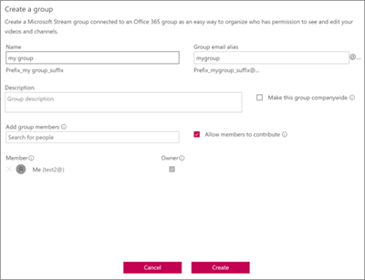
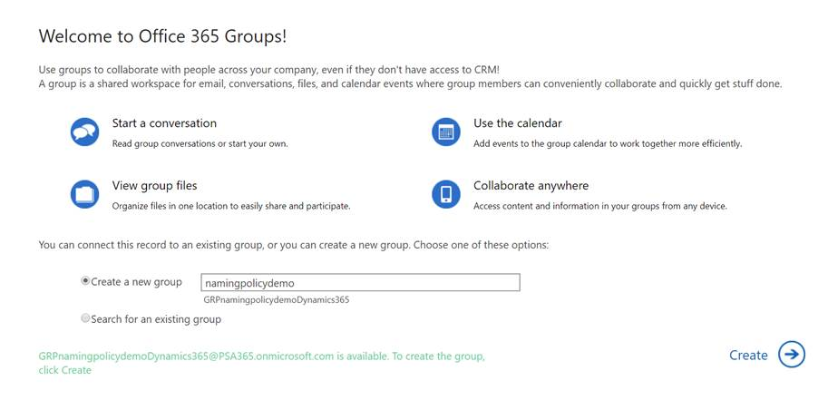

# Política de nomenclatura de grupos do Office 365

Você usa uma política de nomeação de grupo para impor uma estratégia de nomenclatura consistente para grupos criados por usuários em sua organização. Uma política de nomenclatura pode ajudar você e seus usuários a identificar a função do grupo, da associação, da região geográfica ou quem criou o grupo. A política de nomenclatura também pode ajudar a categorizar grupos no catálogo de endereços. Você pode usar a política para bloquear a utilização de palavras específicas em nomes de grupo e aliases.

A política de nomenclatura é aplicada a grupos criados em todas as cargas de trabalho de grupos (como Outlook, Microsoft Teams, SharePoint, Planner, Yammer, etc.). Ela é aplicada ao nome do grupo e ao alias do grupo. Ela é aplicada quando um usuário cria um grupo e quando o nome ou o alias do grupo é editado para um grupo existente.

> [!TIP]
> Uma política de nomenclatura de grupo do Office 365 só se aplica aos grupos do Office 365. Ele não se aplica a grupos de distribuição criados no Exchange Online. Para criar uma política de nomenclatura para grupos de distribuição, consulte [criar uma política de nomenclatura de grupo de distribuição](https://docs.microsoft.com/exchange/recipients-in-exchange-online/manage-distribution-groups/create-group-naming-policy).

A política de nomeação de grupo consiste nos seguintes recursos:

- **Política de nomenclatura de sufixo de prefixo**: você pode usar prefixos ou sufixos para definir a Convenção de nomenclatura de grupos (\_por\_exemplo:\_"GRP US My Group Engineering"). Os prefixos/sufixos podem ser cadeias de caracteres fixas ou atributos de usuário como [departamento] que serão substituídos com base no usuário que está criando o grupo.

- **Palavras bloqueadas personalizadas**: você pode carregar um conjunto de palavras bloqueadas específicas para sua organização que seriam bloqueados em grupos criados por usuários. (Por exemplo: "CEO, folha de pagamento, RH").

## Requisitos de licença

O uso da política de nomenclatura do Azure AD para grupos do Office 365 requer que você tenha, mas não necessariamente, atribua uma licença do Azure Active Directory Premium P1 ou uma licença do Azure AD Basic EDU para cada usuário exclusivo (incluindo convidados) que seja membro de um ou mais grupos do Office 365.
Isso também é necessário para o administrador que cria a política de nomenclatura de grupos.

## Política de nomenclatura de sufixo de prefixo

Os prefixos e sufixos podem ser cadeias de caracteres fixas ou atributos de usuário.

### Cadeias de caracteres fixas

Você pode usar cadeias de caracteres curtas que podem ajudá-lo a diferenciar grupos na GAL e na navegação à esquerda das cargas de trabalho do grupo. Alguns dos sufixos de prefixos comuns são palavras-chave como\_"GRP Name"\#, "Name"\_, "Name"

### Atributos

Você pode usar atributos que podem ajudar a identificar quem criou o grupo como [departamento] e onde ele foi criado de como [país].

|||
|:-----|:-----|
|**Exemplos**|Policy = "GRP [Nome_do_grupo] [departamento]"|
||Departamento do usuário = engenharia|
||Nome do grupo criado = "engenharia de grupo meu GRP"|

Os atributos do Azure Active Directory (Azure AD) com suporte são [departamento], [empresa], [Office], [StateOrProvince], [CountryOrRegion], [título]

- Atributos de usuário não suportados são considerados cadeias de caracteres fixas. Por exemplo "[CEP]"

- Não há suporte para atributos de extensão e atributos personalizados.

É recomendável que você use atributos com valores preenchidos para todos os usuários em sua organização e não use atributos com valores mais longos.

### Aspectos a serem verificados

- Durante a criação da política, o comprimento total de cadeias de caracteres e sufixos é restrito a 53 caracteres.

- Os prefixos e sufixos podem conter caracteres especiais compatíveis com o nome do grupo e o alias do grupo. Quando os prefixos e sufixos contêm caracteres especiais que não são permitidos no alias do grupo, eles são removidos e aplicados ao alias do grupo. Portanto, nesse caso, os prefixos e sufixos aplicados ao nome do grupo seriam diferentes dos que foram aplicados ao alias do grupo.

- Se você estiver usando os grupos conectados do Yammer Office 365, evite usar os seguintes caracteres em sua política de nomenclatura \#: \[@ \], \<,, \>, e. Se esses caracteres estiverem na política de nomenclatura, os usuários normais do Yammer não poderão criar grupos.

## Palavras bloqueadas personalizadas

Você pode inserir uma lista separada por vírgulas de palavras bloqueadas que serão bloqueadas em nomes de grupo e aliases.

A verificação de palavras bloqueadas é feita no nome do grupo inserido pelo usuário. Portanto, se o usuário inserir "darnit" e\_"prefixo" for a política de nomenclatura\_, "prefix darnit" falhará.

Nenhuma pesquisa de subcadeias de caracteres é executada; especificamente, uma correspondência exata entre o nome digitado pelo usuário e as palavras bloqueadas personalizadas é necessária para acionar uma falha. A pesquisa de subcadeia de caracteres não é feita para que os usuários possam usar algumas palavras comuns como ' classe ', mesmo se ' ass ' for uma palavra bloqueada.

**Aspectos a serem verificados**:

- As palavras bloqueadas não diferenciam maiúsculas de minúsculas.

- Quando um usuário insere uma palavra bloqueada, o cliente do grupo mostrará uma mensagem de erro com a palavra bloqueada.

- Não há restrições de caracteres nas palavras bloqueadas usadas.

- Há um limite superior de 5000 palavras que podem ser definidas como palavras bloqueadas.

## Substituição de administrador

Os administradores seletivos são isentos dessas políticas, em todas as cargas de trabalho de grupo e pontos de extremidade, para que eles possam criar grupos com essas palavras bloqueadas e com as convenções de nomenclatura desejadas. Veja a seguir a lista de funções de administrador isentas da política de nomeação de grupo.

- Administrador global

- Suporte da camada 1 do parceiro

- Suporte da camada 2 do parceiro

- Administrador de conta de usuário

- Gravadores de diretório

## Como configurar a política de nomenclatura

Para configurar uma política de nomenclatura:

1. No [Azure Active Directory](https://aad.portal.azure.com), em **gerenciar**, clique em **grupos**.
2. Em **configurações**, clique em **política de nomenclatura**.
3. Escolha a guia **política de nomeação de grupo** .
4. Em **política atual**, escolha se você deseja exigir um prefixo ou sufixo, ou ambos, e marque as caixas de seleção apropriadas.
5. Escolha entre **atributo** e **cadeia de caracteres** para cada linha e, em seguida, especifique o atributo ou a cadeia de caracteres.
6. Após adicionar os prefixos e sufixos necessários, clique em **salvar**.

## Experiências de política de nomenclatura nos aplicativos do Office 365

Os aplicativos do Office 365 foram atualizados para mostrar uma visualização do nome de grupo de política de nomenclatura (com prefixos e sufixos) quando o usuário digita o nome e o alias do grupo. Quando o usuário insere palavras bloqueadas, ele verá uma mensagem de erro para que possa remover as palavras bloqueadas.

## Outlook na Web

O Outlook na Web (anteriormente conhecido como Outlook Web App ou OWA) mostra o nome decorado da política de nomenclatura quando o usuário digita um nome de grupo ou alias de grupo. Quando um usuário insere uma palavra bloqueada personalizada, uma mensagem de erro é exibida na interface do usuário, juntamente com a palavra bloqueada, para que o usuário possa removê-la. Os instantâneos de experiência da Web do Outlook são mostrados abaixo.

## Área de trabalho do Outlook

Os grupos criados na área de trabalho do Outlook são compatíveis com a política de nomeação. O aplicativo de área de trabalho do Outlook ainda não mostra a visualização da política de nomenclatura e não retorna erros de palavras bloqueados, quando o usuário insere o nome do grupo. No entanto, a política de nomenclatura será aplicada automaticamente à seleção de criar/editar e os usuários serão apresentados com erros se houver palavras bloqueadas personalizadas no nome ou alias do grupo.

## Microsoft Teams

O Microsoft Teams mostra o nome decorado da política de nomenclatura quando o usuário digita um nome de equipe. Quando um usuário insere uma palavra bloqueada personalizada, uma mensagem de erro é exibida junto com a palavra bloqueada para que o usuário possa removê-la.

## SharePoint

O SharePoint mostra o nome da política de nomenclatura quando o usuário digita um nome de site ou endereço de email de grupo. Quando um usuário insere uma palavra bloqueada personalizada, uma mensagem de erro é exibida, juntamente com a palavra bloqueada para que o usuário possa removê-la.

## Microsoft Stream

O Microsoft Stream mostra o nome decorado da política de nomenclatura quando o usuário digita um nome de grupo ou alias de email de grupo. Quando um usuário insere uma palavra bloqueada personalizada, uma mensagem de erro é exibida com o texto bloqueado, para que o usuário possa removê-la.

## Aplicativo do Outlook iOS e Android

Os grupos criados nos aplicativos do Outlook são compatíveis com a política de nomeação. O Outlook Mobile mostra a visualização da política de nomenclatura ao digitar o nome do grupo. Quando um usuário insere uma palavra bloqueada personalizada, uma mensagem de erro é mostrada na criação do grupo, portanto, o usuário pode remover a palavra bloqueada.

## Planner

O Planner é compatível com a política de nomeação. O Planner mostra a visualização da política de nomenclatura ao inserir o nome do plano. Quando um usuário insere uma palavra bloqueada personalizada, uma mensagem de erro é mostrada na criação do plano, portanto, o usuário pode remover a palavra bloqueada.

## Dynamics 365 para o envolvimento do cliente

O Dynamics 365 for Customer Engagement é compatível com a política de nomenclatura. O Dynamics 365 mostra o nome decorado da política de nomenclatura quando o usuário digita um nome de grupo ou alias de email de grupo. Quando o usuário insere uma palavra bloqueada personalizada, uma mensagem de erro é exibida com o texto bloqueado, para que o usuário possa removê-la.

## O School Data Sync (SDS)

Os grupos criados por meio do SDS estão em conformidade com a política de nomenclatura, mas a política de nomenclatura não é aplicada automaticamente. Os administradores do SDS precisam acrescentar os prefixos e sufixos aos nomes de classe para os quais os grupos precisam ser criados e depois carregar no SDS. A criação/edição de grupos falharia caso contrário.

## Gerenciador de clientes do Outlook (OCM)

O Gerenciador de clientes do Outlook está em conformidade com a política de nomeação. A política de nomeação é aplicada automaticamente ao grupo criado no Gerenciador de clientes do Outlook. Se qualquer uma das palavras de "equipe de vendas" estiver definida como uma palavra bloqueada personalizada, a criação do grupo no OCM será bloqueada. O usuário não será capaz de criar o grupo OCM e será impedido de usar o aplicativo OCM. "

## Aplicativo de sala de aula

Os grupos criados no aplicativo de sala de aula estão em conformidade com a política de nomenclatura, mas a política de nomenclatura não é aplicada automaticamente e a visualização da política de nomenclatura não é mostrada para os usuários ao inserir um nome de grupo de sala de aula Portanto, os usuários precisarão inserir o nome do grupo de salas de aula decorado com prefixos e sufixos. Caso contrário, a criação ou edição do grupo de salas falhará com erros.

## Power BI

Os grupos criados nos espaços de trabalho do Power BI estão em conformidade com a política de nomenclatura, mas a política de nomenclatura não é aplicada automaticamente. E a visualização da política de nomeação não é mostrada aos usuários quando eles inserem um nome de espaço de trabalho do Power BI.

O nome recomendado-com a política de nomenclatura aplicada-é mostrado nos detalhes do erro em criar ou Editar espaços de trabalho. Isso significa que os usuários precisam inserir o nome do espaço de trabalho decorado com prefixos e sufixos. Caso contrário, a criação ou edição do espaço de trabalho falhará com erros.

## Yammer

Quando um usuário conectado ao Yammer com sua conta do Azure Active Directory cria um grupo ou edita um nome de grupo, o nome do grupo será compatível com a política de nomenclatura. Isso se aplica a grupos conectados do Office 365 e a todos os outros grupos do Yammer.

Se um grupo conectado do Office 365 foi criado antes da política de nomenclatura ser estabelecida, o nome do grupo não seguirá automaticamente as políticas de nomeação. Quando um usuário edita o nome do grupo, ele será solicitado a adicionar o prefixo e o sufixo.

Se a política de nomenclatura incluir caracteres que não podem estar nos nomes de grupo do Yammer, somente os administradores poderão criar um grupo conectado no Yammer.

## StaffHub

As equipes do StaffHub não seguem a política de nomenclatura, mas o grupo subjacente do Office 365. O nome da equipe do StaffHub não aplica os prefixos e sufixos e não verifica as palavras bloqueadas personalizadas. Mas o StaffHub aplica os prefixos e sufixos e remove as palavras bloqueadas do grupo subjacente do Office 365.

## PowerShell do Exchange

Os cmdlets do Exchange PowerShell são compatíveis com a política de nomeação. Os usuários receberão mensagens de erro apropriadas com prefixos sugeridos e sufixos e para palavras bloqueadas personalizadas se a Convenção de nomenclatura não for usada nos nomes de grupo e alias de grupo.

## Cmdlets do PowerShell do Azure Active Directory

Os cmdlets do PowerShell do Azure Active Directory são compatíveis com a política de nomenclatura. Os usuários receberão mensagens de erro apropriadas com prefixos sugeridos e sufixos e para palavras bloqueadas personalizadas se a Convenção de nomenclatura não for usada nos nomes de grupo e alias de grupo.

## Centro de administração do Exchange

O centro de administração do Exchange (Eat) é compatível com a política de nomenclatura. Ao criar ou editar ações, os usuários receberão mensagens de erro apropriadas com prefixos e sufixos sugeridos e para palavras bloqueadas personalizadas se a Convenção de nomenclatura não for usada nos nomes de grupo e alias de grupo.

## Centro de administração do Microsoft 365

O centro de administração do 365 da Microsoft é compatível com a política de nomeação. Ao criar ou editar ações, a política de nomeação será automaticamente aplicada. Os usuários receberão os erros apropriados quando inserirem palavras bloqueadas personalizadas. O centro de administração do Microsoft 365 ainda não mostra a visualização da política de nomenclatura e não retorna erros de palavras bloqueados, quando o usuário insere o nome do grupo.

## Portal do Azure Active Directory

O portal do Azure Active Directory é compatível com a política de nomeação. O portal do Azure Active Directory mostra a visualização da política de nomenclatura ao inserir o nome do grupo. Quando um usuário insere uma palavra bloqueada personalizada, uma mensagem de erro é mostrada na criação do grupo, portanto, o usuário pode remover a palavra bloqueada.

## Mais artigos sobre política de nomenclatura

[Aplicar uma política de nomenclatura para grupos do Office 365 no Azure Active Directory](https://go.microsoft.com/fwlink/?linkid=868340)

[Cmdlets do Azure Active Directory para definição de configurações de grupo](https://go.microsoft.com/fwlink/?linkid=868341)
