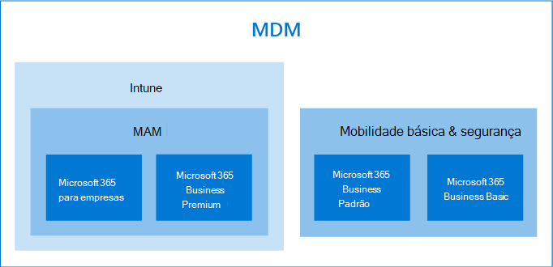

# Opções para proteger seus dispositivos e dados de aplicativosOptions for protecting your devices and app data

Você tem várias maneiras de proteger seus dispositivos e dados de organização com o Microsoft 365 for Business e Enterprise.You have several ways to secure your organizations devices and data on them with Microsoft 365 for business and enterprise. Você pode usar os seguintes planos autônomos:You can use the following stand-alone plans:

- Intune (uma parte do Microsoft Endpoint Management)Intune (a part of Microsoft Endpoint Management)
- Planos Premium do Azure Active Directory.Azure Active Directory Premium plans.
- Mobilidade e segurança básica (incluídas na maioria dos planos do Microsoft 365 for Business e Enterprise) ou usar as assinaturas que incluem alguns, ou todos os planos autônomos anteriores.Basic Mobility and Security (included in most Microsoft 365 for business and enterprise plans) Or use the subscriptions that include some, or all of the previous standalone plans.

- Uma assinatura do Microsoft 365 Business Premium, que inclui proteção contra ameaças e segurança para pequenas empresas em 300 usuários.A Microsoft 365 Business Premium subscription, which includes security and threat protection for small business under 300 users.
- Microsoft 365 Enterprise Plans que incluem segurança avançada e proteção contra ameaças.Microsoft 365 Enterprise plans that include advanced security and threat protection.

## Opções de gerenciamento de dispositivoDevice management options

- A **mobilidade básica e a segurança** são oferecidas com a maioria dos planos do Microsoft 365 e é a única opção interna oferecida para o Microsoft 365 Business Standard e o Microsoft 365 Business Basic.**Basic Mobility and Security** is offered with most Microsoft 365 plans, and is the only built-in choice offered for Microsoft 365 Business Standard and Microsoft 365 Business Basic. Para obter mais informações, consulte [disponibilidade de mobilidade básica e segurança](../basic-mobility-security/choose-between-basic-mobility-and-security-and-intune.md#availability-of-basic-mobility-and-security-and-intune).For more information, see [availability of Basic Mobility and Security](../basic-mobility-security/choose-between-basic-mobility-and-security-and-intune.md#availability-of-basic-mobility-and-security-and-intune). 

    Se você tiver o Microsoft 365 Business Basic ou o Microsoft 365 Business Standard, também poderá comprar o Intune se sua organização tiver necessidades de segurança mais complexas.If you have either Microsoft 365 Business Basic or Microsoft 365 Business Standard, you can also purchase Intune if your organization has more complex security needs.
 
- **O Microsoft Intune** é um plano autônomo que também está incluído em alguns planos do Microsoft 365 for Business ou Enterprise.**Microsoft Intune** is a stand-alone plan that is also included with some Microsoft 365 for business or enterprise plans. Se você tiver o Intune como autônomo ou uma parte da sua assinatura, ele fornecerá a capacidade de ajustar o gerenciamento de dados e aplicativos de seu dispositivo.If you have Intune either as a stand-alone or a part of your subscription, it provides ability to fine-tune your device and app-data management. Para obter mais informações sobre disponibilidade com o Microsoft 365, consulte [disponibilidade do Intune](../basic-mobility-security/choose-between-basic-mobility-and-security-and-intune.md#availability-of-basic-mobility-and-security-and-intune).For more information on availability with Microsoft 365, see [availability of Intune](../basic-mobility-security/choose-between-basic-mobility-and-security-and-intune.md#availability-of-basic-mobility-and-security-and-intune).

    O Microsoft Intune é um serviço baseado em nuvem que enfoca o gerenciamento de dispositivo móvel (MDM) e o gerenciamento de aplicativo móvel (MAM).Microsoft Intune is a cloud-based service that focuses on mobile device management (MDM) and mobile application management (MAM). Você controla como os dispositivos de sua organização são usados, incluindo telefones celulares, tablets e laptops.You control how your organization’s devices are used, including mobile phones, tablets, and laptops. Você também pode configurar políticas específicas para controlar aplicativos.You can also configure specific policies to control applications. Para obter mais informações, consulte a [documentação do Microsoft Intune](https://docs.microsoft.com/mem/intune/).For more information, see [Microsoft Intune documentation](https://docs.microsoft.com/mem/intune/).

- Os planos **Premium do Azure Active Directory (AD)** são planos autônomos que também vêm com alguns dos planos do Microsoft 365 for Business e Enterprise.**Azure Active Directory (AD) Premium** plans are standalone plans that also come with some of the Microsoft 365 for business and enterprise plans. Para obter mais informações, consulte [preços do Azure ad](https://azure.microsoft.com/pricing/details/active-directory/).For more information, see [Azure AD pricing](https://azure.microsoft.com/pricing/details/active-directory/).

     O Azure AD Premium P1 e o Azure AD Premium P2 permitem que você defina recursos de acesso condicional, redefinição de senha de autoatendimento, etc. Para obter mais informações sobre os recursos dos planos Premium, consulte página de [preços do Azure ad](https://azure.microsoft.com/pricing/details/active-directory/) .Azure AD Premium P1 and Azure AD Premium P2 allow you to set conditional access features, self-service password reset, etc. For more information on the capabilities of the Premium plans, see [Azure AD pricing](https://azure.microsoft.com/pricing/details/active-directory/) page.
- **O Microsoft 365 Business Premium inclui o** Intune e o Azure Active Directory Premium P1 e o Office 365 Advanced Threat Protection.**Microsoft 365 Business Premium** includes Intune and Azure Active Directory Premium P1 and Office 365 Advanced Threat Protection. 
 
    O Microsoft 365 Business Premium oferece um conjunto de modelos de política para proteger seus dispositivos e dados de aplicativos.Microsoft 365 Business Premium offers a set of policy templates for securing your devices and app data. Ele oferece um bom nível de proteção contra ameaças e segurança para a maioria das empresas em 300 usuários.It offers a good level of security and threat protection for most businesses under 300 users. Para obter mais informações, consulte [Configurar o Microsoft 365 Business Premium no assistente de configuração](../../business/set-up.md), [computadores seguros do Windows 10](../../business/secure-win-10-pcs.md)e [recursos de segurança e conformidade do Microsoft 365 Business Premium](../../business/security-features.md).For more information, see [set up Microsoft 365 Business Premium in the setup wizard](../../business/set-up.md), [secure Windows 10 computers](../../business/secure-win-10-pcs.md),  and [Microsoft 365 Business Premium security and compliance features](../../business/security-features.md).

- As assinaturas do **microsoft 365 for Enterprise** incluem o Microsoft Intune e o E5 também inclui o Azure ad Premium Plans 1 e 2.**Microsoft 365 for enterprise** subscriptions include Microsoft Intune and E5 also includes the Azure AD premium plans 1 and 2.

    O Microsoft 365 E5 oferece o nível mais alto de proteção contra ameaças e segurança de todas as assinaturas do Microsoft 365.Microsoft 365 E5 offers the highest level of security and threat protection of all the Microsoft 365 subscriptions. Para obter mais informações, consulte [Microsoft 365 for Enterprise Overview](../../enterprise/microsoft-365-overview.md).For more information, see [Microsoft 365 for enterprise overview](../../enterprise/microsoft-365-overview.md).
