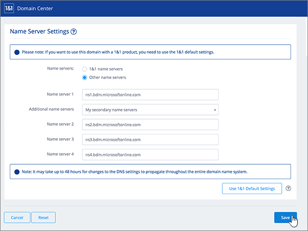

# Alterar os nameservers para configurar o Microsoft 365 com 1&1 IONOS

 Caso não encontre o conteúdo que está procurando, **[verifique as perguntas frequentes sobre domínios](../setup/domains-faq.yml)**. 
  
Siga estas instruções se quiser que o Microsoft 365 gerencie os registros DNS do Microsoft 365 para você. Se preferir, gerencie todos os registros DNS do [Microsoft 365 em 1&1 IONOS.](create-dns-records-at-1-1-internet.md) 
  

    
## Adicionar um registro TXT para verificação

Antes de usar o seu domínio com o Microsoft 365, precisamos verificar se você é o proprietário dele. A capacidade de entrar na conta do seu registrador de domínios e criar o registro de DNS prova ao Microsoft 365 que você é o proprietário do domínio.
  
> [!NOTE]
> Esse registro é usado exclusivamente para confirmar se você é o proprietário do domínio; ele não afeta mais nada. É possível excluí-lo mais tarde, se desejar. 
  
Siga as etapas abaixo ou [assista ao vídeo (início em 0:42)](https://support.microsoft.com/office/0ef1b3b5-d27a-4004-8ca1-fbe0453a0ea3).
  
1. To get started, go to your domains page at 1&1 IONOS via [this link](https://account.1and1.com/?redirect_url=https%3A%2F%2Fmy.1and1.com%2F). You'll be prompted to log in. 
    
2. Em **MEUS DOMÍNIOS,** selecione **Gerenciar domínios.**
    
3. Na página **Central de** Domínios, localize o domínio que você deseja atualizar; em seguida, **selecione o** controle Panel ( **v**) para esse domínio.
    
4. Na área **Configurações de Domínio,** selecione **Editar Configurações de DNS.**
    
5. Na seção **Registros TXT e SRV,** selecione **Adicionar Registro.**
    
    (Pode ser necessário rolar para baixo.) 
    
6. In the **Add Record** area, in the boxes for the new record, type or copy and paste the values from the following table. 
    
||||
|:-----|:-----|:-----|
|**Tipo**   |**Prefixo**   |**Valor do Nome**   |
|TXT    |(Leave this field empty.)    |MS = ms *XXXXXXXX*   **Observação:** este é um exemplo. Use seu valor específico de **Destino ou Pontos de Endereçamento** aqui, retirado da tabela no Microsoft 365. [Como localizo isto?](../get-help-with-domains/information-for-dns-records.md)   |

   
7. Selecione **Salvar** e **Salvar** novamente. 
    
8. Na caixa **de diálogo Editar Configurações** dns, selecione **Sim**.
    
9. Aguarde alguns minutos antes de prosseguir para que o registro que você acabou de criar possa ser atualizado na Internet.
    
Agora que você adicionou o registro no site do seu registrador de domínios, retorne ao Microsoft 365 e solicite que o Microsoft 365 procure o registro.
  
Quando o Microsoft 365 encontrar o registros TXT correto, o domínio será verificado.
  
1. No centro do administrador, acesse a página **Configurações de** \> <a href="https://go.microsoft.com/fwlink/p/?linkid=834818" target="_blank">domínios</a>.
    
2. Na página **Domínios**, clique no domínio que você está verificando. 
    
3. Na página **Configuração**, clique em **Iniciar configuração**.
    
4. Na página **Verificar domínio**, clique em **Verificar**.
    
> [!NOTE]
> Typically it takes about 15 minutes for DNS changes to take effect. Mas, às vezes, pode ser necessário mais tempo para atualizar uma alteração feita no sistema DNS da Internet. Se você estiver tendo problemas com o fluxo de emails ou outros problemas após adicionar registros DNS, consulte Encontrar e corrigir problemas depois de adicionar seu domínio ou registros DNS no [Microsoft 365.](../get-help-with-domains/find-and-fix-issues.md) 
  
## Alterar os registros de nameserver (NS) de seu domínio

Para concluir a configuração do domínio com o Microsoft 365, altere os registros NS do seu domínio no registrador de domínios para apontar para os servidores de nomes primários e secundários do Microsoft 365. Isso configura o Microsoft 365 para atualizar os registros DNS do domínio para você. Todos os registros são adicionados para que os seus emails, o Skype for Business Online e os sites públicos funcionem com o seu domínio e você fique com tudo pronto.
  
> [!CAUTION]
> Quando você altera os registros NS do seu domínio para apontar para os servidores de nomes do Microsoft 365, todos os serviços atualmente associados ao seu domínio são afetados. Por exemplo, todos os emails enviados para seu domínio (como rob@ *your_domain*  .com) começarão a chegar no Microsoft 365 depois que você fizer essa alteração. 
  
Pronto para alterar seus registros NS para que o Microsoft 365 possa configurar seu domínio? Siga as etapas abaixo ou [assista ao vídeo (inicia em 2:47)](https://support.microsoft.com/office/0ef1b3b5-d27a-4004-8ca1-fbe0453a0ea3).
  
> [!IMPORTANT]
>  O procedimento a seguir mostrará como excluir quaisquer outros nameservers indesejados da lista e também como adicionar os nameservers corretos se eles ainda não estão listados. > Concluir as etapas desta seção, os únicos nameservers que devem estar listados são estes quatro: > ns1.bdm.microsoftonline.com > ns2.bdm.microsoftonline.com > ns3.bdm.microsoftonline.com > ns4.bdm.microsoftonline.com 
  
1. To get started, go to your domains page at 1&1 IONOS by using [this link](https://account.1and1.com/?redirect_url=https%3A%2F%2Fmy.1and1.com%2F). You'll be prompted to log in. 
    
2. Em **MEUS DOMÍNIOS,** selecione **Gerenciar domínios.**
    
3. Na página **Central de** Domínios, localize o domínio que você deseja atualizar e selecione o controle **Painel** **(v)** para esse domínio.
    
4. Na área **Configurações de Domínio,** selecione **Editar Configurações de DNS.**
    
5. Na seção **Configurações de Servidor de nomes**, selecione **Outros servidores de nomes**.
    
    (Pode ser necessário rolar para baixo.)
    
6. Dependendo se há ou não nameservers já listados na página exibida agora, continue para um destes dois procedimentos:
    
  - Se **NÃO HOUVER** nameservers listados, [Se NÃO houver nameservers listados](#if-there-are-no-nameservers-already-listed).
    
  - Se **HOUVER** nameservers listados, [Se HOUVER nameservers listados](#if-there-are-nameservers-already-listed).
    
### Se NÃO houver nameservers listados

1. Na segunda caixa **Servidor de nomes 1**, digite ou copie e cole o valor da tabela a seguir. 
    
|||
|:-----|:-----|
|**Servidor de nomes 1**   |ns1.bdm.microsoftonline.com    |
   
   
  
2. Na lista suspensa **Servidores de nomes adicionais**, escolha **Meus servidores de nomes secundários**.
    
    
  
3. Nas caixas **Servidor de nomes 2, 3 e 4**, digite ou copie e cole o valor da tabela a seguir. 
    
|||
|:-----|:-----|
|**Servidor de nomes 2**   |ns2.bdm.microsoftonline.com    |
|**Servidor de nomes 3**   |ns3.bdm.microsoftonline.com    |
|**Servidor de nomes 4**   |ns4.bdm.microsoftonline.com    |
   

  
4. Selecione **Salvar**.
    
    
  
5. Na caixa **de diálogo Editar Configurações** dns, selecione **Sim**.
    
    
  
> [!NOTE]
> Your nameserver record updates may take up to several hours to update across the Internet's DNS system. Em seguida, seu email da Microsoft e outros serviços serão definidos para funcionar com seu domínio. 
  
### Se HOUVER nameservers listados

> [!CAUTION]
> Siga estas etapas  *somente*  se você tiver outros nameservers existentes, além dos quatro nameservers  *corretos*  . Ou seja, exclua  *somente*  nameservers atuais que  *não*  sejam denominados como **ns1.bdm.microsoftonline.com**, **ns2.bdm.microsoftonline.com**, **ns3.bdm.microsoftonline.com** ou **ns4.bdm.microsoftonline.com**. 
  
1. Se houver outros nameservers listados nas caixas **Servidor de nomes**, exclua cada um deles selecionando e pressionando a tecla **Delete** no teclado. 
    
    
  
2. Nas caixas **Servidor de nomes 1, 2, 3 e 4**, digite ou copie e cole os valores da tabela a seguir. 
    
|||
|:-----|:-----|
|**Servidor de nomes 1**   |ns1.bdm.microsoftonline.com    |
|**Servidor de nomes 2**   |ns2.bdm.microsoftonline.com    |
|**Servidor de nomes 3**   |ns3.bdm.microsoftonline.com    |
|**Servidor de nomes 4**   |ns4.bdm.microsoftonline.com    |
   
   
  
3. Selecione **Salvar**.
    
    
  
4. Na caixa **de diálogo Editar Configurações** dns, selecione **Sim**.
    
    
  
> [!NOTE]
> Your nameserver record updates may take up to several hours to update across the Internet's DNS system. Em seguida, seu email da Microsoft e outros serviços serão definidos para funcionar com seu domínio. 
  

