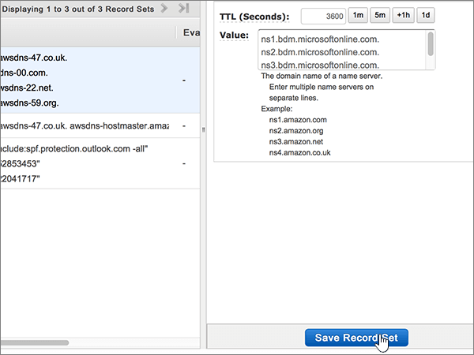

# Alterar os nameservers para configurar a Microsoft com serviços Web da Amazon (AWS)

 Caso não encontre o conteúdo que está procurando, **[verifique as perguntas frequentes sobre domínios](../setup/domains-faq.md)**. 
  
Siga estas instruções se quiser que a Microsoft gerencie seus registros DNS para você. Se preferir, [gerencie todos os registros DNS da Microsoft em AWS](create-dns-records-at-aws.md).
  
    
## Adicionar um registro TXT para verificação

Antes de usar o seu domínio com a Microsoft, precisamos verificar se você é o proprietário dele. A capacidade de entrar na conta do seu registrador de domínios e criar o registro de DNS prova à Microsoft que você é o proprietário do domínio.
  
> [!NOTE]
> Esse registro é usado exclusivamente para confirmar se você é o proprietário do domínio; ele não afeta mais nada. É possível excluí-lo mais tarde, se desejar. 
  
1. Para começar, vá para sua página de domínios no AWS usando [este link](https://console.aws.amazon.com/route53/home). Você será solicitado a fazer logon primeiro.
    
2. Na página **recursos** , selecione **zonas hospedadas**.
    
3. Na página **zonas hospedadas** , na coluna **nome do domínio** , selecione o nome do domínio que você deseja editar. 
    
4. Selecione **criar conjunto de registros**.
    
5. In the **Create Record Set** area, in the boxes for the new record, type or copy and paste the values from the following table. 
    
    (Choose the **Type** and **Routing Policy** values from the drop-down lists.) 
    
    > [!TIP]
    > The quotation marks required by the onscreen instructions are supplied automatically. You don't need to type them manually. 
  
|||||||
|:-----|:-----|:-----|:-----|:-----|:-----|
|**Nome**   |**Tipo**   |**Alias**   |**TTL (Segundos)**   |**Valor**   |**Política de Roteamento**   |
|(Deixe este campo vazio)    |TXT - Text    |Não    |300    |MS=ms *XXXXXXXX*   **Observação**: esse é um exemplo. Use aqui seu valor específico de **Destino ou Pontos de Endereçamento**, retirado da tabela. [Como localizo isto?](../get-help-with-domains/information-for-dns-records.md)     |Simples   |
   
6. Selecione **Criar**.
    
7. Aguarde alguns minutos antes de prosseguir para que o registro que você acabou de criar possa ser atualizado na Internet.
    
Agora que você adicionou o registro no site do seu registrador de domínio, você voltará para a Microsoft e solicitará uma pesquisa para o registro.
  
Quando a Microsoft encontrar o registro TXT correto, seu domínio estará verificado.
  
1. No centro do administrador da Microsoft, acesse a página **Configurações de** \> <a href="https://go.microsoft.com/fwlink/p/?linkid=834818" target="_blank">domínios</a>.

    
2. Na página **Domínios**, clique no domínio que você está verificando. 
    
3. Na página **Configuração**, clique em **Iniciar configuração**.
    
4. Na página **Verificar domínio**, clique em **Verificar**.
    
> [!NOTE]
> Typically it takes about 15 minutes for DNS changes to take effect. Mas, às vezes, pode ser necessário mais tempo para atualizar uma alteração feita no sistema DNS da Internet. Se você tiver problemas com o fluxo de e-mails ou de outro tipo após adicionar os registros DNS, consulte [Localizar e corrigir problemas ou registros DNS](../get-help-with-domains/find-and-fix-issues.md). 
  
## Alterar os registros de nameserver (NS) de seu domínio

Para concluir a configuração do seu domínio com a Microsoft, altere os registros NS do seu domínio no seu registrador de domínios para apontar para os servidores de nomes primários e secundários da Microsoft. Isso configura a Microsoft para atualizar os registros DNS do domínio para você. Todos os registros são adicionados para que os seus emails, o Skype for Business Online e os sites públicos funcionem com o seu domínio e você fique com tudo pronto.
  
> [!CAUTION]
> Quando você alterar os registros NS do seu domínio para apontar para os servidores de nomes da Microsoft, todos os serviços associados atualmente ao seu domínio serão afetados. Por exemplo, todos os emails enviados para seu domínio (como rob@ *your_domain* . com) começarão a ser iniciados pela Microsoft depois que você fizer essa alteração. 
  
> [!IMPORTANT]
>  O procedimento a seguir mostrará como excluir outros nameservers indesejados da lista e também como adicionar os nameservers corretos se eles ainda não estiverem listados. > quando você tiver concluído as etapas nesta seção, os únicos nameservers que devem ser listados são estes quatro: > ns1.bdm.microsoftonline.com > ns2.bdm.microsoftonline.com > ns3.bdm.microsoftonline.com > ns4.bdm.microsoftonline.com 
  
1. Para começar, vá para sua página de domínios no AWS usando [este link](https://console.aws.amazon.com/route53/home). Você será solicitado a fazer logon primeiro.
    
2. Na página **recursos** , selecione **zonas hospedadas**.
    
3. Na página **zonas hospedadas** , na coluna **nome do domínio** , selecione o nome do domínio que você deseja editar. 
    
4. Selecione o conjunto de registros **Nameserver**. 
    
    
  
5. No conjunto de registros **NS - Name server** na caixa **Valor**, exclua todos os nameservers selecionando todos eles e pressionando a tecla **Delete** no teclado. 
    
    > [!CAUTION]
    > Follow these steps only if you have existing nameservers other than the four correct nameservers. (Ou seja, exclua somente os nameservers atuais que *não* sejam denominados **ns1.bdm.microsoftonline.com**, **ns2.bdm.microsoftonline.com**, **NS3.bdm.microsoftonline.com**ou **NS4.bdm.microsoftonline.com**.) 
  
    
  
6. Na área **TTL (segundos):** , selecione **1h** (1 hora). 
    
    
  
7. Ainda no conjunto de registros **NS - Nameserver**, na caixa **Valor**, digite ou copie e cole o valor **Primeira linha** da tabela a seguir, pressione a tecla **Enter** no teclado e digite ou copie e cole o valor da próxima **linha**. 
    
    > [!IMPORTANT]
    > Cada valor de nameserver  *tem que*  estar em sua própria linha separada dentro da caixa **Valor**, conforme mostrado na ilustração a seguir. 
  
|||
|:-----|:-----|
|**Primeira linha**   |ns1.bdm.microsoftonline.com.    **This value MUST end with a period (.)**   |
|**Segunda linha**   |ns2.bdm.microsoftonline.com.    **This value MUST end with a period (.)**   |
|**Terceira linha**   |ns3.bdm.microsoftonline.com.    **Este valor deve OBRIGATORIAMENTE terminar com um ponto (.)**   |
|**Quarta linha**   |ns4.bdm.microsoftonline.com.    **Este valor deve OBRIGATORIAMENTE terminar com um ponto (.)**   |
   
   
  
8. Selecione **Salvar conjunto de registros**.
    
    
  
> [!NOTE]
> Your nameserver record updates may take up to several hours to update across the Internet's DNS system. Em seguida, seu email da Microsoft e outros serviços serão configurados para funcionar com seu domínio. 
