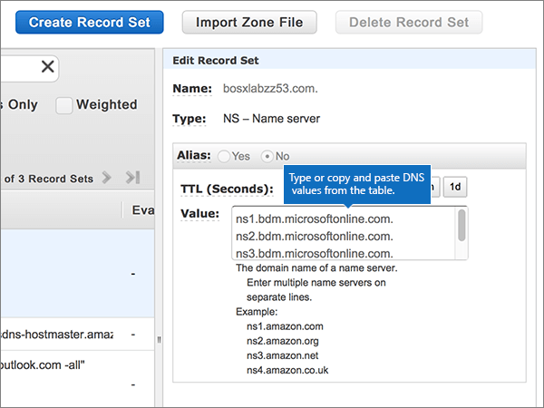

# Alterar os nameservers para configurar o Office 365 com a AWS (Amazon Web Services)Change nameservers to set up Office 365 with Amazon Web Services (AWS)

 **Caso não encontre o conteúdo que está procurando, [verifique as perguntas frequentes sobre domínios](../setup/domains-faq.md)**.**[Check the Domains FAQ](../setup/domains-faq.md)** if you don't find what you're looking for. 
  
Siga essas instruções se desejar que o Office 365 gerencie os registros DNS do Office 365 para você. Se preferir, [gerencie todos os registros DNS do Office 365 no AWS](create-dns-records-at-aws.md).Follow these instructions if you want Office 365 to manage your Office 365 DNS records for you. (If you prefer, you can [manage all your Office 365 DNS records at AWS](create-dns-records-at-aws.md).)
  
    
## Adicionar um registro TXT para verificaçãoAdd a TXT record for verification

Antes de usar o seu domínio com o Office 365, precisamos verificar se você é o proprietário dele. A capacidade de entrar na conta do seu registrador de domínios e criar o registro DNS prova ao Office 365 que você é o proprietário do domínio.Before you use your domain with Office 365, we have to make sure that you own it. Your ability to log in to your account at your domain registrar and create the DNS record proves to Office 365 that you own the domain.
  
> [!NOTE]
> Esse registro é usado exclusivamente para confirmar se você é o proprietário do domínio; ele não afeta mais nada. É possível excluí-lo mais tarde, se desejar.This record is used only to verify that you own your domain; it doesn't affect anything else. You can delete it later, if you like. 
  
1. Para começar, vá para sua página de domínios no AWS usando [este link](https://console.aws.amazon.com/route53/home). Você será solicitado a fazer logon primeiro.To get started, go to your domains page at AWS by using [this link](https://console.aws.amazon.com/route53/home). You'll be prompted to log in first.
    
2. Na página **recursos** , selecione **zonas hospedadas**.On the **Resources** page, select **Hosted Zones**.
    
3. Na página **zonas hospedadas** , na coluna **nome do domínio** , selecione o nome do domínio que você deseja editar.On the **Hosted Zones** page, in the **Domain Name** column, select the name of the domain that you want to edit. 
    
4. Selecione **criar conjunto de registros**.Select **Create Record Set**.
    
5. In the **Create Record Set** area, in the boxes for the new record, type or copy and paste the values from the following table.In the **Create Record Set** area, in the boxes for the new record, type or copy and paste the values from the following table. 
    
    (Choose the **Type** and **Routing Policy** values from the drop-down lists.)(Choose the **Type** and **Routing Policy** values from the drop-down lists.) 
    
    > [!TIP]
    > The quotation marks required by the onscreen instructions are supplied automatically. You don't need to type them manually.The quotation marks required by the onscreen instructions are supplied automatically. You don't need to type them manually. 
  
|||||||
|:-----|:-----|:-----|:-----|:-----|:-----|
|**Nome****Name**   |**Tipo****Type**   |**Alias****Alias**   |**TTL (Segundos)****TTL (Seconds)**   |**Valor****Value**   |**Política de Roteamento****Routing Policy**   |
|(Deixe este campo vazio)(Leave this field empty)    |TXT - TextTXT - Text    |NãoNo    |300300    |MS = ms *XXXXXXXX*MS=ms *XXXXXXXX*   **Observação:** Este é um exemplo.**Note:** This is an example. Use aqui o valor específico de **Destino ou Pontos de Endereçamento**, retirado da tabela em Office 365.Use your specific **Destination or Points to Address** value here, from the table in Office 365. [Como faço para encontrar isso?How do I find this?](../get-help-with-domains/information-for-dns-records.md)     |SimplesSimple   |
   
6. Selecione **Criar**.Select **Create**.
    
7. Aguarde alguns minutos antes de prosseguir para que o registro que você acabou de criar possa ser atualizado na Internet.Wait a few minutes before you continue, so that the record you just created can update across the Internet.
    
Now that you've added the record at your domain registrar's site, you'll go back to Office 365 and request Office 365 to look for the record.Now that you've added the record at your domain registrar's site, you'll go back to Office 365 and request Office 365 to look for the record.
  
When Office 365 finds the correct TXT record, your domain is verified.When Office 365 finds the correct TXT record, your domain is verified.
  
1. No centro de administração, vá para a página de <a href="https://go.microsoft.com/fwlink/p/?linkid=834818" target="_blank">domínios</a> de **configurações** \> .In the admin center, go to the **Settings** \> <a href="https://go.microsoft.com/fwlink/p/?linkid=834818" target="_blank">Domains</a> page.

    
2. Na página **domínios** , selecione o domínio que você está verificando.On the **Domains** page, select the domain that you are verifying. 
    
3. Na página **configuração** , selecione **Iniciar configuração**.On the **Setup** page, select **Start setup**.
    
4. Na página **verificar domínio** , selecione **verificar**.On the **Verify domain** page, select **Verify**.
    
> [!NOTE]
> Typically it takes about 15 minutes for DNS changes to take effect.Typically it takes about 15 minutes for DNS changes to take effect. However, it can occasionally take longer for a change you've made to update across the Internet's DNS system.However, it can occasionally take longer for a change you've made to update across the Internet's DNS system. Se você estiver tendo problemas com o fluxo de emails ou com outros problemas após adicionar registros DNS, consulte [Localizar e corrigir problemas após adicionar seu domínio ou registros DNS no Office 365](../get-help-with-domains/find-and-fix-issues.md).If you're having trouble with mail flow or other issues after adding DNS records, see [Find and fix issues after adding your domain or DNS records in Office 365](../get-help-with-domains/find-and-fix-issues.md). 
  
## Alterar os registros de nameserver (NS) de seu domínioChange your domain's nameserver (NS) records

Para concluir a configuração do domínio com o Office 365, altere os registros NS do seu domínio no registrador de domínios para apontar para os servidores de nomes primários e secundários do Office 365. Isso configura o Office 365 para atualizar os registros DNS do seu domínio. Todos os registros são adicionados para que os seus emails, o Skype for Business Online e os sites públicos funcionem com o seu domínio e você fique com tudo pronto.To complete setting up your domain with Office 365, you change your domain's NS records at your domain registrar to point to the Office 365 primary and secondary name servers. This sets up Office 365 to update the domain's DNS records for you. We'll add all records so that email, Skype for Business Online, and your public website work with your domain, and you'll be all set.
  
> [!CAUTION]
> Ao alterar os registros NS do domínio para direcionar para os servidores de nome do Office 365, todos os serviços associados atualmente a esse domínio serão afetados. Por exemplo, todos os emails enviados para seu domínio (como paulo@ *seu_domínio*  .com) vão começar a chegar no Office 365, depois que essa alteração for feita.When you change your domain's NS records to point to the Office 365 name servers, all the services that are currently associated with your domain are affected. For example, all email sent to your domain (like rob@ *your_domain*  .com) will start coming to Office 365 after you make this change. 
  
> [!IMPORTANT]
>  O procedimento a seguir mostrará como excluir outros nameservers indesejados da lista e também como adicionar os nameservers corretos se eles ainda não estiverem listados.The following procedure will show you how to delete any other, unwanted nameservers from the list, and also how to add the correct nameservers if they are not already listed. > quando você tiver concluído as etapas nesta seção, os únicos nameservers que devem ser listados são estes quatro: > ns1.bdm.microsoftonline.com > ns2.bdm.microsoftonline.com > ns3.bdm.microsoftonline.com > ns4.bdm.microsoftonline.com>  When you have completed the steps in this section, the only nameservers that should be listed are these four: >  ns1.bdm.microsoftonline.com >  ns2.bdm.microsoftonline.com >  ns3.bdm.microsoftonline.com >  ns4.bdm.microsoftonline.com 
  
1. Para começar, vá para sua página de domínios no AWS usando [este link](https://console.aws.amazon.com/route53/home).To get started, go to your domains page at AWS by using [this link](https://console.aws.amazon.com/route53/home). Você será solicitado a fazer logon primeiro.You'll be prompted to log in first.
    
2. Na página **recursos** , selecione **zonas hospedadas**.On the **Resources** page, select **Hosted Zones**.
    
3. Na página **zonas hospedadas** , na coluna **nome do domínio** , selecione o nome do domínio que você deseja editar.On the **Hosted Zones** page, in the **Domain Name** column, select the name of the domain that you want to edit. 
    
4. Selecione o conjunto de registros **Nameserver**.Select the **Nameserver** record set. 
    
    
  
5. No conjunto de registros **NS - Name server** na caixa **Valor**, exclua todos os nameservers selecionando todos eles e pressionando a tecla **Delete** no teclado.In the **NS - Name server** record set in the **Value** box, delete all of the nameservers by selecting them all and then pressing the **Delete** key on your keyboard. 
    
    > [!CAUTION]
    > Follow these steps only if you have existing nameservers other than the four correct nameservers.Follow these steps only if you have existing nameservers other than the four correct nameservers. (Ou seja, exclua somente os nameservers atuais que *não* sejam denominados **ns1.bdm.microsoftonline.com**, **ns2.bdm.microsoftonline.com**, **NS3.bdm.microsoftonline.com**ou **NS4.bdm.microsoftonline.com**.)(That is, delete only any current nameservers that are  *not*  named **ns1.bdm.microsoftonline.com**, **ns2.bdm.microsoftonline.com**, **ns3.bdm.microsoftonline.com**, or **ns4.bdm.microsoftonline.com**.) 
  
    
  
6. Na área **TTL (segundos):** , selecione **1h** (1 hora).In the **TTL (Seconds):** area, select **1h** (1 Hour). 
    
    
  
7. Ainda no conjunto de registros **NS - Nameserver**, na caixa **Valor**, digite ou copie e cole o valor **Primeira linha** da tabela a seguir, pressione a tecla **Enter** no teclado e digite ou copie e cole o valor da próxima **linha**.Still in the **NS - Name server** record set, in the **Value** box, type or copy and paste the **First line** value from the following table, then press the **Enter** key on your keyboard and type or copy and paste the next **line** value. 
    
    > [!IMPORTANT]
    > Cada valor de nameserver  *tem que*  estar em sua própria linha separada dentro da caixa **Valor**, conforme mostrado na ilustração a seguir.Each nameserver value  *must*  be on its own separate line within the **Value** box, as shown in the following illustration. 
  
|||
|:-----|:-----|
|**Primeira linha****First line**   |ns1.bdm.microsoftonline.com.ns1.bdm.microsoftonline.com.    **This value MUST end with a period (.)****This value MUST end with a period (.)**   |
|**Segunda linha****Second line**   |ns2.bdm.microsoftonline.com.ns2.bdm.microsoftonline.com.    **This value MUST end with a period (.)****This value MUST end with a period (.)**   |
|**Terceira linha****Third line**   |ns3.bdm.microsoftonline.com.ns3.bdm.microsoftonline.com.    **Este valor deve OBRIGATORIAMENTE terminar com um ponto (.)****This value MUST end with a period (.)**   |
|**Quarta linha****Fourth line**   |ns4.bdm.microsoftonline.com.ns4.bdm.microsoftonline.com.    **Este valor deve OBRIGATORIAMENTE terminar com um ponto (.)****This value MUST end with a period (.)**   |
   
   
  
8. Selecione **Salvar conjunto de registros**.Select **Save Record Set**.
    
    
  
> [!NOTE]
> As atualizações de registro do servidor de nomes poderão levar várias horas para entrarem em vigor no sistema DNS da Internet. Em seguida, os seus emails e outros serviços do Office 365 serão todos configurados para funcionar com seu domínio.Your nameserver record updates may take up to several hours to update across the Internet's DNS system. Then your Office 365 email and other services will be all set to work with your domain. 
