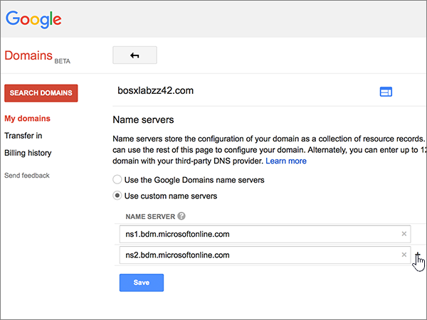

# Alterar os nameservers para configurar o Office 365 com o Google DomainsChange nameservers to set up Office 365 with Google Domains

 **Caso não encontre o conteúdo que está procurando, [verifique as perguntas frequentes sobre domínios](../setup/domains-faq.md)**.**[Check the Domains FAQ](../setup/domains-faq.md)** if you don't find what you're looking for. 
  
Siga essas instruções se desejar que o Office 365 gerencie os registros DNS do Office 365 para você. Se preferir, [gerencie todos os registros DNS do Office 365 em Google Domains](create-dns-records-at-google-domains.md).Follow these instructions if you want Office 365 to manage your Office 365 DNS records for you. (If you prefer, you can [manage all your Office 365 DNS records at Google Domains](create-dns-records-at-google-domains.md).)
  
    
## Adicionar um registro TXT para verificaçãoAdd a TXT record for verification

Antes de usar o seu domínio com o Office 365, precisamos verificar se você é o proprietário dele. A capacidade de entrar na conta do seu registrador de domínios e criar o registro DNS prova ao Office 365 que você é o proprietário do domínio.Before you use your domain with Office 365, we have to make sure that you own it. Your ability to log in to your account at your domain registrar and create the DNS record proves to Office 365 that you own the domain.
  
> [!NOTE]
>  Esse registro é usado exclusivamente para confirmar se você é o proprietário do domínio; ele não afeta mais nada. É possível excluí-lo mais tarde, se desejar.This record is used only to verify that you own your domain; it doesn't affect anything else. You can delete it later, if you like. 
  
1. Para começar, vá até a sua página de domínios no Google Domains por meio [deste link](https://domains.google.com/registrar).To get started, go to your domains page at Google Domains via [this link](https://domains.google.com/registrar). You'll be prompted to sign in.You'll be prompted to sign in. To do so:To do so:
    
1. Selecione **entrar**.Select **Sign In**.
    
2. Insira suas credenciais de logon e selecione **entrar**novamente.Enter your login credentials and again select **Sign In**.
    
2. Na página **domínios** , na seção **domínio** , selecione **Configurar DNS** para o domínio que você deseja editar.On the **Domains** page, in the **Domain** section, select **Configure DNS** for the domain that you want to edit. 
    
3. In the **Custom resource records** section, in the boxes for the new record, type or copy and paste the values from the following table.In the **Custom resource records** section, in the boxes for the new record, type or copy and paste the values from the following table. 
    
    (You may have to scroll down.)(You may have to scroll down.)
    
    (Choose the **Type** value from the drop-down list.)(Choose the **Type** value from the drop-down list.) 
    
|||||
|:-----|:-----|:-----|:-----|
|**Nome****Name**   |**Tipo****Type**   |**TTL****TTL**   |**Dados****Data**   |
|@    |TXTTXT    |1H1H    |MS = ms *XXXXXXXX*MS=ms *XXXXXXXX*   **Observação**: esse é um exemplo.**Note:** This is an example. Use seu valor específico de **Destinos ou Pontos de Endereçamento** aqui, da tabela no Office 365.Use your specific **Destination or Points to Address** value here, from the table in Office 365. [Como localizo isto?How do I find this?](../get-help-with-domains/information-for-dns-records.md)          |
   
4. Clique em **Adicionar**.Select **Add**.
    
5. Aguarde alguns minutos antes de prosseguir para que o registro que você acabou de criar possa ser atualizado na Internet.Wait a few minutes before you continue, so that the record you just created can update across the Internet.
    
Agora que você adicionou o registro no site do seu registrador de domínios, retorne ao Office 365 e solicite que o Office 365 procure o registro.Now that you've added the record at your domain registrar's site, you'll go back to Office 365 and request Office 365 to look for the record.
  
Quando o Office 365 encontrar o registro TXT correto, o domínio será verificado.When Office 365 finds the correct TXT record, your domain is verified.
  
1. No centro do administrador, acesse a página **Configurações de** \> <a href="https://go.microsoft.com/fwlink/p/?linkid=834818" target="_blank">domínios</a>.In the admin center, go to the **Settings** \> <a href="https://go.microsoft.com/fwlink/p/?linkid=834818" target="_blank">Domains</a> page.

    
2. Na página **Domínios**, clique no domínio que você está verificando.On the **Domains** page, select the domain that you are verifying. 
    
3. Na página **Configuração**, clique em **Iniciar configuração**.On the **Setup** page, select **Start setup**.
    
4. Na página **Verificar domínio**, clique em **Verificar**.On the **Verify domain** page, select **Verify**.
    
> [!NOTE]
> Typically it takes about 15 minutes for DNS changes to take effect.Typically it takes about 15 minutes for DNS changes to take effect. Mas, às vezes, pode ser necessário mais tempo para atualizar uma alteração feita no sistema DNS da Internet.However, it can occasionally take longer for a change you've made to update across the Internet's DNS system. Se você tiver problemas com o fluxo de e-mails ou de outro tipo após adicionar os registros DNS, consulte [Localizar e corrigir problemas após alterar o nome de domínio ou registros DNS no Office 365](../get-help-with-domains/find-and-fix-issues.md).If you're having trouble with mail flow or other issues after adding DNS records, see [Find and fix issues after adding your domain or DNS records in Office 365](../get-help-with-domains/find-and-fix-issues.md). 
  
## Alterar os registros de nameserver (NS) de seu domínioChange your domain's nameserver (NS) records

Para concluir a configuração do domínio com o Office 365, altere os registros NS do seu domínio no registrador de domínios para apontar para os servidores de nomes primários e secundários do Office 365. Isso configura o Office 365 para atualizar os registros DNS do seu domínio. Todos os registros são adicionados para que os seus emails, o Skype for Business Online e os sites públicos funcionem com o seu domínio e você fique com tudo pronto.To complete setting up your domain with Office 365, you change your domain's NS records at your domain registrar to point to the Office 365 primary and secondary name servers. This sets up Office 365 to update the domain's DNS records for you. We'll add all records so that email, Skype for Business Online, and your public website work with your domain, and you'll be all set.
  
> [!CAUTION]
> Ao alterar os registros NS do domínio para direcionar para os servidores de nome do Office 365, todos os serviços associados atualmente a esse domínio serão afetados.When you change your domain's NS records to point to the Office 365 name servers, all the services that are currently associated with your domain are affected. Por exemplo, todos os emails enviados para seu domínio (como rob@ *your_domain.*For example, all email sent to your domain (like rob@ *your_domain.*  com) começará a chegar ao Office 365 depois que você fizer essa alteração.com) will start coming to Office 365 after you make this change. 
  
> [!IMPORTANT]
> The following procedure will show you how to delete any other, unwanted nameservers from the list, and also how to add the correct nameservers if they are not already in the list.The following procedure will show you how to delete any other, unwanted nameservers from the list, and also how to add the correct nameservers if they are not already in the list. > quando você tiver concluído as etapas nesta seção, os únicos nameservers que devem ser listados são estes quatro:> When you have completed the steps in this section, the only nameservers that should be listed are these four: 
  
1. Para iniciar, vá até a página do seu domínio no Google Domains usando [este link](https://domains.google.com/registrar). Você será solicitado a entrar. Para fazer isso:To get started, go to your domains page at Google Domains by using [this link](https://domains.google.com/registrar). You'll be prompted to sign in. To do so:
    
1. Selecione **entrar**.Select **Sign In**.
    
2. Digite suas credenciais de logon e, em seguida, selecione **entrar**novamente.Enter your login credentials, and then again select **Sign In**.
    
2. Na página **domínios** , na seção **domínio** , selecione **Configurar DNS** para o domínio que você deseja editar.On the **Domains** page, in the **Domain** section, select **Configure DNS** for the domain that you want to edit. 
    
3. Na página **Domínios**, na seção **Servidores de nomes**, selecione **Usar servidores de nomes personalizados**.On the **Domains** page, in the **Name servers** section, select **Use custom name servers**.
    
    
  
4. Dependendo se há ou não nameservers já listados na página exibida agora, continue para um destes dois procedimentos:Depending on whether or not there are already nameservers listed on the page that is displayed now, continue to one of the two following procedures:
    
  - Se **NÃO HOUVER** nameservers listados, [Se NÃO houver nameservers listados](#if-there-are-no-nameservers-already-listed).If there are **NO** nameservers already listed, [If there are NO nameservers already listed](#if-there-are-no-nameservers-already-listed).
    
  - Se **HOUVER** nameservers listados, [Se HOUVER nameservers listados](#if-there-are-nameservers-already-listed).If there **ARE** nameservers already listed, [If there ARE nameservers already listed](#if-there-are-nameservers-already-listed).
    
### Se NÃO houver nameservers listadosIf there are NO nameservers already listed

1. Adicione o primeiro nameserver.Add the first nameserver.
    
    Na seção **Servidores de nomes**, na caixa **SERVIDOR DE NOMES**, digite ou copie e cole o primeiro valor da tabela a seguir.In the **Name servers** section, in the **NAME SERVER** box, type or copy and paste the first value from the following table. 
    
|||
|:-----|:-----|
|**Primeiro servidor de nomes****First name server**   |ns1.bdm.microsoftonline.comns1.bdm.microsoftonline.com    |
|**Segundo servidor de nomes****Second name server**   |ns2.bdm.microsoftonline.comns2.bdm.microsoftonline.com    |
|**Terceiro servidor de nome****Third name server**   |ns3.bdm.microsoftonline.comns3.bdm.microsoftonline.com    |
|**Quarto servidor de nome****Fourth name server**   |ns4.bdm.microsoftonline.comns4.bdm.microsoftonline.com    |
   
   
  
2. Selecione o controle **+ (Adicionar)** para criar uma linha vazia.Select the **+ (add)** control to create an empty row. 
    
    
  
3. Adicione os outros três registros Nameserver.Add the other three Nameserver records.
    
    Na seção **usar servidores de nomes personalizados** , crie um registro usando os valores da próxima linha na tabela e, em seguida, selecione o controle **+ (Adicionar)** para adicionar outra linha.In the **Use custom name servers** section, create a record by using the values from the next row in the table, and then select the **+ (add)** control to add another row. 
    
    Repita esse processo até ter criado todos os quatro registros Nameserver.Repeat this process until you have created all four Nameserver records.
    
4. Selecione **Salvar**.Select **Save**.
    
    
  
> [!NOTE]
> As atualizações de registro do servidor de nomes poderão levar várias horas para entrarem em vigor no sistema DNS da Internet. Em seguida, os seus emails e outros serviços do Office 365 serão todos configurados para funcionar com seu domínio.Your nameserver record updates may take up to several hours to update across the Internet's DNS system. Then your Office 365 email and other services will be all set to work with your domain. 
  
### Se HOUVER nameservers listadosIf there ARE nameservers already listed

1. Se houver outros nameservers listados, selecione **Editar**.If there are any other nameservers listed, select **Edit**.
    
    > [!CAUTION]
    > Follow these steps only if you have existing nameservers other than the four correct nameservers.Follow these steps only if you have existing nameservers other than the four correct nameservers. (Ou seja, exclua somente os nameservers atuais que *não* sejam denominados **ns1.bdm.microsoftonline.com**, **ns2.bdm.microsoftonline.com**, **NS3.bdm.microsoftonline.com**ou **NS4.bdm.microsoftonline.com**.)(That is, delete only any current nameservers that are  *not*  named **ns1.bdm.microsoftonline.com**, **ns2.bdm.microsoftonline.com**, **ns3.bdm.microsoftonline.com**, or **ns4.bdm.microsoftonline.com**.) 
  
    
  
2. Exclua cada um selecionando-o e pressionando a tecla **Delete** no teclado.Delete each one by selecting it, and then pressing the **Delete** key on your keyboard. 
    
    
  
3. Ainda na seção **Servidores de nomes**, nas linhas **SERVIDOR DE NOMES**, digite ou copie e cole os valores da tabela a seguir.Still in the **Name servers** section, in the **NAME SERVER** rows, type or copy and paste the values from the following table. 
    
|||
|:-----|:-----|
|**Primeiro servidor de nomes****First name server**   |ns1.bdm.microsoftonline.comns1.bdm.microsoftonline.com    |
|**Segundo servidor de nomes****Second name server**   |ns2.bdm.microsoftonline.comns2.bdm.microsoftonline.com    |
|**Terceiro servidor de nome****Third name server**   |ns3.bdm.microsoftonline.comns3.bdm.microsoftonline.com    |
|**Quarto servidor de nome****Fourth name server**   |ns4.bdm.microsoftonline.comns4.bdm.microsoftonline.com    |
   
   
  
4. Selecione o controle **+ (Adicionar)** para criar uma linha vazia.Select the **+(add)** control to create an empty row. 
    
    
  
5. Adicione os outros dois registros Nameserver.Add the other two Nameserver records.
    
    Na seção **usar servidores de nomes personalizados** , crie um registro usando os valores da próxima linha na tabela e, em seguida, selecione o controle **+ (Adicionar)** para adicionar outra linha.In the **Use custom name servers** section, create a record by using the values from the next row in the table, and then select the **+(add)** control to add another row. 
    
    Repita esse processo até ter criado todos os quatro registros Nameserver.Repeat this process until you have created all four Nameserver records.
    
6. Selecione **Salvar**.Select **Save**.
    
    
  
> [!NOTE]
> As atualizações de registro do servidor de nomes poderão levar várias horas para entrarem em vigor no sistema DNS da Internet. Em seguida, os seus emails e outros serviços do Office 365 serão todos configurados para funcionar com seu domínio.Your nameserver record updates may take up to several hours to update across the Internet's DNS system. Then your Office 365 email and other services will be all set to work with your domain. 
  
