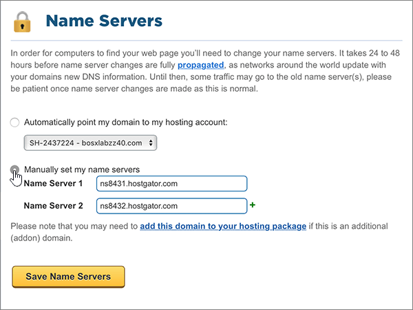

# Alterar os nameservers para configurar o Office 365 com o Hostgator

 **Caso não encontre o conteúdo que está procurando, [verifique as perguntas frequentes sobre domínios](../setup/domains-faq.md)**.
  
Siga essas instruções se desejar que o Office 365 gerencie os registros DNS do Office 365 para você. Se preferir, [gerencie todos os registros DNS do Office 365 na HostGator](create-dns-records-at-hostgator.md).
  
    
## Aponte o seu domínio para sua conta de hospedagem.

> [!IMPORTANT]
> Você deve executar esse procedimento antes do procedimento na seção a seguir, **Adicionar um registro TXT para verificação**.
  
Siga estas etapas para associar seu domínio e as contas de hospedagem.
  
1. Para começar, vá até a sua página de gerenciamento de clientes na Hostgator usando [este link](https://portal.hostgator.com/domain/manage). Você será solicitado a fazer logon primeiro.
    
    
  
2. Selecione a guia **domínios** .
    
    
  
3. Na página **gerenciar domínios** , na área **meus domínios** , selecione o domínio que você deseja atualizar.
    
    
  
4. Na página **visão geral de domínios** , na área **servidores de nomes** , selecione **alterar**.
    
    
  
5. Na página **servidores de nomes** do seu domínio, na lista suspensa **selecionar conta de hospedagem** , escolha a conta de **hospedagem** associada ao seu domínio.
    
    
  
6. Selecione **salvar servidores de nomes**.
    
    
  
## Adicionar um registro TXT para verificação

> [!IMPORTANT]
> Antes de executar este procedimento, você deve primeiro executar o procedimento na primeira seção deste artigo, [aponte seu domínio para sua conta de hospedagem.](#point-your-domain-to-your-hosting-account).
  
Antes de usar o seu domínio com o Office 365, precisamos verificar se você é o proprietário dele. A capacidade de entrar na conta do seu registrador de domínios e criar o registro DNS prova ao Office 365 que você é o proprietário do domínio.
  
> [!NOTE]
> Esse registro é usado exclusivamente para confirmar se você é o proprietário do domínio; ele não afeta mais nada. É possível excluí-lo mais tarde, se desejar.
  
1. Para começar, vá para a página do cPanel no Hostgator. Será solicitado que você faça logon primeiro.
    
    (É atribuído um endereço cPanel exclusivo a cada conta hospedada no Hostgator. Seu endereço cPanel deve ter esta aparência: https://YourSiteAddress:secure-port-numberçoDoSeuSite:número-de-porta-segura. O email de inscrição recebido do Hostgator especificará esse endereço.)
    
    > [!IMPORTANT]
    > To have a cPanel associated with your domain, you need a hosting account with Hostgator. Para começar a usar o Office 365, você pode comprar uma conta de hospedagem do Hostgator ou [alterar os registros de nameserver (ns) do seu domínio](#change-your-domains-nameserver-ns-records) para apontar para o Office 365. 
  
2. Na página **painel de controle** , na área **domínios** , selecione **Editor de zona de DNS avançado**.
    
    (You may have to scroll down.) 
    
3. On the **Advanced DNS Zone Editor** page, in the **Add a Record** area, in the boxes for the new record, type or copy and paste the values from the following table. 
    
    (Escolha o valor de **Tipo** na lista suspensa.) 
    
|||||
|:-----|:-----|:-----|:-----|
|**Nome**   |**TTL**   |**Tipo**   |**Dados TXT**   |
|Use seu  *domain_name*  . (por exemplo, fourthcoffee.com.)    **Este valor deve OBRIGATORIAMENTE terminar com um ponto (.)**   |1    |TXT    |MS = ms *XXXXXXXX*    **Observação**: esse é um exemplo. Use seu valor específico de **Destinos ou Pontos de Endereçamento** aqui, da tabela no Office 365. [Como localizo isto?](../get-help-with-domains/information-for-dns-records.md)        |
   
4. Selecione **adicionar registro**.
    
5. Aguarde alguns minutos antes de prosseguir para que o registro que você acabou de criar possa ser atualizado na Internet.
    
Agora que você adicionou o registro no site do seu registrador de domínios, retorne ao Office 365 e solicite que o Office 365 procure o registro.
  
Quando o Office 365 encontrar o registro TXT correto, o domínio será verificado.
  
1. No centro do administrador, acesse a página **Configurações de** \> <a href="https://go.microsoft.com/fwlink/p/?linkid=834818" target="_blank">domínios</a>.

    
2. Na página **Domínios**, clique no domínio que você está verificando. 
    
3. Na página **Configuração**, clique em **Iniciar configuração**.
    
4. Na página **Verificar domínio**, clique em **Verificar**.
    
> [!NOTE]
> Typically it takes about 15 minutes for DNS changes to take effect. Mas, às vezes, pode ser necessário mais tempo para atualizar uma alteração feita no sistema DNS da Internet. Se você tiver problemas com o fluxo de e-mails ou de outro tipo após adicionar os registros DNS, consulte [Localizar e corrigir problemas após alterar o nome de domínio ou registros DNS no Office 365](../get-help-with-domains/find-and-fix-issues.md). 
  
## Alterar os registros de nameserver (NS) de seu domínio

Para concluir a configuração do domínio com o Office 365, altere os registros NS do seu domínio no registrador de domínios para apontar para os servidores de nomes primários e secundários do Office 365. Isso configura o Office 365 para atualizar os registros DNS do seu domínio. Todos os registros são adicionados para que os seus emails, o Skype for Business Online e os sites públicos funcionem com o seu domínio e você fique com tudo pronto.
  
> [!CAUTION]
> Ao alterar os registros NS do domínio para direcionar para os servidores de nome do Office 365, todos os serviços associados atualmente a esse domínio serão afetados. Por exemplo, todos os emails enviados para seu domínio (como paulo@ *seu_domínio*  .com) vão começar a chegar no Office 365, depois que essa alteração for feita.
  
> [!IMPORTANT]
> O procedimento a seguir mostrará como excluir outros nameservers indesejados da lista e também como adicionar os nameservers corretos se eles ainda não estiverem listados. Quando você tiver concluído as etapas nesta seção, os únicos nameservers que devem ser listados são estes quatro: **ns1.bdm.microsoftonline.com**, **ns2.bdm.microsoftonline.com**, **NS3.bdm.microsoftonline.com**e **NS4.bdm.microsoftonline.com**.
  
1. Para começar, vá até a sua página de gerenciamento de clientes na Hostgator usando [este link](https://portal.hostgator.com/domain/manage). Você será solicitado a fazer logon primeiro.
    
    
  
2. Selecione a guia **domínios** . 
    
    
  
3. Na página **gerenciar domínios** , na área **meus domínios** , selecione o domínio que você deseja atualizar. 
    
    
  
4. Na página **visão geral do domínio** , na área **servidores de nomes** , selecione **alterar**.
    
    
  
5. Na página **servidores de nomes** do seu domínio, na lista suspensa **selecionar conta de hospedagem** , escolha a conta de **hospedagem** associada ao seu domínio. 
    
    
  
6. Selecione **definir manualmente os meus servidores de nomes**.
    
    
  
7.   **Cuidado**: Siga estas etapas somente se você tiver nameservers existentes além dos quatro nameservers corretos. (Ou seja, exclua somente os nameservers atuais que *não* sejam denominados **ns1.bdm.microsoftonline.com**, **ns2.bdm.microsoftonline.com**, **NS3.bdm.microsoftonline.com**ou **NS4.bdm.microsoftonline.com**.)
  
        Ainda na página **Servidores de Nomes** do domínio, na lista de servidores de nomes, exclua cada nameserver na lista selecionando-o e pressionando a tecla **Delete** no teclado. 
    
   
  
8. Ainda na lista de servidores de nomes, digite ou copie e cole os dois primeiros valores da tabela a seguir.
    
|||
|:-----|:-----|
|**Servidor de nomes 1:**   |ns1.bdm.microsoftonline.com    |
|**Servidor de nomes 2:**   |ns2.bdm.microsoftonline.com    |
|**Servidor de Nomes 3:**   |ns3.bdm.microsoftonline.com    |
|**Servidor de Nomes 4:**   |ns4.bdm.microsoftonline.com    |
   
   
  
9. Adicione outros valores de nameserver.
    
    Selecione **(+)** adicionar e, em seguida, digite ou copie e cole o valor da próxima linha da tabela na caixa do registro. 
    
    Repita esse processo até ter criado todos os quatro registros nameserver.
    
    
  
10. Selecione **salvar servidores de nomes**.
    
    
  
> [!NOTE]
> As atualizações de registro do servidor de nomes poderão levar várias horas para entrarem em vigor no sistema DNS da Internet. Em seguida, os seus emails e outros serviços do Office 365 serão todos configurados para funcionar com seu domínio.
