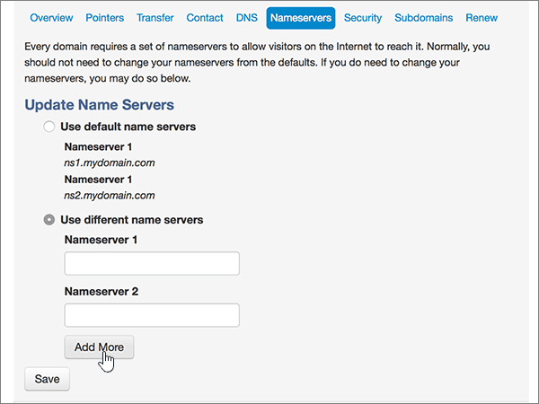
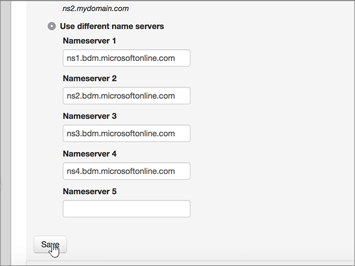

# Alterar os nameservers para configurar o Microsoft com mydomainChange nameservers to set up Microsoft with MyDomain

 Caso não encontre o conteúdo que está procurando, **[verifique as perguntas frequentes sobre domínios](../setup/domains-faq.md)**.**[Check the Domains FAQ](../setup/domains-faq.md)** if you don't find what you're looking for.
  
Siga estas instruções se quiser que a Microsoft gerencie seus registros DNS para você.Follow these instructions if you want Microsoft to manage your DNS records for you. Se preferir, [gerencie todos os registros DNS da Microsoft em mydomain](create-dns-records-at-mydomain.md).(If you prefer, you can [manage all your Microsoft DNS records at MyDomain](create-dns-records-at-mydomain.md).)
  
## Adicionar um registro TXT para verificaçãoAdd a TXT record for verification

Antes de usar seu domínio com a Microsoft, precisamos garantir que você o tenha.Before you use your domain with Microsoft, we have to make sure that you own it. Sua capacidade de fazer logon em sua conta no registrador de domínios e criar o registro DNS comprova para a Microsoft que você é o proprietário do domínio.Your ability to log in to your account at your domain registrar and create the DNS record proves to Microsoft that you own the domain.
  
> [!NOTE]
> Esse registro é usado exclusivamente para confirmar se você é o proprietário do domínio; ele não afeta mais nada. É possível excluí-lo mais tarde, se desejar.This record is used only to verify that you own your domain; it doesn't affect anything else. You can delete it later, if you like. 
  
1. Para começar, vá até a sua página de domínios em MeuDomínio usando [este link](https://www.mydomain.com/controlpanel). Você será solicitado a fazer logon primeiro.To get started, go to your domains page at MyDomain by using [this link](https://www.mydomain.com/controlpanel). You'll be prompted to log in first.
    
2. Na seção **Meus Favoritos**, clique em **Central de domínio**.In the **My Favorites** section, select **Domain Central**.
    
3. Na opção **Domínio**, clique no nome do domínio que quer editar.Under **Domain**, select the name of the domain that you want to edit.
    
4. Na linha **Visão geral**, clique em **DNS**.In the **Overview** row, select **DNS**.
    
5. Na lista suspensa **Modificar**, clique em **Registro TXT/SPF**.From the **Modify** drop-down list, choose **TXT/SPF Record**.
    
6. Em **Content**, na caixa do novo registro, digite ou copie e cole os valores da tabela a seguir.Under **Content**, in the box for the new record, type or copy and paste the value from the following table.
    
||
|:-----|
|**Conteúdo****Content**   |
|MS = ms *XXXXXXXX*MS=ms *XXXXXXXX*    **Observação**: Este é um exemplo.**Note**: This is an example. Use o seu **destino específico ou aponte para** o valor de endereço aqui, a partir da tabela.Use your specific **Destination or Points to Address** value here, from the table. [Como localizo isto?How do I find this?](../get-help-with-domains/information-for-dns-records.md)          |
   
7. Clique em **Adicionar**.Select **Add**.
    
8. Aguarde alguns minutos antes de prosseguir para que o registro que você acabou de criar possa ser atualizado na Internet.Wait a few minutes before you continue, so that the record you just created can update across the Internet.
    
Agora que você adicionou o registro no site do seu registrador de domínio, você voltará para o Microsoft 365 e solicitará que a Microsoft 365 procure o registro.Now that you've added the record at your domain registrar's site, you'll go back to Microsoft 365 and request Microsoft 365 to look for the record.
  
Quando a Microsoft encontrar o registro TXT correto, seu domínio será verificado.When Microsoft finds the correct TXT record, your domain is verified.
  
1. No centro de administração da Microsoft, vá para a página de <a href="https://go.microsoft.com/fwlink/p/?linkid=834818" target="_blank">domínios</a> de **configurações** \> .In the Microsoft admin center, go to the **Settings** \> <a href="https://go.microsoft.com/fwlink/p/?linkid=834818" target="_blank">Domains</a> page.

    
2. Na página **Domínios**, clique no domínio que você está verificando.On the **Domains** page, select the domain that you are verifying. 
    
3. Na página **Configuração**, clique em **Iniciar configuração**.On the **Setup** page, select **Start setup**.
    
4. Na página **Verificar domínio**, clique em **Verificar**.On the **Verify domain** page, select **Verify**.
    
> [!NOTE]
> Typically it takes about 15 minutes for DNS changes to take effect.Typically it takes about 15 minutes for DNS changes to take effect. Mas, às vezes, pode ser necessário mais tempo para atualizar uma alteração feita no sistema DNS da Internet.However, it can occasionally take longer for a change you've made to update across the Internet's DNS system. Se você estiver tendo problemas com o fluxo de emails ou com outros problemas após adicionar registros DNS, consulte [Localizar e corrigir problemas após adicionar seu domínio ou registros DNS](../get-help-with-domains/find-and-fix-issues.md).If you're having trouble with mail flow or other issues after adding DNS records, see [Find and fix issues after adding your domain or DNS records](../get-help-with-domains/find-and-fix-issues.md). 
  
## Alterar os registros de nameserver (NS) de seu domínioChange your domain's nameserver (NS) records

Para concluir a configuração do seu domínio com a Microsoft, altere os registros NS do seu domínio no seu registrador de domínios para apontar para os servidores de nomes primários e secundários da Microsoft.To complete setting up your domain with Microsoft, you change your domain's NS records at your domain registrar to point to the Microsoft primary and secondary name servers. Isso configura a Microsoft para atualizar os registros DNS do domínio para você.This sets up Microsoft to update the domain's DNS records for you. Todos os registros são adicionados para que os seus emails, o Skype for Business Online e os sites públicos funcionem com o seu domínio e você fique com tudo pronto.We'll add all records so that email, Skype for Business Online, and your public website work with your domain, and you'll be all set.
  
> [!CAUTION]
> Quando você alterar os registros NS do seu domínio para apontar para os servidores de nomes da Microsoft, todos os serviços associados atualmente ao seu domínio serão afetados.When you change your domain's NS records to point to the Microsoft name servers, all the services that are currently associated with your domain are affected. Por exemplo, todos os emails enviados para seu domínio (como rob@ *your_domain.*For example, all email sent to your domain (like rob@ *your_domain.* com) começará à Microsoft depois que você fizer essa alteração.com) will start coming to Microsoft after you make this change. 
  
> [!IMPORTANT]
> The following procedure will show you how to delete any other, unwanted nameservers from the list, and also how to add the correct nameservers if they are not already in the list.The following procedure will show you how to delete any other, unwanted nameservers from the list, and also how to add the correct nameservers if they are not already in the list.   When you have completed the steps in this section, the only nameservers that should be listed are these four:When you have completed the steps in this section, the only nameservers that should be listed are these four:
  
1. Para começar, vá até a sua página de domínios em MeuDomínio usando [este link](https://www.mydomain.com/controlpanel). Você será solicitado a fazer logon primeiro.To get started, go to your domains page at MyDomain by using [this link](https://www.mydomain.com/controlpanel). You'll be prompted to log in first.
    
2. Na seção **Meus Favoritos**, clique em **Central de domínio**.In the **My Favorites** section, select **Domain Central**.
    
3. Na opção **Domínio**, clique no nome do domínio que quer editar.Under **Domain**, select the name of the domain that you want to edit.
    
4. Na linha **visão geral** , selecione **nameservers**.In the **Overview** row, select **Nameservers**.
    
    
  
5. Na seção **Update Name Servers**, selecione **Use different name servers**.In the **Update Name Servers** section, select **Use different name servers**.
    
    
  
6. Dependendo se já existem ou não nameservers listados na página exibida agora, continue com um dos dois procedimentos a seguir.Depending on whether or not there are already nameservers listed on the page that is displayed now, continue to one of the two following procedures.
    
### Se os nameservers corretos já ESTIVEREM listadosIf the correct nameservers ARE already listed

- Se os nameservers corretos já estiverem listados, ignore esta etapa.If the correct nameservers are already listed, you can skip this step.
    
    
  
### Se os nameservers corretos NÃO ESTIVEREM listadosIf the correct nameservers are NOT already listed

> [!CAUTION]
> Follow these steps only if you have existing nameservers other than the four correct nameservers.Follow these steps only if you have existing nameservers other than the four correct nameservers. (Ou seja, exclua somente os nameservers atuais que *não* sejam denominados **ns1.bdm.microsoftonline.com**, **ns2.bdm.microsoftonline.com**, **NS3.bdm.microsoftonline.com**ou **NS4.bdm.microsoftonline.com**.)(That is, delete only any current nameservers that are  *not*  named **ns1.bdm.microsoftonline.com**, **ns2.bdm.microsoftonline.com**, **ns3.bdm.microsoftonline.com**, or **ns4.bdm.microsoftonline.com**.) 
  
1. Exclua os nameservers existentes selecionado cada entrada no campo **Nameserver:** e, em seguida, pressione a tecla **Delete** no seu teclado.Delete the existing nameservers by selecting each entry in the **Nameserver:** field, and then pressing the **Delete** key on your keyboard. 
    
    
  
2. Selecione **adicionar mais** duas vezes para adicionar duas novas linhas de nameserver.Select **Add More** twice to add two new Nameserver rows. 
    
    
  
3. Nas caixas dos registros, digite ou copie e cole os valores de nameserver da tabela a seguir.In the boxes for the records, type or copy and paste the nameserver values from the following table.
    
|||
|:-----|:-----|
|**Nameserver 1****Nameserver 1**   |ns1.bdm.microsoftonline.comns1.bdm.microsoftonline.com    |
|**Nameserver 2****Nameserver 2**   |ns2.bdm.microsoftonline.comns2.bdm.microsoftonline.com    |
|**Nameserver 3****Nameserver 3**   |ns3.bdm.microsoftonline.comns3.bdm.microsoftonline.com    |
|**Nameserver 4****Nameserver 4**   |ns4.bdm.microsoftonline.comns4.bdm.microsoftonline.com    |
   
   
  
4. Selecione **Salvar**.Select **Save**.
    
    
  
> [!NOTE]
> As atualizações de registro do servidor de nomes poderão levar várias horas para entrarem em vigor no sistema DNS da Internet.Your nameserver record updates may take up to several hours to update across the Internet's DNS system. Em seguida, seu email da Microsoft e outros serviços serão configurados para funcionar com seu domínio.Then your Microsoft email and other services will be all set to work with your domain. 
