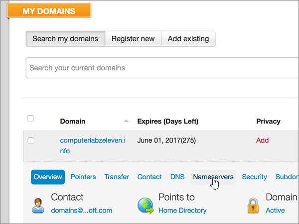

# Alterar os nameservers para configurar o Office 365 com a MyDomainChange nameservers to set up Office 365 with MyDomain

 **Caso não encontre o conteúdo que está procurando, [verifique as perguntas frequentes sobre domínios](../setup/domains-faq.md)**.**[Check the Domains FAQ](../setup/domains-faq.md)** if you don't find what you're looking for.
  
Siga essas instruções se desejar que o Office 365 gerencie os registros DNS do Office 365 para você. Se preferir, [gerencie todos os registros DNS do Office 365 na MyDomain](create-dns-records-at-mydomain.md).Follow these instructions if you want Office 365 to manage your Office 365 DNS records for you. (If you prefer, you can [manage all your Office 365 DNS records at MyDomain](create-dns-records-at-mydomain.md).)
  
## Adicionar um registro TXT para verificaçãoAdd a TXT record for verification

Antes de usar o seu domínio com o Office 365, precisamos verificar se você é o proprietário dele. A capacidade de entrar na conta do seu registrador de domínios e criar o registro DNS prova ao Office 365 que você é o proprietário do domínio.Before you use your domain with Office 365, we have to make sure that you own it. Your ability to log in to your account at your domain registrar and create the DNS record proves to Office 365 that you own the domain.
  
> [!NOTE]
> Esse registro é usado exclusivamente para confirmar se você é o proprietário do domínio; ele não afeta mais nada. É possível excluí-lo mais tarde, se desejar.This record is used only to verify that you own your domain; it doesn't affect anything else. You can delete it later, if you like. 
  
1. Para começar, vá até a sua página de domínios em MeuDomínio usando [este link](https://www.mydomain.com/controlpanel). Você será solicitado a fazer logon primeiro.To get started, go to your domains page at MyDomain by using [this link](https://www.mydomain.com/controlpanel). You'll be prompted to log in first.
    
2. Na seção **meus favoritos** , selecione **domínio central**.In the **My Favorites** section, select **Domain Central**.
    
3. Em **domínio**, selecione o nome do domínio que você deseja editar.Under **Domain**, select the name of the domain that you want to edit.
    
4. Na linha **visão geral** , selecione **DNS**.In the **Overview** row, select **DNS**.
    
5. From the **Modify** drop-down list, choose **TXT/SPF Record**.From the **Modify** drop-down list, choose **TXT/SPF Record**.
    
6. Under **Content**, in the box for the new record, type or copy and paste the value from the following table.Under **Content**, in the box for the new record, type or copy and paste the value from the following table.
    
||
|:-----|
|**Conteúdo****Content**   |
|MS = ms *XXXXXXXX*MS=ms *XXXXXXXX*    **Observação**: Este é um exemplo.**Note**: This is an example. Use aqui o valor específico de **Destino ou Pontos de Endereçamento**, retirado da tabela em Office 365.Use your specific **Destination or Points to Address** value here, from the table in Office 365. [Como faço para encontrar isso?How do I find this?](../get-help-with-domains/information-for-dns-records.md)          |
   
7. Selecione **Adicionar**.Select **Add**.
    
8. Aguarde alguns minutos antes de prosseguir para que o registro que você acabou de criar possa ser atualizado na Internet.Wait a few minutes before you continue, so that the record you just created can update across the Internet.
    
Now that you've added the record at your domain registrar's site, you'll go back to Office 365 and request Office 365 to look for the record.Now that you've added the record at your domain registrar's site, you'll go back to Office 365 and request Office 365 to look for the record.
  
When Office 365 finds the correct TXT record, your domain is verified.When Office 365 finds the correct TXT record, your domain is verified.
  
1. No centro de administração, vá para a página de <a href="https://go.microsoft.com/fwlink/p/?linkid=834818" target="_blank">domínios</a> de **configurações** \> .In the admin center, go to the **Settings** \> <a href="https://go.microsoft.com/fwlink/p/?linkid=834818" target="_blank">Domains</a> page.

    
2. Na página **domínios** , selecione o domínio que você está verificando.On the **Domains** page, select the domain that you are verifying. 
    
3. Na página **configuração** , selecione **Iniciar configuração**.On the **Setup** page, select **Start setup**.
    
4. Na página **verificar domínio** , selecione **verificar**.On the **Verify domain** page, select **Verify**.
    
> [!NOTE]
> Typically it takes about 15 minutes for DNS changes to take effect.Typically it takes about 15 minutes for DNS changes to take effect. However, it can occasionally take longer for a change you've made to update across the Internet's DNS system.However, it can occasionally take longer for a change you've made to update across the Internet's DNS system. Se você estiver tendo problemas com o fluxo de emails ou com outros problemas após adicionar registros DNS, consulte [Localizar e corrigir problemas após adicionar seu domínio ou registros DNS no Office 365](../get-help-with-domains/find-and-fix-issues.md).If you're having trouble with mail flow or other issues after adding DNS records, see [Find and fix issues after adding your domain or DNS records in Office 365](../get-help-with-domains/find-and-fix-issues.md). 
  
## Alterar os registros de nameserver (NS) de seu domínioChange your domain's nameserver (NS) records

Para concluir a configuração do domínio com o Office 365, altere os registros NS do seu domínio no registrador de domínios para apontar para os servidores de nomes primários e secundários do Office 365. Isso configura o Office 365 para atualizar os registros DNS do seu domínio. Todos os registros são adicionados para que os seus emails, o Skype for Business Online e os sites públicos funcionem com o seu domínio e você fique com tudo pronto.To complete setting up your domain with Office 365, you change your domain's NS records at your domain registrar to point to the Office 365 primary and secondary name servers. This sets up Office 365 to update the domain's DNS records for you. We'll add all records so that email, Skype for Business Online, and your public website work with your domain, and you'll be all set.
  
> [!CAUTION]
> Ao alterar os registros NS do domínio para direcionar para os servidores de nome do Office 365, todos os serviços associados atualmente a esse domínio serão afetados.When you change your domain's NS records to point to the Office 365 name servers, all the services that are currently associated with your domain are affected. Por exemplo, todos os emails enviados para seu domínio (como rob@ *your_domain.*For example, all email sent to your domain (like rob@ *your_domain.* com) começará a chegar ao Office 365 depois que você fizer essa alteração.com) will start coming to Office 365 after you make this change. 
  
> [!IMPORTANT]
> The following procedure will show you how to delete any other, unwanted nameservers from the list, and also how to add the correct nameservers if they are not already in the list.The following procedure will show you how to delete any other, unwanted nameservers from the list, and also how to add the correct nameservers if they are not already in the list.   When you have completed the steps in this section, the only nameservers that should be listed are these four:When you have completed the steps in this section, the only nameservers that should be listed are these four:
  
1. Para começar, vá até a sua página de domínios em MeuDomínio usando [este link](https://www.mydomain.com/controlpanel).To get started, go to your domains page at MyDomain by using [this link](https://www.mydomain.com/controlpanel). Você será solicitado a fazer logon primeiro.You'll be prompted to log in first.
    
2. Na seção **meus favoritos** , selecione **domínio central**.In the **My Favorites** section, select **Domain Central**.
    
3. Em **domínio**, selecione o nome do domínio que você deseja editar.Under **Domain**, select the name of the domain that you want to edit.
    
4. Na linha **visão geral** , selecione **nameservers**.In the **Overview** row, select **Nameservers**.
    
    
  
5. Na seção **Update Name Servers**, selecione **Use different name servers**.In the **Update Name Servers** section, select **Use different name servers**.
    
    
  
6. Dependendo se já existem ou não nameservers listados na página exibida agora, continue com um dos dois procedimentos a seguir.Depending on whether or not there are already nameservers listed on the page that is displayed now, continue to one of the two following procedures.
    
### Se os nameservers corretos já ESTIVEREM listadosIf the correct nameservers ARE already listed

- Se os nameservers corretos já estiverem listados, ignore esta etapa.If the correct nameservers are already listed, you can skip this step.
    
    
  
### Se os nameservers corretos NÃO ESTIVEREM listadosIf the correct nameservers are NOT already listed

> [!CAUTION]
> Follow these steps only if you have existing nameservers other than the four correct nameservers.Follow these steps only if you have existing nameservers other than the four correct nameservers. (Ou seja, exclua somente os nameservers atuais que *não* sejam denominados **ns1.bdm.microsoftonline.com**, **ns2.bdm.microsoftonline.com**, **NS3.bdm.microsoftonline.com**ou **NS4.bdm.microsoftonline.com**.)(That is, delete only any current nameservers that are  *not*  named **ns1.bdm.microsoftonline.com**, **ns2.bdm.microsoftonline.com**, **ns3.bdm.microsoftonline.com**, or **ns4.bdm.microsoftonline.com**.) 
  
1. Exclua os nameservers existentes selecionado cada entrada no campo **Nameserver:** e, em seguida, pressione a tecla **Delete** no seu teclado.Delete the existing nameservers by selecting each entry in the **Nameserver:** field, and then pressing the **Delete** key on your keyboard. 
    
    
  
2. Selecione **adicionar mais** duas vezes para adicionar duas novas linhas de nameserver.Select **Add More** twice to add two new Nameserver rows. 
    
    
  
3. Nas caixas dos registros, digite ou copie e cole os valores de nameserver da tabela a seguir.In the boxes for the records, type or copy and paste the nameserver values from the following table.
    
|||
|:-----|:-----|
|**Nameserver 1****Nameserver 1**   |ns1.bdm.microsoftonline.comns1.bdm.microsoftonline.com    |
|**Nameserver 2****Nameserver 2**   |ns2.bdm.microsoftonline.comns2.bdm.microsoftonline.com    |
|**Nameserver 3****Nameserver 3**   |ns3.bdm.microsoftonline.comns3.bdm.microsoftonline.com    |
|**Nameserver 4****Nameserver 4**   |ns4.bdm.microsoftonline.comns4.bdm.microsoftonline.com    |
   
   
  
4. Selecione **Salvar**.Select **Save**.
    
    
  
> [!NOTE]
> As atualizações de registro do servidor de nomes poderão levar várias horas para entrarem em vigor no sistema DNS da Internet. Em seguida, os seus emails e outros serviços do Office 365 serão todos configurados para funcionar com seu domínio.Your nameserver record updates may take up to several hours to update across the Internet's DNS system. Then your Office 365 email and other services will be all set to work with your domain. 
