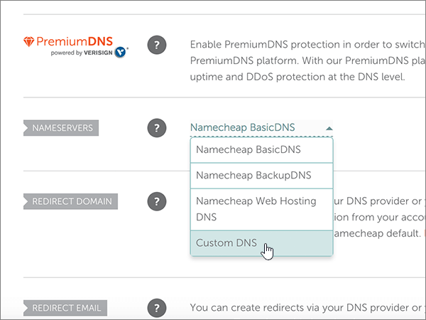

# Alterar os nameservers para configurar o Microsoft com o Namecheap

 Caso não encontre o conteúdo que está procurando, **[verifique as perguntas frequentes sobre domínios](../setup/domains-faq.md)**.
  
Siga estas instruções se quiser que a Microsoft gerencie seus registros DNS para você. Se preferir, [gerencie todos os registros DNS da Microsoft em Namecheap](create-dns-records-at-namecheap.md).
  
    
## Adicionar um registro TXT para verificação

1. Para começar, vá até a sua página de domínios no Namecheap usando [este link](https://www.namecheap.com/myaccount/login.aspx?ReturnUrl=%2f). Você será solicitado a entrar e continuar.
    
    
  
2. Na página de **aterrissagem** , em **conta**, escolha **lista de domínios** na lista suspensa. 
    
    
  
3. Na página **lista de domínios** , localize o nome do domínio que você deseja editar e, em seguida, selecione **gerenciar**.
    
    
  
4. Selecione **DNS avançado**.
    
    
  
5. Na seção **registros de host** , selecione **Adicionar novo registro**.
    
    
  
6. Na lista suspensa **tipo** , selecione **registro txt**.
    
    > [!NOTE]
    > O menu suspenso **tipo** aparece automaticamente quando você seleciona **Adicionar novo registro**.
  
    
  
7. Nas caixas do novo registro, digite ou copie e cole os valores da seguinte tabela.
    
    (Escolha o valor **TTL** na lista suspensa.) 
    
|**Tipo**|**Host**|**Valor**|**TTL**|
|:-----|:-----|:-----|:-----|
|TXT    |@    |MS = ms *XXXXXXXX*    **Observação**: Este é um exemplo. Use o seu **destino específico ou aponte para** o valor de endereço aqui, a partir da tabela.           [Como localizo isto?](../get-help-with-domains/information-for-dns-records.md)          |30 min    |
   
   
  
8. Selecione o controle **salvar alterações** (marca de seleção). 
    
    
  
9. Aguarde alguns minutos antes de prosseguir para que o registro que você acabou de criar possa ser atualizado na Internet.
    
Agora que você adicionou o registro no site do seu registrador de domínio, você voltará para a Microsoft e solicitará uma pesquisa para o registro.
  
Quando a Microsoft encontrar o registro TXT correto, seu domínio será verificado.
  
1. No centro do administrador, acesse a página **Configurações de** \> <a href="https://go.microsoft.com/fwlink/p/?linkid=834818" target="_blank">domínios</a>.

    
2. Na página **Domínios**, clique no domínio que você está verificando. 
    
    
  
3. Na página **Configuração**, clique em **Iniciar configuração**.
    
    
  
4. Na página **Verificar domínio**, marque **Verificar**.
    
    
  
> [!NOTE]
>  Normalmente, são necessários cerca de 15 minutos para que as alterações de DNS entrem em vigor. Mas, às vezes, pode ser necessário mais tempo para atualizar uma alteração feita no sistema DNS da Internet. Se você tiver problemas com o fluxo de emails ou de outro tipo após adicionar os registros DNS, consulte [Solucionar problemas após alterar o nome de domínio ou registros DNS](../get-help-with-domains/find-and-fix-issues.md). 
  
## Alterar os registros de nameserver (NS) de seu domínio

Para concluir a configuração do seu domínio com a Microsoft, altere os registros NS do seu domínio no seu registrador de domínios para apontar para os servidores de nomes primários e secundários da Microsoft. Isso configura a Microsoft para atualizar os registros DNS do domínio para você. Todos os registros são adicionados para que os seus emails, o Skype for Business Online e os sites públicos funcionem com o seu domínio e você fique com tudo pronto.
  
> [!CAUTION]
> Quando você alterar os registros NS do seu domínio para apontar para os servidores de nomes da Microsoft, todos os serviços associados atualmente ao seu domínio serão afetados. Por exemplo, todos os emails enviados para seu domínio (como rob@ *your_domain* . com) começarão a ser iniciados pela Microsoft depois que você fizer essa alteração. 
  
> [!IMPORTANT]
>  Quando você concluir as etapas desta seção, os  *únicos*  nameservers que deverão estar listados são estes quatro: >  ns1.bdm.microsoftonline.com >  ns2.bdm.microsoftonline.com >  ns3.bdm.microsoftonline.com >  ns4.bdm.microsoftonline.com >  O procedimento a seguir mostra como excluir outros nameservers indesejados da lista, além de adicionar os nameservers  *corretos*  se ainda não estiverem na lista. 
  
1. Para começar, vá até a sua página de domínios no Namecheap usando [este link](https://www.namecheap.com/myaccount/login.aspx?ReturnUrl=%2f). Você será solicitado a entrar e continuar.
    
    
  
2. Na página de **aterrissagem** , em **conta**, escolha **lista de domínios** na lista suspensa. 
    
    
  
3. Na página **lista de domínios** , localize o nome do domínio que você deseja editar e, em seguida, selecione **gerenciar**.
    
    
  
4. Selecione **domínio**.
    
    
  
5. Encontre a seção **nameservers** e, em seguida, selecione **personalizado** na lista suspensa **Namecheap padrão** . 
    
    
  
6. Dependendo se já existem ou não nameservers listados na página exibida agora, continue com um dos dois procedimentos a seguir.
    
### Se NÃO houver nameservers listados

1. Selecione **Adicionar nameserver** duas vezes para adicionar duas novas linhas.
    
    
  
2. Nas caixas **nameserver** , digite ou copie e cole os valores da tabela a seguir.
    
|||
|:-----|:-----|
|**Nameserver 1**   |ns1.bdm.microsoftonline.com    |
|**Nameserver 2**   |ns2.bdm.microsoftonline.com    |
|**Nameserver 3**   |ns3.bdm.microsoftonline.com    |
|**Nameserver 4**   |ns4.bdm.microsoftonline.com    |
   
   
  
3. Selecione o controle **salvar** (marca de seleção). 
    
    
  
> [!NOTE]
> Your nameserver record updates may take up to several hours to update across the Internet's DNS system. Em seguida, seu email da Microsoft e outros serviços serão configurados para funcionar com seu domínio. 
  
### Se HOUVER nameservers listados

> [!CAUTION]
> Siga estas etapas  *somente*  se você tiver outros nameservers existentes, além dos quatro nameservers  *corretos*  . Ou seja, exclua  *somente*  nameservers atuais que  *não*  sejam denominados como **ns1.bdm.microsoftonline.com**, **ns2.bdm.microsoftonline.com**, **ns3.bdm.microsoftonline.com** ou **ns4.bdm.microsoftonline.com**. 
  
1. Se houver outros nameservers listados nas caixas **nameserver** , exclua cada um selecionando-o e pressionando a tecla **delete** no teclado. 
    
    
  
2. Selecione **Adicionar nameserver** duas vezes para adicionar duas novas linhas. 
    
    
  
3. Nas caixas **nameserver** , digite ou copie e cole os valores da tabela a seguir.
 
    
|||
|:-----|:-----|
|**Servidor de nomes 1**   |ns1.bdm.microsoftonline.com    |
|**Servidor de nomes 2**   |ns2.bdm.microsoftonline.com    |
|**Nameserver 3**   |ns3.bdm.microsoftonline.com    |
|**Nameserver 4**   |ns4.bdm.microsoftonline.com    |
   
   
  
4. Selecione o controle **salvar** (marca de seleção). 
    
    
  
> [!NOTE]
> Your nameserver record updates may take up to several hours to update across the Internet's DNS system. Em seguida, seu email da Microsoft e outros serviços serão configurados para funcionar com seu domínio.
