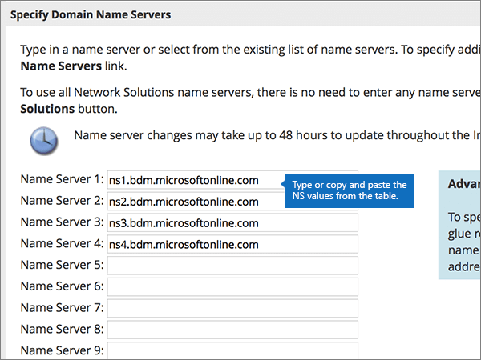

# Alterar os nameservers para configurar o Microsoft com soluções de redeChange nameservers to set up Microsoft with Network Solutions

 Caso não encontre o conteúdo que está procurando, **[verifique as perguntas frequentes sobre domínios](../setup/domains-faq.md)**.**[Check the Domains FAQ](../setup/domains-faq.md)** if you don't find what you're looking for.
  
Siga estas instruções se quiser que a Microsoft gerencie seus registros DNS para você.Follow these instructions if you want Microsoft to manage your DNS records for you. Se preferir, [gerencie todos os seus registros DNS da Microsoft em soluções de rede](create-dns-records-at-network-solutions.md).(If you prefer, you can [manage all your Microsoft DNS records at Network Solutions](create-dns-records-at-network-solutions.md).)
  
    
## Adicionar um registro TXT na Network Solutions para verificar o proprietário do domínioAdd a TXT record at Network Solutions to verify that you own the domain

Antes de usar o seu domínio com a Microsoft, precisamos verificar se você é o proprietário dele. A capacidade de entrar na conta do seu registrador de domínios e criar o registro de DNS prova à Microsoft que você é o proprietário do domínio.Before you use your domain with Microsoft, we have to make sure that you own it. Your ability to log in to your account at your domain registrar and create the DNS record proves to Microsoft that you own the domain.
  
> [!NOTE]
> Esse registro é usado exclusivamente para confirmar se você é o proprietário do domínio; ele não afeta mais nada. É possível excluí-lo mais tarde, se desejar.This record is used only to verify that you own your domain; it doesn't affect anything else. You can delete it later, if you like. 
  
Siga as etapas abaixo ou [assista ao vídeo (inicia em 0:47)](https://support.microsoft.com/office/69b092e3-c026-4d19-a7d0-16cdb2d8b261).Follow the steps below or [watch the video (start at 0:47)](https://support.microsoft.com/office/69b092e3-c026-4d19-a7d0-16cdb2d8b261).
  
1. Para iniciar, vá até a página do seu domínio em Network Solutions, usando [este link](https://www.networksolutions.com/manage-it). Você será solicitado a fazer o logon.To get started, go to your domains page at Network Solutions by using [this link](https://www.networksolutions.com/manage-it). You'll be prompted to log in.
    
    > [!IMPORTANT]
    > Antes de selecionar o botão de **login** , primeiro escolha **gerenciar meus nomes de domínio** na lista suspensa **fazer logon em:** .Before you select the **Login** button, first choose **Manage My Domain Names** in the **Log In to:** drop-down list.
  
    
  
2. Selecione a caixa de seleção ao lado do nome do domínio que você está modificando.Select the check box next to the name of the domain that you are modifying.
    
    
  
3. Selecione **Editar DNS**.Select **Edit DNS**.
    
    
  
4. Selecione **gerenciar registros de DNS avançados**.Select **Manage Advanced DNS Records**.
    
    (You may have to scroll down.)(You may have to scroll down.)
    
    
  
5. Role para baixo até a seção **texto (registros txt)** e selecione **editar registros txt**.Scroll down to the **Text (TXT Records)** section, and then select **Edit TXT Records**.
    
    
  
6. Nas caixas do novo registro, digite ou copie e cole os valores na tabela seguinte.In the boxes for the new record, type or copy and paste the values in the following table.
    
|**Host****Host**|**TTL****TTL**|**Texto****Text**|
|:-----|:-----|:-----|
|@    (The system will change this value to **@ (None)** when you save the record.)(The system will change this value to **@ (None)** when you save the record.)    |36003600    |MS = ms *XXXXXXXX*MS=ms *XXXXXXXX*    **Observação**: Este é um exemplo.**Note**: This is an example. Use seu valor específico de **Destino ou Pontos de Endereçamento** aqui, retirado da tabela no Microsoft 365.Use your specific **Destination or Points to Address** value here, from the table in Microsoft 365.           [Como localizo isto?How do I find this?](../get-help-with-domains/information-for-dns-records.md)
   
    
   
  
7. Selecione **continuar**.Select **Continue**.
    
    
  
8. Selecione **salvar alterações**.Select **Save Changes**.
    
    
  
9. Aguarde alguns minutos antes de prosseguir para que o registro que você acabou de criar possa ser atualizado na Internet.Wait a few minutes before you continue, so that the record you just created can update across the Internet.
    
Agora que você adicionou o registro no site do seu registrador de domínios, retorne ao Microsoft 365 e solicite que o Microsoft 365 procure o registro.Now that you've added the record at your domain registrar's site, you'll go back to Microsoft 365 and request Microsoft 365 to look for the record.
  
Quando a Microsoft encontrar o registro TXT correto, seu domínio estará verificado.When Microsoft finds the correct TXT record, your domain is verified.
  
1. No centro do administrador da Microsoft, acesse a página **Configurações de** \> <a href="https://go.microsoft.com/fwlink/p/?linkid=834818" target="_blank">domínios</a>.In the Microsoft admin center, go to the **Settings** \> <a href="https://go.microsoft.com/fwlink/p/?linkid=834818" target="_blank">Domains</a> page.

    
2. Na página **Domínios**, clique no domínio que você está verificando.On the **Domains** page, select the domain that you are verifying. 
    
    
  
3. Na página **Configuração**, clique em **Iniciar configuração**.On the **Setup** page, select **Start setup**.
    
    
  
4. Na página **Verificar domínio**, marque **Verificar**.On the **Verify domain** page, select **Verify**.
    
    
  
> [!NOTE]
>  Normalmente, são necessários cerca de 15 minutos para que as alterações de DNS entrem em vigor. Mas, às vezes, pode ser necessário mais tempo para atualizar uma alteração feita no sistema DNS da Internet. Se você tiver problemas com o fluxo de emails ou de outro tipo após adicionar os registros DNS, consulte [Solucionar problemas após alterar o nome de domínio ou registros DNS](../get-help-with-domains/find-and-fix-issues.md).Typically it takes about 15 minutes for DNS changes to take effect. However, it can occasionally take longer for a change you've made to update across the Internet's DNS system. If you're having trouble with mail flow or other issues after adding DNS records, see [Troubleshoot issues after changing your domain name or DNS records](../get-help-with-domains/find-and-fix-issues.md). 
  
## Alterar os registros de nameserver (NS) de seu domínioChange your domain's nameserver (NS) records

Para concluir a configuração do seu domínio com a Microsoft, altere os registros NS do seu domínio no seu registrador de domínios para apontar para os servidores de nomes primários e secundários da Microsoft.To complete setting up your domain with Microsoft, you change your domain's NS records at your domain registrar to point to the Microsoft primary and secondary name servers. Isso configura a Microsoft para atualizar os registros DNS do domínio para você.This sets up Microsoft to update the domain's DNS records for you. Todos os registros são adicionados para que os seus emails, o Skype for Business Online e os sites públicos funcionem com o seu domínio e você fique com tudo pronto.We'll add all records so that email, Skype for Business Online, and your public website work with your domain, and you'll be all set.
  
> [!CAUTION]
> Quando você alterar os registros NS do seu domínio para apontar para os servidores de nomes da Microsoft, todos os serviços associados atualmente ao seu domínio serão afetados.When you change your domain's NS records to point to the Microsoft name servers, all the services that are currently associated with your domain are affected. Por exemplo, todos os emails enviados para seu domínio (como rob@ *your_domain* . com) começarão a ser iniciados pela Microsoft depois que você fizer essa alteração.For example, all email sent to your domain (like rob@ *your_domain*  .com) will start coming to Microsoft after you make this change.
  
Pronto para alterar os registros NS para que a Microsoft possa configurar seu domínio?Ready to change your NS records so Microsoft can set up your domain? Siga as etapas abaixo ou [assista ao vídeo (inicia em 2:23)](https://support.microsoft.com/office/69b092e3-c026-4d19-a7d0-16cdb2d8b261).Follow the steps below or [watch the video (start at 2:23)](https://support.microsoft.com/office/69b092e3-c026-4d19-a7d0-16cdb2d8b261).
  
> [!IMPORTANT]
>  Quando você tiver concluído as etapas nesta seção, os *únicos* nameservers que devem ser listados são estes quatro: **ns1.bdm.microsoftonline.com**, **ns2.bdm.microsoftonline.com**, **NS3.bdm.microsoftonline.com**e **NS4.bdm.microsoftonline.com**.When you have completed the steps in this section, the  *only*  nameservers that should be listed are these four: **ns1.bdm.microsoftonline.com**, **ns2.bdm.microsoftonline.com**, **ns3.bdm.microsoftonline.com**, and **ns4.bdm.microsoftonline.com**. O procedimento a seguir mostra como excluir outros nameservers indesejados da lista, além de adicionar os nameservers  *corretos*  se ainda não estiverem na lista.The following procedure will show you how to delete any other, unwanted nameservers from the list, and also how to add the  *correct*  nameservers if they are not already in the list. 
  
1. Para iniciar, vá até a página do seu domínio em Network Solutions, usando [este link](https://www.networksolutions.com/manage-it).To get started, go to your domains page at Network Solutions by using [this link](https://www.networksolutions.com/manage-it). Você será solicitado a fazer o logon.You'll be prompted to log in.
    
    > [!IMPORTANT]
    > Antes de selecionar o botão de **login** , primeiro escolha **gerenciar meus nomes de domínio** na lista suspensa **fazer logon em:** .Before you select the **Login** button, first choose **Manage My Domain Names** in the **Log In to:** drop-down list. 
  
    
  
2. Selecione a caixa de seleção ao lado do nome do domínio que você está modificando.Select the check box next to the name of the domain that you are modifying.
    
    
  
3. Selecione **Editar DNS**.Select **Edit DNS**.
    
    
  
4. Selecione **mover DNS**.Select **Move DNS**.
    
    
  
5. Dependendo se há ou não nameservers já listados na página exibida agora, continue para um destes dois procedimentos:Depending on whether or not there are already nameservers listed on the page that is displayed now, continue to one of the two following procedures:
    
  - Se **NÃO HOUVER** nameservers listados, [Se NÃO houver nameservers listados](#if-there-are-no-nameservers-already-listed).If there are **NO** nameservers already listed, [If there are NO nameservers already listed](#if-there-are-no-nameservers-already-listed).
    
  - Se **HOUVER** nameservers listados, [Se HOUVER nameservers listados](#if-there-are-nameservers-already-listed).If there **ARE** nameservers already listed, [If there ARE nameservers already listed](#if-there-are-nameservers-already-listed).
    
### Se NÃO houver nameservers listadosIf there are NO nameservers already listed

1. Na página **domínios** , na seção **especificar servidores de nomes de domínio** , selecione **adicionar mais servidores de nomes**.On the **Domains** page, in the **Specify Domain Name Servers** section, select **Add More Name Servers**.
    
    
  
2. Na página **Nomes de Domínio**, digite ou copie e cole os valores de nameserver da tabela a seguir.On the **Domain Names** page, type or copy and paste the nameserver values from the following table. 
    
|||
|:-----|:-----|
|**Servidor de nomes 1****Name Server 1**   |ns1.bdm.microsoftonline.comns1.bdm.microsoftonline.com    |
|**Servidor de nomes 2****Name Server 2**   |ns2.bdm.microsoftonline.comns2.bdm.microsoftonline.com    |
|**Servidor de nomes 2****Name Server 2**   |ns3.bdm.microsoftonline.comns3.bdm.microsoftonline.com    |
|**Servidor de nomes 2****Name Server 2**   |ns4.bdm.microsoftonline.comns4.bdm.microsoftonline.com    |
   
    

  
3. Selecione **mover DNS**.Select **Move DNS**.
    
    
  
4. Selecione **salvar alterações**.Select **Save Changes**.
    
    
  
> [!NOTE]
> As atualizações de registro do servidor de nomes poderão levar várias horas para entrarem em vigor no sistema DNS da Internet.Your nameserver record updates may take up to several hours to update across the Internet's DNS system. Em seguida, seu email da Microsoft e outros serviços serão configurados para funcionar com seu domínio.Then your Microsoft email and other services will be all set to work with your domain. 
  
### Se HOUVER nameservers listadosIf there ARE nameservers already listed

> [!CAUTION]
> Siga estas etapas  *somente*  se você tiver outros nameservers existentes, além dos quatro nameservers  *corretos*  . Ou seja, exclua  *somente*  nameservers atuais que  *não*  sejam denominados como **ns1.bdm.microsoftonline.com**, **ns2.bdm.microsoftonline.com**, **ns3.bdm.microsoftonline.com** ou **ns4.bdm.microsoftonline.com**.Follow these steps  *only*  if you have existing nameservers other than the four  *correct*  nameservers. (That is, delete  *only*  any current nameservers that are  *not*  named **ns1.bdm.microsoftonline.com**, **ns2.bdm.microsoftonline.com**, **ns3.bdm.microsoftonline.com**, or **ns4.bdm.microsoftonline.com**.)
  
1. Se houver outros nameservers listados, exclua cada um deles, selecionando-os e pressionando a tecla **Delete** no teclado.If there are any other nameservers listed, delete each one by selecting it and then pressing the **Delete** key on your keyboard.
    
    
  
2. Selecione **adicionar mais servidores de nomes**.Select **Add More Name Servers**.
    
    
  
3. Na página **Nomes de Domínio**, digite ou copie e cole os valores de nameserver da tabela a seguir.On the **Domain Names** page, type or copy and paste the nameserver values from the following table. 
    
|||
|:-----|:-----|
|**Servidor de nomes 1****Name Server 1**   |ns1.bdm.microsoftonline.comns1.bdm.microsoftonline.com    |
|**Servidor de nomes 2****Name Server 2**   |ns2.bdm.microsoftonline.comns2.bdm.microsoftonline.com    |
|**Servidor de Nomes 3****Name Server 3**   |ns3.bdm.microsoftonline.comns3.bdm.microsoftonline.com    |
|**Servidor de Nomes 4****Name Server 4**   |ns4.bdm.microsoftonline.comns4.bdm.microsoftonline.com    |
   
    

  
4. Selecione **mover DNS**.Select **Move DNS**.
    
    
  
5. Selecione **salvar alterações.**Select **Save Changes.**
    
    
  
> [!NOTE]
> As atualizações de registro do servidor de nomes poderão levar várias horas para entrarem em vigor no sistema DNS da Internet.Your nameserver record updates may take up to several hours to update across the Internet's DNS system. Em seguida, seu email da Microsoft e outros serviços serão configurados para funcionar com seu domínio.Then your Microsoft email and other services will be all set to work with your domain.
