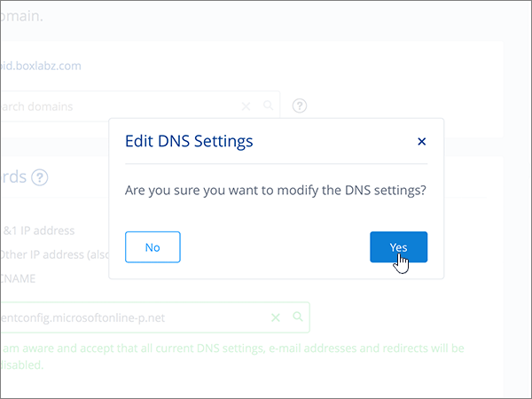
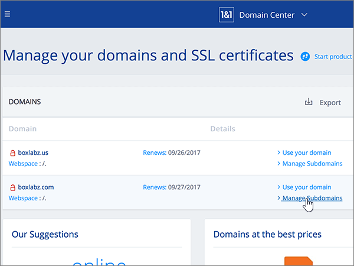
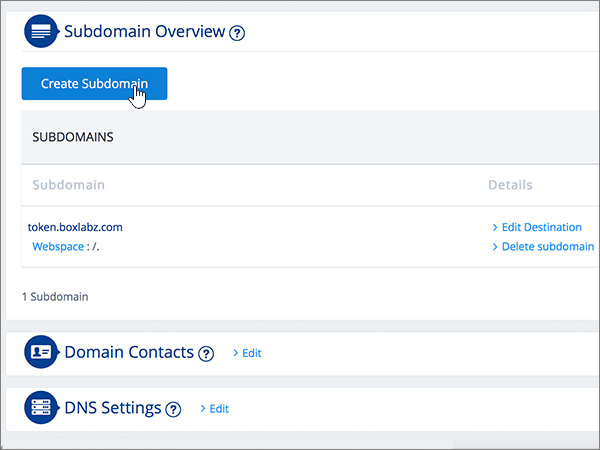
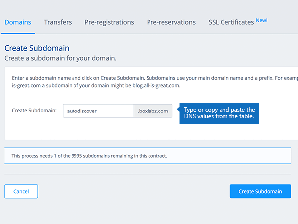
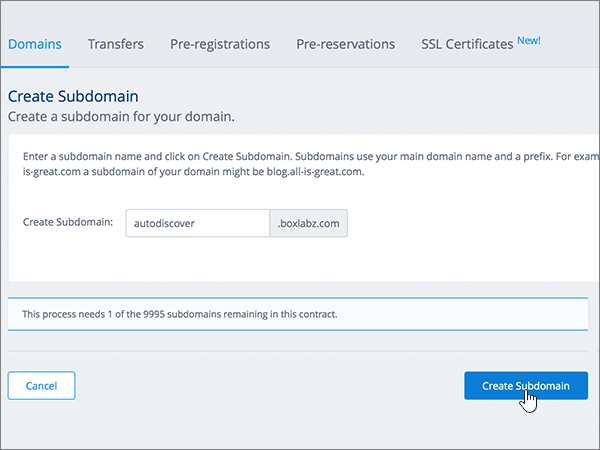
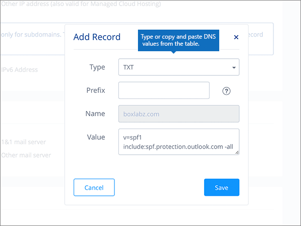

# Criar registros DNS em 1&1 IONOS para o Office 365Create DNS records at 1&1 IONOS for Office 365

 Caso não encontre o conteúdo que está procurando, **[verifique as perguntas frequentes sobre domínios](../setup/domains-faq.md)**.**[Check the Domains FAQ](../setup/domains-faq.md)** if you don't find what you're looking for. 
  
> [!CAUTION]
> Observe que 1&1 do IONOS não permite que um domínio tenha um registro MX e um registro CNAME de descoberta automática de nível superior.Note that 1&1 IONOS doesn't allow a domain to have both an MX record and a top-level Autodiscover CNAME record. Isso limita as formas de configurar o Exchange Online para o Office 365.This limits the ways in which you can configure Exchange Online for Office 365. Há uma solução alternativa, mas recomendamos o seu emprego **somente** se você já tiver experiência com a criação de subdomínios em 1&1 IONOS.There is a workaround, but we recommend employing it **only** if you already have experience with creating subdomains at 1&1 IONOS. > se apesar desta [limitação de serviço](https://support.office.com/article/7ae9a655-041d-4724-aa92-60392ee390c2.aspx) você optar por gerenciar seus próprios registros DNS do Office 365 em 1&1 IONOS, siga as etapas deste artigo para verificar seu domínio e configurar registros DNS para email, Skype for Business Online e assim por diante.> If despite this [service limitation](https://support.office.com/article/7ae9a655-041d-4724-aa92-60392ee390c2.aspx) you choose to manage your own Office 365 DNS records at 1&1 IONOS, follow the steps in this article to verify your domain and to set up DNS records for email, Skype for Business Online, and so on. 
  
Depois que você adicionar esses registros na 1&1 IONOS, o domínio será configurado para funcionar com os serviços do Office 365.After you add these records at 1&1 IONOS, your domain will be set up to work with Office 365 services.
  
Para saber mais sobre hospedagem na Web e DNS para sites com o Office 365, confira [Usar um site público com o Office 365](https://support.office.com/article/choose-a-public-website-3325d50e-d131-403c-a278-7f3296fe33a9).To learn about webhosting and DNS for websites with Office 365, see [Use a public website with Office 365](https://support.office.com/article/choose-a-public-website-3325d50e-d131-403c-a278-7f3296fe33a9).
  
> [!NOTE]
> Typically it takes about 15 minutes for DNS changes to take effect.Typically it takes about 15 minutes for DNS changes to take effect. However, it can occasionally take longer for a change you've made to update across the Internet's DNS system.However, it can occasionally take longer for a change you've made to update across the Internet's DNS system. Se você estiver tendo problemas com o fluxo de emails ou com outros problemas após adicionar registros DNS, consulte [Localizar e corrigir problemas após adicionar seu domínio ou registros DNS no Office 365](../get-help-with-domains/find-and-fix-issues.md).If you're having trouble with mail flow or other issues after adding DNS records, see [Find and fix issues after adding your domain or DNS records in Office 365](../get-help-with-domains/find-and-fix-issues.md). 
  
## Adicionar um registro TXT para verificaçãoAdd a TXT record for verification

Antes de usar o seu domínio com o Office 365, precisamos verificar se você é o proprietário dele. A capacidade de entrar na conta do seu registrador de domínios e criar o registro DNS prova ao Office 365 que você é o proprietário do domínio.Before you use your domain with Office 365, we have to make sure that you own it. Your ability to log in to your account at your domain registrar and create the DNS record proves to Office 365 that you own the domain.
  
> [!NOTE]
> Esse registro é usado exclusivamente para confirmar se você é o proprietário do domínio; ele não afeta mais nada. É possível excluí-lo mais tarde, se desejar.This record is used only to verify that you own your domain; it doesn't affect anything else. You can delete it later, if you like. 
  
Siga as etapas abaixo ou [assista ao vídeo (início em 0:42)](https://support.office.com/article/Video-Create-DNS-records-at-1-1-Internet-for-Office-365-543fb112-ecf5-47ae-b096-07f3f942a089?ui=en-US&amp;rs=en-US&amp;ad=US).Follow the steps below or [watch the video (start at 0:42)](https://support.office.com/article/Video-Create-DNS-records-at-1-1-Internet-for-Office-365-543fb112-ecf5-47ae-b096-07f3f942a089?ui=en-US&amp;rs=en-US&amp;ad=US).
  
1. Para começar, vá até a página de domínios em 1&1 IONOS usando [este link](https://my.1and1.com/).To get started, go to your domains page at 1&1 IONOS by using [this link](https://my.1and1.com/). You'll be prompted to log in.You'll be prompted to log in.
    
2. Selecione **gerenciar domínios**.Select **Manage domains**.
    
3. Na página **centro de domínio** , localize o domínio que você deseja atualizar e, em seguida, selecione o controle de **painel** ( **v**) para esse domínio.On the **Domain Center** page, find the domain that you want to update, and then select the **Panel** ( **v**) control for that domain.
    
4. Na área **configurações de domínio** , selecione **Editar configurações de DNS**.In the **Domain Settings** area, select **Edit DNS Settings**.
    
5. Na seção **registros txt e SRV** , selecione **adicionar registro**.In the **TXT and SRV Records** section, select **Add Record**.
    
6. In the **Add Record** area, in the boxes for the new record, type or copy and paste the values from the following table.In the **Add Record** area, in the boxes for the new record, type or copy and paste the values from the following table. 
    
    (Choose the **Type** value from the drop-down list.)(Choose the **Type** value from the drop-down list.) 
    
    ||||
    |:-----|:-----|:-----|
    |**Tipo****Type**   |**Prefixo****Prefix**   |**Valor do Nome****Name Value**   |
    |TXTTXT    |(Deixe este campo em branco)(Leave this field blank)    |MS = ms *XXXXXXXX*MS=ms *XXXXXXXX*    Observação: Este é um exemplo.NOTE: This is an example. Use aqui o valor específico de **Destino ou Pontos de Endereçamento**, retirado da tabela em Office 365.Use your specific **Destination or Points to Address** value here, from the table in Office 365. [Como faço para encontrar isso?How do I find this?](../get-help-with-domains/information-for-dns-records.md)          |
   
7. Selecione **Salvar**.Select **Save**.
    
8. Selecione **salvar** novamente.Select **Save** again. 
    
9. Na caixa de diálogo **Editar configurações de DNS** , selecione **Sim**.In the **Edit DNS Settings** dialog box, select **Yes**.
    
10. Aguarde alguns minutos antes de prosseguir para que o registro que você acabou de criar possa ser atualizado na Internet.Wait a few minutes before you continue, so that the record you just created can update across the Internet.
    
Now that you've added the record at your domain registrar's site, you'll go back to Office 365 and request Office 365 to look for the record.Now that you've added the record at your domain registrar's site, you'll go back to Office 365 and request Office 365 to look for the record.
  
When Office 365 finds the correct TXT record, your domain is verified.When Office 365 finds the correct TXT record, your domain is verified.
  
1. No centro de administração, vá para a página de <a href="https://go.microsoft.com/fwlink/p/?linkid=834818" target="_blank">domínios</a> de **configurações** \> .In the admin center, go to the **Settings** \> <a href="https://go.microsoft.com/fwlink/p/?linkid=834818" target="_blank">Domains</a> page.

    
2. Na página **domínios** , selecione o domínio que você está verificando.On the **Domains** page, select the domain that you are verifying. 
    
3. Na página **configuração** , selecione **Iniciar configuração**.On the **Setup** page, select **Start setup**.
    
4. Na página **verificar domínio** , selecione **verificar**.On the **Verify domain** page, select **Verify**.
    
> [!NOTE]
> Typically it takes about 15 minutes for DNS changes to take effect.Typically it takes about 15 minutes for DNS changes to take effect. However, it can occasionally take longer for a change you've made to update across the Internet's DNS system.However, it can occasionally take longer for a change you've made to update across the Internet's DNS system. Se você estiver tendo problemas com o fluxo de emails ou com outros problemas após adicionar registros DNS, consulte [Localizar e corrigir problemas após adicionar seu domínio ou registros DNS no Office 365](../get-help-with-domains/find-and-fix-issues.md).If you're having trouble with mail flow or other issues after adding DNS records, see [Find and fix issues after adding your domain or DNS records in Office 365](../get-help-with-domains/find-and-fix-issues.md). 
  
## Adicionar um registro MX para que o email do domínio vá para o Office 365Add an MX record so email for your domain will come to Office 365

Siga as etapas abaixo ou [assista ao vídeo (início em 3:22)](https://support.office.com/article/Video-Create-DNS-records-at-1-1-Internet-for-Office-365-543fb112-ecf5-47ae-b096-07f3f942a089?ui=en-US&amp;rs=en-US&amp;ad=US).Follow the steps below or [watch the video (start at 3:22)](https://support.office.com/article/Video-Create-DNS-records-at-1-1-Internet-for-Office-365-543fb112-ecf5-47ae-b096-07f3f942a089?ui=en-US&amp;rs=en-US&amp;ad=US).
  
> [!NOTE]
> Se você tiver registrado o 1und1.de, [entre aqui](https://go.microsoft.com/fwlink/?linkid=859152).If you've registered with 1und1.de, [sign in here](https://go.microsoft.com/fwlink/?linkid=859152). 
  
1. Para começar, vá até a página de domínios em 1&1 IONOS usando [este link](https://my.1and1.com/).To get started, go to your domains page at 1&1 IONOS by using [this link](https://my.1and1.com/). You'll be prompted to log in.You'll be prompted to log in.
    
2. Selecione **gerenciar domínios**.Select **Manage domains**.
    
3. Na página **centro de domínio** , localize o domínio que você deseja atualizar e, em seguida, selecione o controle de **painel** ( **v**) para esse domínio.On the **Domain Center** page, find the domain that you want to update, and then select the **Panel** ( **v**) control for that domain.
    
4. Na área **configurações de domínio** , selecione **Editar configurações de DNS**.In the **Domain Settings** area, select **Edit DNS Settings**.
    
5. Na seção **Registros MX**, na área \*\* Servidor de Mensagens (Registro MX) \*\*, selecione **Outro servidor de email**.In the **MX Records** section, in the \*\* Mail Exchanger (MX Record) \*\* area, select **Other mail server**. (Pode ser necessário rolar para baixo.)(You may have to scroll down.)   
  
6. Se houver registros MX já listados, exclua-os selecionando o registro e pressionando a tecla **Delete** no teclado.If there are any MX records already listed, delete each of them by selecting the record and then pressing the **Delete** key on your keyboard. (Se não houver nenhum registro MX já listado, continue na próxima etapa.)(If there are no MX records already listed, continue to the next step.)  
  
7. Nas caixas do registro **MX 1**, digite ou copie e cole os valores da tabela a seguir.In the boxes for the **MX 1** record, type or copy and paste the values from the following table. 
    
    |**MX 1****MX 1**|**Prioridade****Priority**|
    |:-----|:-----|
    | *\<chave-do-domínio\>*  .mail.protection.outlook.com*\<domain-key\>*  .mail.protection.outlook.com     Observação: Obtenha sua \<chave\> de domínio de sua conta do Office 365.NOTE: Get your \<domain-key\> from your Office 365 account. [Como faço para encontrar isso?How do I find this?](../get-help-with-domains/information-for-dns-records.md)          |10 10    Para saber mais sobre prioridade, confira [O que é prioridade MX?](https://support.office.com/article/2784cc4d-95be-443d-b5f7-bb5dd867ba83.aspx)For more information about priority, see [What is MX priority?](https://support.office.com/article/2784cc4d-95be-443d-b5f7-bb5dd867ba83.aspx)   | 
    
     
  
8. Selecione **Salvar**.Select **Save**. (You may have to scroll down.)(You may have to scroll down.) 
  
9. Na caixa de diálogo **Editar configurações de DNS** , selecione **Sim**.In the **Edit DNS Settings** dialog box, select **Yes**. 
  
## Adicionar os seis registros CNAME necessários para o Office 365Add the six CNAME records that are required for Office 365

1&1 IONOS requer uma solução alternativa para que você possa usar um registro MX junto com os registros CNAME necessários para os serviços de email do Office 365.1&1 IONOS requires a workaround so that you can use an MX record together with the CNAME records that are required for Office 365 email services. Essa solução alternativa requer que você crie um conjunto de subdomínios em 1&1 IONOS e atribua-os aos registros CNAME.This workaround requires you to create a set of subdomains at 1&1 IONOS, and to assign them to CNAME records.
  
> [!IMPORTANT]
> Verifique se você tem pelo menos dois subdomínios disponíveis antes de iniciar esse procedimento.Make sure that you have at least two available subdomains before starting this procedure. Recomendamos esta solução somente se você já tem experiência com a criação de subdomínios em 1&1 IONOS.We recommend this solution only if you already have experience with creating subdomains at 1&1 IONOS. 
  
### Registros CNAME básicosBasic CNAME records

Siga as etapas abaixo ou [assista ao vídeo (início em 3:57)](https://support.office.com/article/Video-Create-DNS-records-at-1-1-Internet-for-Office-365-543fb112-ecf5-47ae-b096-07f3f942a089?ui=en-US&amp;rs=en-US&amp;ad=US).Follow the steps below or [watch the video (start at 3:57)](https://support.office.com/article/Video-Create-DNS-records-at-1-1-Internet-for-Office-365-543fb112-ecf5-47ae-b096-07f3f942a089?ui=en-US&amp;rs=en-US&amp;ad=US).
  
> [!NOTE]
> Se você tiver registrado o 1und1.de, [entre aqui](https://go.microsoft.com/fwlink/?linkid=859152).If you've registered with 1und1.de, [sign in here](https://go.microsoft.com/fwlink/?linkid=859152). 
  
1. Para começar, vá até a página de domínios em 1&1 IONOS usando [este link](https://my.1and1.com/).To get started, go to your domains page at 1&1 IONOS by using [this link](https://my.1and1.com/). You'll be prompted to log in.You'll be prompted to log in.
    
2. Selecione **gerenciar domínios**.Select **Manage domains**.
    
3. Na página **centro de domínio** , localize o domínio que você deseja atualizar e, em seguida, selecione **gerenciar subdomínios**.On the **Domain Center** page, find the domain that you want to update, and then select **Manage Subdomains**.   Agora, você vai criar dois subdomínios e definir um valor **Alias** para cada um.Now you'll create two subdomains and set an **Alias** value for each. (Isso é necessário porque 1&1 IONOS suporta apenas um registro CNAME de nível superior, mas o Office 365 requer vários registros CNAME.)(This is required because 1&1 IONOS supports only one top-level CNAME record, but Office 365 requires several CNAME records.) Primeiro, você criará o subdomínio Descoberta Automática.First, you'll create the Autodiscover subdomain.
    
4. Na seção **visão geral de subdomínio** , selecione **criar subdomínio**.In the **Subdomain Overview** section, select **Create Subdomain**.
    
    
  
5. Na caixa **Criar Subdomínio** para o novo subdomínio, digite ou copie e cole somente o valor de **Criar Subdomínio** da tabela a seguir. (Você adicionará o valor **Alias** em uma etapa posterior.)In the **Create Subdomain** box for the new subdomain, type or copy and paste only the **Create Subdomain** value from the following table. (You'll add the **Alias** value in a later step.)

    |**Criar subdomínio****Create Subdomain**|**Alias****Alias**|
    |:-----|:-----|
    |descoberta automáticaautodiscover    |autodiscover.outlook.comautodiscover.outlook.com   | 

    
  
6. Selecione **criar subdomínio**.Select **Create Subdomain**. 
  
7. Na seção **visão geral de subdomínio** , localize o subdomínio de **descoberta automática** que você acabou de criar e selecione o controle de **painel (v)** para esse subdomínio.In the **Subdomain Overview** section, locate the **autodiscover** subdomain that you just created, and then select the **Panel (v)** control for that subdomain.  
  
8. Na área **configurações de subdomínio** , selecione **Editar configurações de DNS**.In the **Subdomain Settings** area, select **Edit DNS Settings**.  
  
9. Na seção **registros a/aaaa (endereços IP)** , na área **endereço IP (registro)** , selecione **CNAME**.In the **A/AAAA Records (IP Addresses)** section, in the **IP address (A Record)** area, select **CNAME**. 
  
10. Na caixa **Alias:**, digite o copie e cole somente o valor **Alias** da tabela a seguir.In the **Alias:** box, type or copy and paste only the **Alias** value from the following table.  
    
    |**Criar subdomínio****Create Subdomain**|**Alias****Alias**|
    |:-----|:-----|
    |descoberta automáticaautodiscover    |autodiscover.outlook.comautodiscover.outlook.com   |

    
  
11. Marque a caixa de seleção para a isenção de responsabilidade **Estou ciente**.Select the check box for the **I am aware** disclaimer. 
  
12. Selecione **Salvar**.Select **Save**. 
  
  
### Registros CNAME adicionaisAdditional CNAME records

Os registros CNAME adicionais criados no procedimento a seguir habilitam os serviços do Skype for Business Online. Você usará as mesmas etapas que usou para criar os dois registros CNAME já criados.The additional CNAME records created in the following procedure enable Skype for Business Online services. You will employ the same steps that you used to create the two CNAME records you have already created.
  
1. Crie o terceiro subdomínio (Lyncdiscover).Create the third subdomain (Lyncdiscover). Na seção **visão geral de subdomínio** , selecione **criar subdomínio**.On the **Subdomain Overview** section, select **Create Subdomain**.
    
2. Na caixa **Criar Subdomínio** para o novo subdomínio, digite ou copie e cole somente o valor de **Criar Subdomínio** da tabela a seguir. (Você adicionará o valor **Alias** em uma etapa posterior.)In the **Create Subdomain** box for the new subdomain, type or copy and paste only the **Create Subdomain** value from the following table. (You'll add the **Alias** value in a later step.)  
    
    |**Criar subdomínio****Create Subdomain**|**Alias****Alias**|
    |:-----|:-----|
    |lyncdiscoverlyncdiscover   |webdir.online.lync.comwebdir.online.lync.com  |
   
3. Selecione **criar subdomínio**.Select **Create Subdomain**.
    
4. Na página **centro de domínio** , selecione **gerenciar subdomínios**.On the **Domain Center** page, select **Manage Subdomains**.
    
5. Na seção **visão geral de subdomínio** , encontre o subdomínio **lyncdiscover** que você acabou de criar e selecione o controle de **painel (v)** para esse subdomínio.In the **Subdomain Overview** section, find the **lyncdiscover** subdomain that you just created, and then select the **Panel (v)** control for that subdomain.  Na área **configurações de subdomínio** , selecione **Editar configurações de DNS**.In the **Subdomain Settings** area, select **Edit DNS Settings**.
    
6. In the **A/AAAA Records (IP Addresses)** section, in the \*\* IP address (A Record) \*\* area, select **CNAME**.In the **A/AAAA Records (IP Addresses)** section, in the \*\* IP address (A Record) \*\* area, select **CNAME**.
    
7. Na caixa **Alias:**, digite o copie e cole somente o valor **Alias** da tabela a seguir.In the **Alias:** box, type or copy and paste only the **Alias** value from the following table.  
    
    |**Criar subdomínio****Create Subdomain**|**Alias****Alias**|
    |:-----|:-----|
    |lyncdiscoverlyncdiscover    |webdir.online.lync.comwebdir.online.lync.com    |
   
8. Marque a caixa de seleção para a isenção de responsabilidade estou **ciente** e selecione **salvar**.Select the check box for the **I am aware** disclaimer, and then select **Save**.
    
9. Na caixa de diálogo **Editar configurações de DNS** , selecione **Sim**.In the **Edit DNS Settings** dialog box, select **Yes**.
    
10. Crie o quarto subdomínio (SIP):Create the fourth subdomain (SIP):  Na seção **visão geral de subdomínio** , selecione **criar subdomínio**.In the **Subdomain Overview** section, select **Create Subdomain**.
    
11. Na caixa **Criar Subdomínio** para o novo subdomínio, digite ou copie e cole somente o valor de **Criar Subdomínio** da tabela a seguir. (Você adicionará o valor **Alias** em uma etapa posterior.)In the **Create Subdomain** box for the new subdomain, type or copy and paste only the **Create Subdomain** value from the following table. (You'll add the **Alias** value in a later step.)  
    
    |**Criar subdomínio****Create Subdomain**|**Alias****Alias**|
    |:-----|:-----|
    |sipsip    |sipdir.online.lync.comsipdir.online.lync.com    |
   
12. Selecione **criar subdomínio**.Select **Create Subdomain**.
    
13. Na página **centro de domínio** , selecione **gerenciar subdomínios**.On the **Domain Center** page, select **Manage Subdomains**.
    
14. Na seção **visão geral de subdomínio** , encontre o subdomínio **SIP** que você acabou de criar e selecione o controle de **painel (v)** para esse subdomínio.In the **Subdomain Overview** section, find the **sip** subdomain that you just created, and then select the **Panel (v)** control for that subdomain.  Na área **configurações de subdomínio** , selecione **Editar configurações de DNS**.In the **Subdomain Settings** area, select **Edit DNS Settings**.
    
15. In the **A/AAAA Records (IP Addresses)** section, in the \*\* IP address (A Record) \*\* area, select **CNAME**.In the **A/AAAA Records (IP Addresses)** section, in the \*\* IP address (A Record) \*\* area, select **CNAME**.
    
16. Na caixa **Alias:**, digite o copie e cole somente o valor **Alias** da tabela a seguir.In the **Alias:** box, type or copy and paste only the **Alias** value from the following table. 
    
    |**Criar subdomínio****Create Subdomain**|**Alias****Alias**|
    |:-----|:-----|
    |sipsip    |sipdir.online.lync.comsipdir.online.lync.com    |
   
17. Marque a caixa de seleção para a isenção de responsabilidade estou **ciente** e selecione **salvar**.Select the check box for the **I am aware** disclaimer, and then select **Save**.
    
18. Na caixa de diálogo **Editar configurações de DNS** , selecione **Sim**.In the **Edit DNS Settings** dialog box, select **Yes**.
    
### Registros CNAME necessários para o MDMCNAME records needed for MDM

> [!IMPORTANT]
> Siga o procedimento que você usou para os outros quatro registros CNAME, mas forneça os valores da tabela a seguir.Follow the procedure that you used for the other four CNAME records, but supply the values from the following table. 
  
|**Criar subdomínio****Create Subdomain**|**Alias****Alias**|
|:-----|:-----|
|enterpriseregistrationenterpriseregistration    |enterpriseregistration.windows.netenterpriseregistration.windows.net    |
|enterpriseenrollmententerpriseenrollment    |enterpriseenrollment-s.manage.microsoft.comenterpriseenrollment-s.manage.microsoft.com    |
   
## Adicionar registro TXT à SPF para ajudar a evitar spam de emailAdd a TXT record for SPF to help prevent email spam

> [!IMPORTANT]
> You cannot have more than one TXT record for SPF for a domain.You cannot have more than one TXT record for SPF for a domain. If your domain has more than one SPF record, you'll get email errors, as well as delivery and spam classification issues.If your domain has more than one SPF record, you'll get email errors, as well as delivery and spam classification issues. If you already have an SPF record for your domain, don't create a new one for Office 365.If you already have an SPF record for your domain, don't create a new one for Office 365. Em vez disso, adicione os valores necessários do Office 365 ao registro atual, de modo que você tenha um  *único*  registro SPF que inclua os dois conjuntos de valores.Instead, add the required Office 365 values to the current record so that you have a  *single*  SPF record that includes both sets of values. Precisa de exemplos?Need examples? Confira estes [registros de sistema de nomes de domínio externo para o Office 365](https://support.office.com/article/c0531a6f-9e25-4f2d-ad0e-a70bfef09ac0).Check out these [External Domain Name System records for Office 365](https://support.office.com/article/c0531a6f-9e25-4f2d-ad0e-a70bfef09ac0). Para validar o registro SPF, você pode usar uma destas[ferramentas de validação de SPF](../setup/domains-faq.md).To validate your SPF record, you can use one of these[SPF validation tools](../setup/domains-faq.md). 
  
Siga as etapas abaixo ou [assista ao vídeo (início em 5:09)](https://support.office.com/article/Video-Create-DNS-records-at-1-1-Internet-for-Office-365-543fb112-ecf5-47ae-b096-07f3f942a089?ui=en-US&amp;rs=en-US&amp;ad=US).Follow the steps below or [watch the video (start at 5:09)](https://support.office.com/article/Video-Create-DNS-records-at-1-1-Internet-for-Office-365-543fb112-ecf5-47ae-b096-07f3f942a089?ui=en-US&amp;rs=en-US&amp;ad=US).
  
> [!NOTE]
> Se você tiver registrado o 1und1.de, [entre aqui](https://go.microsoft.com/fwlink/?linkid=859152).If you've registered with 1und1.de, [sign in here](https://go.microsoft.com/fwlink/?linkid=859152). 
  
1. Para começar, vá até a página de domínios em 1&1 IONOS usando [este link](https://my.1and1.com/).To get started, go to your domains page at 1&1 IONOS by using [this link](https://my.1and1.com/). You'll be prompted to log in.You'll be prompted to log in.
    
2. Selecione **gerenciar domínios**.Select **Manage domains**.
    
3. Na página **centro de domínio** , localize o domínio que você deseja atualizar e, em seguida, selecione o controle de **painel** (**v**) para esse domínio.On the **Domain Center** page, find the domain that you want to update, and then select the **Panel** (**v**) control for that domain.
    
4. Na área **configurações de domínio** , selecione **Editar configurações de DNS**.In the **Domain Settings** area, select **Edit DNS Settings**.
    
5. Na seção **registros txt e SRV** , selecione **adicionar registro**.In the **TXT and SRV Records** section, select **Add Record**.  (You may have to scroll down.)(You may have to scroll down.)
    
6. In the **Add Record** area, in the boxes for the new record, type or copy and paste the values from the following table.In the **Add Record** area, in the boxes for the new record, type or copy and paste the values from the following table.  (Choose the **Type** value from the drop-down list.)(Choose the **Type** value from the drop-down list.)  
    
    |**Tipo****Type**|**Prefixo****Prefix**|**Valor do Nome****Name Value**|
    |:-----|:-----|:-----|
    |TXTTXT    |(Leave this field empty.)(Leave this field empty.)    |v=spf1 include:spf.protection.outlook.com -allv=spf1 include:spf.protection.outlook.com -all    **Observação:** É recomendável copiar e colar essa entrada, para que todo o espaçamento permaneça correto.**Note:** We recommend copying and pasting this entry, so that all of the spacing stays correct.           | 
    
    
  
7. Selecione **Salvar**.Select **Save**. 
  
8. Selecione **Salvar**.Select **Save**. 
  
9. Na caixa de diálogo **Editar configurações de DNS** , selecione **Sim**.In the **Edit DNS Settings** dialog box, select **Yes**. 
  
## Adicionar os dois registros SRV necessários para o Office 365Add the two SRV records that are required for Office 365

Siga as etapas abaixo ou [assista ao vídeo (início em 5:51)](https://support.office.com/article/Video-Create-DNS-records-at-1-1-Internet-for-Office-365-543fb112-ecf5-47ae-b096-07f3f942a089?ui=en-US&amp;rs=en-US&amp;ad=US).Follow the steps below or [watch the video (start at 5:51)](https://support.office.com/article/Video-Create-DNS-records-at-1-1-Internet-for-Office-365-543fb112-ecf5-47ae-b096-07f3f942a089?ui=en-US&amp;rs=en-US&amp;ad=US).
  
> [!NOTE]
> Se você tiver registrado o 1und1.de, [entre aqui](https://go.microsoft.com/fwlink/?linkid=859152).If you've registered with 1und1.de, [sign in here](https://go.microsoft.com/fwlink/?linkid=859152). 
  
1. Para começar, vá até a página de domínios em 1&1 IONOS usando [este link](https://my.1and1.com/).To get started, go to your domains page at 1&1 IONOS by using [this link](https://my.1and1.com/). You'll be prompted to log in.You'll be prompted to log in.
    
2. Selecione **gerenciar domínios**.Select **Manage domains**.
    
3. Na página **centro de domínio** , localize o domínio que você deseja atualizar e, em seguida, selecione o controle de **painel** ( **v**) para esse domínio.On the **Domain Center** page, find the domain that you want to update, and then select the **Panel** ( **v**) control for that domain.
    
4. Na área **configurações de domínio** , selecione **Editar configurações de DNS**.In the **Domain Settings** area, select **Edit DNS Settings**.
    
5. Na seção **registros txt e SRV** , selecione **adicionar registro**.In the **TXT and SRV Records** section, select **Add Record**.
    
6. Adicione o primeiro dos dois registros SRV.Add the first of the two SRV records. Na área **Adicionar Registro**, nas caixas do novo registro, digite ou copie e cole os valores da primeira linha da tabela a seguir.In the **Add Record** area, in the boxes for the new record, type or copy and paste the values from the first row in the following table.  (Escolha os valores de **tipo** e **TTL** na lista suspensa.)(Choose the **Type** and **TTL** values from the drop-down list.) 
    
    |**Tipo****Type**|**Serviço****Service**|**Protocolo****Protocol**|**Nome****Name**|**Host****Host**|**Prioridade****Priority**|**Peso****Weight**|**Porta****Port**|**TTL****TTL**|
    |:-----|:-----|:-----|:-----|:-----|:-----|:-----|:-----|:-----|
    |SRVSRV    |sipsip    |tlstls    |(Leave this field empty.)(Leave this field empty.)    |sipdir.online.lync.comsipdir.online.lync.com    |100100    |11    |443443    |3.600 (1 hora)3600 (1 h)    |
    |SRVSRV    |sipfederationtlssipfederationtls    |tcptcp    |(Deixe este campo vazio.)(Leave this field empty.)    |sipfed.online.lync.comsipfed.online.lync.com    |100100    |11    |50615061    |3.600 (1 hora)3600 (1 h)    |  
    
    
  
7. Selecione **Salvar**.Select **Save**.  
  
8. Selecione **Salvar**.Select **Save**.  
  
9. Na caixa de diálogo **Editar configurações de DNS** , selecione **Sim**.In the **Edit DNS Settings** dialog box, select **Yes**.  
  
10. Adicione o outro registro SRV.Add the other SRV record.  Na seção **registros txt e SRV** , selecione **adicionar registro**.In the **TXT and SRV Records** section, select **Add Record**.  Na área **adicionar registro** , crie um registro usando os valores da outra linha da tabela e, em seguida, selecione **Adicionar**, **salvar**e **Sim** novamente para concluir o registro.In the **Add Record** area, create a record using the values from the other row in the table, and then again select **Add**, **Save**, and **Yes** to complete the record. 
    
> [!NOTE]
> Typically it takes about 15 minutes for DNS changes to take effect.Typically it takes about 15 minutes for DNS changes to take effect. However, it can occasionally take longer for a change you've made to update across the Internet's DNS system.However, it can occasionally take longer for a change you've made to update across the Internet's DNS system. Se você estiver tendo problemas com o fluxo de emails ou com outros problemas após adicionar registros DNS, consulte [Localizar e corrigir problemas após adicionar seu domínio ou registros DNS no Office 365](../get-help-with-domains/find-and-fix-issues.md).If you're having trouble with mail flow or other issues after adding DNS records, see [Find and fix issues after adding your domain or DNS records in Office 365](../get-help-with-domains/find-and-fix-issues.md). 
  
