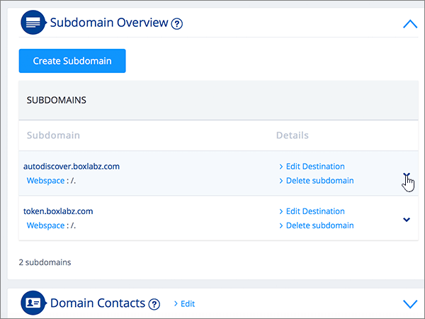
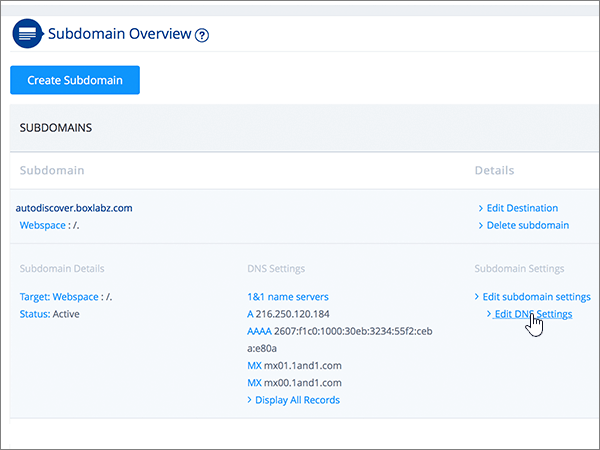
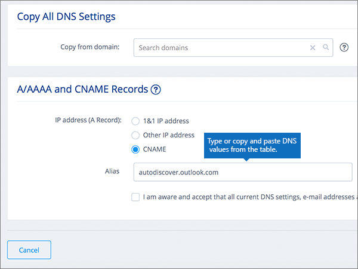
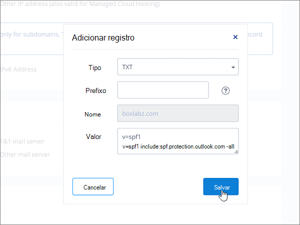
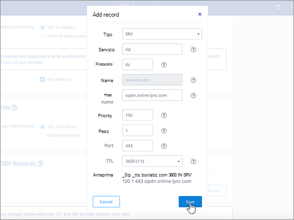

# Criar registros DNS em 1&1 IONOS para a Microsoft

 Caso não encontre o conteúdo que está procurando, **[verifique as perguntas frequentes sobre domínios](../setup/domains-faq.yml)**. 
  
> [!CAUTION]
> Observe que 1&IONOS 1 não permite que um domínio tenha um registro MX e um registro CNAME de descoberta automática de nível superior. Isso limita as maneiras pelas quais você pode configurar o Exchange Online para a Microsoft. Há uma solução alternativa, mas recomendamos empresá-la somente se você já tiver experiência com a criação de subdomas em 1&1 IONOS.  > Se, apesar  dessa limitação de serviço, você optar por gerenciar seus próprios registros DNS da Microsoft em 1&1 IONOS, siga as etapas deste artigo para verificar seu domínio e configurar registros DNS para email, Skype for Business Online e assim por diante. 
  
Depois de adicionar esses registros em 1&1 IONOS, seu domínio será definido para funcionar com os serviços da Microsoft.
  
  
> [!NOTE]
> Typically it takes about 15 minutes for DNS changes to take effect. Mas, às vezes, pode ser necessário mais tempo para atualizar uma alteração feita no sistema DNS da Internet. Se você tiver problemas com o fluxo de e-mails ou de outro tipo após adicionar os registros DNS, consulte [Localizar e corrigir problemas ou registros DNS](../get-help-with-domains/find-and-fix-issues.md). 
  
## Adicionar um registro TXT para verificação

Antes de usar o seu domínio com a Microsoft, precisamos verificar se você é o proprietário dele. A capacidade de entrar na conta do seu registrador de domínios e criar o registro de DNS prova à Microsoft que você é o proprietário do domínio.
  
> [!NOTE]
> Esse registro é usado exclusivamente para confirmar se você é o proprietário do domínio; ele não afeta mais nada. É possível excluí-lo mais tarde, se desejar. 
  
Siga as etapas abaixo ou [assista ao vídeo (início em 0:42)]().
  
1. Para começar, vá para sua página de domínios em 1&1 IONOS usando [este link](https://my.1and1.com/). You'll be prompted to log in.
    
2. Selecione **Gerenciar domínios**.
    
3. Na página **Centro de** Domínio, localize o domínio que você deseja atualizar e selecione o controle **Painel** ( **v**) para esse domínio.
    
4. Na área **Configurações de** Domínio, selecione **Editar Configurações de DNS**.
    
5. Na seção **Registros TXT e SRV,** selecione **Adicionar Registro**.
    
6. In the **Add Record** area, in the boxes for the new record, type or copy and paste the values from the following table. 
    
    (Selecione o valor **Tipo** na lista suspensa.) 
    
    ||||
    |:-----|:-----|:-----|
    |**Tipo**   |**Prefixo**   |**Valor do Nome**   |
    |TXT    |(Deixe este campo em branco)    |MS = ms *XXXXXXXX*    OBSERVAÇÃO: Este é um exemplo. Use aqui seu valor específico de **Destino ou Pontos de Endereçamento**, retirado da tabela. [Como localizo isto?](../get-help-with-domains/information-for-dns-records.md)          |
   
7. Selecione **Salvar**.
    
8. Selecione **Salvar** novamente. 
    
9. Na caixa **de diálogo Editar Configurações** de DNS, selecione **Sim**.
    
10. Aguarde alguns minutos antes de prosseguir para que o registro que você acabou de criar possa ser atualizado na Internet.
    
Agora que você adicionou o registro no site do seu registrador de domínios, retorne ao Microsoft 365 e solicite que o Microsoft 365 procure o registro.
  
Quando a Microsoft encontrar o registro TXT correto, seu domínio estará verificado.
  
1. No centro do administrador da Microsoft, acesse a página **Configurações de** \> <a href="https://go.microsoft.com/fwlink/p/?linkid=834818" target="_blank">domínios</a>.

    
2. Na página **Domínios**, clique no domínio que você está verificando. 
    
3. Na página **Configuração**, clique em **Iniciar configuração**.
    
4. Na página **Verificar domínio**, clique em **Verificar**.
    
> [!NOTE]
> Typically it takes about 15 minutes for DNS changes to take effect. Mas, às vezes, pode ser necessário mais tempo para atualizar uma alteração feita no sistema DNS da Internet. Se você tiver problemas com o fluxo de e-mails ou de outro tipo após adicionar os registros DNS, consulte [Localizar e corrigir problemas ou registros DNS](../get-help-with-domains/find-and-fix-issues.md). 
  
## Adicione um registro MX para que o email do domínio vá para a Microsoft.

Siga as etapas abaixo ou [assista ao vídeo (início em 3:22)]().
  
> [!NOTE]
> Se você se registrou com 1und1.de, [entre aqui](https://go.microsoft.com/fwlink/?linkid=859152). 
  
1. Para começar, vá para sua página de domínios em 1&1 IONOS usando [este link](https://my.1and1.com/). You'll be prompted to log in.
    
2. Selecione **Gerenciar domínios**.
    
3. Na página **Centro de** Domínio, localize o domínio que você deseja atualizar e selecione o controle **Painel** ( **v**) para esse domínio.
    
4. Na área **Configurações de** Domínio, selecione **Editar Configurações de DNS**.
    
5. Na seção **Registros MX,** na área **Mail Exchanger (Registro MX),** selecione **Outro servidor de email**. (Pode ser necessário rolar para baixo.)   
  
6. Se houver registros MX já listados, exclua-os selecionando o registro e pressionando a tecla **Delete** no teclado. (Se não houver nenhum registro MX já listado, continue na próxima etapa.)  
  
7. Nas caixas do registro **MX 1**, digite ou copie e cole os valores da tabela a seguir. 
    
    |**MX 1**|**Prioridade**|
    |:-----|:-----|
    | *\<domain-key\>*  .mail.protection.outlook.com     OBSERVAÇÃO: Receba sua \<domain-key\> conta da Microsoft. [Como faço para encontrar isso?](../get-help-with-domains/information-for-dns-records.md)          |10     Para saber mais sobre prioridade, confira [O que é prioridade MX?](../setup/domains-faq.yml)   | 
    
     
  
8. Selecione **Salvar**. (Pode ser necessário rolar para baixo.) 
  
9. Na caixa **de diálogo Editar Configurações** de DNS, selecione **Sim**. 
  
## Adicionar os seis registros CNAME necessários para a Microsoft

1&IONOS 1 requer uma solução alternativa para que você possa usar um registro MX juntamente com os registros CNAME necessários para os serviços de email da Microsoft. Essa solução alternativa exige que você crie um conjunto de subdomas em 1&1 IONOS e atribua-os aos registros CNAME.
  
> [!IMPORTANT]
> Verifique se você tem pelo menos dois subdomínios disponíveis antes de iniciar esse procedimento. Recomendamos essa solução somente se você já tiver experiência com a criação de subdomas em 1&1 IONOS. 
  
### Registros CNAME básicos

Siga as etapas abaixo ou [assista ao vídeo (início em 3:57)]().
  
> [!NOTE]
> Se você se registrou com 1und1.de, [entre aqui](https://go.microsoft.com/fwlink/?linkid=859152). 
  
1. Para começar, vá para sua página de domínios em 1&1 IONOS usando [este link](https://my.1and1.com/). You'll be prompted to log in.
    
2. Selecione **Gerenciar domínios**.
    
3. Na página **Centro de** Domínio, localize o domínio que você deseja atualizar e selecione **Gerenciar Subdomas**.   Agora, você vai criar dois subdomínios e definir um valor **Alias** para cada um. (Isso é necessário porque 1&1 IONOS suporta apenas um registro CNAME de nível superior, mas a Microsoft requer vários registros CNAME.) Primeiro, você criará o subdomínio Descoberta Automática.
    
4. Na seção **Visão Geral do Subdomínio,** selecione **Criar Subdomínio**.
    
    
  
5. Na caixa **Criar Subdomínio** para o novo subdomínio, digite ou copie e cole somente o valor de **Criar Subdomínio** da tabela a seguir. (Você adicionará o valor **Alias** em uma etapa posterior.)

    |**Criar subdomínio**|**Alias**|
    |:-----|:-----|
    |descoberta automática    |autodiscover.outlook.com   | 

    
  
6. Selecione **Criar Subdomínio**. 
  
7. Na seção **Visão Geral do Subdomínio,** localize o **subdomínio** de descoberta automática que você acabou de criar e selecione o controle Painel **(v)** para esse subdomínio.  
  
8. Na área **Configurações de Subdomínio,** selecione **Editar Configurações DNS**.  
  
9. Na seção **Registros A/AAAA (Endereços IP),** na área **Endereço IP (Registro),** selecione **CNAME**. 
  
10. Na caixa **Alias:**, digite o copie e cole somente o valor **Alias** da tabela a seguir.  
    
    |**Criar subdomínio**|**Alias**|
    |:-----|:-----|
    |descoberta automática    |autodiscover.outlook.com   |

    
  
11. Marque a caixa de seleção para a isenção de responsabilidade **Estou ciente**. 
  
12. Selecione **Salvar**. 
  
  
### Registros CNAME adicionais

Os registros CNAME adicionais criados no procedimento a seguir habilitam os serviços do Skype for Business Online. Você usará as mesmas etapas que usou para criar os dois registros CNAME já criados.
  
1. Crie o terceiro subdomínio (Lyncdiscover). Na seção **Visão Geral do Subdomínio,** selecione **Criar Subdomínio**.
    
2. Na caixa **Criar Subdomínio** para o novo subdomínio, digite ou copie e cole somente o valor de **Criar Subdomínio** da tabela a seguir. (Você adicionará o valor **Alias** em uma etapa posterior.)  
    
    |**Criar subdomínio**|**Alias**|
    |:-----|:-----|
    |lyncdiscover   |webdir.online.lync.com  |
   
3. Selecione **Criar Subdomínio**.
    
4. Na página **Centro de** Domínios, selecione **Gerenciar Subdomas**.
    
5. Na seção **Visão geral do subdomínio,** localmente o subdomínio de descoberta de **lyncdiscover** que você acabou de criar e selecione o controle **Painel (v)** para esse subdomínio.  Na área **Configurações de Subdomínio,** selecione **Editar Configurações DNS**.
    
6. Na seção **Registros A/AAAA (Endereços IP),** na área **Endereço IP (Registro),** selecione **CNAME**.
    
7. Na caixa **Alias:**, digite o copie e cole somente o valor **Alias** da tabela a seguir.  
    
    |**Criar subdomínio**|**Alias**|
    |:-----|:-----|
    |lyncdiscover    |webdir.online.lync.com    |
   
8. Marque a caixa de seleção para **o** aviso de isenção de responsabilidade ciente e selecione **Salvar**.
    
9. Na caixa **de diálogo Editar Configurações** de DNS, selecione **Sim**.
    
10. Crie o quarto subdomínio (SIP):  Na seção **Visão Geral do Subdomínio,** selecione **Criar Subdomínio**.
    
11. Na caixa **Criar Subdomínio** para o novo subdomínio, digite ou copie e cole somente o valor de **Criar Subdomínio** da tabela a seguir. (Você adicionará o valor **Alias** em uma etapa posterior.) 
    
    |**Criar subdomínio**|**Alias**|
    |:-----|:-----|
    |sip    |sipdir.online.lync.com    |
   
12. Selecione **Criar Subdomínio**.
    
13. Na página **Centro de** Domínios, selecione **Gerenciar Subdomas**.
    
14. Na seção **Visão geral do subdomínio,** encontre o subdomínio **sip** que você acabou de criar e selecione o controle **Painel (v)** para esse subdomínio.  Na área **Configurações de Subdomínio,** selecione **Editar Configurações DNS**.
    
15. Na seção **Registros A/AAAA (Endereços IP),** na área **Endereço IP (Registro),** selecione **CNAME**.
    
16. Na caixa **Alias:**, digite o copie e cole somente o valor **Alias** da tabela a seguir. 
    
    |**Criar subdomínio**|**Alias**|
    |:-----|:-----|
    |sip    |sipdir.online.lync.com    |
   
17. Marque a caixa de seleção para **o** aviso de isenção de responsabilidade ciente e selecione **Salvar**.
    
18. Na caixa **de diálogo Editar Configurações** de DNS, selecione **Sim**.
    
### Registros CNAME necessários para o MDM

> [!IMPORTANT]
> Siga o procedimento que você usou para os outros quatro registros CNAME, mas forneça os valores da tabela a seguir. 
  
|**Criar subdomínio**|**Alias**|
|:-----|:-----|
|enterpriseregistration    |enterpriseregistration.windows.net    |
|enterpriseenrollment    |enterpriseenrollment-s.manage.microsoft.com    |
   
## Adicionar registro TXT à SPF para ajudar a evitar spam de email

> [!IMPORTANT]
> Não é possível ter mais de um registro TXT para SPF para um domínio. Se o seu domínio possuir mais de um registro SPF, ocorrerão erros de email, bem como problemas na entrega e na classificação de spam. Se você já possui um registro SPF para seu domínio, não crie um novo para a Microsoft. Em vez disso, adicione os valores necessários da Microsoft ao registro atual para que você tenha um único registro  *SPF*  que inclua ambos os conjuntos de valores. Precisa de exemplos? Confira os [Registros do Sistema de Nomes de Domínios externos para a Microsoft](../../enterprise/external-domain-name-system-records.md). Para validar seu registro SPF, você pode usar uma dessas ferramentas de validação[SPF.](../setup/domains-faq.yml) 
  
Siga as etapas abaixo ou [assista ao vídeo (início em 5:09)]().
  
> [!NOTE]
> Se você se registrou com 1und1.de, [entre aqui](https://go.microsoft.com/fwlink/?linkid=859152). 
  
1. Para começar, vá para sua página de domínios em 1&1 IONOS usando [este link](https://my.1and1.com/). You'll be prompted to log in.
    
2. Selecione **Gerenciar domínios**.
    
3. Na página **Centro de** Domínio, localize o domínio que você deseja atualizar e selecione o controle **Painel** (**v**) para esse domínio.
    
4. Na área **Configurações de** Domínio, selecione **Editar Configurações de DNS**.
    
5. Na seção **Registros TXT e SRV,** selecione **Adicionar Registro**.  (Pode ser necessário rolar para baixo.)
    
6. In the **Add Record** area, in the boxes for the new record, type or copy and paste the values from the following table.  (Selecione o valor **Tipo** na lista suspensa.)  
    
    |**Tipo**|**Prefixo**|**Valor do Nome**|
    |:-----|:-----|:-----|
    |TXT    |(Leave this field empty.)    |v=spf1 include:spf.protection.outlook.com -all    **Observação:** é recomendável copiar e colar essa entrada para que o espaçamento permaneça correto.           | 
    
    
  
7. Selecione **Salvar**. 
  
8. Selecione **Salvar**. 
  
9. Na caixa **de diálogo Editar Configurações** de DNS, selecione **Sim**. 
  
## Adicionar os dois registros SRV necessários para a Microsoft

Siga as etapas abaixo ou [assista ao vídeo (início em 5:51)]().
  
> [!NOTE]
> Se você se registrou com 1und1.de, [entre aqui](https://go.microsoft.com/fwlink/?linkid=859152). 
  
1. Para começar, vá para sua página de domínios em 1&1 IONOS usando [este link](https://my.1and1.com/). You'll be prompted to log in.
    
2. Selecione **Gerenciar domínios**.
    
3. Na página **Centro de** Domínio, localize o domínio que você deseja atualizar e selecione o controle **Painel** ( **v**) para esse domínio.
    
4. Na área **Configurações de** Domínio, selecione **Editar Configurações de DNS**.
    
5. Na seção **Registros TXT e SRV,** selecione **Adicionar Registro**.
    
6. Adicione o primeiro dos dois registros SRV. Na área **Adicionar Registro**, nas caixas do novo registro, digite ou copie e cole os valores da primeira linha da tabela a seguir.  (Escolha os **valores Type** e **TTL** na listada.) 
    
    |**Tipo**|**Serviço**|**Protocolo**|**Nome**|**Host**|**Prioridade**|**Espessura**|**Porta**|**TTL**|
    |:-----|:-----|:-----|:-----|:-----|:-----|:-----|:-----|:-----|
    |SRV    |sip    |tls    |(Deixe este campo vazio.)    |sipdir.online.lync.com    |100    |1    |443    |3.600 (1 hora)    |
    |SRV    |sipfederationtls    |tcp    |(Deixe este campo vazio.)    |sipfed.online.lync.com    |100    |1    |5061    |3.600 (1 hora)    |  
    
    
  
7. Selecione **Salvar**.  
  
8. Selecione **Salvar**.  
  
9. Na caixa **de diálogo Editar Configurações** de DNS, selecione **Sim**.  
  
10. Adicione o outro registro SRV.  Na seção **Registros TXT e SRV,** selecione **Adicionar Registro**.  Na área **Adicionar Registro,** crie um registro usando os valores da outra linha da tabela e selecione Adicionar **,** Salvar **e** **Sim** para concluir o registro. 
    
> [!NOTE]
> Typically it takes about 15 minutes for DNS changes to take effect. Mas, às vezes, pode ser necessário mais tempo para atualizar uma alteração feita no sistema DNS da Internet. Se você tiver problemas com o fluxo de e-mails ou de outro tipo após adicionar os registros DNS, consulte [Localizar e corrigir problemas ou registros DNS](../get-help-with-domains/find-and-fix-issues.md). 
