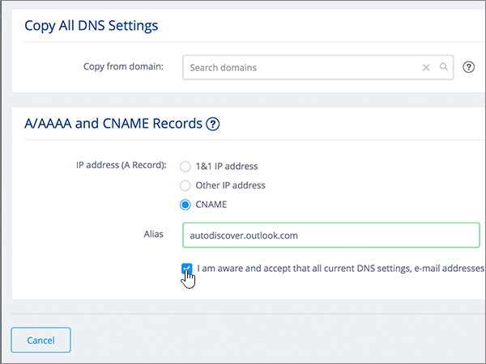

# Criar registros DNS na 1&1 IONOS para Microsoft

 Caso não encontre o conteúdo que está procurando, **[verifique as perguntas frequentes sobre domínios](../setup/domains-faq.md)**. 
  
> [!CAUTION]
> Observe que 1&1 do IONOS não permite que um domínio tenha um registro MX e um registro CNAME de descoberta automática de nível superior. Isso limita as maneiras nas quais você pode configurar o Exchange Online para a Microsoft. Há uma solução alternativa, mas recomendamos o seu emprego **somente** se você já tiver experiência com a criação de subdomínios em 1&1 IONOS. > se apesar desta [limitação de serviço](https://docs.microsoft.com/microsoft-365/admin/setup/domains-faq) você optar por gerenciar seus próprios registros DNS da Microsoft em 1&1 IONOS, siga as etapas deste artigo para verificar seu domínio e configurar registros DNS para email, Skype for Business Online e assim por diante. 
  
Depois que você adicionar esses registros na 1&1 IONOS, o domínio será configurado para funcionar com os serviços da Microsoft.
  
  
> [!NOTE]
> Typically it takes about 15 minutes for DNS changes to take effect. Mas, às vezes, pode ser necessário mais tempo para atualizar uma alteração feita no sistema DNS da Internet. Se você tiver problemas com o fluxo de e-mails ou de outro tipo após adicionar os registros DNS, consulte [Localizar e corrigir problemas ou registros DNS](../get-help-with-domains/find-and-fix-issues.md). 
  
## Adicionar um registro TXT para verificação

Antes de usar o seu domínio com a Microsoft, precisamos verificar se você é o proprietário dele. A capacidade de entrar na conta do seu registrador de domínios e criar o registro de DNS prova à Microsoft que você é o proprietário do domínio.
  
> [!NOTE]
> Esse registro é usado exclusivamente para confirmar se você é o proprietário do domínio; ele não afeta mais nada. É possível excluí-lo mais tarde, se desejar. 
  
Siga as etapas abaixo ou [assista ao vídeo (início em 0:42)](https://docs.microsoft.com/microsoft-365/admin/dns/create-dns-records-at-1-1-internet).
  
1. Para começar, vá até a página de domínios em 1&1 IONOS usando [este link](https://my.1and1.com/). You'll be prompted to log in.
    
2. Selecione **gerenciar domínios**.
    
3. Na página **centro de domínio** , localize o domínio que você deseja atualizar e, em seguida, selecione o controle de **painel** ( **v**) para esse domínio.
    
4. Na área **configurações de domínio** , selecione **Editar configurações de DNS**.
    
5. Na seção **registros txt e SRV** , selecione **adicionar registro**.
    
6. In the **Add Record** area, in the boxes for the new record, type or copy and paste the values from the following table. 
    
    (Selecione o valor **Tipo** na lista suspensa.) 
    
    ||||
    |:-----|:-----|:-----|
    |**Tipo**   |**Prefixo**   |**Valor do Nome**   |
    |TXT    |(Deixe este campo em branco)    |MS=ms *XXXXXXXX*    Observação: Este é um exemplo. Use aqui seu valor específico de **Destino ou Pontos de Endereçamento**, retirado da tabela. [Como localizo isto?](../get-help-with-domains/information-for-dns-records.md)          |
   
7. Selecione **Salvar**.
    
8. Selecione **salvar** novamente. 
    
9. Na caixa de diálogo **Editar configurações de DNS** , selecione **Sim**.
    
10. Aguarde alguns minutos antes de prosseguir para que o registro que você acabou de criar possa ser atualizado na Internet.
    
Agora que você adicionou o registro no site do seu registrador de domínios, retorne ao Microsoft 365 e solicite que o Microsoft 365 procure o registro.
  
Quando a Microsoft encontrar o registro TXT correto, seu domínio estará verificado.
  
1. No centro do administrador da Microsoft, acesse a página **Configurações de** \> <a href="https://go.microsoft.com/fwlink/p/?linkid=834818" target="_blank">domínios</a>.

    
2. Na página **Domínios**, clique no domínio que você está verificando. 
    
3. Na página **Configuração**, clique em **Iniciar configuração**.
    
4. Na página **Verificar domínio**, clique em **Verificar**.
    
> [!NOTE]
> Typically it takes about 15 minutes for DNS changes to take effect. Mas, às vezes, pode ser necessário mais tempo para atualizar uma alteração feita no sistema DNS da Internet. Se você tiver problemas com o fluxo de e-mails ou de outro tipo após adicionar os registros DNS, consulte [Localizar e corrigir problemas ou registros DNS](../get-help-with-domains/find-and-fix-issues.md). 
  
## Adicione um registro MX para que o email do domínio vá para a Microsoft.

Siga as etapas abaixo ou [assista ao vídeo (início em 3:22)](https://docs.microsoft.com/microsoft-365/admin/dns/create-dns-records-at-1-1-internet).
  
> [!NOTE]
> Se você tiver registrado o 1und1.de, [entre aqui](https://go.microsoft.com/fwlink/?linkid=859152). 
  
1. Para começar, vá até a página de domínios em 1&1 IONOS usando [este link](https://my.1and1.com/). You'll be prompted to log in.
    
2. Selecione **gerenciar domínios**.
    
3. Na página **centro de domínio** , localize o domínio que você deseja atualizar e, em seguida, selecione o controle de **painel** ( **v**) para esse domínio.
    
4. Na área **configurações de domínio** , selecione **Editar configurações de DNS**.
    
5. Na seção **registros MX** , na área **trocador de mensagens (registro MX)** , selecione **outro servidor de email**. (Pode ser necessário rolar para baixo.)   
  
6. Se houver registros MX já listados, exclua-os selecionando o registro e pressionando a tecla **Delete** no teclado. (Se não houver nenhum registro MX já listado, continue na próxima etapa.)  
  
7. Nas caixas do registro **MX 1**, digite ou copie e cole os valores da tabela a seguir. 
    
    |**MX 1**|**Prioridade**|
    |:-----|:-----|
    | *\<domain-key\>*  .mail.protection.outlook.com     Observação: acesse sua \<domain-key\> conta da Microsoft. [Como faço para encontrar isso?](../get-help-with-domains/information-for-dns-records.md)          |10     Para saber mais sobre prioridade, confira [O que é prioridade MX?](https://docs.microsoft.com/microsoft-365/admin/setup/domains-faq)   | 
    
     
  
8. Selecione **Salvar**. (Pode ser necessário rolar para baixo.) 
  
9. Na caixa de diálogo **Editar configurações de DNS** , selecione **Sim**. 
  
## Adicionar os seis registros CNAME necessários para o Microsoft

1&1 IONOS requer uma solução alternativa para que você possa usar um registro MX junto com os registros CNAME necessários para os serviços de email da Microsoft. Essa solução alternativa requer que você crie um conjunto de subdomínios em 1&1 IONOS e atribua-os aos registros CNAME.
  
> [!IMPORTANT]
> Verifique se você tem pelo menos dois subdomínios disponíveis antes de iniciar esse procedimento. Recomendamos esta solução somente se você já tem experiência com a criação de subdomínios em 1&1 IONOS. 
  
### Registros CNAME básicos

Siga as etapas abaixo ou [assista ao vídeo (início em 3:57)](https://docs.microsoft.com/microsoft-365/admin/dns/create-dns-records-at-1-1-internet).
  
> [!NOTE]
> Se você tiver registrado o 1und1.de, [entre aqui](https://go.microsoft.com/fwlink/?linkid=859152). 
  
1. Para começar, vá até a página de domínios em 1&1 IONOS usando [este link](https://my.1and1.com/). You'll be prompted to log in.
    
2. Selecione **gerenciar domínios**.
    
3. Na página **centro de domínio** , localize o domínio que você deseja atualizar e, em seguida, selecione **gerenciar subdomínios**.   Agora, você vai criar dois subdomínios e definir um valor **Alias** para cada um. (Isso é necessário porque 1&1 IONOS suporta apenas um registro CNAME de nível superior, mas a Microsoft requer vários registros CNAME.) Primeiro, você criará o subdomínio Descoberta Automática.
    
4. Na seção **visão geral de subdomínio** , selecione **criar subdomínio**.
    
    
  
5. Na caixa **Criar Subdomínio** para o novo subdomínio, digite ou copie e cole somente o valor de **Criar Subdomínio** da tabela a seguir. (Você adicionará o valor **Alias** em uma etapa posterior.)

    |**Criar subdomínio**|**Alias**|
    |:-----|:-----|
    |autodiscover    |autodiscover.outlook.com   | 

    
  
6. Selecione **criar subdomínio**. 
  
7. Na seção **visão geral de subdomínio** , localize o subdomínio de **descoberta automática** que você acabou de criar e selecione o controle de **painel (v)** para esse subdomínio.  
  
8. Na área **configurações de subdomínio** , selecione **Editar configurações de DNS**.  
  
9. Na seção **registros a/aaaa (endereços IP)** , na área **endereço IP (registro)** , selecione **CNAME**. 
  
10. Na caixa **Alias:**, digite o copie e cole somente o valor **Alias** da tabela a seguir.  
    
    |**Criar subdomínio**|**Alias**|
    |:-----|:-----|
    |autodiscover    |autodiscover.outlook.com   |

    
  
11. Marque a caixa de seleção para a isenção de responsabilidade **Estou ciente**. 
  
12. Selecione **Salvar**. 
  
  
### Registros CNAME adicionais

Os registros CNAME adicionais criados no procedimento a seguir habilitam os serviços do Skype for Business Online. Você usará as mesmas etapas que usou para criar os dois registros CNAME já criados.
  
1. Crie o terceiro subdomínio (Lyncdiscover). Na seção **visão geral de subdomínio** , selecione **criar subdomínio**.
    
2. Na caixa **Criar Subdomínio** para o novo subdomínio, digite ou copie e cole somente o valor de **Criar Subdomínio** da tabela a seguir. (Você adicionará o valor **Alias** em uma etapa posterior.)  
    
    |**Criar subdomínio**|**Alias**|
    |:-----|:-----|
    |lyncdiscover   |webdir.online.lync.com  |
   
3. Selecione **criar subdomínio**.
    
4. Na página **centro de domínio** , selecione **gerenciar subdomínios**.
    
5. Na seção **visão geral de subdomínio** , encontre o subdomínio **lyncdiscover** que você acabou de criar e selecione o controle de **painel (v)** para esse subdomínio.  Na área **configurações de subdomínio** , selecione **Editar configurações de DNS**.
    
6. Na seção **registros a/aaaa (endereços IP)** , na área **endereço IP (registro)** , selecione **CNAME**.
    
7. Na caixa **Alias:**, digite o copie e cole somente o valor **Alias** da tabela a seguir.  
    
    |**Criar subdomínio**|**Alias**|
    |:-----|:-----|
    |lyncdiscover    |webdir.online.lync.com    |
   
8. Marque a caixa de seleção para a isenção de responsabilidade estou **ciente** e selecione **salvar**.
    
9. Na caixa de diálogo **Editar configurações de DNS** , selecione **Sim**.
    
10. Crie o quarto subdomínio (SIP):  Na seção **visão geral de subdomínio** , selecione **criar subdomínio**.
    
11. Na caixa **Criar Subdomínio** para o novo subdomínio, digite ou copie e cole somente o valor de **Criar Subdomínio** da tabela a seguir. (Você adicionará o valor **Alias** em uma etapa posterior.) 
    
    |**Criar subdomínio**|**Alias**|
    |:-----|:-----|
    |sip    |sipdir.online.lync.com    |
   
12. Selecione **criar subdomínio**.
    
13. Na página **centro de domínio** , selecione **gerenciar subdomínios**.
    
14. Na seção **visão geral de subdomínio** , encontre o subdomínio **SIP** que você acabou de criar e selecione o controle de **painel (v)** para esse subdomínio.  Na área **configurações de subdomínio** , selecione **Editar configurações de DNS**.
    
15. Na seção **registros a/aaaa (endereços IP)** , na área **endereço IP (registro)** , selecione **CNAME**.
    
16. Na caixa **Alias:**, digite o copie e cole somente o valor **Alias** da tabela a seguir. 
    
    |**Criar subdomínio**|**Alias**|
    |:-----|:-----|
    |sip    |sipdir.online.lync.com    |
   
17. Marque a caixa de seleção para a isenção de responsabilidade estou **ciente** e selecione **salvar**.
    
18. Na caixa de diálogo **Editar configurações de DNS** , selecione **Sim**.
    
### Registros CNAME necessários para o MDM

> [!IMPORTANT]
> Siga o procedimento que você usou para os outros quatro registros CNAME, mas forneça os valores da tabela a seguir. 
  
|**Criar subdomínio**|**Alias**|
|:-----|:-----|
|enterpriseregistration    |enterpriseregistration.windows.net    |
|enterpriseenrollment    |enterpriseenrollment-s.manage.microsoft.com    |
   
## Adicionar registro TXT à SPF para ajudar a evitar spam de email

> [!IMPORTANT]
> Não é possível ter mais de um registro TXT para SPF para um domínio. Se o seu domínio possuir mais de um registro SPF, ocorrerão erros de email, bem como problemas na entrega e na classificação de spam. Se você já possui um registro SPF para seu domínio, não crie um novo para a Microsoft. Em vez disso, adicione os valores necessários da Microsoft ao registro atual para que você tenha um  *único*  registro SPF que inclua os dois conjuntos de valores. Precisa de exemplos? Confira os [Registros do Sistema de Nomes de Domínios externos para a Microsoft](https://docs.microsoft.com/microsoft-365/enterprise/external-domain-name-system-records). Para validar o registro SPF, você pode usar uma destas[ferramentas de validação de SPF](../setup/domains-faq.md). 
  
Siga as etapas abaixo ou [assista ao vídeo (início em 5:09)](https://docs.microsoft.com/microsoft-365/admin/dns/create-dns-records-at-1-1-internet).
  
> [!NOTE]
> Se você tiver registrado o 1und1.de, [entre aqui](https://go.microsoft.com/fwlink/?linkid=859152). 
  
1. Para começar, vá até a página de domínios em 1&1 IONOS usando [este link](https://my.1and1.com/). You'll be prompted to log in.
    
2. Selecione **gerenciar domínios**.
    
3. Na página **centro de domínio** , localize o domínio que você deseja atualizar e, em seguida, selecione o controle de **painel** (**v**) para esse domínio.
    
4. Na área **configurações de domínio** , selecione **Editar configurações de DNS**.
    
5. Na seção **registros txt e SRV** , selecione **adicionar registro**.  (Pode ser necessário rolar para baixo.)
    
6. In the **Add Record** area, in the boxes for the new record, type or copy and paste the values from the following table.  (Selecione o valor **Tipo** na lista suspensa.)  
    
    |**Tipo**|**Prefixo**|**Valor do Nome**|
    |:-----|:-----|:-----|
    |TXT    |(Leave this field empty.)    |v=spf1 include:spf.protection.outlook.com -all    **Observação:** é recomendável copiar e colar essa entrada para que o espaçamento permaneça correto.           | 
    
    
  
7. Selecione **Salvar**. 
  
8. Selecione **Salvar**. 
  
9. Na caixa de diálogo **Editar configurações de DNS** , selecione **Sim**. 
  
## Adicionar os dois registros SRV necessários para a Microsoft

Siga as etapas abaixo ou [assista ao vídeo (início em 5:51)](https://docs.microsoft.com/microsoft-365/admin/dns/create-dns-records-at-1-1-internet).
  
> [!NOTE]
> Se você tiver registrado o 1und1.de, [entre aqui](https://go.microsoft.com/fwlink/?linkid=859152). 
  
1. Para começar, vá até a página de domínios em 1&1 IONOS usando [este link](https://my.1and1.com/). You'll be prompted to log in.
    
2. Selecione **gerenciar domínios**.
    
3. Na página **centro de domínio** , localize o domínio que você deseja atualizar e, em seguida, selecione o controle de **painel** ( **v**) para esse domínio.
    
4. Na área **configurações de domínio** , selecione **Editar configurações de DNS**.
    
5. Na seção **registros txt e SRV** , selecione **adicionar registro**.
    
6. Adicione o primeiro dos dois registros SRV. Na área **Adicionar Registro**, nas caixas do novo registro, digite ou copie e cole os valores da primeira linha da tabela a seguir.  (Escolha os valores de **tipo** e **TTL** na lista suspensa.) 
    
    |**Tipo**|**Serviço**|**Protocolo**|**Nome**|**Host**|**Prioridade**|**Espessura**|**Porta**|**TTL**|
    |:-----|:-----|:-----|:-----|:-----|:-----|:-----|:-----|:-----|
    |SRV    |sip    |tls    |(Deixe este campo vazio.)    |sipdir.online.lync.com    |100    |1     |443    |3.600 (1 hora)    |
    |SRV    |sipfederationtls    |tcp    |(Deixe este campo vazio.)    |sipfed.online.lync.com    |100    |1     |5061    |3.600 (1 hora)    |  
    
    
  
7. Selecione **Salvar**.  
  
8. Selecione **Salvar**.  
  
9. Na caixa de diálogo **Editar configurações de DNS** , selecione **Sim**.  
  
10. Adicione o outro registro SRV.  Na seção **registros txt e SRV** , selecione **adicionar registro**.  Na área **adicionar registro** , crie um registro usando os valores da outra linha da tabela e, em seguida, selecione **Adicionar**, **salvar**e **Sim** novamente para concluir o registro. 
    
> [!NOTE]
> Typically it takes about 15 minutes for DNS changes to take effect. Mas, às vezes, pode ser necessário mais tempo para atualizar uma alteração feita no sistema DNS da Internet. Se você tiver problemas com o fluxo de e-mails ou de outro tipo após adicionar os registros DNS, consulte [Localizar e corrigir problemas ou registros DNS](../get-help-with-domains/find-and-fix-issues.md). 
  
