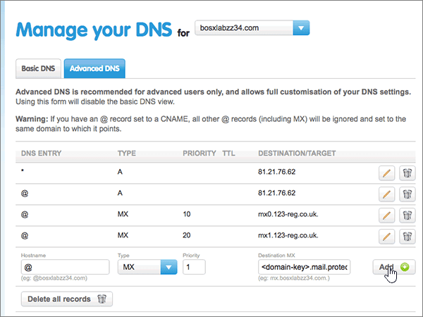
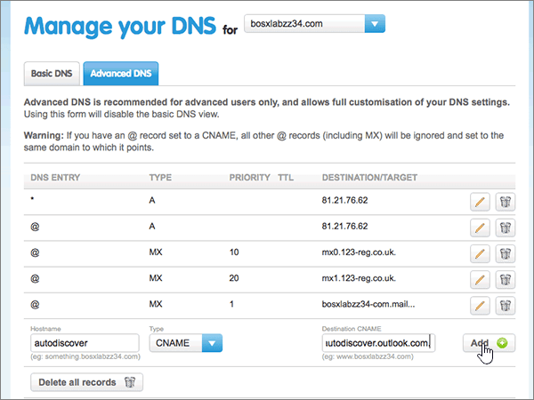
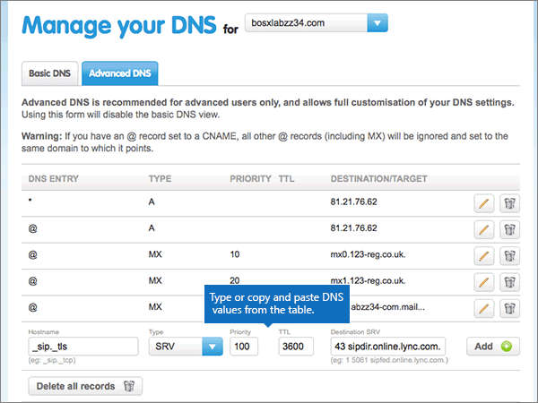

# Criar registros DNS no site 123-reg.co.uk para Office 365Create DNS records at 123-reg.co.uk for Office 365

 **Caso não encontre o conteúdo que está procurando, [verifique as perguntas frequentes sobre domínios](../setup/domains-faq.md)**.**[Check the Domains FAQ](../setup/domains-faq.md)** if you don't find what you're looking for. 
  
Se você usa a 123-reg.co.uk como provedor de hospedagem DNS, siga as etapas deste artigo para verificar o domínio e configurar registros DNS para o Skype for Business Online, email e outros serviços.If 123-reg.co.uk is your DNS hosting provider, follow the steps in this article to verify your domain and set up DNS records for email, Skype for Business Online, and so on.
  
Depois que você adicionar esses registros na 123-reg.co.uk, o domínio será configurado para funcionar com os serviços do Office 365.After you add these records at 123-reg.co.uk, your domain will be set up to work with Office 365 services.
  
Para saber mais sobre hospedagem na Web e DNS para sites com o Office 365, confira [Usar um site público com o Office 365](https://support.office.com/article/choose-a-public-website-3325d50e-d131-403c-a278-7f3296fe33a9).To learn about webhosting and DNS for websites with Office 365, see [Use a public website with Office 365](https://support.office.com/article/choose-a-public-website-3325d50e-d131-403c-a278-7f3296fe33a9).
  
> [!NOTE]
> Typically it takes about 15 minutes for DNS changes to take effect.Typically it takes about 15 minutes for DNS changes to take effect. However, it can occasionally take longer for a change you've made to update across the Internet's DNS system.However, it can occasionally take longer for a change you've made to update across the Internet's DNS system. Se você estiver tendo problemas com o fluxo de emails ou com outros problemas após adicionar registros DNS, consulte [Localizar e corrigir problemas após adicionar seu domínio ou registros DNS no Office 365](../get-help-with-domains/find-and-fix-issues.md).If you're having trouble with mail flow or other issues after adding DNS records, see [Find and fix issues after adding your domain or DNS records in Office 365](../get-help-with-domains/find-and-fix-issues.md). 
  
## Adicionar um registro TXT para verificaçãoAdd a TXT record for verification

Antes de usar o seu domínio com o Office 365, precisamos verificar se você é o proprietário dele. A capacidade de entrar na conta do seu registrador de domínios e criar o registro DNS prova ao Office 365 que você é o proprietário do domínio.Before you use your domain with Office 365, we have to make sure that you own it. Your ability to log in to your account at your domain registrar and create the DNS record proves to Office 365 that you own the domain.
  
> [!NOTE]
> Esse registro é usado exclusivamente para confirmar se você é o proprietário do domínio; ele não afeta mais nada. É possível excluí-lo mais tarde, se desejar.This record is used only to verify that you own your domain; it doesn't affect anything else. You can delete it later, if you like. 
  
1. Para começar, vá para sua página de domínios em 123-reg.co.uk usando [este link](https://www.123-reg.co.uk/secure/cpanel/domain/overview).To get started, go to your domains page at 123-reg.co.uk by using [this link](https://www.123-reg.co.uk/secure/cpanel/domain/overview). Será solicitado que você faça logon primeiro.You'll be prompted to log in first.
    
2. On the **Domain name overview** page, select the name of the domain that you want to edit.On the **Domain name overview** page, select the name of the domain that you want to edit. 
    
3. Choose **DNS** from the **Select action** drop-down list.Choose **DNS** from the **Select action** drop-down list. 
    
4. Na página **gerenciar seu DNS** , selecione a guia **DNS avançado** .On the **Manage your DNS** page, select the **Advanced DNS** tab. 
    
5. In the **Advanced DNS** section, in the boxes for the new record, type or copy and paste the values from the following table.In the **Advanced DNS** section, in the boxes for the new record, type or copy and paste the values from the following table. 
    
    (Choose the **Type** value from the drop-down list.)(Choose the **Type** value from the drop-down list.) 
    
    ||||
    |:-----|:-----|:-----|
    |**Nome do host****Hostname**   |**Tipo****Type**   |**Destination TXT/SPF****Destination TXT/SPF**   |
    |@    |TXT/SPFTXT/SPF    |MS = ms *XXXXXXXX*MS=ms *XXXXXXXX*    **Observação:** Este é um exemplo.**Note:** This is an example. Use aqui o valor específico de **Destino ou Pontos de Endereçamento**, retirado da tabela em Office 365.Use your specific **Destination or Points to Address** value here, from the table in Office 365. [Como faço para encontrar isso?How do I find this?](../get-help-with-domains/information-for-dns-records.md)          |
   
6. Selecione **Adicionar**.Select **Add**.
    
7. Aguarde alguns minutos antes de prosseguir para que o registro que você acabou de criar possa ser atualizado na Internet.Wait a few minutes before you continue, so that the record you just created can update across the Internet.
    
Now that you've added the record at your domain registrar's site, you'll go back to Office 365 and request Office 365 to look for the record.Now that you've added the record at your domain registrar's site, you'll go back to Office 365 and request Office 365 to look for the record.
  
When Office 365 finds the correct TXT record, your domain is verified.When Office 365 finds the correct TXT record, your domain is verified.
  
1. No centro de administração, vá para a página de <a href="https://go.microsoft.com/fwlink/p/?linkid=834818" target="_blank">domínios</a> de **configurações** \> .In the admin center, go to the **Settings** \> <a href="https://go.microsoft.com/fwlink/p/?linkid=834818" target="_blank">Domains</a> page.

    
2. Na página **domínios** , selecione o domínio que você está verificando.On the **Domains** page, select the domain that you are verifying. 
    
3. Na página **configuração** , selecione **Iniciar configuração**.On the **Setup** page, select **Start setup**.
    
4. Na página **verificar domínio** , selecione **verificar**.On the **Verify domain** page, select **Verify**.
    
> [!NOTE]
> Typically it takes about 15 minutes for DNS changes to take effect.Typically it takes about 15 minutes for DNS changes to take effect. However, it can occasionally take longer for a change you've made to update across the Internet's DNS system.However, it can occasionally take longer for a change you've made to update across the Internet's DNS system. Se você estiver tendo problemas com o fluxo de emails ou com outros problemas após adicionar registros DNS, consulte [Localizar e corrigir problemas após adicionar seu domínio ou registros DNS no Office 365](../get-help-with-domains/find-and-fix-issues.md).If you're having trouble with mail flow or other issues after adding DNS records, see [Find and fix issues after adding your domain or DNS records in Office 365](../get-help-with-domains/find-and-fix-issues.md). 
  
## Adicionar um registro MX para que o email do domínio vá para o Office 365Add an MX record so email for your domain will come to Office 365

1. Para começar, vá para sua página de domínios em 123-reg.co.uk usando [este link](https://www.123-reg.co.uk/secure/cpanel/domain/overview). Será solicitado que você faça logon primeiro.To get started, go to your domains page at 123-reg.co.uk by using [this link](https://www.123-reg.co.uk/secure/cpanel/domain/overview). You'll be prompted to log in first.
    
2. On the **Domain name overview** page, select the name of the domain that you want to edit.On the **Domain name overview** page, select the name of the domain that you want to edit. 
    
3. Choose **DNS** from the **Select action** drop-down list.Choose **DNS** from the **Select action** drop-down list. 
    
4. Na página **gerenciar seu DNS** , selecione a guia **DNS avançado** .On the **Manage your DNS** page, select the **Advanced DNS** tab. 
    
5. In the **Advanced DNS** section, in the boxes for the new record, type or copy and paste the values from the following table.In the **Advanced DNS** section, in the boxes for the new record, type or copy and paste the values from the following table. 
    
    (Choose the **Type** value from the drop-down list.)(Choose the **Type** value from the drop-down list.) 
    
    |**Nome do host****Hostname**|**Tipo****Type**|**Prioridade****Priority**|**MX de destino****Destination MX**|
    |:-----|:-----|:-----|:-----|
    |@    |MXMX    |11    Para saber mais sobre prioridade, confira [O que é prioridade MX?](https://support.office.com/article/2784cc4d-95be-443d-b5f7-bb5dd867ba83.aspx)For more information about priority, see [What is MX priority?](https://support.office.com/article/2784cc4d-95be-443d-b5f7-bb5dd867ba83.aspx)   | *\<domain-key\>*  .mail.protection.outlook.com.*\<domain-key\>*  .mail.protection.outlook.com.    **This value MUST end with a period (.)****This value MUST end with a period (.)**   **Observação:** Obtenha sua \<chave\> de domínio de sua conta do Office 365.**Note:** Get your \<domain-key\> from your Office 365 account. [Como faço para encontrar isso?How do I find this?](../get-help-with-domains/information-for-dns-records.md)          |
   
    
  
6. Selecione **Adicionar**.Select **Add**.
    
    
  
7. Se houver outros registros MX, remova cada um deles escolhendo o ícone **Excluir (Lixeira)** do registro.If there are any other MX records, remove each one by choosing the **Delete (trash can)** icon for that record. 
    
    
  
## Adicionar os seis registros CNAME necessários para o Office 365Add the six CNAME records that are required for Office 365

1. Para começar, vá para sua página de domínios em 123-reg.co.uk usando [este link](https://www.123-reg.co.uk/secure/cpanel/domain/overview). Será solicitado que você faça logon primeiro.To get started, go to your domains page at 123-reg.co.uk by using [this link](https://www.123-reg.co.uk/secure/cpanel/domain/overview). You'll be prompted to log in first.
    
2. On the **Domain name overview** page, select the name of the domain that you want to edit.On the **Domain name overview** page, select the name of the domain that you want to edit. 
    
3. Choose **DNS** from the **Select action** drop-down list.Choose **DNS** from the **Select action** drop-down list. 
    
4. Na página **gerenciar seu DNS** , selecione a guia **DNS avançado** .On the **Manage your DNS** page, select the **Advanced DNS** tab. 
    
5. Adicione o primeiro dos seis registros CNAME.Add the first of the six CNAME records.
    
    In the **Advanced DNS** section, in the boxes for the new record, type or copy and paste the values from the following table.In the **Advanced DNS** section, in the boxes for the new record, type or copy and paste the values from the following table. 
    
    (Choose the **Type** value from the drop-down list.)(Choose the **Type** value from the drop-down list.) 
    
    |**Nome do host****Hostname**|**Tipo****Type**|**CNAME de destino****Destination CNAME**|
    |:-----|:-----|:-----|
    |autodiscoverautodiscover    |CNAMECNAME    |autodiscover.outlook.com.autodiscover.outlook.com.    **This value MUST end with a period (.)****This value MUST end with a period (.)**   |
    |sipsip    |CNAMECNAME    |sipdir.online.lync.com.sipdir.online.lync.com.    **This value MUST end with a period (.)****This value MUST end with a period (.)**   |
    |lyncdiscoverlyncdiscover    |CNAMECNAME    |webdir.online.lync.com.webdir.online.lync.com.    **This value MUST end with a period (.)****This value MUST end with a period (.)**   |
    |enterpriseregistrationenterpriseregistration    |CNAMECNAME    |enterpriseregistration.windows.net.enterpriseregistration.windows.net.    **Este valor deve OBRIGATORIAMENTE terminar com um ponto (.)****This value MUST end with a period (.)**   |
    |enterpriseenrollmententerpriseenrollment    |CNAMECNAME    |enterpriseenrollment-s.manage.microsoft.com.enterpriseenrollment-s.manage.microsoft.com.    **Este valor deve OBRIGATORIAMENTE terminar com um ponto (.)****This value MUST end with a period (.)**   |
   
    
  
6. Selecione **Adicionar**.Select **Add**.
    
    
  
7. Adicione os outros cinco registros CNAME.Add the other five CNAME records.
    
    Na seção **DNS avançado** , crie um registro usando os valores da próxima linha na tabela e, em seguida, selecione **Adicionar** para concluir esse registro.In the **Advanced DNS** section, create a record using the values from the next row in the table, and then again select **Add** to complete that record. 
    
    Repita esse processo até ter criado todos os seis registros CNAME.Repeat this process until you have created all six CNAME records.
    
## Adicionar registro TXT à SPF para ajudar a evitar spam de emailAdd a TXT record for SPF to help prevent email spam

> [!IMPORTANT]
> You cannot have more than one TXT record for SPF for a domain.You cannot have more than one TXT record for SPF for a domain. If your domain has more than one SPF record, you'll get email errors, as well as delivery and spam classification issues.If your domain has more than one SPF record, you'll get email errors, as well as delivery and spam classification issues. If you already have an SPF record for your domain, don't create a new one for Office 365.If you already have an SPF record for your domain, don't create a new one for Office 365. Em vez disso, adicione os valores necessários do Office 365 ao registro atual, de modo que você tenha um  *único*  registro SPF que inclua os dois conjuntos de valores.Instead, add the required Office 365 values to the current record so that you have a  *single*  SPF record that includes both sets of values. Precisa de exemplos?Need examples? Confira estes [registros de sistema de nomes de domínio externo para o Office 365](https://support.office.com/article/c0531a6f-9e25-4f2d-ad0e-a70bfef09ac0#bkmk_spfrecords).Check out these [External Domain Name System records for Office 365](https://support.office.com/article/c0531a6f-9e25-4f2d-ad0e-a70bfef09ac0#bkmk_spfrecords). Para validar o seu registro SPF, use uma destas [ferramentas de validação de SPF](../setup/domains-faq.md).To validate your SPF record, you can use one of these [SPF validation tools](../setup/domains-faq.md). 
  
1. Para começar, vá para sua página de domínios em 123-reg.co.uk usando [este link](https://www.123-reg.co.uk/secure/cpanel/domain/overview).To get started, go to your domains page at 123-reg.co.uk by using [this link](https://www.123-reg.co.uk/secure/cpanel/domain/overview). Será solicitado que você faça logon primeiro.You'll be prompted to log in first.
    
2. On the **Domain name overview** page, select the name of the domain that you want to edit.On the **Domain name overview** page, select the name of the domain that you want to edit. 
    
3. Choose **DNS** from the **Select action** drop-down list.Choose **DNS** from the **Select action** drop-down list. 
    
4. Na página **gerenciar seu DNS** , selecione a guia **DNS avançado** .On the **Manage your DNS** page, select the **Advanced DNS** tab. 
    
5. In the **Advanced DNS** section, in the boxes for the new record, type or copy and paste the values from the following table.In the **Advanced DNS** section, in the boxes for the new record, type or copy and paste the values from the following table. 
    
    (Choose the **Type** value from the drop-down list.)(Choose the **Type** value from the drop-down list.) 
    
    |**Nome do host****Hostname**|**Tipo****Type**|**Destination TXT/SPF****Destination TXT/SPF**|
    |:-----|:-----|:-----|
    |@    |TXT/SPFTXT/SPF    |v=spf1 include:spf.protection.outlook.com -allv=spf1 include:spf.protection.outlook.com -all    **Observação:** É recomendável copiar e colar essa entrada, para que todo o espaçamento permaneça correto.**Note:** We recommend copying and pasting this entry, so that all of the spacing stays correct.           |
   
    
  
6. Selecione **Adicionar**.Select **Add**.
    
    
  
## Adicionar os dois registros SRV necessários para o Office 365Add the two SRV records that are required for Office 365

1. Para começar, vá para sua página de domínios em 123-reg.co.uk usando [este link](https://www.123-reg.co.uk/secure/cpanel/domain/overview). Será solicitado que você faça logon primeiro.To get started, go to your domains page at 123-reg.co.uk by using [this link](https://www.123-reg.co.uk/secure/cpanel/domain/overview). You'll be prompted to log in first.
    
2. On the **Domain name overview** page, select the name of the domain that you want to edit.On the **Domain name overview** page, select the name of the domain that you want to edit. 
    
3. Choose **DNS** from the **Select action** drop-down list.Choose **DNS** from the **Select action** drop-down list. 
    
4. Na página **gerenciar seu DNS** , selecione a guia **DNS avançado** .On the **Manage your DNS** page, select the **Advanced DNS** tab. 
    
5. Adicione o primeiro dos dois registros SRV:Add the first of the two SRV records:
    
    In the **Advanced DNS** section, in the boxes for the new record, type or copy and paste the values from the following table.In the **Advanced DNS** section, in the boxes for the new record, type or copy and paste the values from the following table. 
    
    (Choose the **Type** value from the drop-down list.)(Choose the **Type** value from the drop-down list.) 
    
    ||||||
    |:-----|:-----|:-----|:-----|:-----|
    |Nome do hostHostname|TipoType|PrioridadePriority|TTLTTL|SRV de destinoDestination SRV|
    |_sip. _tls_sip._tls|SRVSRV|100100|36003600|1 443 sipdir.online.lync.com.1 443 sipdir.online.lync.com. **This value MUST end with a period (.)****This value MUST end with a period (.)**  **Observação:** É recomendável copiar e colar essa entrada, para que todo o espaçamento permaneça correto.**Note:** We recommend copying and pasting this entry, so that all of the spacing stays correct.           |
    |_sipfederationtls. _tcp_sipfederationtls._tcp|SRVSRV|100100|36003600|1 5061 sipfed.online.lync.com.1 5061 sipfed.online.lync.com. **This value MUST end with a period (.)****This value MUST end with a period (.)**   **Observação:** É recomendável copiar e colar essa entrada, para que todo o espaçamento permaneça correto.**Note:** We recommend copying and pasting this entry, so that all of the spacing stays correct.           |
   
    
  
6. Selecione **Adicionar**.Select **Add**.
    
    
  
7. Para adicionar o outro registro SRV:To add the other SRV record:
    
    Na seção **DNS avançado** , crie um registro usando os valores da segunda linha na tabela e, em seguida, selecione **Adicionar** para concluir esse registro.In the **Advanced DNS** section, create a record by using the values from the second row in the table, and then again select **Add** to complete that record. 
    
> [!NOTE]
> Typically it takes about 15 minutes for DNS changes to take effect.Typically it takes about 15 minutes for DNS changes to take effect. However, it can occasionally take longer for a change you've made to update across the Internet's DNS system.However, it can occasionally take longer for a change you've made to update across the Internet's DNS system. Se você estiver tendo problemas com o fluxo de emails ou com outros problemas após adicionar registros DNS, consulte [Localizar e corrigir problemas após adicionar seu domínio ou registros DNS no Office 365](../get-help-with-domains/find-and-fix-issues.md).If you're having trouble with mail flow or other issues after adding DNS records, see [Find and fix issues after adding your domain or DNS records in Office 365](../get-help-with-domains/find-and-fix-issues.md). 
  
