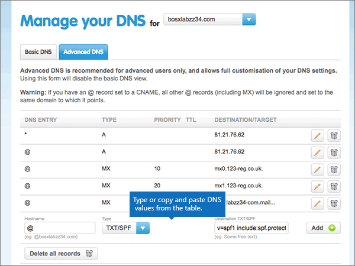

# Criar registros DNS no 123-reg.co.uk para a MicrosoftCreate DNS records at 123-reg.co.uk for Microsoft

 **Caso não encontre o conteúdo que está procurando, [verifique as perguntas frequentes sobre domínios](../setup/domains-faq.yml)**.**[Check the Domains FAQ](../setup/domains-faq.yml)** if you don't find what you're looking for. 
  
Se você usa a 123-reg.co.uk como provedor de hospedagem DNS, siga as etapas deste artigo para verificar o domínio e configurar registros DNS para o Skype for Business Online, email e outros serviços.If 123-reg.co.uk is your DNS hosting provider, follow the steps in this article to verify your domain and set up DNS records for email, Skype for Business Online, and so on.
  
Depois de adicionar esses registros no 123-reg.co.uk, seu domínio será definido para funcionar com os serviços da Microsoft.After you add these records at 123-reg.co.uk, your domain will be set up to work with Microsoft services.
  
  
> [!NOTE]
> Typically it takes about 15 minutes for DNS changes to take effect.Typically it takes about 15 minutes for DNS changes to take effect. Mas, às vezes, pode ser necessário mais tempo para atualizar uma alteração feita no sistema DNS da Internet.However, it can occasionally take longer for a change you've made to update across the Internet's DNS system. Se você tiver problemas com o fluxo de e-mails ou de outro tipo após adicionar os registros DNS, consulte [Localizar e corrigir problemas ou registros DNS](../get-help-with-domains/find-and-fix-issues.md).If you're having trouble with mail flow or other issues after adding DNS records, see [Find and fix issues after adding your domain or DNS records](../get-help-with-domains/find-and-fix-issues.md). 
  
## Adicionar um registro TXT para verificaçãoAdd a TXT record for verification

Antes de usar o seu domínio com a Microsoft, precisamos verificar se você é o proprietário dele. A capacidade de entrar na conta do seu registrador de domínios e criar o registro de DNS prova à Microsoft que você é o proprietário do domínio.Before you use your domain with Microsoft, we have to make sure that you own it. Your ability to log in to your account at your domain registrar and create the DNS record proves to Microsoft that you own the domain.
  
> [!NOTE]
> Esse registro é usado exclusivamente para confirmar se você é o proprietário do domínio; ele não afeta mais nada. É possível excluí-lo mais tarde, se desejar.This record is used only to verify that you own your domain; it doesn't affect anything else. You can delete it later, if you like. 
  
1. Para começar, vá para sua página de domínios em 123-reg.co.uk usando [este link](https://www.123-reg.co.uk/secure/cpanel/domain/overview). Será solicitado que você faça logon primeiro.To get started, go to your domains page at 123-reg.co.uk by using [this link](https://www.123-reg.co.uk/secure/cpanel/domain/overview). You'll be prompted to log in first.
    
2. On the **Domain name overview** page, select the name of the domain that you want to edit.On the **Domain name overview** page, select the name of the domain that you want to edit. 
    
3. Choose **DNS** from the **Select action** drop-down list.Choose **DNS** from the **Select action** drop-down list. 
    
4. Na página **Gerenciar seu DNS,** selecione a **guia DNS** Avançado.On the **Manage your DNS** page, select the **Advanced DNS** tab. 
    
5. In the **Advanced DNS** section, in the boxes for the new record, type or copy and paste the values from the following table.In the **Advanced DNS** section, in the boxes for the new record, type or copy and paste the values from the following table. 
    
    (Choose the **Type** value from the drop-down list.)(Choose the **Type** value from the drop-down list.) 
    
    ||||
    |:-----|:-----|:-----|
    |**Nome do host****Hostname**   |**Tipo****Type**   |**Destination TXT/SPF****Destination TXT/SPF**   |
    |@    |TXT/SPFTXT/SPF    |MS = ms *XXXXXXXX*MS=ms *XXXXXXXX*    **Observação**: esse é um exemplo.**Note:** This is an example. Use aqui seu valor específico de **Destino ou Pontos de Endereçamento**, retirado da tabela.Use your specific **Destination or Points to Address** value here, from the table. [Como localizo isto?How do I find this?](../get-help-with-domains/information-for-dns-records.md)          |
   
6. Clique em **Adicionar**.Select **Add**.
    
7. Aguarde alguns minutos antes de prosseguir para que o registro que você acabou de criar possa ser atualizado na Internet.Wait a few minutes before you continue, so that the record you just created can update across the Internet.
    
Agora que você adicionou o registro no site do registrador de domínios, você voltará para a Microsoft e solicitará uma pesquisa para o registro.Now that you've added the record at your domain registrar's site, you'll go back to Microsoft and request a search for the record.
  
Quando a Microsoft encontrar o registro TXT correto, seu domínio estará verificado.When Microsoft finds the correct TXT record, your domain is verified.
  
1. No centro do administrador da Microsoft, acesse a página **Configurações de** \> <a href="https://go.microsoft.com/fwlink/p/?linkid=834818" target="_blank">domínios</a>.In the Microsoft admin center, go to the **Settings** \> <a href="https://go.microsoft.com/fwlink/p/?linkid=834818" target="_blank">Domains</a> page.

    
2. Na página **Domínios**, clique no domínio que você está verificando.On the **Domains** page, select the domain that you are verifying. 
    
3. Na página **Configuração**, clique em **Iniciar configuração**.On the **Setup** page, select **Start setup**.
    
4. Na página **Verificar domínio**, clique em **Verificar**.On the **Verify domain** page, select **Verify**.
    
> [!NOTE]
> Typically it takes about 15 minutes for DNS changes to take effect.Typically it takes about 15 minutes for DNS changes to take effect. Mas, às vezes, pode ser necessário mais tempo para atualizar uma alteração feita no sistema DNS da Internet.However, it can occasionally take longer for a change you've made to update across the Internet's DNS system. Se você tiver problemas com o fluxo de e-mails ou de outro tipo após adicionar os registros DNS, consulte [Localizar e corrigir problemas ou registros DNS](../get-help-with-domains/find-and-fix-issues.md).If you're having trouble with mail flow or other issues after adding DNS records, see [Find and fix issues after adding your domain or DNS records](../get-help-with-domains/find-and-fix-issues.md). 
  
## Adicione um registro MX para que o email do domínio vá para a Microsoft.Add an MX record so email for your domain will come to Microsoft

1. Para começar, vá para sua página de domínios em 123-reg.co.uk usando [este link](https://www.123-reg.co.uk/secure/cpanel/domain/overview). Será solicitado que você faça logon primeiro.To get started, go to your domains page at 123-reg.co.uk by using [this link](https://www.123-reg.co.uk/secure/cpanel/domain/overview). You'll be prompted to log in first.
    
2. On the **Domain name overview** page, select the name of the domain that you want to edit.On the **Domain name overview** page, select the name of the domain that you want to edit. 
    
3. Choose **DNS** from the **Select action** drop-down list.Choose **DNS** from the **Select action** drop-down list. 
    
4. Na página **Gerenciar seu DNS,** selecione a **guia DNS** Avançado.On the **Manage your DNS** page, select the **Advanced DNS** tab. 
    
5. In the **Advanced DNS** section, in the boxes for the new record, type or copy and paste the values from the following table.In the **Advanced DNS** section, in the boxes for the new record, type or copy and paste the values from the following table. 
    
    (Choose the **Type** value from the drop-down list.)(Choose the **Type** value from the drop-down list.) 
    
    |**Nome do host****Hostname**|**Tipo****Type**|**Prioridade****Priority**|**MX de destino****Destination MX**|
    |:-----|:-----|:-----|:-----|
    |@    |MXMX    |11    Para saber mais sobre prioridade, confira [O que é prioridade MX?](https://docs.microsoft.com/microsoft-365/admin/setup/domains-faq)For more information about priority, see [What is MX priority?](https://docs.microsoft.com/microsoft-365/admin/setup/domains-faq)   | *\<domain-key\>*  .mail.protection.outlook.com.*\<domain-key\>*  .mail.protection.outlook.com.    **Este valor deve OBRIGATORIAMENTE terminar com um ponto (.)****This value MUST end with a period (.)**   **Observação:** Obtenha a sua \<domain-key\> através da sua conta Microsoft.**Note:** Get your \<domain-key\> from your Microsoft account. [Como localizo isto?How do I find this?](../get-help-with-domains/information-for-dns-records.md)          |
   
    
  
6. Clique em **Adicionar**.Select **Add**.
    
    
  
7. Se houver outros registros MX, remova cada um deles escolhendo o ícone **Excluir (Lixeira)** do registro.If there are any other MX records, remove each one by choosing the **Delete (trash can)** icon for that record. 
    
    
  
## Adicionar os cinco registros CNAME necessários para a MicrosoftAdd the five CNAME records that are required for Microsoft

1. Para começar, vá para sua página de domínios em 123-reg.co.uk usando [este link](https://www.123-reg.co.uk/secure/cpanel/domain/overview). Será solicitado que você faça logon primeiro.To get started, go to your domains page at 123-reg.co.uk by using [this link](https://www.123-reg.co.uk/secure/cpanel/domain/overview). You'll be prompted to log in first.
    
2. On the **Domain name overview** page, select the name of the domain that you want to edit.On the **Domain name overview** page, select the name of the domain that you want to edit. 
    
3. Choose **DNS** from the **Select action** drop-down list.Choose **DNS** from the **Select action** drop-down list. 
    
4. Na página **Gerenciar seu DNS,** selecione a **guia DNS** Avançado.On the **Manage your DNS** page, select the **Advanced DNS** tab. 
    
5. Adicione o primeiro dos cinco registros CNAME.Add the first of the five CNAME records.
    
    In the **Advanced DNS** section, in the boxes for the new record, type or copy and paste the values from the following table.In the **Advanced DNS** section, in the boxes for the new record, type or copy and paste the values from the following table. 
    
    (Choose the **Type** value from the drop-down list.)(Choose the **Type** value from the drop-down list.) 
    
    |**Nome do host****Hostname**|**Tipo****Type**|**CNAME de destino****Destination CNAME**|
    |:-----|:-----|:-----|
    |autodiscoverautodiscover    |CNAMECNAME    |autodiscover.outlook.com.autodiscover.outlook.com.    **Este valor deve OBRIGATORIAMENTE terminar com um ponto (.)****This value MUST end with a period (.)**   |
    |sipsip    |CNAMECNAME    |sipdir.online.lync.com.sipdir.online.lync.com.    **Este valor deve OBRIGATORIAMENTE terminar com um ponto (.)****This value MUST end with a period (.)**   |
    |lyncdiscoverlyncdiscover    |CNAMECNAME    |webdir.online.lync.com.webdir.online.lync.com.    **Este valor deve OBRIGATORIAMENTE terminar com um ponto (.)****This value MUST end with a period (.)**   |
    |enterpriseregistrationenterpriseregistration    |CNAMECNAME    |enterpriseregistration.windows.net.enterpriseregistration.windows.net.    **Este valor deve OBRIGATORIAMENTE terminar com um ponto (.)****This value MUST end with a period (.)**   |
    |enterpriseenrollmententerpriseenrollment    |CNAMECNAME    |enterpriseenrollment-s.manage.microsoft.com.enterpriseenrollment-s.manage.microsoft.com.    **Este valor deve OBRIGATORIAMENTE terminar com um ponto (.)****This value MUST end with a period (.)**   |
   
    
  
6. Clique em **Adicionar**.Select **Add**.
    
    
  
7. Adicione os outros quatro registros CNAME.Add the other four CNAME records.
    
    Na seção **DNS Avançado,** crie um registro usando os valores da próxima  linha na tabela e selecione Adicionar novamente para concluir esse registro.In the **Advanced DNS** section, create a record using the values from the next row in the table, and then again select **Add** to complete that record. 
    
    Repita esse processo até que você tenha criado todos os cinco registros CNAME.Repeat this process until you have created all five CNAME records.
    
## Adicionar o registro TXT à SPF para ajudar a evitar spam de e-mailAdd a TXT record for SPF to help prevent email spam

> [!IMPORTANT]
> Não é possível ter mais de um registro TXT para SPF para um domínio.You cannot have more than one TXT record for SPF for a domain. Se o seu domínio possuir mais de um registro SPF, ocorrerão erros de email, bem como problemas na entrega e na classificação de spam.If your domain has more than one SPF record, you'll get email errors, as well as delivery and spam classification issues. Se você já tiver um registro SPF para seu domínio, não crie um novo para Microsfot.If you already have an SPF record for your domain, don't create a new one for Microsfot. Em vez disso, adicione os valores necessários da Microsoft ao registro atual para que você tenha um único registro  *SPF*  que inclua ambos os conjuntos de valores.Instead, add the required Microsoft values to the current record so that you have a  *single*  SPF record that includes both sets of values. Precisa de exemplos?Need examples? Confira os [Registros do Sistema de Nomes de Domínios externos para a Microsoft](https://docs.microsoft.com/microsoft-365/enterprise/external-domain-name-system-records#external-dns-records-required-for-spf).Check out these [External Domain Name System records for Microsoft](https://docs.microsoft.com/microsoft-365/enterprise/external-domain-name-system-records#external-dns-records-required-for-spf). To validate your SPF record, you can use one of these [SPF validation tools](../setup/domains-faq.yml).To validate your SPF record, you can use one of these [SPF validation tools](../setup/domains-faq.yml). 
  
1. Para começar, vá para sua página de domínios em 123-reg.co.uk usando [este link](https://www.123-reg.co.uk/secure/cpanel/domain/overview).To get started, go to your domains page at 123-reg.co.uk by using [this link](https://www.123-reg.co.uk/secure/cpanel/domain/overview). Será solicitado que você faça logon primeiro.You'll be prompted to log in first.
    
2. On the **Domain name overview** page, select the name of the domain that you want to edit.On the **Domain name overview** page, select the name of the domain that you want to edit. 
    
3. Choose **DNS** from the **Select action** drop-down list.Choose **DNS** from the **Select action** drop-down list. 
    
4. Na página **Gerenciar seu DNS,** selecione a **guia DNS** Avançado.On the **Manage your DNS** page, select the **Advanced DNS** tab. 
    
5. In the **Advanced DNS** section, in the boxes for the new record, type or copy and paste the values from the following table.In the **Advanced DNS** section, in the boxes for the new record, type or copy and paste the values from the following table. 
    
    (Choose the **Type** value from the drop-down list.)(Choose the **Type** value from the drop-down list.) 
    
    |**Nome do host****Hostname**|**Tipo****Type**|**Destination TXT/SPF****Destination TXT/SPF**|
    |:-----|:-----|:-----|
    |@    |TXT/SPFTXT/SPF    |v=spf1 include:spf.protection.outlook.com -allv=spf1 include:spf.protection.outlook.com -all    **Observação:** é recomendável copiar e colar essa entrada para que o espaçamento permaneça correto.**Note:** We recommend copying and pasting this entry, so that all of the spacing stays correct.           |
   
    
  
6. Clique em **Adicionar**.Select **Add**.
    
    
  
## Adicionar os dois registros SRV necessários para a MicrosoftAdd the two SRV records that are required for Microsoft

1. Para começar, vá para sua página de domínios em 123-reg.co.uk usando [este link](https://www.123-reg.co.uk/secure/cpanel/domain/overview). Será solicitado que você faça logon primeiro.To get started, go to your domains page at 123-reg.co.uk by using [this link](https://www.123-reg.co.uk/secure/cpanel/domain/overview). You'll be prompted to log in first.
    
2. On the **Domain name overview** page, select the name of the domain that you want to edit.On the **Domain name overview** page, select the name of the domain that you want to edit. 
    
3. Choose **DNS** from the **Select action** drop-down list.Choose **DNS** from the **Select action** drop-down list. 
    
4. Na página **Gerenciar seu DNS,** selecione a **guia DNS** Avançado.On the **Manage your DNS** page, select the **Advanced DNS** tab. 
    
5. Adicione o primeiro dos dois registros SRV:Add the first of the two SRV records:
    
    In the **Advanced DNS** section, in the boxes for the new record, type or copy and paste the values from the following table.In the **Advanced DNS** section, in the boxes for the new record, type or copy and paste the values from the following table. 
    
    (Choose the **Type** value from the drop-down list.)(Choose the **Type** value from the drop-down list.) 
    
    ||||||
    |:-----|:-----|:-----|:-----|:-----|
    |Nome do hostHostname|TipoType|PrioridadePriority|TTLTTL|SRV de destinoDestination SRV|
    |_sip._tls_sip._tls|SRVSRV|100100|36003600|1 443 sipdir.online.lync.com.1 443 sipdir.online.lync.com. **Este valor deve OBRIGATORIAMENTE terminar com um ponto (.)****This value MUST end with a period (.)**  **Observação:** é recomendável copiar e colar essa entrada para que o espaçamento permaneça correto.**Note:** We recommend copying and pasting this entry, so that all of the spacing stays correct.           |
    |_sipfederationtls._tcp_sipfederationtls._tcp|SRVSRV|100100|36003600|1 5061 sipfed.online.lync.com.1 5061 sipfed.online.lync.com. **Este valor deve OBRIGATORIAMENTE terminar com um ponto (.)****This value MUST end with a period (.)**   **Observação:** é recomendável copiar e colar essa entrada para que o espaçamento permaneça correto.**Note:** We recommend copying and pasting this entry, so that all of the spacing stays correct.           |
   
    
  
6. Clique em **Adicionar**.Select **Add**.
    
    
  
7. Para adicionar o outro registro SRV:To add the other SRV record:
    
    Na seção **DNS avançado,** crie um registro usando os valores da segunda  linha da tabela e selecione Adicionar novamente para concluir esse registro.In the **Advanced DNS** section, create a record by using the values from the second row in the table, and then again select **Add** to complete that record. 
    
> [!NOTE]
> Typically it takes about 15 minutes for DNS changes to take effect.Typically it takes about 15 minutes for DNS changes to take effect. Mas, às vezes, pode ser necessário mais tempo para atualizar uma alteração feita no sistema DNS da Internet.However, it can occasionally take longer for a change you've made to update across the Internet's DNS system. Se você tiver problemas com o fluxo de e-mails ou de outro tipo após adicionar os registros DNS, consulte [Localizar e corrigir problemas ou registros DNS](../get-help-with-domains/find-and-fix-issues.md).If you're having trouble with mail flow or other issues after adding DNS records, see [Find and fix issues after adding your domain or DNS records](../get-help-with-domains/find-and-fix-issues.md). 
  
