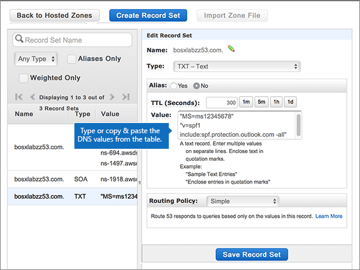

# Criar registros DNS no Amazon Web Services (AWS) para o MicrosoftCreate DNS records at Amazon Web Services (AWS) for Microsoft

 Caso não encontre o conteúdo que está procurando, **[verifique as perguntas frequentes sobre domínios](../setup/domains-faq.md)**.**[Check the Domains FAQ](../setup/domains-faq.md)** if you don't find what you're looking for. 
  
Se o AWS for seu provedor de hospedagem DNS, siga as etapas deste artigo para verificar seu domínio e configurar registros DNS para email, Skype online for Business e assim por diante.If AWS is your DNS hosting provider, follow the steps in this article to verify your domain and set up DNS records for email, Skype Online for Business, and so on.
  
Depois que você adicionar esses registros no AWS, o domínio será configurado para funcionar com os serviços da Microsoft.After you add these records at AWS, your domain will be set up to work with Microsoft services.
  
Para saber mais sobre o webhosting e o DNS para sites com o Microsfot, confira [usar um site público com a Microsoft](https://support.office.com/article/choose-a-public-website-3325d50e-d131-403c-a278-7f3296fe33a9).To learn about webhosting and DNS for websites with Microsfot, see [Use a public website with Microsoft](https://support.office.com/article/choose-a-public-website-3325d50e-d131-403c-a278-7f3296fe33a9).
  
> [!NOTE]
> Typically it takes about 15 minutes for DNS changes to take effect.Typically it takes about 15 minutes for DNS changes to take effect. Mas, às vezes, pode ser necessário mais tempo para atualizar uma alteração feita no sistema DNS da Internet.However, it can occasionally take longer for a change you've made to update across the Internet's DNS system. Se você estiver tendo problemas com o fluxo de emails ou com outros problemas após adicionar registros DNS, consulte [Localizar e corrigir problemas após adicionar seu domínio ou registros DNS](../get-help-with-domains/find-and-fix-issues.md).If you're having trouble with mail flow or other issues after adding DNS records, see [Find and fix issues after adding your domain or DNS records](../get-help-with-domains/find-and-fix-issues.md). 
  
## Adicionar um registro TXT para verificaçãoAdd a TXT record for verification

Antes de usar seu domínio com a Microsoft, precisamos garantir que você o tenha.Before you use your domain with Microsoft, we have to make sure that you own it. Sua capacidade de fazer logon em sua conta no registrador de domínios e criar o registro DNS comprova para a Microsoft que você é o proprietário do domínio.Your ability to log in to your account at your domain registrar and create the DNS record proves to Microsoft that you own the domain.
  
> [!NOTE]
> Esse registro é usado exclusivamente para confirmar se você é o proprietário do domínio; ele não afeta mais nada. É possível excluí-lo mais tarde, se desejar.This record is used only to verify that you own your domain; it doesn't affect anything else. You can delete it later, if you like. 
  
1. Para começar, vá para sua página de domínios no AWS usando [este link](https://console.aws.amazon.com/route53/home).To get started, go to your domains page at AWS by using [this link](https://console.aws.amazon.com/route53/home). Você será solicitado a fazer logon primeiro.You'll be prompted to log in first.
    
2. Na página **recursos** , selecione **zonas hospedadas**.On the **Resources** page, select **Hosted Zones**.
    
3. Na página \* \* zonas hospedadas \* \*, na coluna **nome do domínio** , selecione o nome do domínio que você deseja editar.On the \*\* Hosted Zones \*\* page, in the **Domain Name** column, select the name of the domain that you want to edit. 
    
4. Selecione **criar conjunto de registros**.Select **Create Record Set**.
    
5. In the **Create Record Set** area, in the boxes for the new record, type or copy and paste the values from the following table.In the **Create Record Set** area, in the boxes for the new record, type or copy and paste the values from the following table. 
    
    (Choose the **Type** and **Routing Policy** values from the drop-down lists.)(Choose the **Type** and **Routing Policy** values from the drop-down lists.) 
    
    > [!TIP]
    > The quotation marks required by the onscreen instructions are supplied automatically. You don't need to type them manually.The quotation marks required by the onscreen instructions are supplied automatically. You don't need to type them manually. 
  
    |||||||
    |:-----|:-----|:-----|:-----|:-----|:-----|
    |**Nome****Name**   |**Tipo****Type**   |**Alias****Alias**   |**TTL (Segundos)****TTL (Seconds)**   |**Valor****Value**   |**Política de Roteamento****Routing Policy**   |
    |(Leave this field empty.)(Leave this field empty.)    |TXT - TextTXT - Text    |NãoNo    |300300    |MS = ms *XXXXXXXX*MS=ms *XXXXXXXX*   **Observação**: esse é um exemplo.**Note:** This is an example. Use o seu **destino específico ou aponte para** o valor de endereço aqui, na tabela no Microsoft 365.Use your specific **Destination or Points to Address** value here, from the table in Microsoft 365. [Como faço para encontrar isso?How do I find this?](../get-help-with-domains/information-for-dns-records.md)          |SimplesSimple    |
   
6. Selecione **Criar**.Select **Create**.
    
7. Aguarde alguns minutos antes de prosseguir para que o registro que você acabou de criar possa ser atualizado na Internet.Wait a few minutes before you continue, so that the record you just created can update across the Internet.
    
Agora que você adicionou o registro no site do seu registrador de domínio, você voltará para a Microsoft e solicitará uma pesquisa para o registro.Now that you've added the record at your domain registrar's site, you'll go back to Microsoft and request a search for the record.
  
Quando a Microsoft encontrar o registro TXT correto, seu domínio será verificado.When Microsoft finds the correct TXT record, your domain is verified.
  
1. No centro de administração da Microsoft, vá para a página de <a href="https://go.microsoft.com/fwlink/p/?linkid=834818" target="_blank">domínios</a> de **configurações** \> .In the Microsoft admin center, go to the **Settings** \> <a href="https://go.microsoft.com/fwlink/p/?linkid=834818" target="_blank">Domains</a> page.

    
2. Na página **Domínios**, clique no domínio que você está verificando.On the **Domains** page, select the domain that you are verifying. 
    
3. Na página **Configuração**, clique em **Iniciar configuração**.On the **Setup** page, select **Start setup**.
    
4. Na página **Verificar domínio**, clique em **Verificar**.On the **Verify domain** page, select **Verify**.
    
> [!NOTE]
> Typically it takes about 15 minutes for DNS changes to take effect.Typically it takes about 15 minutes for DNS changes to take effect. Mas, às vezes, pode ser necessário mais tempo para atualizar uma alteração feita no sistema DNS da Internet.However, it can occasionally take longer for a change you've made to update across the Internet's DNS system. Se você estiver tendo problemas com o fluxo de emails ou com outros problemas após adicionar registros DNS, consulte [Localizar e corrigir problemas após adicionar seu domínio ou registros DNS](../get-help-with-domains/find-and-fix-issues.md).If you're having trouble with mail flow or other issues after adding DNS records, see [Find and fix issues after adding your domain or DNS records](../get-help-with-domains/find-and-fix-issues.md). 
  
## Adicionar um registro MX para que o email do seu domínio seja fornecido com o Microsoft 365Add an MX record so email for your domain will come to Microsoft 365

1. Para começar, vá para sua página de domínios no AWS usando [este link](https://console.aws.amazon.com/route53/home). Você será solicitado a fazer logon primeiro.To get started, go to your domains page at AWS by using [this link](https://console.aws.amazon.com/route53/home). You'll be prompted to log in first.
    
2. Na página **recursos** , selecione **zonas hospedadas**.On the **Resources** page, select **Hosted Zones**.
    
3. Na página **zonas hospedadas** , na coluna **nome do domínio** , selecione o nome do domínio que você deseja editar.On the **Hosted Zones** page, in the **Domain Name** column, select the name of the domain that you want to edit. 
    
4. Selecione **criar conjunto de registros**.Select **Create Record Set**.
    
5. In the **Create Record Set** area, in the boxes for the new record, type or copy and paste the values from the following table.In the **Create Record Set** area, in the boxes for the new record, type or copy and paste the values from the following table. 
    
    (Choose the **Type** and **Routing Policy** values from the drop-down lists.)(Choose the **Type** and **Routing Policy** values from the drop-down lists.) 
    
    |**Nome****Name**|**Tipo****Type**|**Alias****Alias**|**TTL (Segundos)****TTL (Seconds)**|**Valor****Value**|**Política de Roteamento****Routing Policy**|
    |:-----|:-----|:-----|:-----|:-----|:-----|
    |(Deixe este campo vazio.)(Leave this field empty.)    |MX - Mail exchangeMX - Mail exchange    |NãoNo    |300300    |0  *\<domain-key\>*  .mail.protection.outlook.com.0  *\<domain-key\>*  .mail.protection.outlook.com.    O 0 é o valor de prioridade de MX. Adicione-o ao início do valor de MX, separado do restante do valor por um espaço.  The 0 is the MX priority value. Add it to the beginning of the MX value, separated from the remainder of the value by a space.    **Este valor deve OBRIGATORIAMENTE terminar com um ponto (.)****This value MUST end with a period (.)**   **Observação:** Obtenha sua \< *chave* \> de domínio de sua conta do Microsoft 365.**Note:** Get your \<*domain-key*\> from your Microsoft 365 account. [Como faço para encontrar isso?How do I find this?](../get-help-with-domains/information-for-dns-records.md)          |SimplesSimple    |
       
    
  
6. Selecione **Criar**.Select **Create**.
    
    
  
7. Se houver quaisquer outros registros MX, remova-os.If there are any other MX records, remove them.
    
    > [!IMPORTANT]
    > O AWS armazena registros MX como um conjunto que pode conter vários registros.AWS stores MX records as a set that may contain multiple records. **Não** selecione **excluir conjunto de registros**, pois isso excluirá todos os seus registros MX, incluindo aquele que você acabou de adicionar.**DO NOT** select **Delete Record Set**, as this will delete all of your MX records, including the one you just added. Em vez disso, use as instruções a seguir.Use the following instructions instead. 
  
    Primeiro, selecione o conjunto de registros MX.First, select the MX record set.
    
    
  
    Em seguida, na área **Editar Conjunto de Registros**, exclua cada registro MX obsoleto selecionando a entrada na caixa **Valor** e, em seguida, pressione a tecla **Excluir** em seu teclado.Next, in the **Edit Record Set** area, delete each obsolete MX record by selecting the entry in the **Value** box and then pressing the **Delete** key on your keyboard. 
    
    
  
8. Selecione **Salvar conjunto de registros**.Select **Save Record Set**.
    
    
  
## Adicionar os cinco registros CNAME necessários para o Microsoft 365Add the five CNAME records that are required for Microsoft 365

1. Para começar, vá para sua página de domínios no AWS usando [este link](https://console.aws.amazon.com/route53/home). Você será solicitado a fazer logon primeiro.To get started, go to your domains page at AWS by using [this link](https://console.aws.amazon.com/route53/home). You'll be prompted to log in first.
    
2. Na página **recursos** , selecione **zonas hospedadas**.On the **Resources** page, select **Hosted Zones**.
    
3. Na página **zonas hospedadas** , na coluna **nome do domínio** , selecione o nome do domínio que você deseja editar.On the **Hosted Zones** page, in the **Domain Name** column, select the name of the domain that you want to edit. 
    
4. Selecione **criar conjunto de registros**.Select **Create Record Set**.
    
5. Adicione o primeiro registro CNAME.Add the first CNAME record.
    
    Na área **Criar Conjunto de Registros**, nas caixas do novo registro, digite ou copie e cole os valores da primeira linha da tabela a seguir.In the **Create Record Set** area, in the boxes for the new record, type or copy and paste the values from the first row in the following table. 
    
    Escolha os valores **Tipo** e **Política de Roteamento** nas listas suspensas.(Choose the **Type** and **Routing Policy** values from the drop-down lists.) 
    
    |**Nome****Name**|**Tipo****Type**|**Alias****Alias**|**TTL (Segundos)****TTL (Seconds)**|**Valor****Value**|**Política de Roteamento****Routing Policy**|
    |:-----|:-----|:-----|:-----|:-----|:-----|
    |autodiscoverautodiscover    |CNAME - Nome canônicoCNAME - Canonical name    |NãoNo    |300300    |autodiscover.outlook.com.autodiscover.outlook.com.    **Este valor deve OBRIGATORIAMENTE terminar com um ponto (.)****This value MUST end with a period (.)**   |SimplesSimple    |
    |sipsip    |CNAME - Nome canônicoCNAME - Canonical name    |NãoNo    |300300    |sipdir.online.lync.com.sipdir.online.lync.com.    **Este valor deve OBRIGATORIAMENTE terminar com um ponto (.)****This value MUST end with a period (.)**   |SimplesSimple    |
    |lyncdiscoverlyncdiscover    |CNAME - Nome canônicoCNAME - Canonical name    |NãoNo    |300300    |webdir.online.lync.com.webdir.online.lync.com.    **Este valor deve OBRIGATORIAMENTE terminar com um ponto (.)****This value MUST end with a period (.)**   |SimplesSimple    |
    |enterpriseregistrationenterpriseregistration    |CNAME - Nome canônicoCNAME - Canonical name    |NãoNo    |300300    |enterpriseregistration.windows.net.enterpriseregistration.windows.net.    **Este valor deve OBRIGATORIAMENTE terminar com um ponto (.)****This value MUST end with a period (.)**   |SimplesSimple    |
    |enterpriseenrollmententerpriseenrollment    |CNAME - Nome canônicoCNAME - Canonical name    |NãoNo    |300300    |enterpriseenrollment-s.manage.microsoft.com.enterpriseenrollment-s.manage.microsoft.com.    **Este valor deve OBRIGATORIAMENTE terminar com um ponto (.)****This value MUST end with a period (.)**   |SimplesSimple    |
   
    
  
6. Selecione **Criar**.Select **Create**.
    
    
  
7. Adicione os outros quatro registros CNAME.Add the other four CNAME records.
    
    Na página **zonas hospedadas** , selecione **criar conjunto de registros**, crie um registro usando os valores da próxima linha na tabela e, em seguida, selecione **criar** para concluir esse registro.In the **Hosted Zones** page, select **Create Record Set**, create a record using the values from the next row in the table, and then again select **Create** to complete that record. 
    
    Repita esse processo até ter criado todos os cinco registros CNAME.Repeat this process until you have created all five CNAME records.
    
## Adicionar o registro TXT à SPF para ajudar a evitar spam de e-mailAdd a TXT record for SPF to help prevent email spam

> [!IMPORTANT]
> Não é possível ter mais de um registro TXT para SPF para um domínio.You cannot have more than one TXT record for SPF for a domain. Se o seu domínio possuir mais de um registro SPF, ocorrerão erros de email, bem como problemas na entrega e na classificação de spam.If your domain has more than one SPF record, you'll get email errors, as well as delivery and spam classification issues. Se você já tiver um registro SPF para seu domínio, não crie um novo para a Microsoft.If you already have an SPF record for your domain, don't create a new one for Microsoft. Em vez disso, adicione os valores necessários da Microsoft ao registro atual para que você tenha um *único* registro SPF que inclua os dois conjuntos de valores.Instead, add the required Microsoft values to the current record so that you have a  *single*  SPF record that includes both sets of values. Precisa de exemplos?Need examples? Confira estes [registros de sistema de nomes de domínio externo para a Microsoft](https://support.office.com/article/c0531a6f-9e25-4f2d-ad0e-a70bfef09ac0).Check out these [External Domain Name System records for Microsoft](https://support.office.com/article/c0531a6f-9e25-4f2d-ad0e-a70bfef09ac0). Para validar o registro SPF, você pode usar uma destas[ferramentas de validação de SPF](../setup/domains-faq.md).To validate your SPF record, you can use one of these[SPF validation tools](../setup/domains-faq.md). 
  
1. Para começar, vá para sua página de domínios no AWS usando [este link](https://console.aws.amazon.com/route53/home).To get started, go to your domains page at AWS by using [this link](https://console.aws.amazon.com/route53/home). Você será solicitado a fazer logon primeiro.You'll be prompted to log in first.
    
2. Na página **recursos** , selecione **zonas hospedadas**.On the **Resources** page, select **Hosted Zones**.
    
3. Na página **zonas hospedadas** , na coluna **nome do domínio** , selecione o nome do domínio que você deseja editar.On the **Hosted Zones** page, in the **Domain Name** column, select the name of the domain that you want to edit. 
    
4. Selecione o conjunto de registros **txt** .Select the **TXT** record set. 
    
    
  
5. Na área **Editar Conjunto de Registros**, ao final da entrada atual na caixa **Valor:** para o registro existente, pressione Enter em seu teclado para criar uma nova linha; e, em seguida, nessa linha nova (sob o valor existente), digite ou copie e cole os valores da tabela a seguir. (Você pode ver um exemplo na ilustração abaixo da tabela).In the **Edit Record Set** area, at the end of the current entry in the **Value:** box for the existing record, press Enter on your keyboard to create a new line; and then, on that new line (under the existing value), type or copy and paste the value from the following table. (You can see an example in the illustration below the table.) 
    
    |**Valor:****Value:**|
    |:-----|
    |v=spf1 include:spf.protection.outlook.com -allv=spf1 include:spf.protection.outlook.com -all    (As aspas necessárias para as instruções na tela são fornecidas automaticamente. Não é necessário inseri-las manualmente.)  (The quotation marks required by the onscreen instructions are supplied automatically. You don't need to type them manually.)    **Observação:** é recomendável copiar e colar essa entrada para que o espaçamento permaneça correto.**Note:** We recommend copying and pasting this entry, so that all of the spacing stays correct.           |
   
    
  
6. Selecione **Salvar conjunto de registros**.Select **Save Record Set**.
    
    
  
## Adicionar os dois registros SRV necessários para o Microsoft 365Add the two SRV records that are required for Microsoft 365

1. Para começar, vá para sua página de domínios no AWS usando [este link](https://console.aws.amazon.com/route53/home). Você será solicitado a fazer logon primeiro.To get started, go to your domains page at AWS by using [this link](https://console.aws.amazon.com/route53/home). You'll be prompted to log in first.
    
2. Na página **recursos** , selecione **zonas hospedadas**.On the **Resources** page, select **Hosted Zones**.
    
3. Na página **zonas hospedadas** , na coluna **nome do domínio** , selecione o nome do domínio que você deseja editar.On the **Hosted Zones** page, in the **Domain Name** column, select the name of the domain that you want to edit. 
    
4. Selecione **criar conjunto de registros**.Select **Create Record Set**.
    
5. Adicione o primeiro registro SRV:Add the first SRV record:
    
    Na área **Criar Conjunto de Registros**, nas caixas do novo registro, digite ou copie e cole os valores da primeira linha da tabela a seguir.In the **Create Record Set** area, in the boxes for the new record, type or copy and paste the values from the first row in the following table. 
    
    Escolha os valores **Tipo** e **Política de Roteamento** nas listas suspensas.(Choose the **Type** and **Routing Policy** values from the drop-down lists.) 
    
    |**Nome****Name**|**Tipo****Type**|**Alias****Alias**|**TTL (Segundos)****TTL (Seconds)**|**Valor****Value**|**Política de Roteamento****Routing Policy**|
    |:-----|:-----|:-----|:-----|:-----|:-----|
    |_sip. _tls_sip._tls|SRV - Localizador de serviçoSRV - Service locator|NãoNo|300300|100 1 443 sipdir.online.lync.com.100 1 443 sipdir.online.lync.com. **Esse valor deve terminar com um ponto (.)**>**This value MUST end with a period (.)**>  **Observação:** é recomendável copiar e colar essa entrada para que o espaçamento permaneça correto.**Note:** We recommend copying and pasting this entry, so that all of the spacing stays correct.           |SimplesSimple|
    |_sipfederationtls. _tcp_sipfederationtls._tcp|SRV - Localizador de serviçoSRV - Service locator|NãoNo|300300|100 1 5061 sipfed.online.lync.com.100 1 5061 sipfed.online.lync.com. **This value MUST end with a period (.)****This value MUST end with a period (.)**  **Observação:** é recomendável copiar e colar essa entrada para que o espaçamento permaneça correto.**Note:** We recommend copying and pasting this entry, so that all of the spacing stays correct.           |SimplesSimple|
   
    
  
6. Selecione **Criar**.Select **Create**.
    
    
  
7. Para adicionar o outro registro SRV:To add the other SRV record:
    
    Na página **zonas hospedadas** , selecione **criar conjunto de registros**, crie um registro usando os valores da próxima linha na tabela e, em seguida, selecione **criar** para concluir esse registro.In the **Hosted Zones** page, select **Create Record Set**, create a record using the values from the next row in the table, and then again select **Create** to complete that record. 
    
> [!NOTE]
> Typically it takes about 15 minutes for DNS changes to take effect.Typically it takes about 15 minutes for DNS changes to take effect. Mas, às vezes, pode ser necessário mais tempo para atualizar uma alteração feita no sistema DNS da Internet.However, it can occasionally take longer for a change you've made to update across the Internet's DNS system. Se você estiver tendo problemas com o fluxo de emails ou com outros problemas após adicionar registros DNS, consulte [Localizar e corrigir problemas após adicionar seu domínio ou registros DNS](../get-help-with-domains/find-and-fix-issues.md).If you're having trouble with mail flow or other issues after adding DNS records, see [Find and fix issues after adding your domain or DNS records](../get-help-with-domains/find-and-fix-issues.md). 
  
