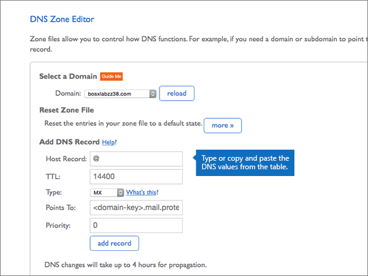

# Criar registros DNS no Bluehost para Microsoft

 **Caso não encontre o conteúdo que está procurando, [verifique as perguntas frequentes sobre domínios](../setup/domains-faq.md)**. 
  
Se você usa a Bluehost como provedor de hospedagem DNS, siga as etapas deste artigo para verificar o domínio e configurar registros DNS para o Skype for Business Online, email e outros serviços.
  
Depois que você adicionar esses registros no Bluehost, o domínio será configurado para funcionar com os serviços da Microsoft.

> [!NOTE]
> Typically it takes about 15 minutes for DNS changes to take effect. Mas, às vezes, pode ser necessário mais tempo para atualizar uma alteração feita no sistema DNS da Internet. Se você tiver problemas com o fluxo de e-mails ou de outro tipo após adicionar os registros DNS, consulte [Localizar e corrigir problemas ou registros DNS](../get-help-with-domains/find-and-fix-issues.md). 
  
## Adicionar um registro TXT para verificação

Antes de usar o seu domínio com a Microsoft, precisamos verificar se você é o proprietário dele. A capacidade de entrar na conta do seu registrador de domínios e criar o registro de DNS prova à Microsoft que você é o proprietário do domínio.
  
> [!NOTE]
> Esse registro é usado exclusivamente para confirmar se você é o proprietário do domínio; ele não afeta mais nada. É possível excluí-lo mais tarde, se desejar. 
  
1. Para começar, vá para sua página de domínios no Bluehost usando [este link](https://my.bluehost.com/cgi/dm). Será solicitado que você faça logon primeiro.
    
2. Na página **Domínios**, na área **domínio**, localize a linha do domínio que está sendo alterado e marque a caixa de seleção desse domínio. 
    
    (Pode ser necessário rolar para baixo.)
    
3. Na área ***domain_name*** , na linha **Editor de zona DNS** , selecione **gerenciar registros DNS**.
    
4. On the **DNS Zone Editor** page, in the **Add DNS Record** area, in the boxes for the new record, type or copy and paste the values from the following table. 
    
    (Choose the **Type** value from the drop-down list.) 
    
    |||||
    |:-----|:-----|:-----|:-----|
    |**Host Record**   |**TTL**   |**Tipo**   |**TXT Value**   |
    |@    |14400    |TXT    |MS=ms *XXXXXXXX*    **Observação**: esse é um exemplo. Use aqui seu valor específico de **Destino ou Pontos de Endereçamento**, retirado da tabela. [Como localizo isto?](../get-help-with-domains/information-for-dns-records.md)          |
   
5. Selecione **adicionar registro**.
    
6. Aguarde alguns minutos antes de prosseguir para que o registro que você acabou de criar possa ser atualizado na Internet.
    
Agora que você adicionou o registro no site do seu registrador de domínio, você voltará para a Microsoft e solicitará uma pesquisa para o registro.
  
Quando a Microsoft encontrar o registro TXT correto, seu domínio estará verificado.
  
1. No centro do administrador da Microsoft, acesse a página **Configurações de** \> <a href="https://go.microsoft.com/fwlink/p/?linkid=834818" target="_blank">domínios</a>.

    
2. Na página **Domínios**, clique no domínio que você está verificando. 
    
3. Na página **Configuração**, clique em **Iniciar configuração**.
    
4. Na página **Verificar domínio**, clique em **Verificar**.
    
> [!NOTE]
> Typically it takes about 15 minutes for DNS changes to take effect. Mas, às vezes, pode ser necessário mais tempo para atualizar uma alteração feita no sistema DNS da Internet. Se você tiver problemas com o fluxo de e-mails ou de outro tipo após adicionar os registros DNS, consulte [Localizar e corrigir problemas ou registros DNS](../get-help-with-domains/find-and-fix-issues.md). 
  
## Adicione um registro MX para que o email do domínio vá para a Microsoft.

1. Para começar, vá para sua página de domínios no Bluehost usando [este link](https://my.bluehost.com/cgi/dm). Será solicitado que você faça logon primeiro.
    
2. Na página **Domínios**, na área **domínio**, localize a linha do domínio que está sendo alterado e marque a caixa de seleção desse domínio. 
    
    (Pode ser necessário rolar para baixo.)
    
3. Na área ***domain_name*** , na linha **Editor de zona DNS** , selecione **gerenciar registros DNS**.
    
4. On the **DNS Zone Editor** page, in the **Add DNS Record** area, in the boxes for the new record, type or copy and paste the values from the following table. 
    
    (Choose the **Type** value from the drop-down list.) 
    
    |**Host Record**|**TTL**|**Tipo**|**Aponta para**|**Prioridade**|
    |:-----|:-----|:-----|:-----|:-----|
    |@    |14400    |MX    | *\<chave-do-domínio\>*  .mail.protection.outlook.com   **Observação:** Obtenha a sua \<*chave-de-domínio*\> através da sua conta Microsoft. [Como faço para encontrar isso?](../get-help-with-domains/information-for-dns-records.md)          |,0    Para saber mais sobre prioridade, confira [O que é prioridade MX?](https://support.office.com/article/2784cc4d-95be-443d-b5f7-bb5dd867ba83.aspx)   |
   
   
  
5. Selecione **adicionar registro**.
    
    
  
6. Se existirem outros registros MX na seção **MX (Mail Exchanger)**, exclua cada um deles. 
    
    Para um dos outros registros MX, selecione **excluir.**
    
    
  
7. Na caixa de diálogo de confirmação, selecione **OK**.
    
    
  
8. Use o mesmo processo para excluir todos os outros registros MX que já foram listados.
    
## Adicionar os seis registros CNAME necessários para o Microsoft

1. Para começar, vá para sua página de domínios no Bluehost usando [este link](https://my.bluehost.com/cgi/dm). Será solicitado que você faça logon primeiro.
    
2. Na página **Domínios**, na área **domínio**, localize a linha do domínio que está sendo alterado e marque a caixa de seleção desse domínio. 
    
    (Pode ser necessário rolar para baixo.)
    
3. Na área ***domain_name*** , na linha **Editor de zona DNS** , selecione **gerenciar registros DNS**.
    
4. Na seção registros **a (host)** , localize a linha do registro de **descoberta automática** e, em seguida, selecione **excluir** para essa linha. 
    
    > [!IMPORTANT]
    > Você deve excluir o registro de **descoberta automática** existente *antes* de adicionar o registro de **descoberta automática** necessário para a Microsoft. Bluehost does not allow you to maintain two **autodiscover** records simultaneously. 
  
    
  
5. Selecione **OK**.
    
    
  
6. Crie o primeiro dos seis registros CNAME.
    
    Na página **Editor de Zona DNS**, na área **Adicionar Registro DNS**, nas caixas do novo registro, digite ou copie e cole os valores da primeira linha da tabela a seguir. 
    
    (Choose the **Type** value from the drop-down list.) 
    
    |**Host Record**|**TTL**|**Tipo**|**Aponta para**|
    |:-----|:-----|:-----|:-----|
    |autodiscover    |14400    |CNAME    |autodiscover.outlook.com    |
    |sip    |14400    |CNAME    |sipdir.online.lync.com    |
    |lyncdiscover    |14400    |CNAME    |webdir.online.lync.com    |
    |enterpriseregistration    |14400    |CNAME    |enterpriseregistration.windows.net    |
    |enterpriseenrollment    |14400    |CNAME    |enterpriseenrollment-s.manage.microsoft.com    |
   
    
  
7. Selecione **adicionar registro**.
    
    
  
8. Adicione cada um dos outros cinco registros CNAME.
    
    Ainda na seção **adicionar registro DNS** , crie um registro usando os valores da próxima linha na tabela e, em seguida, selecione **adicionar registro** para concluir esse registro. 
    
    Repita esse processo até ter criado todos os seis registros CNAME.
    
## Adicionar registro TXT à SPF para ajudar a evitar spam de email

> [!IMPORTANT]
> Não é possível ter mais de um registro TXT para SPF para um domínio. Se o seu domínio possuir mais de um registro SPF, ocorrerão erros de email, bem como problemas na entrega e na classificação de spam. Se você já possui um registro SPF para seu domínio, não crie um novo para a Microsoft. Em vez disso, adicione os valores necessários da Microsoft ao registro atual para que você tenha um *único* registro SPF que inclua os dois conjuntos de valores. Precisa de exemplos? Confira os [Registros do Sistema de Nomes de Domínios externos para a Microsoft](https://support.office.com/article/c0531a6f-9e25-4f2d-ad0e-a70bfef09ac0). Para validar o registro SPF, você pode usar uma destas[ferramentas de validação de SPF](../setup/domains-faq.md). 
  
1. Para começar, vá para sua página de domínios no Bluehost usando [este link](https://my.bluehost.com/cgi/dm). Será solicitado que você faça logon primeiro.
    
2. Na página **Domínios**, na área **domínio**, localize a linha do domínio que está sendo alterado e marque a caixa de seleção desse domínio. 
    
    (Pode ser necessário rolar para baixo.)
    
3. Na área ***domain_name*** , na linha **Editor de zona DNS** , selecione **gerenciar registros DNS**.
    
4. On the **DNS Zone Editor** page, in the **Add DNS Record** area, in the boxes for the new record, type or copy and paste the values from the following table. 
    
    (Choose the **Type** value from the drop-down list.) 
        
    |**Host Record**|**TTL**|**Tipo**|**TXT Value**|
    |:-----|:-----|:-----|:-----|
    |@    |14400    |TXT    |v=spf1 include:spf.protection.outlook.com -all   **Observação:** é recomendável copiar e colar essa entrada, para que todo o espaçamento permaneça correto.           |
   
    
  
5. Selecione **adicionar registro**.
    
    
  
## Adicionar os dois registros SRV necessários para a Microsoft

1. Para começar, vá para sua página de domínios no Bluehost usando [este link](https://my.bluehost.com/cgi/dm). Será solicitado que você faça logon primeiro.
    
2. Na página **Domínios**, na área **domínio**, localize a linha do domínio que está sendo alterado e marque a caixa de seleção desse domínio. 
    
    (Pode ser necessário rolar para baixo.)
    
3. Na área ***domain_name*** , na linha **Editor de zona DNS** , selecione **gerenciar registros DNS**.
    
4. Crie o primeiro dos dois registros SRV.
    
    Na página **Editor de Zona DNS**, na área **Adicionar Registro DNS**, nas caixas do novo registro, digite ou copie e cole os valores da primeira linha da tabela a seguir. 
    
    (Choose the **Type** value from the drop-down list.) 
    
    |**Serviço**|**Protocolo**|**Host**|**TTL**|**Tipo**|**Prioridade**|**Espessura**|**Porta**|**Aponta para**|
    |:-----|:-----|:-----|:-----|:-----|:-----|:-----|:-----|:-----|
    |_sip    |_tls    |@    |14400    |SRV    |100    |1    |443    |sipdir.online.lync.com    |
    |_sipfederationtls    |_tcp    |@    |14400    |SRV    |100    |1    |5061    |sipfed.online.lync.com    |
   
    
  
5. Selecione **adicionar registro**.
    
    
  
6. Adicione o outro registro SRV.
    
    Ainda na seção **adicionar registro DNS** , crie um registro usando os valores da outra linha na tabela e, em seguida, selecione **adicionar registro** para concluir esse registro. 
    
> [!NOTE]
> Typically it takes about 15 minutes for DNS changes to take effect. Mas, às vezes, pode ser necessário mais tempo para atualizar uma alteração feita no sistema DNS da Internet. Se você tiver problemas com o fluxo de e-mails ou de outro tipo após adicionar os registros DNS, consulte [Localizar e corrigir problemas ou registros DNS](../get-help-with-domains/find-and-fix-issues.md). 
  

