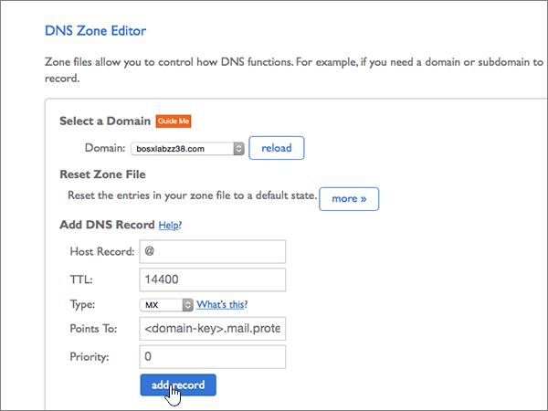
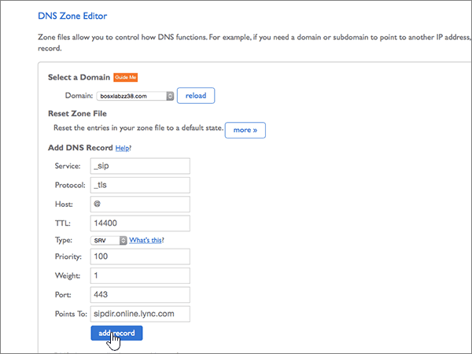

# Criar registros DNS no Bluehost para MicrosoftCreate DNS records at Bluehost for Microsoft

 **Caso não encontre o conteúdo que está procurando, [verifique as perguntas frequentes sobre domínios](../setup/domains-faq.md)**.**[Check the Domains FAQ](../setup/domains-faq.md)** if you don't find what you're looking for. 
  
Se você usa a Bluehost como provedor de hospedagem DNS, siga as etapas deste artigo para verificar o domínio e configurar registros DNS para o Skype for Business Online, email e outros serviços.If Bluehost is your DNS hosting provider, follow the steps in this article to verify your domain and set up DNS records for email, Skype for Business Online, and so on.
  
Depois que você adicionar esses registros no Bluehost, o domínio será configurado para funcionar com os serviços da Microsoft.After you add these records at Bluehost, your domain will be set up to work with Microsoft services.
  
Para saber mais sobre hospedagem na web e DNS para sites com a Microsoft, confira [Usar um site público com o a Microsoft](https://support.office.com/article/choose-a-public-website-3325d50e-d131-403c-a278-7f3296fe33a9).To learn about webhosting and DNS for websites with Microsoft, see [Use a public website with Microsoft](https://support.office.com/article/choose-a-public-website-3325d50e-d131-403c-a278-7f3296fe33a9).
  
> [!NOTE]
> Typically it takes about 15 minutes for DNS changes to take effect.Typically it takes about 15 minutes for DNS changes to take effect. Mas, às vezes, pode ser necessário mais tempo para atualizar uma alteração feita no sistema DNS da Internet.However, it can occasionally take longer for a change you've made to update across the Internet's DNS system. Se você tiver problemas com o fluxo de e-mails ou de outro tipo após adicionar os registros DNS, consulte [Localizar e corrigir problemas ou registros DNS](../get-help-with-domains/find-and-fix-issues.md).If you're having trouble with mail flow or other issues after adding DNS records, see [Find and fix issues after adding your domain or DNS records](../get-help-with-domains/find-and-fix-issues.md). 
  
## Adicionar um registro TXT para verificaçãoAdd a TXT record for verification

Antes de usar o seu domínio com a Microsoft, precisamos verificar se você é o proprietário dele. A capacidade de entrar na conta do seu registrador de domínios e criar o registro de DNS prova à Microsoft que você é o proprietário do domínio.Before you use your domain with Microsoft, we have to make sure that you own it. Your ability to log in to your account at your domain registrar and create the DNS record proves to Microsoft that you own the domain.
  
> [!NOTE]
> Esse registro é usado exclusivamente para confirmar se você é o proprietário do domínio; ele não afeta mais nada. É possível excluí-lo mais tarde, se desejar.This record is used only to verify that you own your domain; it doesn't affect anything else. You can delete it later, if you like. 
  
1. Para começar, vá para sua página de domínios no Bluehost usando [este link](https://my.bluehost.com/cgi/dm).To get started, go to your domains page at Bluehost by using [this link](https://my.bluehost.com/cgi/dm). Será solicitado que você faça logon primeiro.You'll be prompted to log in first.
    
2. Na página **Domínios**, na área **domínio**, localize a linha do domínio que está sendo alterado e marque a caixa de seleção desse domínio.On the **domains** page, in the **domain** area, find the row for the domain that you're changing, and then select the check box for that domain. 
    
    (Pode ser necessário rolar para baixo.)(You may have to scroll down.)
    
3. Na área ***domain_name*** , na linha **Editor de zona DNS** , selecione **gerenciar registros DNS**.In the ***domain_name*** area, on the **DNS Zone Editor** row, select **Manage DNS records**.
    
4. On the **DNS Zone Editor** page, in the **Add DNS Record** area, in the boxes for the new record, type or copy and paste the values from the following table.On the **DNS Zone Editor** page, in the **Add DNS Record** area, in the boxes for the new record, type or copy and paste the values from the following table. 
    
    (Choose the **Type** value from the drop-down list.)(Choose the **Type** value from the drop-down list.) 
    
    |||||
    |:-----|:-----|:-----|:-----|
    |**Host Record****Host Record**   |**TTL****TTL**   |**Tipo****Type**   |**TXT Value****TXT Value**   |
    |@    |1440014400    |TXTTXT    |MS = ms *XXXXXXXX*MS=ms *XXXXXXXX*    **Observação**: esse é um exemplo.**Note:** This is an example. Use aqui seu valor específico de **Destino ou Pontos de Endereçamento**, retirado da tabela.Use your specific **Destination or Points to Address** value here, from the table. [Como localizo isto?How do I find this?](../get-help-with-domains/information-for-dns-records.md)          |
   
5. Selecione **adicionar registro**.Select **add record**.
    
6. Aguarde alguns minutos antes de prosseguir para que o registro que você acabou de criar possa ser atualizado na Internet.Wait a few minutes before you continue, so that the record you just created can update across the Internet.
    
Agora que você adicionou o registro no site do seu registrador de domínio, você voltará para a Microsoft e solicitará uma pesquisa para o registro.Now that you've added the record at your domain registrar's site, you'll go back to Microsoft and request a search for the record.
  
Quando a Microsoft encontrar o registro TXT correto, seu domínio estará verificado.When Microsoft finds the correct TXT record, your domain is verified.
  
1. No centro do administrador da Microsoft, acesse a página **Configurações de** \> <a href="https://go.microsoft.com/fwlink/p/?linkid=834818" target="_blank">domínios</a>.In the Microsoft admin center, go to the **Settings** \> <a href="https://go.microsoft.com/fwlink/p/?linkid=834818" target="_blank">Domains</a> page.

    
2. Na página **Domínios**, clique no domínio que você está verificando.On the **Domains** page, select the domain that you are verifying. 
    
3. Na página **Configuração**, clique em **Iniciar configuração**.On the **Setup** page, select **Start setup**.
    
4. Na página **Verificar domínio**, clique em **Verificar**.On the **Verify domain** page, select **Verify**.
    
> [!NOTE]
> Typically it takes about 15 minutes for DNS changes to take effect.Typically it takes about 15 minutes for DNS changes to take effect. Mas, às vezes, pode ser necessário mais tempo para atualizar uma alteração feita no sistema DNS da Internet.However, it can occasionally take longer for a change you've made to update across the Internet's DNS system. Se você tiver problemas com o fluxo de e-mails ou de outro tipo após adicionar os registros DNS, consulte [Localizar e corrigir problemas ou registros DNS](../get-help-with-domains/find-and-fix-issues.md).If you're having trouble with mail flow or other issues after adding DNS records, see [Find and fix issues after adding your domain or DNS records](../get-help-with-domains/find-and-fix-issues.md). 
  
## Adicione um registro MX para que o email do domínio vá para a Microsoft.Add an MX record so email for your domain will come to Microsoft

1. Para começar, vá para sua página de domínios no Bluehost usando [este link](https://my.bluehost.com/cgi/dm).To get started, go to your domains page at Bluehost by using [this link](https://my.bluehost.com/cgi/dm). Será solicitado que você faça logon primeiro.You'll be prompted to log in first.
    
2. Na página **Domínios**, na área **domínio**, localize a linha do domínio que está sendo alterado e marque a caixa de seleção desse domínio.On the **domains** page, in the **domain** area, find the row for the domain that you're changing, and then select the check box for that domain. 
    
    (Pode ser necessário rolar para baixo.)(You may have to scroll down.)
    
3. Na área ***domain_name*** , na linha **Editor de zona DNS** , selecione **gerenciar registros DNS**.In the ***domain_name*** area, on the **DNS Zone Editor** row, select **Manage DNS records**.
    
4. On the **DNS Zone Editor** page, in the **Add DNS Record** area, in the boxes for the new record, type or copy and paste the values from the following table.On the **DNS Zone Editor** page, in the **Add DNS Record** area, in the boxes for the new record, type or copy and paste the values from the following table. 
    
    (Choose the **Type** value from the drop-down list.)(Choose the **Type** value from the drop-down list.) 
    
    |**Host Record****Host Record**|**TTL****TTL**|**Tipo****Type**|**Aponta para****Points To**|**Prioridade****Priority**|
    |:-----|:-----|:-----|:-----|:-----|
    |@    |1440014400    |MXMX    | *\<chave-do-domínio\>*  .mail.protection.outlook.com*\<domain-key\>*  .mail.protection.outlook.com   **Observação:** Obtenha a sua \<*chave-de-domínio*\> através da sua conta Microsoft.**Note:** Get your \<*domain-key*\> from your Microsoft account. [Como faço para encontrar isso?How do I find this?](../get-help-with-domains/information-for-dns-records.md)          |,00    Para saber mais sobre prioridade, confira [O que é prioridade MX?](https://support.office.com/article/2784cc4d-95be-443d-b5f7-bb5dd867ba83.aspx)For more information about priority, see [What is MX priority?](https://support.office.com/article/2784cc4d-95be-443d-b5f7-bb5dd867ba83.aspx)   |
   
   
  
5. Selecione **adicionar registro**.Select **add record**.
    
    
  
6. Se existirem outros registros MX na seção **MX (Mail Exchanger)**, exclua cada um deles.If there are any other MX records in the **MX (Mail Exchanger)** section, delete each of them. 
    
    Para um dos outros registros MX, selecione **excluir.**For one of the other MX records, select **Delete.**
    
    
  
7. Na caixa de diálogo de confirmação, selecione **OK**.In the confirmation dialog box, select **OK**.
    
    
  
8. Use o mesmo processo para excluir todos os outros registros MX que já foram listados.Use the same process to delete any other MX records that were already listed.
    
## Adicionar os seis registros CNAME necessários para o MicrosoftAdd the six CNAME records that are required for Microsoft

1. Para começar, vá para sua página de domínios no Bluehost usando [este link](https://my.bluehost.com/cgi/dm).To get started, go to your domains page at Bluehost by using [this link](https://my.bluehost.com/cgi/dm). Será solicitado que você faça logon primeiro.You'll be prompted to log in first.
    
2. Na página **Domínios**, na área **domínio**, localize a linha do domínio que está sendo alterado e marque a caixa de seleção desse domínio.On the **domains** page, in the **domain** area, find the row for the domain that you're changing, and then select the check box for that domain. 
    
    (Pode ser necessário rolar para baixo.)(You may have to scroll down.)
    
3. Na área ***domain_name*** , na linha **Editor de zona DNS** , selecione **gerenciar registros DNS**.In the ***domain_name*** area, on the **DNS Zone Editor** row, select **Manage DNS records**.
    
4. Na seção registros **a (host)** , localize a linha do registro de **descoberta automática** e, em seguida, selecione **excluir** para essa linha.In the **A (Host)** records section, find the row for the **autodiscover** record, and then select **delete** for that row. 
    
    > [!IMPORTANT]
    > Você deve excluir o registro de **descoberta automática** existente *antes* de adicionar o registro de **descoberta automática** necessário para a Microsoft.You must delete the existing **autodiscover** record  *before*  adding the **autodiscover** record that is required by Microsoft. Bluehost does not allow you to maintain two **autodiscover** records simultaneously.Bluehost does not allow you to maintain two **autodiscover** records simultaneously. 
  
    
  
5. Selecione **OK**.Select **OK**.
    
    
  
6. Crie o primeiro dos seis registros CNAME.Create the first of the six CNAME records.
    
    Na página **Editor de Zona DNS**, na área **Adicionar Registro DNS**, nas caixas do novo registro, digite ou copie e cole os valores da primeira linha da tabela a seguir.On the **DNS Zone Editor** page, in the **Add DNS Record** area, in the boxes for the new record, type or copy and paste the values from the first row in the following table. 
    
    (Choose the **Type** value from the drop-down list.)(Choose the **Type** value from the drop-down list.) 
    
    |**Host Record****Host Record**|**TTL****TTL**|**Tipo****Type**|**Aponta para****Points To**|
    |:-----|:-----|:-----|:-----|
    |autodiscoverautodiscover    |1440014400    |CNAMECNAME    |autodiscover.outlook.comautodiscover.outlook.com    |
    |sipsip    |1440014400    |CNAMECNAME    |sipdir.online.lync.comsipdir.online.lync.com    |
    |lyncdiscoverlyncdiscover    |1440014400    |CNAMECNAME    |webdir.online.lync.comwebdir.online.lync.com    |
    |enterpriseregistrationenterpriseregistration    |1440014400    |CNAMECNAME    |enterpriseregistration.windows.netenterpriseregistration.windows.net    |
    |enterpriseenrollmententerpriseenrollment    |1440014400    |CNAMECNAME    |enterpriseenrollment-s.manage.microsoft.comenterpriseenrollment-s.manage.microsoft.com    |
   
    
  
7. Selecione **adicionar registro**.Select **add record**.
    
    
  
8. Adicione cada um dos outros cinco registros CNAME.Add each of the other five CNAME records.
    
    Ainda na seção **adicionar registro DNS** , crie um registro usando os valores da próxima linha na tabela e, em seguida, selecione **adicionar registro** para concluir esse registro.Still in the **Add DNS Record** section, create a record by using the values from the next row in the table, and then again select **add record** to complete that record. 
    
    Repita esse processo até ter criado todos os seis registros CNAME.Repeat this process until you have created all six CNAME records.
    
## Adicionar o registro TXT à SPF para ajudar a evitar spam de e-mailAdd a TXT record for SPF to help prevent email spam

> [!IMPORTANT]
> Não é possível ter mais de um registro TXT para SPF para um domínio.You cannot have more than one TXT record for SPF for a domain. Se o seu domínio possuir mais de um registro SPF, ocorrerão erros de email, bem como problemas na entrega e na classificação de spam.If your domain has more than one SPF record, you'll get email errors, as well as delivery and spam classification issues. Se você já possui um registro SPF para seu domínio, não crie um novo para a Microsoft.If you already have an SPF record for your domain, don't create a new one for Microsoft. Em vez disso, adicione os valores necessários da Microsoft ao registro atual para que você tenha um *único* registro SPF que inclua os dois conjuntos de valores.Instead, add the required Microsoft values to the current record so that you have a  *single*  SPF record that includes both sets of values. Precisa de exemplos?Need examples? Confira os [Registros do Sistema de Nomes de Domínios externos para a Microsoft](https://support.office.com/article/c0531a6f-9e25-4f2d-ad0e-a70bfef09ac0).Check out these [External Domain Name System records for Microsoft](https://support.office.com/article/c0531a6f-9e25-4f2d-ad0e-a70bfef09ac0). Para validar o registro SPF, você pode usar uma destas[ferramentas de validação de SPF](../setup/domains-faq.md).To validate your SPF record, you can use one of these[SPF validation tools](../setup/domains-faq.md). 
  
1. Para começar, vá para sua página de domínios no Bluehost usando [este link](https://my.bluehost.com/cgi/dm).To get started, go to your domains page at Bluehost by using [this link](https://my.bluehost.com/cgi/dm). Será solicitado que você faça logon primeiro.You'll be prompted to log in first.
    
2. Na página **Domínios**, na área **domínio**, localize a linha do domínio que está sendo alterado e marque a caixa de seleção desse domínio.On the **domains** page, in the **domain** area, find the row for the domain that you're changing, and then select the check box for that domain. 
    
    (Pode ser necessário rolar para baixo.)(You may have to scroll down.)
    
3. Na área ***domain_name*** , na linha **Editor de zona DNS** , selecione **gerenciar registros DNS**.In the ***domain_name*** area, on the **DNS Zone Editor** row, select **Manage DNS records**.
    
4. On the **DNS Zone Editor** page, in the **Add DNS Record** area, in the boxes for the new record, type or copy and paste the values from the following table.On the **DNS Zone Editor** page, in the **Add DNS Record** area, in the boxes for the new record, type or copy and paste the values from the following table. 
    
    (Choose the **Type** value from the drop-down list.)(Choose the **Type** value from the drop-down list.) 
        
    |**Host Record****Host Record**|**TTL****TTL**|**Tipo****Type**|**TXT Value****TXT Value**|
    |:-----|:-----|:-----|:-----|
    |@    |1440014400    |TXTTXT    |v=spf1 include:spf.protection.outlook.com -allv=spf1 include:spf.protection.outlook.com -all   **Observação:** é recomendável copiar e colar essa entrada para que o espaçamento permaneça correto.**Note:** We recommend copying and pasting this entry, so that all of the spacing stays correct.           |
   
    
  
5. Selecione **adicionar registro**.Select **add record**.
    
    
  
## Adicionar os dois registros SRV necessários para a MicrosoftAdd the two SRV records that are required for Microsoft

1. Para começar, vá para sua página de domínios no Bluehost usando [este link](https://my.bluehost.com/cgi/dm).To get started, go to your domains page at Bluehost by using [this link](https://my.bluehost.com/cgi/dm). Será solicitado que você faça logon primeiro.You'll be prompted to log in first.
    
2. Na página **Domínios**, na área **domínio**, localize a linha do domínio que está sendo alterado e marque a caixa de seleção desse domínio.On the **domains** page, in the **domain** area, find the row for the domain that you're changing, and then select the check box for that domain. 
    
    (Pode ser necessário rolar para baixo.)(You may have to scroll down.)
    
3. Na área ***domain_name*** , na linha **Editor de zona DNS** , selecione **gerenciar registros DNS**.In the ***domain_name*** area, on the **DNS Zone Editor** row, select **Manage DNS records**.
    
4. Crie o primeiro dos dois registros SRV.Create the first of the two SRV records.
    
    Na página **Editor de Zona DNS**, na área **Adicionar Registro DNS**, nas caixas do novo registro, digite ou copie e cole os valores da primeira linha da tabela a seguir.On the **DNS Zone Editor** page, in the **Add DNS Record** area, in the boxes for the new record, type or copy and paste the values from the first row in the following table. 
    
    (Choose the **Type** value from the drop-down list.)(Choose the **Type** value from the drop-down list.) 
    
    |**Serviço****Service**|**Protocolo****Protocol**|**Host****Host**|**TTL****TTL**|**Tipo****Type**|**Prioridade****Priority**|**Espessura****Weight**|**Porta****Port**|**Aponta para****Points To**|
    |:-----|:-----|:-----|:-----|:-----|:-----|:-----|:-----|:-----|
    |_sip_sip    |_tls_tls    |@    |1440014400    |SRVSRV    |100100    |11    |443443    |sipdir.online.lync.comsipdir.online.lync.com    |
    |_sipfederationtls_sipfederationtls    |_tcp_tcp    |@    |1440014400    |SRVSRV    |100100    |11    |50615061    |sipfed.online.lync.comsipfed.online.lync.com    |
   
    
  
5. Selecione **adicionar registro**.Select **add record**.
    
    
  
6. Adicione o outro registro SRV.Add the other SRV record.
    
    Ainda na seção **adicionar registro DNS** , crie um registro usando os valores da outra linha na tabela e, em seguida, selecione **adicionar registro** para concluir esse registro.Still in the **Add DNS Record** section, create a record by using the values from the other row in the table, and then again select **add record** to complete that record. 
    
> [!NOTE]
> Typically it takes about 15 minutes for DNS changes to take effect.Typically it takes about 15 minutes for DNS changes to take effect. Mas, às vezes, pode ser necessário mais tempo para atualizar uma alteração feita no sistema DNS da Internet.However, it can occasionally take longer for a change you've made to update across the Internet's DNS system. Se você tiver problemas com o fluxo de e-mails ou de outro tipo após adicionar os registros DNS, consulte [Localizar e corrigir problemas ou registros DNS](../get-help-with-domains/find-and-fix-issues.md).If you're having trouble with mail flow or other issues after adding DNS records, see [Find and fix issues after adding your domain or DNS records](../get-help-with-domains/find-and-fix-issues.md). 
  

