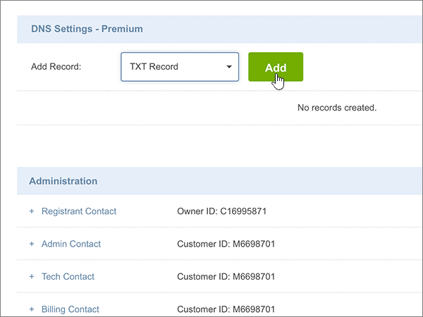
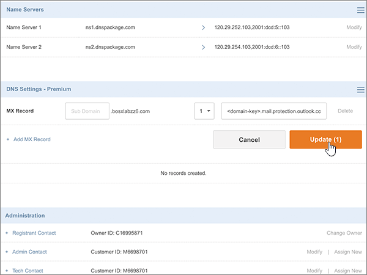
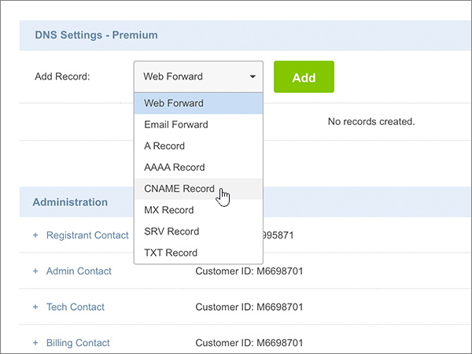
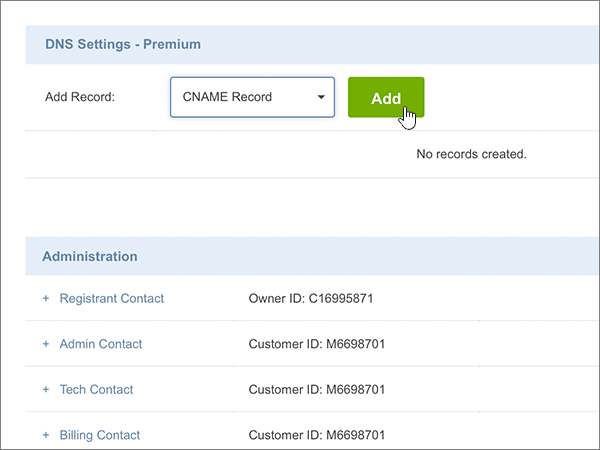
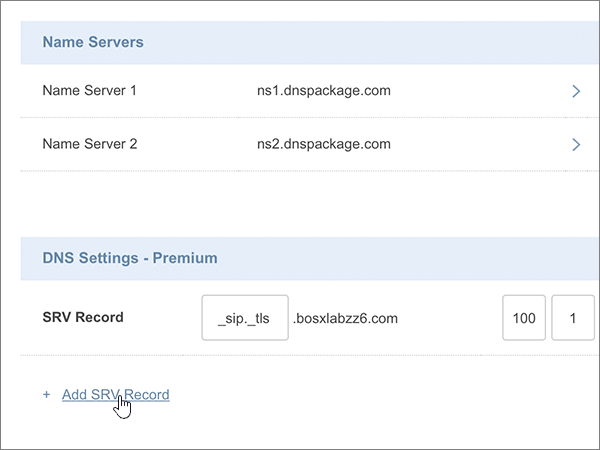

# Criar registros DNS no site Crazy Domains para o Office 365

 **Caso não encontre o conteúdo que está procurando, [verifique as perguntas frequentes sobre domínios](../setup/domains-faq.md)**. 
  
Se você usa a Crazy Domains como provedor de hospedagem DNS, realize os procedimentos deste artigo para verificar o domínio e configurar registros DNS para o Skype for Business Online, email e outros serviços.
  
Depois que você adicionar esses registros na Crazy Domains, o domínio será configurado para funcionar com os serviços do Office 365.
  
Para saber mais sobre hospedagem na Web e DNS para sites com o Office 365, confira [Usar um site público com o Office 365](https://support.office.com/article/choose-a-public-website-3325d50e-d131-403c-a278-7f3296fe33a9).
  
> [!NOTE]
> Normalmente, são necessários cerca de 15 minutos para que as alterações de DNS entrem em vigor. Mas, às vezes, pode ser necessário mais tempo para atualizar uma alteração feita no sistema DNS da Internet. Se você tiver problemas com o fluxo de emails ou de outro tipo após adicionar os registros DNS, consulte [Solucionar problemas após alterar o nome de domínio ou registros DNS](../get-help-with-domains/find-and-fix-issues.md). 
  
## Adicionar um registro TXT para verificação

Antes de usar o seu domínio com o Office 365, precisamos verificar se você é o proprietário dele. A capacidade de entrar na conta do seu registrador de domínios e criar o registro DNS prova ao Office 365 que você é o proprietário do domínio.
  
> [!NOTE]
> Esse registro é usado exclusivamente para confirmar se você é o proprietário do domínio; ele não afeta mais nada. É possível excluí-lo mais tarde, se desejar. 
  
1. Para iniciar, acesse a sua página de domínios no usando [link](https://manage.crazydomains.com/members/domains/). Será solicitado que você faça logon primeiro.
    
    
  
2. Na seção **minha conta** , selecione **domínios**.
    
    
  
3. Na página **nomes de domínio** , na seção **domínio** , selecione o nome do domínio que você está atualizando. 
    
    
  
4. Na seção **configurações de DNS** , selecione o ícone de lista suspensa. 
    
    
  
5. Selecione **adicionar registro**.
    
    
  
6. Escolha **Registro TXT** na lista suspensa **Adicionar Registro**. 
    
    
  
7. Selecione **Adicionar**.
    
    
  
8. Nas caixas do novo registro, digite ou copie e cole os valores da seguinte tabela.
    
    |**Subdomínio**|**Registro de Texto**|
    |:-----|:-----|
    |(Leave this field empty.)    |MS = ms *XXXXXXXX*    **Observação:** Este é um exemplo. Use aqui o valor específico de **Destino ou Pontos de Endereçamento**, retirado da tabela em Office 365.           [Como faço para encontrar isso?](../get-help-with-domains/information-for-dns-records.md)          |
   
    
  
9. Selecione **Atualizar**.
    
    
  
10. Aguarde alguns minutos antes de prosseguir para que o registro que você acabou de criar possa ser atualizado na Internet.
    
Now that you've added the record at your domain registrar's site, you'll go back to Office 365 and request Office 365 to look for the record.
  
When Office 365 finds the correct TXT record, your domain is verified.
  
1. No centro de administração, vá para a página de <a href="https://go.microsoft.com/fwlink/p/?linkid=834818" target="_blank">domínios</a> de **configurações** \> .

    
2. Na página **domínios** , selecione o domínio que você está verificando. 
    
    
  
3. Na página **configuração** , selecione **Iniciar configuração**.
    
    
  
4. Na página **verificar domínio** , selecione **verificar**.
    
    
  
> [!NOTE]
>  Normalmente, são necessários cerca de 15 minutos para que as alterações de DNS entrem em vigor. Mas, às vezes, pode ser necessário mais tempo para atualizar uma alteração feita no sistema DNS da Internet. Se você tiver problemas com o fluxo de emails ou de outro tipo após adicionar os registros DNS, consulte [Solucionar problemas após alterar o nome de domínio ou registros DNS](../get-help-with-domains/find-and-fix-issues.md). 
  
## Adicionar um registro MX para que o email do domínio vá para o Office 365

1. Para iniciar, acesse a sua página de domínios no usando [link](https://manage.crazydomains.com/members/domains/). Será solicitado que você faça logon primeiro.
    
    
  
2. Na seção **minha conta** , selecione **domínios**.
    
    
  
3. Na página **nomes de domínio** , na seção **domínio** , selecione o nome do domínio que você está atualizando. 
    
    
  
4. Na seção **configurações de DNS** , selecione o ícone de lista suspensa. 
    
    
  
5. Selecione **adicionar registro**.
    
    
  
6. Escolha **Registro MX** na lista suspensa **Adicionar Registro:**. 
    
    
  
7. Selecione **Adicionar**.
    
    
  
8. Nas caixas do novo registro, digite ou copie e cole os valores da seguinte tabela.
    
    (Escolha o valor **prioridade** na lista suspensa.) 
    
    |**Email para a zona**|**Prioridade**|**Atribuído a um servidor**|
    |:-----|:-----|:-----|
    |(Deixe este campo vazio.)    |1    Para saber mais sobre prioridade, confira [O que é prioridade MX?](https://support.office.com/article/2784cc4d-95be-443d-b5f7-bb5dd867ba83.aspx)   | *\<chave-do-domínio\>*  .mail.protection.outlook.com    **Observação:** Obtenha sua * \<chave\> de domínio* de sua conta do Office 365.           [Como faço para encontrar isso?](../get-help-with-domains/information-for-dns-records.md)          |
       
   
  
9. Selecione **Atualizar**.
    
    
  
10. Se houver outros registros MX listados na seção **registro MX** , selecione **Modificar** para um desses registros. 
    
    
  
11. Selecione **excluir**.
    
    
  
12. Selecione **Atualizar** para confirmar a exclusão. 
    
    
  
13. Use o mesmo processo para remover outros registros MX na lista, até que somente o domínio que você adicionou anteriormente neste procedimento permaneça.
    
## Adicionar os seis registros CNAME necessários para o Office 365

1. Para iniciar, acesse a sua página de domínios no usando [link](https://manage.crazydomains.com/members/domains/). Será solicitado que você faça logon primeiro.
    
    
  
2. Na seção **minha conta** , selecione **domínios**.
    
    
  
3. Na página **nomes de domínio** , na seção **domínio** , selecione o nome do domínio que você está atualizando. 
    
    
  
4. Na seção **configurações de DNS** , selecione o ícone de lista suspensa. 
    
    
  
5. Selecione **adicionar registro**.
    
    
  
6. Escolha **Registro CNAME** na lista suspensa **Adicionar Registro:**. 
    
    
  
7. Selecione **Adicionar**.
    
    
  
8. Adicione o primeiro dos seis registros CNAME.
    
    Nas caixas do novo registro, digite ou copie e cole os valores da primeira linha da tabela a seguir.
    
    |**Subdomínio**|**Alias para**|
    |:-----|:-----|
    |autodiscover    |autodiscover.outlook.com    |
    |sip    |sipdir.online.lync.com    |
    |lyncdiscover    |webdir.online.lync.com    |
    |enterpriseregistration    |enterpriseregistration.windows.net    |
    |enterpriseenrollment    |enterpriseenrollment-s.manage.microsoft.com    |
   
    
  
9. Selecione **adicionar registro CNAME**.
    
    
  
10. Adicione o segundo registro CNAME.
    
    Nas caixas do novo registro, use os valores da próxima linha na tabela e selecione novamente **adicionar registro CNAME**.
    
    Repita esse processo até ter criado todos os seis registros CNAME.
    
11. Selecione **Atualizar** para salvar suas alterações. 
    
    
  
## Adicionar registro TXT à SPF para ajudar a evitar spam de email

> [!IMPORTANT]
> You cannot have more than one TXT record for SPF for a domain. If your domain has more than one SPF record, you'll get email errors, as well as delivery and spam classification issues. If you already have an SPF record for your domain, don't create a new one for Office 365. Em vez disso, adicione os valores necessários do Office 365 ao registro atual, de modo que você tenha um  *único*  registro SPF que inclua os dois conjuntos de valores. 
  
1. Para iniciar, acesse a sua página de domínios no usando [link](https://manage.crazydomains.com/members/domains/). Será solicitado que você faça logon primeiro.
    
    
  
2. Na seção **minha conta** , selecione **domínios**.
    
    
  
3. Na página **nomes de domínio** , na seção **domínio** , selecione o nome do domínio que você está atualizando. 
    
    
  
4. Na seção **configurações de DNS** , selecione o ícone de lista suspensa. 
    
    
  
5. Selecione **adicionar registro**.
    
    
  
6. Escolha **Registro TXT** na lista suspensa **Adicionar Registro:**. 
    
    
  
7. Selecione **Adicionar**.
    
    
  
8. Nas caixas do novo registro, digite ou cole os valores da seguinte tabela.
    
    |**Subdomínio**|**Registro de Texto**|
    |:-----|:-----|
    |(Deixe este campo vazio.)    |v=spf1 include:spf.protection.outlook.com -all    **Observação:** É recomendável copiar e colar essa entrada, para que todo o espaçamento permaneça correto.           |
   
    
  
9. Selecione **Atualizar**.
    
    
  
## Adicionar os dois registros SRV necessários para o Office 365

1. Para iniciar, acesse a sua página de domínios no usando [link](https://manage.crazydomains.com/members/domains/). Será solicitado que você faça logon primeiro.
    
    
  
2. Na seção **minha conta** , selecione **domínios**.
    
    
  
3. Na página **nomes de domínio** , na seção **domínio** , selecione o nome do domínio que você está atualizando. 
    
    
  
4. Na seção **configurações de DNS** , selecione o ícone de lista suspensa. 
    
    
  
5. Selecione **adicionar registro**.
    
    
  
6. Escolha **Registro SRV** na lista suspensa **Adicionar Registro:**. 
    
    
  
7. Selecione **Adicionar**.
    
    
  
8. Adicione o primeiro dos dois registros SRV.
    
    Nas caixas do novo registro, digite ou copie e cole os valores da primeira linha da tabela a seguir.
    
    |**Tipo de Registro**|**Subdomínio**|**Prioridade**|**Peso**|**Porta**|**Destino**|
    |:-----|:-----|:-----|:-----|:-----|:-----|
    |Registro SRV    |_sip. _tls    |100    |1    |443    |sipdir.online.lync.com    |
    |Registro SRV    |_sipfederationtls. _tcp    |100    |1    |5061    |sipfed.online.lync.com    |
   
    
  
9. Selecione **adicionar registro SRV**.
    
    
  
10. Adicione o outro registro SRV.
    
    Nas caixas para o novo registro, use os valores da segunda linha na tabela.
    
11. Selecione **Atualizar** para salvar suas alterações. 
    
    
  
> [!NOTE]
> Normalmente, são necessários cerca de 15 minutos para que as alterações de DNS entrem em vigor. Mas, às vezes, pode ser necessário mais tempo para atualizar uma alteração feita no sistema DNS da Internet. Se você tiver problemas com o fluxo de emails ou de outro tipo após adicionar os registros DNS, consulte [Solucionar problemas após alterar o nome de domínio ou registros DNS](../get-help-with-domains/find-and-fix-issues.md). 
  
