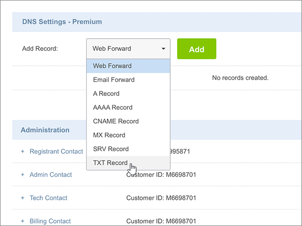
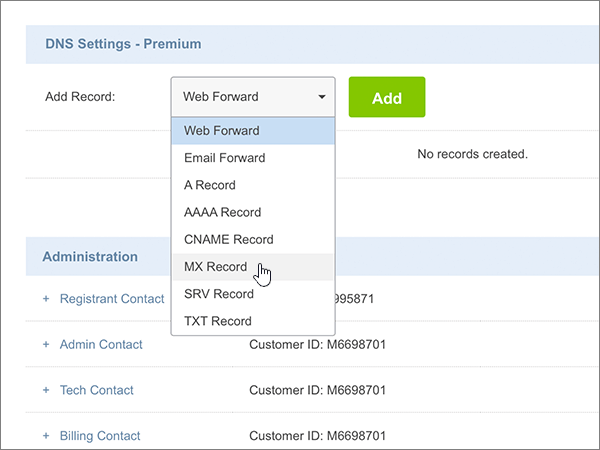
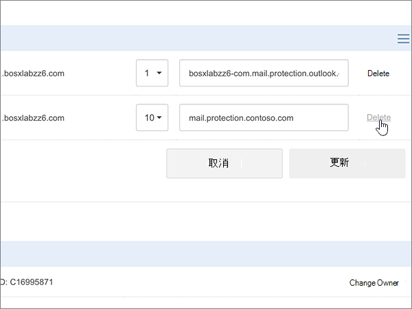
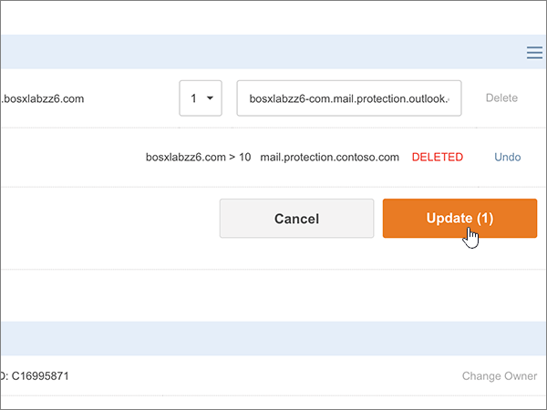
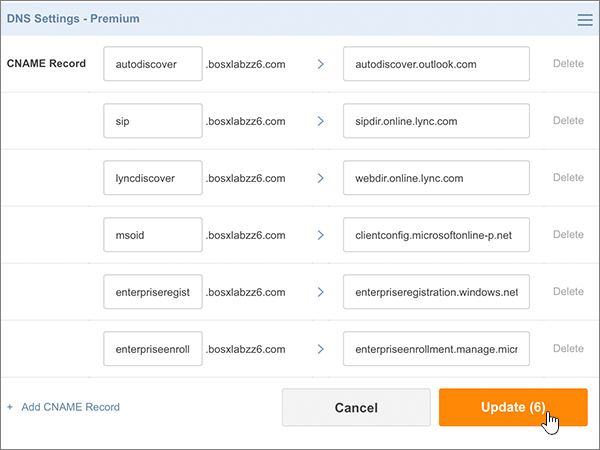
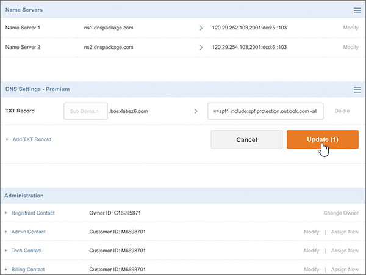

# Criar registros DNS no site Crazy Domains para o Office 365Create DNS records at Crazy Domains for Office 365

 **Caso não encontre o conteúdo que está procurando, [verifique as perguntas frequentes sobre domínios](../setup/domains-faq.md)**.**[Check the Domains FAQ](../setup/domains-faq.md)** if you don't find what you're looking for. 
  
Se você usa a Crazy Domains como provedor de hospedagem DNS, realize os procedimentos deste artigo para verificar o domínio e configurar registros DNS para o Skype for Business Online, email e outros serviços.If Crazy Domains is your DNS hosting provider, follow the steps in this article to verify your domain and set up DNS records for email, Skype for Business Online, and so on.
  
Depois que você adicionar esses registros na Crazy Domains, o domínio será configurado para funcionar com os serviços do Office 365.After you add these records at Crazy Domains, your domain will be set up to work with Office 365 services.
  
Para saber mais sobre hospedagem na Web e DNS para sites com o Office 365, confira [Usar um site público com o Office 365](https://support.office.com/article/choose-a-public-website-3325d50e-d131-403c-a278-7f3296fe33a9).To learn about webhosting and DNS for websites with Office 365, see [Use a public website with Office 365](https://support.office.com/article/choose-a-public-website-3325d50e-d131-403c-a278-7f3296fe33a9).
  
> [!NOTE]
> Normalmente, são necessários cerca de 15 minutos para que as alterações de DNS entrem em vigor. Mas, às vezes, pode ser necessário mais tempo para atualizar uma alteração feita no sistema DNS da Internet. Se você tiver problemas com o fluxo de emails ou de outro tipo após adicionar os registros DNS, consulte [Solucionar problemas após alterar o nome de domínio ou registros DNS](../get-help-with-domains/find-and-fix-issues.md).Typically it takes about 15 minutes for DNS changes to take effect. However, it can occasionally take longer for a change you've made to update across the Internet's DNS system. If you're having trouble with mail flow or other issues after adding DNS records, see [Troubleshoot issues after changing your domain name or DNS records](../get-help-with-domains/find-and-fix-issues.md). 
  
## Adicionar um registro TXT para verificaçãoAdd a TXT record for verification

Antes de usar o seu domínio com o Office 365, precisamos verificar se você é o proprietário dele. A capacidade de entrar na conta do seu registrador de domínios e criar o registro DNS prova ao Office 365 que você é o proprietário do domínio.Before you use your domain with Office 365, we have to make sure that you own it. Your ability to log in to your account at your domain registrar and create the DNS record proves to Office 365 that you own the domain.
  
> [!NOTE]
> Esse registro é usado exclusivamente para confirmar se você é o proprietário do domínio; ele não afeta mais nada. É possível excluí-lo mais tarde, se desejar.This record is used only to verify that you own your domain; it doesn't affect anything else. You can delete it later, if you like. 
  
1. Para iniciar, acesse a sua página de domínios no usando [link](https://manage.crazydomains.com/members/domains/). Será solicitado que você faça logon primeiro.To get started, go to your domains page at Crazy Domains by using [this link](https://manage.crazydomains.com/members/domains/). You'll be prompted to log in first.
    
    
  
2. Na seção **minha conta** , selecione **domínios**.In the **My Account** section, select **Domains**.
    
    
  
3. Na página **nomes de domínio** , na seção **domínio** , selecione o nome do domínio que você está atualizando.On the **Domain Names** page, in the **Domain** section, select the name of the domain that you are updating. 
    
    
  
4. Na seção **configurações de DNS** , selecione o ícone de lista suspensa.In the **DNS Settings** section, select the drop-down list icon. 
    
    
  
5. Selecione **adicionar registro**.Select **Add Record**.
    
    
  
6. Escolha **Registro TXT** na lista suspensa **Adicionar Registro**.Choose **TXT Record** from the **Add Record** drop-down list. 
    
    
  
7. Selecione **Adicionar**.Select **Add**.
    
    
  
8. Nas caixas do novo registro, digite ou copie e cole os valores da seguinte tabela.In the boxes for the new record, type or copy and paste the values from the following table.
    
    |**Subdomínio****Sub Domain**|**Registro de Texto****Text Record**|
    |:-----|:-----|
    |(Leave this field empty.)(Leave this field empty.)    |MS = ms *XXXXXXXX*MS=ms *XXXXXXXX*    **Observação**: esse é um exemplo.**Note:** This is an example. Use seu valor específico de **Destinos ou Pontos de Endereçamento** aqui, da tabela no Office 365.Use your specific **Destination or Points to Address** value here, from the table in Office 365.           [Como localizo isto?How do I find this?](../get-help-with-domains/information-for-dns-records.md)          |
   
    
  
9. Selecione **Atualizar**.Select **Update**.
    
    
  
10. Aguarde alguns minutos antes de prosseguir para que o registro que você acabou de criar possa ser atualizado na Internet.Wait a few minutes before you continue, so that the record you just created can update across the Internet.
    
Agora que você adicionou o registro no site do seu registrador de domínios, retorne ao Office 365 e solicite que o Office 365 procure o registro.Now that you've added the record at your domain registrar's site, you'll go back to Office 365 and request Office 365 to look for the record.
  
Quando o Office 365 encontrar o registro TXT correto, o domínio será verificado.When Office 365 finds the correct TXT record, your domain is verified.
  
1. No centro do administrador, acesse a página **Configurações de** \> <a href="https://go.microsoft.com/fwlink/p/?linkid=834818" target="_blank">domínios</a>.In the admin center, go to the **Settings** \> <a href="https://go.microsoft.com/fwlink/p/?linkid=834818" target="_blank">Domains</a> page.

    
2. Na página **Domínios**, clique no domínio que você está verificando.On the **Domains** page, select the domain that you are verifying. 
    
    
  
3. Na página **Configuração**, clique em **Iniciar configuração**.On the **Setup** page, select **Start setup**.
    
    
  
4. Na página **Verificar domínio**, marque **Verificar**.On the **Verify domain** page, select **Verify**.
    
    
  
> [!NOTE]
>  Normalmente, são necessários cerca de 15 minutos para que as alterações de DNS entrem em vigor. Mas, às vezes, pode ser necessário mais tempo para atualizar uma alteração feita no sistema DNS da Internet. Se você tiver problemas com o fluxo de emails ou de outro tipo após adicionar os registros DNS, consulte [Solucionar problemas após alterar o nome de domínio ou registros DNS](../get-help-with-domains/find-and-fix-issues.md).Typically it takes about 15 minutes for DNS changes to take effect. However, it can occasionally take longer for a change you've made to update across the Internet's DNS system. If you're having trouble with mail flow or other issues after adding DNS records, see [Troubleshoot issues after changing your domain name or DNS records](../get-help-with-domains/find-and-fix-issues.md). 
  
## Adicionar um registro MX para que o e-mail do domínio vá para o Office 365Add an MX record so email for your domain will come to Office 365

1. Para iniciar, acesse a sua página de domínios no usando [link](https://manage.crazydomains.com/members/domains/). Será solicitado que você faça logon primeiro.To get started, go to your domains page at Crazy Domains by using [this link](https://manage.crazydomains.com/members/domains/). You'll be prompted to log in first.
    
    
  
2. Na seção **minha conta** , selecione **domínios**.In the **My Account** section, select **Domains**.
    
    
  
3. Na página **nomes de domínio** , na seção **domínio** , selecione o nome do domínio que você está atualizando.On the **Domain Names** page, in the **Domain** section, select the name of the domain that you are updating. 
    
    
  
4. Na seção **configurações de DNS** , selecione o ícone de lista suspensa.In the **DNS Settings** section, select the drop-down list icon. 
    
    
  
5. Selecione **adicionar registro**.Select **Add Record**.
    
    
  
6. Escolha **Registro MX** na lista suspensa **Adicionar Registro:**.Choose **MX Record** from the **Add Record:** drop-down list. 
    
    
  
7. Selecione **Adicionar**.Select **Add**.
    
    
  
8. Nas caixas do novo registro, digite ou copie e cole os valores da seguinte tabela.In the boxes for the new record, type or copy and paste the values from the following table.
    
    (Escolha o valor **prioridade** na lista suspensa.)(Choose the **Priority** value from the drop-down list.) 
    
    |**Email para a zona****Mail For Zone**|**Prioridade****Priority**|**Atribuído a um servidor****Assigned To Server**|
    |:-----|:-----|:-----|
    |(Deixe este campo vazio.)(Leave this field empty.)    |11    Para saber mais sobre prioridade, confira [O que é prioridade MX?](https://support.office.com/article/2784cc4d-95be-443d-b5f7-bb5dd867ba83.aspx)For more information about priority, see [What is MX priority?](https://support.office.com/article/2784cc4d-95be-443d-b5f7-bb5dd867ba83.aspx)   | *\<chave-do-domínio\>*  .mail.protection.outlook.com*\<domain-key\>*  .mail.protection.outlook.com    **Observação:** Obtenha sua \* \<chave\> de domínio\* de sua conta do Office 365.**Note:** Get your  *\<domain-key\>*  from your Office 365 account.           [Como localizo isto?How do I find this?](../get-help-with-domains/information-for-dns-records.md)          |
       
   
  
9. Selecione **Atualizar**.Select **Update**.
    
    
  
10. Se houver outros registros MX listados na seção **registro MX** , selecione **Modificar** para um desses registros.If there are any other MX records listed in the **MX Record** section, select **Modify** for one of those records. 
    
    
  
11. Selecione **Excluir**.Select **Delete**.
    
    
  
12. Selecione **Atualizar** para confirmar a exclusão.Select **Update** to confirm the deletion. 
    
    
  
13. Use o mesmo processo para remover outros registros MX na lista, até que somente o domínio que você adicionou anteriormente neste procedimento permaneça.Use the same process to remove any other MX records in the list, until only the one that you added earlier in this procedure remains.
    
## Adicionar os seis registros CNAME necessários para o Office 365Add the six CNAME records that are required for Office 365

1. Para iniciar, acesse a sua página de domínios no usando [link](https://manage.crazydomains.com/members/domains/). Será solicitado que você faça logon primeiro.To get started, go to your domains page at Crazy Domains by using [this link](https://manage.crazydomains.com/members/domains/). You'll be prompted to log in first.
    
    
  
2. Na seção **minha conta** , selecione **domínios**.In the **My Account** section, select **Domains**.
    
    
  
3. Na página **nomes de domínio** , na seção **domínio** , selecione o nome do domínio que você está atualizando.On the **Domain Names** page, in the **Domain** section, select the name of the domain that you are updating. 
    
    
  
4. Na seção **configurações de DNS** , selecione o ícone de lista suspensa.In the **DNS Settings** section, select the drop-down list icon. 
    
    
  
5. Selecione **adicionar registro**.Select **Add Record**.
    
    
  
6. Escolha **Registro CNAME** na lista suspensa **Adicionar Registro:**.Choose **CNAME Record** from the **Add Record:** drop-down list. 
    
    
  
7. Selecione **Adicionar**.Select **Add**.
    
    
  
8. Adicione o primeiro dos seis registros CNAME.Add the first of the six CNAME records.
    
    Nas caixas do novo registro, digite ou copie e cole os valores da primeira linha da tabela a seguir.In the boxes for the new record, type or copy and paste the values from the first row of the following table.
    
    |**Subdomínio****Sub Domain**|**Alias para****Alias for**|
    |:-----|:-----|
    |descoberta automáticaautodiscover    |autodiscover.outlook.comautodiscover.outlook.com    |
    |sipsip    |sipdir.online.lync.comsipdir.online.lync.com    |
    |lyncdiscoverlyncdiscover    |webdir.online.lync.comwebdir.online.lync.com    |
    |enterpriseregistrationenterpriseregistration    |enterpriseregistration.windows.netenterpriseregistration.windows.net    |
    |enterpriseenrollmententerpriseenrollment    |enterpriseenrollment-s.manage.microsoft.comenterpriseenrollment-s.manage.microsoft.com    |
   
    
  
9. Selecione **adicionar registro CNAME**.Select **Add CNAME Record**.
    
    
  
10. Adicione o segundo registro CNAME.Add the second CNAME record.
    
    Nas caixas do novo registro, use os valores da próxima linha na tabela e selecione novamente **adicionar registro CNAME**.In the boxes for the new record, use the values from the next row in the table, and then again select **Add CNAME Record**.
    
    Repita esse processo até ter criado todos os seis registros CNAME.Repeat this process until you have created all six CNAME records.
    
11. Selecione **Atualizar** para salvar suas alterações.Select **Update** to save your changes. 
    
    
  
## Adicionar o registro TXT à SPF para ajudar a evitar spam de e-mailAdd a TXT record for SPF to help prevent email spam

> [!IMPORTANT]
> Não é possível ter mais de um registro TXT para SPF para um domínio.You cannot have more than one TXT record for SPF for a domain. Se o seu domínio possuir mais de um registro SPF, ocorrerão erros de email, bem como problemas na entrega e na classificação de spam.If your domain has more than one SPF record, you'll get email errors, as well as delivery and spam classification issues. If you already have an SPF record for your domain, don't create a new one for Office 365.If you already have an SPF record for your domain, don't create a new one for Office 365. Em vez disso, adicione os valores necessários do Office 365 ao registro atual, de modo que você tenha um  *único*  registro SPF que inclua os dois conjuntos de valores.Instead, add the required Office 365 values to the current record so that you have a  *single*  SPF record that includes both sets of values. 
  
1. Para iniciar, acesse a sua página de domínios no usando [link](https://manage.crazydomains.com/members/domains/). Será solicitado que você faça logon primeiro.To get started, go to your domains page at Crazy Domains by using [this link](https://manage.crazydomains.com/members/domains/). You'll be prompted to log in first.
    
    
  
2. Na seção **minha conta** , selecione **domínios**.In the **My Account** section, select **Domains**.
    
    
  
3. Na página **nomes de domínio** , na seção **domínio** , selecione o nome do domínio que você está atualizando.On the **Domain Names** page, in the **Domain** section, select the name of the domain that you are updating. 
    
    
  
4. Na seção **configurações de DNS** , selecione o ícone de lista suspensa.In the **DNS Settings** section, select the drop-down list icon. 
    
    
  
5. Selecione **adicionar registro**.Select **Add Record**.
    
    
  
6. Escolha **Registro TXT** na lista suspensa **Adicionar Registro:**.Choose **TXT Record** from the **Add Record:** drop-down list. 
    
    
  
7. Selecione **Adicionar**.Select **Add**.
    
    
  
8. Nas caixas do novo registro, digite ou cole os valores da seguinte tabela.In the boxes for the new record, type or paste the values from the following table.
    
    |**Subdomínio****Sub Domain**|**Registro de Texto****Text Record**|
    |:-----|:-----|
    |(Deixe este campo vazio.)(Leave this field empty.)    |v=spf1 include:spf.protection.outlook.com -allv=spf1 include:spf.protection.outlook.com -all    **Observação:** é recomendável copiar e colar essa entrada para que o espaçamento permaneça correto.**Note:** We recommend copying and pasting this entry, so that all of the spacing stays correct.           |
   
    
  
9. Selecione **Atualizar**.Select **Update**.
    
    
  
## Adicionar os dois registros SRV necessários do Office 365Add the two SRV records that are required for Office 365

1. Para iniciar, acesse a sua página de domínios no usando [link](https://manage.crazydomains.com/members/domains/). Será solicitado que você faça logon primeiro.To get started, go to your domains page at Crazy Domains by using [this link](https://manage.crazydomains.com/members/domains/). You'll be prompted to log in first.
    
    
  
2. Na seção **minha conta** , selecione **domínios**.In the **My Account** section, select **Domains**.
    
    
  
3. Na página **nomes de domínio** , na seção **domínio** , selecione o nome do domínio que você está atualizando.On the **Domain Names** page, in the **Domain** section, select the name of the domain that you are updating. 
    
    
  
4. Na seção **configurações de DNS** , selecione o ícone de lista suspensa.In the **DNS Settings** section, select the drop-down list icon. 
    
    
  
5. Selecione **adicionar registro**.Select **Add Record**.
    
    
  
6. Escolha **Registro SRV** na lista suspensa **Adicionar Registro:**.Choose **SRV Record** from the **Add Record:** drop-down list. 
    
    
  
7. Selecione **Adicionar**.Select **Add**.
    
    
  
8. Adicione o primeiro dos dois registros SRV.Add the first of the two SRV records.
    
    Nas caixas do novo registro, digite ou copie e cole os valores da primeira linha da tabela a seguir.In the boxes for the new record, type or copy and paste the values from the first row of the following table.
    
    |**Tipo de Registro****Record Type**|**Subdomínio****Sub Domain**|**Prioridade****Priority**|**Espessura****Weight**|**Porta****Port**|**Destino****Target**|
    |:-----|:-----|:-----|:-----|:-----|:-----|
    |Registro SRVSRV Record    |_sip. _tls_sip._tls    |100100    |11    |443443    |sipdir.online.lync.comsipdir.online.lync.com    |
    |Registro SRVSRV Record    |_sipfederationtls. _tcp_sipfederationtls._tcp    |100100    |11    |50615061    |sipfed.online.lync.comsipfed.online.lync.com    |
   
    
  
9. Selecione **adicionar registro SRV**.Select **Add SRV Record**.
    
    
  
10. Adicione o outro registro SRV.Add the other SRV record.
    
    Nas caixas para o novo registro, use os valores da segunda linha na tabela.In the boxes for the new record, use the values from the second row in the table.
    
11. Selecione **Atualizar** para salvar suas alterações.Select **Update** to save your changes. 
    
    
  
> [!NOTE]
> Normalmente, são necessários cerca de 15 minutos para que as alterações de DNS entrem em vigor. Mas, às vezes, pode ser necessário mais tempo para atualizar uma alteração feita no sistema DNS da Internet. Se você tiver problemas com o fluxo de emails ou de outro tipo após adicionar os registros DNS, consulte [Solucionar problemas após alterar o nome de domínio ou registros DNS](../get-help-with-domains/find-and-fix-issues.md).Typically it takes about 15 minutes for DNS changes to take effect. However, it can occasionally take longer for a change you've made to update across the Internet's DNS system. If you're having trouble with mail flow or other issues after adding DNS records, see [Troubleshoot issues after changing your domain name or DNS records](../get-help-with-domains/find-and-fix-issues.md). 
  
